# Technical Specification

# 1. Introduction

## 1.1 EXECUTIVE SUMMARY

### 1.1.1 Project Overview

The repository under specification is identified as **Artifact1**, a designation established by the sole document present in the codebase — a `README.md` file at the repository root containing a single Markdown level-one heading: `# Artifact1`. At the time of this Technical Specification's authorship, the project exists as an **initial placeholder repository** without implemented source code, configuration artifacts, dependency manifests, build pipelines, runtime components, or supplemental documentation.

This Introduction documents the verifiable state of the artifact as of the current revision. It is grounded exclusively in the evidence physically present within the repository and refrains from inferring, extrapolating, or fabricating any business domain, technical scope, or stakeholder context that has not yet been committed to the codebase.

### 1.1.2 Project State Summary

| Attribute | Value |
|---|---|
| Project Identifier | Artifact1 |
| Repository Composition | Single file (`README.md` at root) |
| Implementation Status | Pre-implementation / Placeholder |
| Source Code Present | None |
| Configuration Present | None |
| Dependency Manifests Present | None |
| Subfolders Present | None |

### 1.1.3 Core Business Problem

The repository **does not articulate a business problem** in its current form. The single line of project documentation (`# Artifact1`) provides only an identifier and does not describe a domain, a target market, a pain point, or a value driver. Until further artifacts (such as product requirements, design notes, or source modules) are introduced, the business problem this artifact intends to address remains **unspecified within the codebase**.

### 1.1.4 Key Stakeholders and Users

No stakeholder roles, user personas, or audience segments are declared within the repository's contents. The `README.md` does not enumerate intended consumers, contributors, operators, or administrators of the artifact. As such, the stakeholder model is **undefined at this stage** and will require explicit definition in subsequent project iterations before it can be authoritatively documented in this specification.

### 1.1.5 Expected Business Impact and Value Proposition

The repository contains no statements describing expected outcomes, success metrics, return-on-investment models, or value propositions. The placeholder nature of the artifact means that any expected business impact has **not been formalized in the source tree** at this revision.

## 1.2 SYSTEM OVERVIEW

### 1.2.1 Project Context

#### 1.2.1.1 Business Context and Market Positioning

The repository contains no business context narrative, no market analysis, no competitive positioning statement, and no domain framing. The `README.md` consists exclusively of the artifact's title heading and does not situate the project within any industry, vertical, customer segment, or use-case category. Business context will need to be added to the repository before it can be reflected in this specification.

#### 1.2.1.2 Current System Limitations

No predecessor system, legacy platform, or upgrade context is referenced anywhere in the repository. There is no documentation indicating that **Artifact1** is intended to replace, extend, modernize, or migrate from an existing system. Consequently, no current-state limitations can be documented.

#### 1.2.1.3 Integration with Existing Enterprise Landscape

The repository declares no integrations with external systems. There are no API contracts, message schemas, service descriptors, infrastructure-as-code definitions, environment configurations, third-party SDK references, or dependency declarations. The project's relationship to a broader enterprise landscape therefore **cannot be documented from the current artifact**.

### 1.2.2 High-Level Description

#### 1.2.2.1 Primary System Capabilities

| Capability Category | Status in Repository |
|---|---|
| User-facing features | Not defined |
| Backend services | Not defined |
| Data processing functions | Not defined |
| Administrative or operational tools | Not defined |
| Integration or connector capabilities | Not defined |

The repository implements no capabilities at this time. The single `README.md` file does not enumerate planned, in-progress, or delivered functionality.

#### 1.2.2.2 Major System Components

No components — modules, services, libraries, packages, applications, or infrastructure resources — are present in the repository. There are no subfolders, no source files, and no manifest files describing logical or physical components. The component architecture is therefore **empty** as of this revision, and no architectural decomposition can be presented.

#### 1.2.2.3 Core Technical Approach

No technology stack is declared. The repository's technical surface consists of the following:

| Technical Element | Presence |
|---|---|
| Programming language source files | None |
| Framework declarations | None |
| Build or compilation tooling | None |
| Containerization or deployment configuration | None |
| Testing frameworks or fixtures | None |
| Schema or interface definitions | None |

The technical approach is **undetermined** from currently available evidence and must remain so until implementation artifacts are introduced.

### 1.2.3 Success Criteria

#### 1.2.3.1 Measurable Objectives

No measurable objectives are documented within the repository. The artifact does not contain goal statements, target metrics, acceptance criteria, or quantitative aims of any kind.

#### 1.2.3.2 Critical Success Factors

No critical success factors have been recorded. The placeholder state of the repository precludes any documented basis for evaluating delivery success at this point in the project's lifecycle.

#### 1.2.3.3 Key Performance Indicators (KPIs)

No KPIs are defined. There are no monitoring artifacts, telemetry configurations, observability declarations, or service-level objectives present in the codebase from which performance criteria could be inferred or formalized.

## 1.3 SCOPE

### 1.3.1 In-Scope Elements

#### 1.3.1.1 Core Features and Functionalities

Based exclusively on what is present in the repository, the currently in-scope element set is limited to the following:

| In-Scope Element | Description |
|---|---|
| Artifact identification | The repository establishes the project name `Artifact1` via the `README.md` heading |
| Documentation entry point | The `README.md` serves as the canonical landing document for the artifact |

No additional must-have capabilities, primary user workflows, essential integrations, or detailed technical requirements are presently encoded in the repository. The in-scope catalogue will expand only when corresponding implementation, configuration, or design artifacts are added to the codebase.

#### 1.3.1.2 Implementation Boundaries

| Boundary Dimension | Currently Documented State |
|---|---|
| System boundaries | Not delineated |
| User groups covered | Not enumerated |
| Geographic or market coverage | Not specified |
| Data domains included | None present |

The artifact does not establish system boundaries because no system functionality has been implemented or specified. There are no user-group definitions, geographic scope statements, or data-domain catalogues in the repository.

### 1.3.2 Out-of-Scope Elements

#### 1.3.2.1 Explicitly Excluded Capabilities

Given the placeholder state of the repository, the following capability categories are explicitly **out of scope** for the artifact as currently constituted:

| Out-of-Scope Category | Rationale |
|---|---|
| Application source code | No source modules, scripts, or executables present in the repository |
| Runtime configuration | No environment files, secrets stores, or configuration manifests defined |
| Build, deployment, and CI/CD | No build files, Dockerfiles, or pipeline definitions exist |
| Test suites and quality assurance | No test fixtures, frameworks, or coverage tooling exist |
| External integrations and APIs | No interface contracts, SDK bindings, or connector code declared |
| Data schemas and persistence | No data models, migrations, or storage configuration present |
| Authentication and authorization | No identity, access-control, or security components defined |
| Observability and monitoring | No logging, metrics, or tracing artifacts present |

#### 1.3.2.2 Future Phase Considerations

All substantive engineering work — including, but not limited to, the items enumerated in subsection 1.3.2.1 — represents potential future-phase scope. The current artifact does not pre-commit to any specific roadmap, sequencing, or prioritization of future deliverables, because no planning artifacts (roadmaps, milestone documents, backlog files, or design briefs) exist in the repository to anchor such commitments.

#### 1.3.2.3 Integration Points Not Covered

No integration points are covered by the current artifact, because no integrations are declared, configured, or implemented anywhere in the repository. Any integration with external services, internal platforms, partner systems, identity providers, message brokers, or data stores is therefore out of scope until corresponding artifacts (interface definitions, configuration, connector code, or contract tests) are introduced.

#### 1.3.2.4 Unsupported Use Cases

Because no use cases are defined or implemented within the codebase, all use cases are presently unsupported. The repository in its current state does not provide functional support for any end-user, administrative, operational, batch, or programmatic workflow.

## 1.4 DOCUMENT BASIS AND EVOLUTION

### 1.4.1 Current Documentation Basis

This Introduction has been authored strictly against the verifiable contents of the repository at its present revision. The foundational source materials are:

| Source | Type | Substantive Content |
|---|---|---|
| `README.md` | Markdown file | Single line: `# Artifact1` |
| Repository root | Directory | Contains only `README.md`; no subfolders |

### 1.4.2 Authoring Constraints

This section deliberately refrains from speculating about the project's intended purpose, audience, technology choices, architectural patterns, or success metrics. Such speculation would not be supported by the contents of the repository and would compromise the document's role as a faithful, evidence-grounded reference for the artifact's actual state.

### 1.4.3 Anticipated Documentation Revisions

As the repository evolves — through the addition of source code, configuration, manifests, design documents, or expanded README content — subsequent revisions of this Technical Specification will be required to expand each subsection above to reflect newly committed information. Specifically, future revisions will need to address the currently undocumented dimensions of business problem, stakeholders, capabilities, components, technical approach, success criteria, and scope as those dimensions become substantiated within the codebase.

#### References

#### Files Examined

- `README.md` — Sole file in the repository. Verified contents consist of a single line containing the Markdown level-one heading `# Artifact1`. Serves as the artifact's identifier and the only human-readable context for the project. Confirmed as static, self-contained, and free of imports, dependencies, or executable logic.

#### Folders Explored

- `/` (repository root) — Top-level directory containing exclusively `README.md`. No subdirectories, source files, configuration files, dependency manifests, build scripts, schemas, or other artifacts are present. Maximum possible traversal depth (level 1) achieved during repository analysis.

#### Technical Specification Sections Retrieved

- None. The list of available technical specification sections supplied for cross-referencing was empty (`[]`), so no upstream specification content was available to inform or enrich this Introduction.

# 2. Product Requirements

## 2.1 REQUIREMENT STATE OVERVIEW

### 2.1.1 Basis for the Empty Requirement Catalogue

The repository under specification — identified as **Artifact1** in Section 1.1.1 — exists exclusively as a single `README.md` file at the repository root containing the level-one heading `# Artifact1` and no further content. Because of this placeholder/pre-implementation state, **no product features have been declared, designed, or implemented in the codebase**. The repository contains no functional specification documents, no requirement statements, no acceptance criteria, no user stories, no design briefs, and no implementation artifacts from which a feature catalogue or functional-requirements decomposition could be derived.

Consistent with the authoring constraints established in Section 1.4.2, this Product Requirements section is authored strictly against the verifiable contents of the repository and refrains from inferring, extrapolating, or fabricating features, requirements, dependencies, or relationships that do not exist in the artifact. The conventional structures expected of a Product Requirements section — the Feature Catalog, Functional Requirements Tables, Feature Relationships, Implementation Considerations, and Traceability Matrix — are presented below as **structurally complete but materially empty placeholders**, reflecting the artifact's actual state.

### 2.1.2 Cross-References to Section 1 Findings

The empty state of this section is a direct consequence of the findings established in Section 1 and is consistent with them:

| Section 1 Reference | Finding Supporting Empty Requirements State |
|---|---|
| Section 1.1.2 (Project State Summary) | Implementation Status = Pre-implementation / Placeholder; Source Code Present = None |
| Section 1.2.2.1 (Primary System Capabilities) | All capability categories marked "Not defined" |
| Section 1.2.2.2 (Major System Components) | Component architecture is "empty" as of this revision |
| Section 1.3.1.1 (Core Features and Functionalities) | In-scope elements limited to artifact identification and documentation entry point |
| Section 1.3.2.1 (Explicitly Excluded Capabilities) | All substantive functional categories explicitly out of scope |

### 2.1.3 Forward-Looking Guidance

Per Section 1.4.3 (Anticipated Documentation Revisions), this section will need to be substantively expanded once features, requirements, design notes, or implementation artifacts are introduced into the repository. Each subsection below is therefore designed to be populated incrementally as the codebase matures, with the empty entries serving as deliberate signals to future authors and reviewers that the corresponding analytical work has not yet been performed against the artifact.

## 2.2 FEATURE CATALOG

### 2.2.1 Feature Inventory

The repository, as of the current revision, declares **zero features**. No `F-XXX` feature identifiers have been allocated because no functional units of behaviour, user-facing capabilities, backend services, data-processing routines, or integration capabilities exist in the codebase to be catalogued.

| Feature ID | Feature Name | Feature Category | Status |
|---|---|---|---|
| — | No features declared | — | — |

The single observable artifact in the repository — the `README.md` file containing `# Artifact1` — constitutes documentation metadata rather than a functional feature. It is not assigned a feature identifier in this catalogue because it does not represent a unit of product behaviour, a user-facing capability, or an implementation deliverable. Its role is captured in Section 1.3.1.1 ("Artifact identification" and "Documentation entry point") and is not duplicated here as a feature entry.

### 2.2.2 Feature Metadata

Because no features are catalogued in Section 2.2.1, no feature metadata records exist. The fields prescribed by the Product Requirements specification — Unique ID (`F-XXX` format), Feature Name, Feature Category, Priority Level (Critical/High/Medium/Low), and Status (Proposed/Approved/In Development/Completed) — have no instances to populate. Priority levels and lifecycle statuses cannot be assigned in the absence of declared features, and assigning them would constitute fabrication.

| Metadata Field | Documented Instances |
|---|---|
| Unique ID (F-XXX) | None allocated |
| Feature Name | None declared |
| Feature Category | None defined |
| Priority Level | None assigned |

### 2.2.3 Feature Descriptions

The descriptive dimensions ordinarily documented per feature — Overview, Business Value, User Benefits, and Technical Context — cannot be populated. Per Section 1.1.3, the business problem is **unspecified within the codebase**; per Section 1.1.4, stakeholders and users are **undefined at this stage**; per Section 1.1.5, business impact and value proposition have **not been formalized in the source tree**; per Section 1.2.2.3, the technical approach is **undetermined** from currently available evidence.

| Description Field | Available Source Material |
|---|---|
| Overview | None — no features declared to describe |
| Business Value | None — business problem unspecified (Section 1.1.3) |
| User Benefits | None — stakeholders undefined (Section 1.1.4) |
| Technical Context | None — technical approach undetermined (Section 1.2.2.3) |

### 2.2.4 Feature Dependencies

No feature-level dependencies are documentable because no features have been declared. The prescribed dependency dimensions are nonetheless enumerated for completeness:

| Dependency Type | Documented Instances |
|---|---|
| Prerequisite Features | None — no source or target features exist |
| System Dependencies | None — no system components present (Section 1.2.2.2) |
| External Dependencies | None — no dependency manifests in the repository |
| Integration Requirements | None — no integrations declared (Section 1.2.1.3) |

## 2.3 FUNCTIONAL REQUIREMENTS

### 2.3.1 Requirement Inventory

No functional requirements have been recorded in the repository. Because no features exist (Section 2.2.1), no requirements bearing the `F-XXX-RQ-YYY` identifier format can be derived from the codebase. The requirements table is presented below in its empty form:

| Requirement ID | Description | Priority | Complexity |
|---|---|---|---|
| — | No requirements declared | — | — |

### 2.3.2 Requirement Details

The detail fields prescribed for each requirement — Description, Acceptance Criteria, Priority (Must-Have/Should-Have/Could-Have), and Complexity (High/Medium/Low) — have no instances to document. Acceptance criteria cannot be authored in the absence of feature behaviours to verify, and assigning priority or complexity ratings without underlying requirement statements would be speculative.

| Detail Field | Documented Instances |
|---|---|
| Requirement ID (F-XXX-RQ-YYY) | None allocated |
| Description | None authored |
| Acceptance Criteria | None defined |
| Priority / Complexity | None assigned |

### 2.3.3 Technical Specifications

Per-requirement technical specifications — Input Parameters, Output/Response, Performance Criteria, and Data Requirements — are not documentable. Per Section 1.2.3.3, no KPIs, telemetry configurations, or service-level objectives are defined in the codebase from which performance criteria could be drawn. Per Section 1.3.2.1, data schemas and persistence are explicitly out of scope, leaving no data requirements to enumerate.

| Technical Specification Field | Documented Instances |
|---|---|
| Input Parameters | None — no interfaces declared |
| Output / Response | None — no behaviours defined |
| Performance Criteria | None — no KPIs defined (Section 1.2.3.3) |
| Data Requirements | None — no data domains present (Section 1.3.1.2) |

### 2.3.4 Validation Rules

Validation-rule categories — Business Rules, Data Validation, Security Requirements, and Compliance Requirements — have no instances to record. The repository contains no business-rule statements, no data-validation logic, no authentication or authorization components (per Section 1.3.2.1, explicitly out of scope), and no compliance posture declarations.

| Validation Category | Documented Instances |
|---|---|
| Business Rules | None — no domain logic declared |
| Data Validation | None — no data structures defined |
| Security Requirements | None — auth/authz explicitly out of scope (Section 1.3.2.1) |
| Compliance Requirements | None — no regulatory framing in the codebase |

## 2.4 FEATURE RELATIONSHIPS

### 2.4.1 Feature Dependency Map

Because the feature catalogue in Section 2.2.1 contains zero entries, no inter-feature dependency map can be constructed. There are no source features, no target features, and consequently no edges between features to draw. The following diagram represents the current relational state of the artifact's declared functional surface:

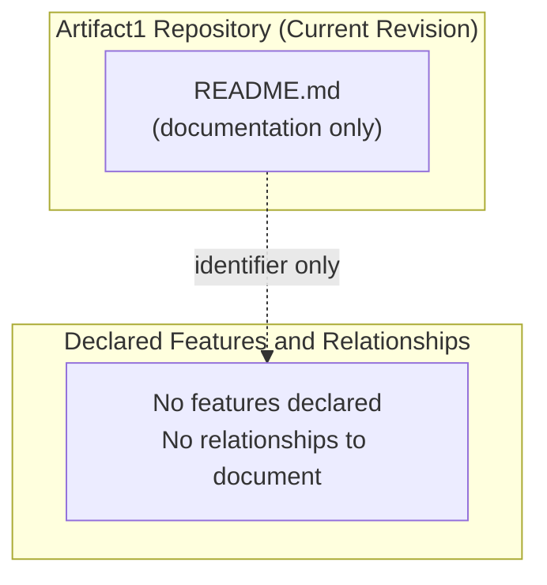

The dashed edge above expresses that the `README.md` provides identification (per Section 1.3.1.1) but contributes no functional feature to a graph that is, in any case, empty.

### 2.4.2 Integration Points

No integration points exist in the repository. Per Section 1.2.1.3, the project declares no integrations with external systems; per Section 1.3.2.3, integration points are explicitly not covered by the current artifact. Consequently, no inter-feature integration points, no service-to-service contracts, and no third-party connectors are documentable in this section.

| Integration Dimension | Documented Instances |
|---|---|
| Internal Feature-to-Feature Integrations | None — no features to integrate |
| External System Integrations | None — none declared (Section 1.2.1.3) |
| Integration Contracts | None — no API or schema definitions present |

### 2.4.3 Shared Components and Common Services

No shared components or common services have been identified, because the component architecture is empty as of this revision (per Section 1.2.2.2). There are no modules, services, libraries, packages, or infrastructure resources in the repository that could be shared across features, and no features exist that could share them.

| Shared-Element Category | Documented Instances |
|---|---|
| Shared Modules / Libraries | None — no components present (Section 1.2.2.2) |
| Common Services | None — no service definitions in the codebase |
| Cross-Cutting Concerns | None — no logging, metrics, or tracing artifacts (Section 1.3.2.1) |

## 2.5 IMPLEMENTATION CONSIDERATIONS

### 2.5.1 Technical Constraints

No technical constraints can be enumerated at the feature level because no features exist and no technology stack has been declared. Per Section 1.2.2.3, programming language source files, framework declarations, build or compilation tooling, containerization or deployment configuration, testing frameworks, and schema definitions are all absent from the repository. Constraints arising from technology choices, runtime targets, or interoperability requirements cannot be documented without these declarations.

### 2.5.2 Performance Requirements

No performance requirements have been recorded. Per Section 1.2.3.3, no KPIs, no observability declarations, and no service-level objectives are present in the codebase. Throughput, latency, concurrency, availability, and resource-utilization targets are therefore undocumented and cannot be associated with feature-level expectations.

### 2.5.3 Scalability Considerations

No scalability considerations are documented. The repository contains no architectural decomposition (per Section 1.2.2.2), no deployment topology, no infrastructure-as-code definitions, and no capacity-planning artifacts. Horizontal-scaling strategies, vertical-scaling limits, data-partitioning approaches, and elasticity criteria cannot be specified in the absence of these inputs.

### 2.5.4 Security Implications

No security implications are recorded at the feature level. Per Section 1.3.2.1, authentication and authorization are explicitly out of scope as currently constituted, and no identity, access-control, cryptographic, or threat-modelling components exist in the codebase. Per Section 2.3.4, no security requirements are documentable. The artifact's security posture will need to be defined in conjunction with the introduction of functional features.

### 2.5.5 Maintenance Requirements

No maintenance requirements have been authored. The repository contains no operational runbooks, upgrade procedures, monitoring playbooks, support-tier definitions, or lifecycle declarations. Maintenance considerations such as patch cadence, dependency-update policy, deprecation timelines, and end-of-life criteria cannot be enumerated without the existence of underlying components to maintain.

### 2.5.6 Summary of Implementation Consideration Coverage

| Consideration Dimension | Status | Reason |
|---|---|---|
| Technical Constraints | Not documentable | No technology stack declared (Section 1.2.2.3) |
| Performance Requirements | Not documentable | No KPIs or SLOs defined (Section 1.2.3.3) |
| Scalability Considerations | Not documentable | No architecture or topology present (Section 1.2.2.2) |
| Security Implications | Not documentable | Auth/authz out of scope (Section 1.3.2.1) |
| Maintenance Requirements | Not documentable | No components or runbooks in repository |

## 2.6 TRACEABILITY MATRIX

### 2.6.1 Requirement-to-Feature Traceability

The traceability matrix is presented below in its empty form, consistent with the absence of features (Section 2.2.1) and the absence of requirements (Section 2.3.1):

| Requirement ID | Feature ID | Acceptance Criterion | Verification Method |
|---|---|---|---|
| — | — | — | — |

No traceable linkages between requirements and features exist at this revision. As features and requirements are introduced in subsequent revisions, this matrix is expected to enumerate the bi-directional mapping between each `F-XXX-RQ-YYY` requirement and its parent `F-XXX` feature, together with the corresponding acceptance criterion and the planned verification method (review, test, demonstration, or analysis).

### 2.6.2 Requirement-to-Source-Artifact Traceability

A traceability mapping from requirements to source artifacts is similarly empty. The only source artifact present in the repository is `README.md`, which carries identifier content rather than requirement-bearing or behaviour-bearing content.

| Source Artifact | Requirement Coverage | Notes |
|---|---|---|
| `README.md` | None | Establishes project identifier; no requirement content |

### 2.6.3 Process-Flow Cross-References

No process flowcharts have been authored in the technical specification at this revision, and none can meaningfully be authored without underlying features or behaviours. Consequently, this section provides no cross-references to process diagrams. Subsequent revisions of the specification — added in step with the introduction of features into the codebase — will be expected to provide such cross-references.

### 2.6.4 Assumptions and Constraints Recorded with This Section

| Assumption / Constraint | Source |
|---|---|
| The repository is in a pre-implementation / placeholder state | Section 1.1.1 and Section 1.1.2 |
| No fabrication of features, requirements, or relationships is permitted | Section 1.4.2 (Authoring Constraints) |
| Future revisions will expand this section as artifacts are added | Section 1.4.3 (Anticipated Documentation Revisions) |
| Section identifiers (F-XXX, F-XXX-RQ-YYY) remain unallocated | Section 2.2.1 and Section 2.3.1 |

### 2.6.5 Requirement Version Tracking

Because no requirements have been authored, no requirement versions exist to track. Subsequent revisions of this section will be expected to introduce per-requirement version identifiers and change-history annotations as the requirement set is populated.

| Requirement ID | Version | Change Summary |
|---|---|---|
| — | — | No requirements authored at this revision |

## 2.7 SECTION SUMMARY AND FORWARD COMMITMENT

### 2.7.1 Summary of the Current Requirements State

| Subsection | Documented Instances |
|---|---|
| 2.2 Feature Catalog | Zero features (F-XXX entries: none) |
| 2.3 Functional Requirements | Zero requirements (F-XXX-RQ-YYY entries: none) |
| 2.4 Feature Relationships | Zero relationships, zero integrations, zero shared components |
| 2.5 Implementation Considerations | Zero documentable considerations across all dimensions |
| 2.6 Traceability Matrix | Empty across all traceability dimensions |

### 2.7.2 Conditions Under Which This Section Will Be Updated

Per the precedent established in Section 1.4.3 (Anticipated Documentation Revisions), the present section will be expanded under any of the following conditions:

1. Introduction of any source-code module, package, or script that implements a unit of behaviour
2. Introduction of design documents, requirement specifications, user stories, or product briefs into the repository
3. Expansion of `README.md` to include feature descriptions, capability statements, or scope clarifications
4. Introduction of dependency manifests, configuration files, or schema definitions that imply feature-level technical context
5. Introduction of integration definitions (API contracts, message schemas, connector code) that establish feature-to-system relationships

Until at least one of the above conditions obtains, this section is expected to remain in its current evidence-grounded, structurally-complete-but-materially-empty form.

### 2.7.3 References to Related Technical Specification Content

| Related Section | Relevance to This Section |
|---|---|
| 1.1 Executive Summary | Establishes placeholder state and lack of business problem articulation |
| 1.2 System Overview | Establishes absence of capabilities, components, and technical approach |
| 1.3 Scope | Establishes the minimal in-scope set and the explicit out-of-scope categories |
| 1.4 Document Basis and Evolution | Establishes the authoring constraints and revision pattern this section follows |

#### References

#### Files Examined

- `README.md` — Sole file in the repository. Verified to contain only the single line `# Artifact1`. Confirmed as providing the project identifier (used in Sections 2.1.1 and 2.2.1) and no feature, requirement, dependency, or relationship content.

#### Folders Explored

- `/` (repository root) — Verified to contain exclusively `README.md` and no subdirectories. Confirmed the absence of any source files, configuration files, dependency manifests, build scripts, test fixtures, integration definitions, schema files, or design documents that could ground feature or requirement statements.

#### Technical Specification Sections Retrieved

- **1.1 Executive Summary** — Cross-referenced in Sections 2.1.2, 2.2.3, and 2.7.3 to establish the placeholder project state, the absence of an articulated business problem, the undefined stakeholder model, and the unformalized business impact.
- **1.2 System Overview** — Cross-referenced in Sections 2.1.2, 2.2.4, 2.3.3, 2.4.2, 2.4.3, 2.5.1, 2.5.2, 2.5.3, and 2.7.3 to establish the absence of business context, integrations, capabilities, components, technical approach, and KPIs.
- **1.3 Scope** — Cross-referenced in Sections 2.1.2, 2.2.1, 2.3.3, 2.3.4, 2.4.2, 2.4.3, 2.5.4, and 2.7.3 to establish the minimal in-scope element set, the explicit out-of-scope categories, and the lack of integration coverage.
- **1.4 Document Basis and Evolution** — Cross-referenced in Sections 2.1.1, 2.1.3, 2.6.4, 2.7.2, and 2.7.3 to establish the authoring constraints, the anticipation of future revisions, and the precedent for empty-but-structured documentation entries.

# 3. Technology Stack

## 3.1 CURRENT STACK STATE OVERVIEW

### 3.1.1 Empty-State Declaration

The repository under specification — identified as **Artifact1** per Section 1.1.1 — declares **no technology stack** as of the current revision. Section 1.2.2.3 (Core Technical Approach) records that programming language source files, framework declarations, build or compilation tooling, containerization or deployment configuration, testing frameworks or fixtures, and schema or interface definitions are all absent from the repository. The technical approach is, per the same section, **undetermined from currently available evidence** and must remain so until implementation artifacts are introduced.

Accordingly, this Technology Stack section is authored to be **structurally complete but materially empty**: each prescribed dimension of the stack is enumerated below for documentary completeness, and each is annotated with the verifiable absence of corresponding artifacts in the repository. No technology choices are inferred, defaulted, fabricated, or otherwise assigned.

### 3.1.2 Authoring Constraints Governing This Section

Three binding constraints from earlier sections of this Technical Specification directly govern the content of Section 3:

| Constraint Source | Constraint Substance | Effect on Section 3 |
|---|---|---|
| Section 1.4.2 (Authoring Constraints) | Prohibits speculation about "technology choices" because such speculation would compromise the document's role as a faithful, evidence-grounded reference for the artifact's actual state | No default or assumed technology assignments are permitted in this section |
| Section 1.2.2.3 (Core Technical Approach) | Records that languages, frameworks, build tooling, containerization, testing, and schemas are all absent | The empty-state declaration above is the only evidentially supportable starting position |
| Section 1.3.2.1 (Explicitly Excluded Capabilities) | Places application source code, runtime configuration, build/deploy/CI-CD, testing, external integrations, data schemas, authentication, and observability all explicitly out of scope | Each subsection below documents an out-of-scope category and cannot enumerate concrete instances |

### 3.1.3 Visual Representation of the Stack's Current Relational State

Consistent with the precedent set in Section 2.4.1 (which renders an empty feature-relationship graph), the current relational state of the artifact's technology surface is depicted below. The diagram explicitly represents the empty stack rather than any speculative architecture:


The dashed edges express that the `README.md` provides only the artifact identifier (per Section 1.3.1.1) and contributes no content to any layer of the technology stack.

## 3.2 PROGRAMMING LANGUAGES

### 3.2.1 Language Inventory by Platform and Component

The repository contains no programming-language source files of any kind. No platform or component pairings can be enumerated because no platforms and no components are declared (per Section 1.2.2.2, which records the absence of modules, services, libraries, packages, applications, and infrastructure resources).

| Platform / Component | Language | Version | Source-File Evidence |
|---|---|---|---|
| — | None declared | — | None present in repository |

The repository contains zero files with extensions associated with any general-purpose programming language (no `.py`, `.js`, `.ts`, `.tsx`, `.java`, `.kt`, `.swift`, `.m`, `.mm`, `.go`, `.rs`, `.rb`, `.php`, `.cs`, `.cpp`, `.c`, `.h`, `.scala`, `.clj`, or equivalent source files), confirmed by the exhaustive enumeration of repository contents in Section 1.4.1 (the sole file is `README.md`).

### 3.2.2 Selection Criteria and Justifications

No selection criteria are documented and no justifications can be provided. Per Section 1.4.2, articulating selection rationale for languages that have not been committed to the repository would constitute speculation about technology choices and is therefore prohibited. The customary criteria — runtime characteristics, ecosystem maturity, team familiarity, performance envelope, interoperability requirements, licensing posture — cannot be evaluated against an empty language set.

| Selection Criterion | Documented Evaluation |
|---|---|
| Runtime characteristics | Not evaluable — no candidate languages |
| Ecosystem maturity | Not evaluable — no candidate languages |
| Team familiarity | Not evaluable — no stakeholder model defined (Section 1.1.4) |
| Performance envelope | Not evaluable — no performance requirements (Section 2.5.2) |
| Interoperability requirements | Not evaluable — no integrations declared (Section 1.2.1.3) |
| Licensing posture | Not evaluable — no dependency manifests present |

### 3.2.3 Language-Level Constraints and Dependencies

No language-level constraints, version pins, runtime targets, or toolchain dependencies have been recorded. Per Section 2.5.1 (Technical Constraints), constraints arising from technology choices, runtime targets, or interoperability requirements cannot be documented without underlying language declarations.

| Constraint Dimension | Documented State |
|---|---|
| Minimum language version | None declared |
| Maximum/supported language version | None declared |
| Runtime / interpreter targets | None declared |
| Toolchain dependencies | None declared |
| Platform-specific build requirements | None declared |

## 3.3 FRAMEWORKS & LIBRARIES

### 3.3.1 Core Framework Inventory

No application frameworks, web frameworks, mobile frameworks, AI/ML frameworks, data-processing frameworks, or testing frameworks are declared in the repository. Per Section 1.2.2.3, framework declarations are recorded as **None**. The repository contains no import statements, no framework configuration files, no application bootstrap files, and no framework-specific directory conventions (no `app/`, `pages/`, `routes/`, `controllers/`, `models/`, `views/`, `src/`, or equivalent scaffolding).

| Framework Category | Framework Name | Version | Configuration Evidence |
|---|---|---|---|
| Backend / Server-side | None declared | — | None present |
| Frontend / Client-side | None declared | — | None present |
| Mobile / Cross-platform | None declared | — | None present |
| AI / ML / Data | None declared | — | None present |
| Testing / Quality | None declared | — | None present |

### 3.3.2 Supporting Libraries

No supporting libraries — utility libraries, validation libraries, ORM/ODM layers, HTTP clients, logging libraries, serialization libraries, or UI component libraries — are declared. Without a dependency manifest of any form (see Section 3.4 below), no library inventory can be constructed.

| Supporting Library Category | Inventory |
|---|---|
| Utilities and helpers | None declared |
| Validation / parsing | None declared |
| Persistence / ORM / ODM | None declared |
| HTTP clients / API consumers | None declared |
| Logging / instrumentation | None declared |
| Serialization / encoding | None declared |
| UI components / styling | None declared |

### 3.3.3 Compatibility Requirements

No compatibility requirements are recorded. Without framework or library declarations, there are no inter-component version ranges to reconcile, no peer-dependency constraints to enforce, no runtime-to-framework compatibility windows to document, and no platform-target compatibility matrices to construct.

| Compatibility Dimension | Documented State |
|---|---|
| Framework-to-runtime compatibility | None declared |
| Inter-library peer dependencies | None declared |
| Platform / OS compatibility ranges | None declared |
| Browser / device compatibility ranges | None declared |
| Backward / forward compatibility commitments | None declared |

### 3.3.4 Justification for Framework Selection

No justifications can be authored. Per Section 1.4.2, speculating about framework choices on behalf of an artifact that declares none would violate the document's foundational authoring constraint. Justification text customarily addresses problem-fit, ecosystem dynamics, long-term maintenance posture, and operational considerations; each of these dimensions requires committed framework choices as input and consequently has no admissible content in the current revision.

## 3.4 OPEN-SOURCE DEPENDENCIES

### 3.4.1 Dependency Manifest Inventory

No dependency manifest files are present in the repository. The absence has been verified by exhaustive directory traversal (Section 1.4.1 confirms the repository root contains only `README.md` and no subdirectories) and reinforced by Section 2.2.4, which records **External Dependencies: None — no dependency manifests in the repository**.

| Manifest File | Ecosystem | Present in Repository |
|---|---|---|
| `package.json` / `package-lock.json` / `yarn.lock` / `pnpm-lock.yaml` | Node.js / npm | No |
| `requirements.txt` / `Pipfile` / `pyproject.toml` / `poetry.lock` | Python / PyPI | No |
| `pom.xml` / `build.gradle` / `build.gradle.kts` | Java / Maven Central | No |
| `Cargo.toml` / `Cargo.lock` | Rust / crates.io | No |
| `go.mod` / `go.sum` | Go modules | No |
| `Gemfile` / `Gemfile.lock` | Ruby / RubyGems | No |
| `composer.json` / `composer.lock` | PHP / Packagist | No |
| `*.csproj` / `*.fsproj` / `packages.config` | .NET / NuGet | No |
| `Podfile` / `Cartfile` / `Package.swift` | iOS / Swift PM | No |
| `pubspec.yaml` | Dart / pub.dev | No |
| `mix.exs` | Elixir / Hex | No |

### 3.4.2 Registry References

No package registries are referenced anywhere in the repository. There are no manifest entries pointing to npm, PyPI, Maven Central, NuGet, Packagist, RubyGems, crates.io, pkg.go.dev, Hex, pub.dev, or any private registry mirror. Authentication tokens, registry URL overrides, scoped-package configuration, and registry-mirror declarations are all absent.

### 3.4.3 Version Pinning and Resolution Strategy

No version pins exist. Customary version-management dimensions — exact pins, semantic-versioning ranges, lockfile-mediated resolution, transitive-dependency graphs, vulnerability-database integration, and license-policy enforcement — have no instances to document.

| Pinning Dimension | Documented State |
|---|---|
| Exact version pins | None present |
| Semver range expressions | None present |
| Lockfile-mediated resolution | No lockfile present |
| Transitive-dependency graph | Not constructible — no roots declared |
| Vulnerability scanning integration | None configured |
| License-policy enforcement | None configured |

### 3.4.4 Licensing Posture for Third-Party Code

No third-party code is incorporated into the repository. Consequently, no SPDX license identifiers, no `LICENSE` files for vendored dependencies, no `NOTICE` files, and no third-party license attribution catalogues are present. License-compatibility analysis is not applicable to an empty dependency set.

## 3.5 THIRD-PARTY SERVICES

### 3.5.1 External APIs and Integrations

No external APIs or third-party integrations are declared, configured, or implemented in the repository. Per Section 1.2.1.3, the project declares no integrations with external systems and contains no API contracts, message schemas, service descriptors, infrastructure-as-code definitions, environment configurations, third-party SDK references, or dependency declarations. Per Section 1.3.2.3, integration points are explicitly not covered by the current artifact.

| Integration Dimension | Documented Instances |
|---|---|
| REST API endpoints consumed | None declared |
| GraphQL endpoints consumed | None declared |
| gRPC services consumed | None declared |
| Webhook subscriptions | None declared |
| Message-broker connections | None declared |
| Third-party SDK bindings | None declared |

### 3.5.2 Authentication and Identity Services

No identity, authentication, or authorization services are integrated with the artifact. Per Section 1.3.2.1, authentication and authorization are explicitly out of scope as currently constituted; per Section 2.5.4, no identity, access-control, cryptographic, or threat-modelling components exist in the codebase.

| Identity / Auth Capability | Documented State |
|---|---|
| Identity Provider (IdP) integration | None declared |
| OAuth 2.0 / OIDC client configuration | None declared |
| SAML federation configuration | None declared |
| API-key / token issuance | None declared |
| Role-based / attribute-based access control | None declared |
| Session management strategy | None declared |

### 3.5.3 Monitoring, Logging, and Observability Services

No monitoring, logging, or observability services are integrated. Per Section 1.3.2.1, observability and monitoring are explicitly out of scope; per Section 1.2.3.3, there are no monitoring artifacts, telemetry configurations, observability declarations, or service-level objectives present in the codebase from which any third-party observability service could be derived.

| Observability Capability | Documented State |
|---|---|
| Metrics collection / time-series backend | None declared |
| Distributed tracing backend | None declared |
| Centralized log aggregation | None declared |
| Application performance monitoring (APM) | None declared |
| Error / exception tracking | None declared |
| Real-user monitoring (RUM) | None declared |
| Synthetic monitoring | None declared |

### 3.5.4 Cloud Platform Services

No cloud platform is declared as a deployment target. The repository contains no infrastructure-as-code definitions (Terraform, CloudFormation, Pulumi, ARM, Bicep, CDK), no provider-specific service descriptors, no IAM policy documents, no resource manifests, and no environment configurations. Cloud-provider-specific defaults (AWS, Azure, GCP, or otherwise) cannot be assigned in the absence of such artifacts and would, per Section 1.4.2, constitute speculation about technology choices.

| Cloud Capability | Documented State |
|---|---|
| Compute services (VMs, serverless, containers) | None declared |
| Network services (VPC, load balancers, CDN) | None declared |
| Managed identity / IAM | None declared |
| Managed messaging / event services | None declared |
| Secrets management | None declared |
| Region / availability-zone strategy | None declared |

## 3.6 DATABASES & STORAGE

### 3.6.1 Primary and Secondary Databases

No databases — relational, document, key-value, columnar, graph, time-series, search, vector, or otherwise — are declared, configured, or referenced in the repository. Per Section 1.3.2.1, data schemas and persistence are explicitly out of scope; per Section 2.3.3 of the Functional Requirements, no data domains are present.

| Database Category | Engine | Version | Connection Configuration |
|---|---|---|---|
| Primary OLTP database | None declared | — | None present |
| Secondary / analytical store | None declared | — | None present |
| Document / NoSQL store | None declared | — | None present |
| Key-value store | None declared | — | None present |
| Time-series store | None declared | — | None present |
| Graph database | None declared | — | None present |
| Search index | None declared | — | None present |
| Vector / embedding store | None declared | — | None present |

### 3.6.2 Data Persistence Strategies

No data persistence strategies are documented. There are no data models, no migration scripts, no schema-versioning artifacts, no ORM/ODM declarations, no replication or backup policies, and no data-lifecycle definitions present in the repository.

| Persistence Dimension | Documented State |
|---|---|
| Schema definitions | None present |
| Migration tooling | None present |
| Replication topology | None declared |
| Backup and restore strategy | None declared |
| Retention and archival policy | None declared |
| Data-residency constraints | None declared |

### 3.6.3 Caching Solutions

No caching layers — in-process caches, distributed caches, HTTP caches, CDN edge caches, or application-tier query caches — are declared or configured. No cache-key conventions, eviction policies, or coherence strategies have been recorded.

| Caching Layer | Documented State |
|---|---|
| In-process cache | None declared |
| Distributed cache (e.g., Redis-class, Memcached-class) | None declared |
| HTTP / reverse-proxy cache | None declared |
| CDN edge cache | None declared |
| Query-result cache | None declared |

### 3.6.4 Object Storage and File Persistence

No object-storage buckets, blob containers, file shares, network-attached storage, or local-disk persistence patterns are declared. Without compute components (per Section 1.2.2.2) and without a cloud platform commitment (Section 3.5.4 above), no storage targets exist to be enumerated.

| Storage Service | Documented State |
|---|---|
| Object storage (S3-class) | None declared |
| Blob storage | None declared |
| File / network share | None declared |
| Block storage / persistent volumes | None declared |
| Content-delivery / static-asset hosting | None declared |

## 3.7 DEVELOPMENT & DEPLOYMENT

### 3.7.1 Development Tools and Local Environment

No development-tooling artifacts are present in the repository. There are no editor configuration files (`.editorconfig`, `.vscode/`, `.idea/`), no language-server configuration files, no formatter or linter configurations (`.prettierrc`, `.eslintrc`, `pyproject.toml` linter sections, `.rubocop.yml`, equivalent), no pre-commit hook definitions (`.pre-commit-config.yaml`, `.husky/`), no devcontainer definitions (`.devcontainer/devcontainer.json`), and no environment-template files (`.env.example`, `.envrc`).

| Development-Tool Category | Documented State |
|---|---|
| Editor / IDE configuration | None present |
| Code formatter configuration | None present |
| Linter configuration | None present |
| Pre-commit / commit-hook configuration | None present |
| Dev-container / sandbox definition | None present |
| Environment-template files | None present |
| Local secrets / credential templates | None present |

### 3.7.2 Build System

No build system is declared. Per Section 1.2.2.3, build or compilation tooling is recorded as **None**. The repository contains no build scripts (`Makefile`, `build.sh`, `build.ps1`), no language-specific build manifests (`pyproject.toml` build sections, `setup.py`, `package.json` scripts, `Cargo.toml`, `pom.xml`, `build.gradle`, `Rakefile`, `mix.exs`), no task runners (Gulp, Grunt, Just), and no monorepo build orchestrators (Nx, Turborepo, Bazel, Pants, Lerna).

| Build-System Dimension | Documented State |
|---|---|
| Imperative build script | None present |
| Declarative build manifest | None present |
| Task runner / orchestrator | None present |
| Monorepo build coordination | None present |
| Reproducible-build configuration | None present |
| Build-output / artifact targets | None declared |

### 3.7.3 Containerization and Runtime Packaging

No container or runtime-packaging artifacts are present. Per Section 1.2.2.3, containerization or deployment configuration is recorded as **None**. The repository contains no `Dockerfile`, no `Containerfile`, no `docker-compose.yml`, no `.dockerignore`, no Buildpack project descriptors, no Kubernetes manifests (`*.yaml` resource files, `kustomization.yaml`, Helm charts), and no virtual-machine image definitions (Packer, Vagrant).

| Packaging Dimension | Documented State |
|---|---|
| Container image definition | None present |
| Multi-service composition file | None present |
| Kubernetes manifest set | None present |
| Helm chart / Kustomize overlay | None present |
| VM image definition | None present |
| Serverless package descriptor | None present |

### 3.7.4 Continuous Integration and Continuous Deployment (CI/CD)

No CI/CD pipeline is defined. The repository contains no `.github/workflows/`, no `.gitlab-ci.yml`, no `.circleci/config.yml`, no `Jenkinsfile`, no `azure-pipelines.yml`, no `bitbucket-pipelines.yml`, no `.travis.yml`, no Drone or Woodpecker configurations, no Tekton pipeline definitions, no Argo CD/Argo Workflows manifests, and no Spinnaker pipeline descriptors. Per Section 1.3.2.1, build, deployment, and CI/CD are explicitly out of scope as currently constituted.

| CI/CD Dimension | Documented State |
|---|---|
| CI provider configuration | None present |
| CD / release-promotion configuration | None present |
| Branch-protection and merge-policy declarations | None present (no repository-level configuration committed) |
| Artifact-signing / provenance configuration | None present |
| Secrets-injection configuration | None present |
| Deployment-environment definitions | None present |

### 3.7.5 Infrastructure as Code (IaC)

No infrastructure-as-code definitions are present. There are no Terraform (`.tf`, `.tfvars`, `.terraform.lock.hcl`), Pulumi, CloudFormation (JSON or YAML templates), AWS CDK, Azure Bicep, Google Deployment Manager, Crossplane, or Ansible artifacts in the repository. Cloud-provider-agnostic and provider-specific IaC categories are both empty.

| IaC Dimension | Documented State |
|---|---|
| Declarative IaC manifest | None present |
| Programmatic IaC code | None present |
| State-management backend configuration | None declared |
| Policy-as-code definitions | None present |
| Drift-detection configuration | None present |

### 3.7.6 Version Control and Source-Management Artifacts

The repository, as established by Section 1.4.1, contains the `README.md` file and no other artifacts. No `.gitignore`, no `.gitattributes`, no `CODEOWNERS`, no `CONTRIBUTING.md`, no `SECURITY.md`, no issue or pull-request templates, no branch-protection configuration, and no commit-signing policy artifacts are present in the working tree. Repository-platform-level configuration (such as protected-branch policies or required reviewers) is similarly undocumented within the source tree.

## 3.8 SUMMARY OF TECHNOLOGY STACK COVERAGE AND FORWARD COMMITMENT

### 3.8.1 Coverage Summary

The following summary mirrors the precedent set by Section 2.5.6 (Summary of Implementation Consideration Coverage):

| Stack Dimension | Status | Evidentiary Anchor |
|---|---|---|
| Programming Languages (Section 3.2) | Not documentable | No source files present (Section 1.2.2.3) |
| Frameworks & Libraries (Section 3.3) | Not documentable | No framework declarations present (Section 1.2.2.3) |
| Open-Source Dependencies (Section 3.4) | Not documentable | No dependency manifests present (Section 2.2.4) |
| Third-Party Services (Section 3.5) | Not documentable | No integrations declared (Section 1.2.1.3); integrations out of scope (Section 1.3.2.3) |
| Databases & Storage (Section 3.6) | Not documentable | Data schemas and persistence out of scope (Section 1.3.2.1) |
| Development & Deployment (Section 3.7) | Not documentable | Build, deployment, and CI/CD out of scope (Section 1.3.2.1) |

### 3.8.2 Conditions Under Which This Section Will Be Updated

Consistent with the revision-trigger pattern established by Section 1.4.3 and reused in Section 2.7.2, this Technology Stack section will be expanded under any of the following conditions:

1. Introduction of any **language source file** (e.g., `*.py`, `*.js`, `*.ts`, `*.java`, `*.kt`, `*.swift`, `*.go`, `*.rs`, `*.rb`, `*.cs`, `*.cpp`, `*.c`, `*.m`, `*.mm`, or equivalent) into the repository — triggering population of Section 3.2.
2. Introduction of **framework configuration files, application bootstrap files, or framework-specific scaffolding** — triggering population of Section 3.3.
3. Introduction of a **dependency manifest** (e.g., `package.json`, `requirements.txt`, `pyproject.toml`, `Pipfile`, `pom.xml`, `build.gradle`, `Cargo.toml`, `go.mod`, `Gemfile`, `composer.json`, `*.csproj`, `Podfile`, `Package.swift`, `pubspec.yaml`, `mix.exs`) or a corresponding **lockfile** — triggering population of Section 3.4.
4. Introduction of **integration definitions** (REST/GraphQL/gRPC contracts, OpenAPI/AsyncAPI documents, SDK initialization code, webhook subscriptions, or message-broker configuration) — triggering population of Section 3.5.
5. Introduction of **data-store configuration** (database connection strings, schema files, migration scripts, ORM/ODM mappings, cache-client configuration, or object-storage references) — triggering population of Section 3.6.
6. Introduction of **build, container, IaC, or CI/CD artifacts** (Makefiles, build scripts, Dockerfiles, Compose files, Kubernetes manifests, Helm charts, Terraform/Pulumi/CloudFormation/Bicep files, or workflow definitions under `.github/workflows/`, `.gitlab-ci.yml`, `Jenkinsfile`, etc.) — triggering population of Section 3.7.
7. Expansion of `README.md` (or introduction of supplementary documentation) to **explicitly declare technology choices** with sufficient specificity to be reflected without inference.

Until at least one of the above conditions obtains, this section is expected to remain in its current evidence-grounded, structurally-complete-but-materially-empty form.

### 3.8.3 Security and Compliance Considerations Pending Stack Commitment

The section prompt directs that security implications of technology choices be considered. Per Section 2.5.4 (Security Implications), no security implications are recorded at the feature level, because authentication and authorization are explicitly out of scope (Section 1.3.2.1) and no identity, access-control, cryptographic, or threat-modelling components exist in the codebase. The following dimensions of security analysis are therefore deferred until a technology stack is committed to the repository:

| Security Dimension | Reason for Deferral |
|---|---|
| Supply-chain risk (transitive dependencies, typosquatting, package signing) | No dependency manifests exist (Section 3.4.1) |
| Runtime hardening (memory-safety properties of language choice, sandboxing) | No language is declared (Section 3.2.1) |
| Secret management (credential storage, rotation, distribution) | No secrets-management service is declared (Section 3.5.4); no env-template files exist (Section 3.7.1) |
| Identity and access management (authN/authZ flows, session controls) | Auth/authz explicitly out of scope (Section 1.3.2.1; Section 3.5.2) |
| Transport security (TLS termination, mutual TLS, certificate management) | No network components or services declared |
| Data-at-rest encryption (database, object storage) | No data stores declared (Section 3.6) |
| Container / runtime hardening (image scanning, minimal base images) | No container artifacts present (Section 3.7.3) |
| Pipeline security (signed builds, provenance attestations) | No CI/CD pipeline declared (Section 3.7.4) |

A complete security evaluation will become possible — and will be required — once at least one technology choice is committed to the repository, at which point the corresponding subsection above will be populated and the deferred dimensions will be reassessed.

### 3.8.4 Version-Information Status

The section prompt requests version numbers for all components. Because zero components have been declared across all six stack dimensions (Sections 3.2 through 3.7), there are zero versions to record. Version pinning, range expressions, lockfile-based resolution, and upgrade-cadence policies will be documented when the corresponding components are introduced under the trigger conditions enumerated in Section 3.8.2.

### 3.8.5 References to Related Technical Specification Content

| Related Section | Relevance to Section 3 |
|---|---|
| 1.1 Executive Summary | Establishes the placeholder state and the verified single-file composition that underpins every empty-state assertion in Section 3 |
| 1.2 System Overview | Section 1.2.1.3 documents the absence of integrations; Section 1.2.2.2 documents the absence of components; Section 1.2.2.3 directly enumerates the absent technical-stack elements that Section 3 expands upon; Section 1.2.3.3 establishes the absence of monitoring artifacts |
| 1.3 Scope | Section 1.3.1.1 establishes the minimal in-scope set; Section 1.3.2.1 enumerates the out-of-scope categories that align with each Section 3 subsection (source code, runtime configuration, build/deploy/CI-CD, testing, integrations, data schemas, authentication, observability); Section 1.3.2.3 reinforces the absence of integration coverage |
| 1.4 Document Basis and Evolution | Section 1.4.1 catalogues the foundational source material; Section 1.4.2 supplies the binding authoring constraint against technology speculation that governs Section 3; Section 1.4.3 supplies the revision-trigger pattern reused in Section 3.8.2 |
| 2.2 Feature Catalog | Section 2.2.4 directly records the absence of dependency manifests, reinforcing Section 3.4 |
| 2.5 Implementation Considerations | Section 2.5.1 directly states the absence of a declared technology stack; Section 2.5.4 establishes that security implications are not yet documentable; Section 2.5.6 provides the Status / Reason table format mirrored in Section 3.8.1 |
| 2.7 Section Summary and Forward Commitment | Section 2.7.2 supplies the canonical structure for the Conditions Under Which This Section Will Be Updated subsection; Section 2.7.3 supplies the canonical structure for the References to Related Technical Specification Content table reused above |

#### References

#### Files Examined

- `README.md` — Sole file in the repository. Verified to contain only the single line `# Artifact1`. Confirmed as providing the artifact identifier and no language declarations, framework imports, dependency references, integration declarations, data-store configuration, build instructions, container definitions, IaC declarations, or CI/CD pipeline content. Establishes the evidentiary basis for the empty-state assertions throughout Section 3.

#### Folders Explored

- `/` (repository root) — Verified by Section 1.4.1 to contain exclusively `README.md` and no subdirectories. Confirmed the absence of conventional source-tree structures (no `src/`, `app/`, `lib/`, `services/`, `pkg/`, `cmd/`, `internal/`, `infrastructure/`, `infra/`, `iac/`, `terraform/`, `deploy/`, `deployment/`, `k8s/`, `kubernetes/`, `helm/`, `charts/`, `config/`, `configs/`, `env/`, `.github/`, `.gitlab/`, `.circleci/`, `.devcontainer/`, `.vscode/`, `.idea/`, `scripts/`, `bin/`, `build/`, `dist/`, `tests/`, `test/`, `spec/`, `__tests__/`, `docs/`, `documentation/`, `migrations/`, `schemas/`, `proto/`, `protos/`, or `api/`). The maximum traversal depth of 1 was achieved because no deeper structure exists.

#### Technical Specification Sections Retrieved

- **1.1 Executive Summary** — Cross-referenced in Sections 3.1.1 and 3.8.5 to anchor the artifact's identifier, the verified single-file repository composition, and the absence of business problem articulation, stakeholders, and value proposition.
- **1.2 System Overview** — Cross-referenced in Sections 3.1.1, 3.2.1, 3.3.1, 3.5.1, 3.5.3, 3.7.2, 3.7.3, 3.8.1, and 3.8.5. Section 1.2.2.3 is the primary evidentiary anchor for the empty-state declarations in every Section 3 subsection; Section 1.2.1.3 anchors the absence of external integrations (Section 3.5.1); Section 1.2.2.2 anchors the absence of components (Section 3.2.1, Section 3.6.4); Section 1.2.3.3 anchors the absence of monitoring artifacts (Section 3.5.3).
- **1.3 Scope** — Cross-referenced in Sections 3.1.2, 3.5.1, 3.5.2, 3.5.3, 3.6.1, 3.7.4, 3.8.1, and 3.8.5. Section 1.3.2.1 anchors the out-of-scope categories that correspond to each Section 3 subsection; Section 1.3.2.3 anchors the absence of integration coverage.
- **1.4 Document Basis and Evolution** — Cross-referenced in Sections 3.1.2, 3.2.2, 3.3.4, 3.5.4, 3.8.2, and 3.8.5. Section 1.4.1 anchors the foundational source-material inventory; Section 1.4.2 supplies the binding constraint against technology-choice speculation that governs every subsection of Section 3; Section 1.4.3 supplies the revision-trigger pattern reused in Section 3.8.2.
- **2.2 Feature Catalog** — Cross-referenced in Sections 3.4.1 and 3.8.5. Section 2.2.4 directly records the absence of external dependency manifests, providing redundant evidentiary support for Section 3.4.
- **2.4 Feature Relationships** — Consulted to confirm the documentary precedent for empty-state Mermaid diagrams; Section 2.4.1's structure informs the diagram rendered in Section 3.1.3.
- **2.5 Implementation Considerations** — Cross-referenced in Sections 3.2.3, 3.5.2, 3.8.1, 3.8.3, and 3.8.5. Section 2.5.1 directly states that no technical constraints can be enumerated because no technology stack is declared; Section 2.5.4 establishes the deferral of security implications; Section 2.5.6's Status / Reason table format is mirrored in Section 3.8.1.
- **2.7 Section Summary and Forward Commitment** — Cross-referenced in Sections 3.8.2 and 3.8.5. Section 2.7.2 supplies the canonical structure for the trigger-condition subsection; Section 2.7.3 supplies the canonical structure for the related-sections table.

# 4. Process Flowchart

## 4.1 CURRENT PROCESS FLOWCHART STATE OVERVIEW

### 4.1.1 Empty-State Declaration

The repository under specification — identified as **Artifact1** per Section 1.1.1 — contains **no process flowcharts, no workflow definitions, no business-process descriptors, no state-machine declarations, no integration sequences, and no error-handling logic** as of the current revision. This empty state is the direct consequence of three independent, evidentiarily verified facts already recorded in prior sections of this Technical Specification:

1. The repository contains exactly one file (`README.md`, 11 bytes, single line: `# Artifact1`) and no subdirectories, per Section 1.4.1 and Section 1.1.2.
2. The feature catalogue contains zero entries (no `F-XXX` identifiers allocated), per Section 2.2.1, and the functional-requirements register contains zero entries (no `F-XXX-RQ-YYY` identifiers allocated), per Section 2.3.1.
3. Section 2.6.3 (Process-Flow Cross-References) directly states that no process flowcharts have been authored in the Technical Specification at this revision, **and that none can meaningfully be authored without underlying features or behaviours**.

Accordingly, this Process Flowchart section is authored to be **structurally complete but materially empty**, mirroring the precedent established by Section 2.4 (Feature Relationships), Section 2.6 (Traceability Matrix), Section 3.1 (Current Stack State Overview), and Section 3.8 (Summary of Technology Stack Coverage and Forward Commitment). Each subsection prescribed by the section prompt is enumerated below for documentary completeness, and each is annotated with the verifiable absence of corresponding artifacts in the repository. No workflows, decision logic, integration sequences, state transitions, retry mechanisms, fallback procedures, or timing constraints are inferred, assumed, defaulted, or fabricated.

### 4.1.2 Authoring Constraints Governing This Section

Four binding constraints from earlier sections of this Technical Specification directly govern the content of Section 4. Each constraint is restated explicitly here because it materially shapes both the diagrams and the inventory tables that follow.

| Constraint Source | Constraint Substance | Effect on Section 4 |
|---|---|---|
| Section 1.4.2 (Authoring Constraints) | Prohibits speculation about the project's intended purpose, audience, technology choices, architectural patterns, or success metrics, because such speculation would compromise the document's role as a faithful, evidence-grounded reference. | No business processes, user journeys, decision points, error-handling paths, or SLA timings may be invented within Section 4. |
| Section 1.3.1.2 (System Boundaries) | Records that system boundaries are **not delineated** in the repository. | No swim lanes, actor boundaries, system-boundary lines, or trust boundaries can be drawn in any diagram in Section 4. |
| Section 1.3.2.1 (Explicitly Excluded Capabilities) | Places application source code, runtime configuration, build and deployment pipelines, test suites, external integrations and APIs, data schemas and persistence, authentication and authorization, and observability and monitoring all explicitly out of scope. | Every functional building block from which a process flow would normally be assembled is out of scope at this revision. |
| Section 2.6.3 (Process-Flow Cross-References) | Directly declares that no process flowcharts have been authored and that none can meaningfully be authored without underlying features or behaviours. | This section's empty-state form is the only evidentiarily supportable form at this revision. |

### 4.1.3 Visual Representation of the Current Process Surface

Consistent with the empty-state-diagram precedent set by Section 2.4.1 (empty feature-relationship graph) and Section 3.1.3 (empty technology-stack graph), the current relational state of the artifact's process-flow surface is depicted below. The diagram explicitly represents the empty workflow surface rather than any speculative orchestration.

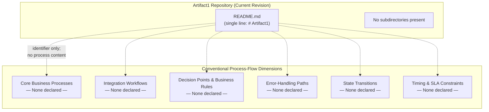

The dashed edges express that the `README.md` provides only the artifact identifier (per Section 1.3.1.1) and contributes no content to any dimension of process or workflow definition. The `NoSubfolders` node within the repository-state subgraph reinforces that there are no implementation directories from which a workflow could be derived.

---

## 4.2 SYSTEM WORKFLOWS

### 4.2.1 Core Business Processes

The section prompt requests documentation of end-to-end user journeys, system interactions, decision points, and error-handling paths. Each of these dimensions is enumerated below with its evidentiary anchor establishing that the dimension is not documentable at this revision.

| Core-Process Dimension | Documented Instances | Evidentiary Anchor |
|---|---|---|
| End-to-End User Journeys | None — no users or stakeholders defined | Section 1.1.4 records stakeholders as "undefined at this stage"; Section 1.3.2.4 establishes that no use cases are supported |
| System Interactions | None — no components present | Section 1.2.2.2 records that component architecture is empty (no modules, services, libraries, packages, applications, or infrastructure resources) |
| Decision Points | None — no business rules declared | Section 2.3.4 records "None — no domain logic declared" for business rules |
| Error-Handling Paths | None — no application source code | Section 1.3.2.1 places application source code out of scope; no error-handling logic is committed to the repository |

#### End-to-End User Journeys

No user journey can be drawn because no user, persona, role, or actor is formally declared in the repository. Section 1.1.4 records stakeholders as undefined; Section 1.3.2.4 records that, because no use cases are defined or implemented within the codebase, all use cases are presently unsupported. A user journey requires (a) at least one declared actor, (b) at least one declared entry point, and (c) at least one declared outcome — none of which are present.

#### System Interactions

No inter-component interaction can be drawn because, per Section 1.2.2.2, the component architecture is empty. There are no modules, services, libraries, packages, applications, or infrastructure resources between which messages, calls, or events could flow. Per Section 1.2.1.3, no integrations with external systems are declared, eliminating system-to-system interactions as well.

#### Decision Points

No decision diamonds can be populated because, per Section 2.3.4, no business rules, no policy logic, and no domain rules are declared. A decision diamond requires a predicate expressible in terms of business or technical state, and the repository commits no such predicates.

#### Error-Handling Paths

No error-handling path can be drawn because, per Section 1.3.2.1, application source code is explicitly out of scope, and per Section 2.5.5, no operational runbooks exist. There is no error-emitting component, no error-detection logic, no exception taxonomy, and no recovery action declared anywhere in the repository.

### 4.2.2 Integration Workflows

The section prompt requests documentation of data flow between systems, API interactions, event processing flows, and batch processing sequences. Each dimension is enumerated below with its evidentiary anchor.

| Integration-Workflow Dimension | Documented Instances | Evidentiary Anchor |
|---|---|---|
| Data Flow Between Systems | None — no integrations declared | Section 1.2.1.3 records absence of integrations; Section 1.3.2.3 places integration points explicitly out of scope |
| API Interactions | None — no REST/GraphQL/gRPC endpoints | Section 3.5.1 records all API-endpoint categories as "None declared" |
| Event Processing Flows | None — no message-broker connections | Section 3.5.1 records no message-broker connections, no webhook subscriptions, no third-party SDK bindings |
| Batch Processing Sequences | None — no scheduled tasks or build/run system | Section 3.7.4 records no CI/CD pipeline; no cron, scheduler, or batch-runner definitions exist |

#### Data Flow Between Systems

No data flow can be drawn because, per Section 1.2.1.3, the repository declares no integrations with external systems and contains no API contracts, message schemas, service descriptors, infrastructure-as-code definitions, environment configurations, third-party SDK references, or dependency declarations. Per Section 1.3.2.3, no integration points are covered by the current artifact.

#### API Interactions

No API interaction can be drawn because, per Section 3.5.1, REST API endpoints, GraphQL endpoints, gRPC services, webhook subscriptions, message-broker connections, and third-party SDK bindings are all recorded as "None declared". There is no OpenAPI, AsyncAPI, Protocol Buffers, GraphQL SDL, or equivalent contract committed to the repository.

#### Event Processing Flows

No event processing flow can be drawn because, per Section 3.5.1, no message-broker connections (Kafka, RabbitMQ, NATS, SQS, SNS, EventBridge, Pub/Sub, Service Bus, Kinesis, or equivalents) are declared and no event-schema definitions exist. There is no producer, consumer, topic, partition, dead-letter destination, or replay policy committed to the repository.

#### Batch Processing Sequences

No batch sequence can be drawn because, per Section 3.7.4, no CI/CD pipeline is defined and, per Section 1.3.2.1, build, deployment, and CI/CD are explicitly out of scope. No cron expressions, scheduled-job manifests (e.g., Kubernetes CronJobs, AWS EventBridge schedules, Airflow DAGs, Prefect flows, Dagster jobs), batch-orchestrator declarations, or workflow-engine definitions exist in the repository.

### 4.2.3 High-Level System Workflow Diagram

The required high-level system workflow diagram is rendered below in its evidentially supportable empty-state form. Every conventional workflow stage is preserved as a placeholder node annotated with "None declared", and the dashed edges indicate that no transition logic has been committed.

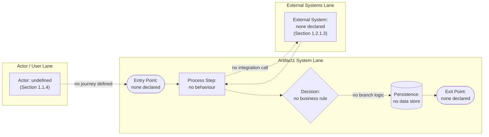

The three swim lanes — Actor, Artifact1 System, and External Systems — are retained for structural completeness so that future revisions can populate the corresponding actors, steps, and integrations without altering the topological skeleton. At the current revision every node is a placeholder and every edge is dashed.

---

## 4.3 FLOWCHART REQUIREMENTS

### 4.3.1 Required Flowchart Elements

The section prompt enumerates seven elements that every major workflow flowchart must contain. The status of each element at the current revision is recorded below.

| Required Flowchart Element | Documented Instances | Evidentiary Anchor |
|---|---|---|
| Start and End Points | None — no process boundaries exist | Section 1.2.2.2 (no components); Section 1.3.1.2 (system boundaries not delineated) |
| Process Steps | None — no behaviours declared | Section 2.3.1 (zero functional requirements); Section 2.2.1 (zero features) |
| Decision Diamonds | None — no business rules declared | Section 2.3.4 (business rules: "None — no domain logic declared") |
| System Boundaries | None — boundaries not delineated | Section 1.3.1.2 (system boundaries: "Not delineated") |
| User Touchpoints | None — no stakeholders defined | Section 1.1.4 (stakeholders "undefined at this stage") |
| Error States and Recovery Paths | None — no application source code | Section 1.3.2.1 (source code explicitly out of scope) |
| Timing and SLA Considerations | None — no KPIs or SLOs declared | Section 1.2.3.3 (no KPIs, telemetry, or service-level objectives) |

### 4.3.2 Validation Rules

The section prompt enumerates four validation-rule categories that every major workflow must encode. The status of each category at the current revision is recorded below.

| Validation Category | Documented Instances | Evidentiary Anchor |
|---|---|---|
| Business Rules at Each Step | None — no domain logic declared | Section 2.3.4 (Business Rules row: "None") |
| Data Validation Requirements | None — no data structures defined | Section 2.3.4 (Data Validation row: "None"); Section 3.6 (no schemas, migrations, or ORM/ODM declarations) |
| Authorization Checkpoints | None — auth/authz explicitly out of scope | Section 1.3.2.1 (authentication and authorization out of scope); Section 3.5.2 (all identity/auth capabilities "None declared") |
| Regulatory Compliance Checks | None — no regulatory framing in codebase | Section 2.3.4 (Compliance Requirements row: "None"); Section 2.5.4 (no threat-modelling components exist) |

No validation rule can be authored at this revision because each of the four sources of such rules — domain business logic, data schemas, authorization policy, and regulatory framing — is independently absent from the repository, as cross-referenced above.

### 4.3.3 Detailed Process Flow Diagram (Per Declared Feature)

The section prompt requires a detailed process flow for **each core feature**. Because Section 2.2.1 records zero features (no `F-XXX` identifiers allocated), there is no feature for which to render a process flow. The diagram below represents the per-feature flow template in its empty-state form, preserving every prescribed flowchart element from Section 4.3.1 as a placeholder.

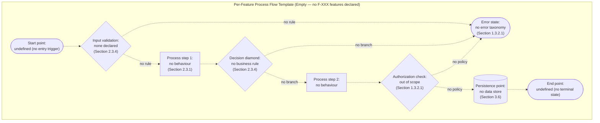

This template diagram is preserved so that, upon introduction of the first `F-XXX` feature, the per-feature flow can be populated by substituting concrete labels for each placeholder node without altering the topological skeleton.

### 4.3.4 Error Handling Flowchart

The required error-handling flowchart is rendered below in its empty-state form. Each conventional error-handling stage — detection, classification, retry, fallback, notification, and recovery — is preserved as a placeholder, and every edge is dashed to indicate that no transition logic has been committed.

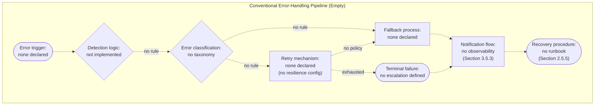

No retry budgets, exponential-backoff parameters, circuit-breaker thresholds, dead-letter destinations, alert severities, paging policies, or post-incident review procedures are documented because no such artifacts exist in the repository.

---

## 4.4 TECHNICAL IMPLEMENTATION

### 4.4.1 State Management

The section prompt requests documentation of state transitions, data persistence points, caching requirements, and transaction boundaries. The status of each dimension at the current revision is recorded below.

| State-Management Dimension | Documented Instances | Evidentiary Anchor |
|---|---|---|
| State Transitions | None — no state machines declared | Section 1.2.2.2 (no components have state); Section 1.3.1.2 (system boundaries not delineated) |
| Data Persistence Points | None — no databases declared | Section 3.6 (no schemas, migrations, ORM/ODM declarations); Section 1.3.2.1 (data schemas and persistence out of scope) |
| Caching Requirements | None — no caching layers declared | Section 3.6.3 (no cache-key conventions, eviction policies, or coherence strategies) |
| Transaction Boundaries | None — no data stores | Section 3.6 (no transactional resources); no ORM/ODM declarations |

No state diagram, persistence-checkpoint marker, cache-key strategy, or transaction-scope envelope can be drawn at this revision because each of the four enabling artifact categories — durable state, persistent storage, cache configuration, and transaction-capable resource — is independently absent.

### 4.4.2 Error Handling Mechanisms

The section prompt requests documentation of retry mechanisms, fallback processes, error notification flows, and recovery procedures. The status of each dimension at the current revision is recorded below.

| Error-Handling Dimension | Documented Instances | Evidentiary Anchor |
|---|---|---|
| Retry Mechanisms | None — no resilience configuration | Section 1.3.2.1 (source code out of scope); no retry-policy files or circuit-breaker configs exist |
| Fallback Processes | None — no degraded-mode logic | No alternative-path declarations, feature flags, or graceful-degradation manifests exist |
| Error Notification Flows | None — no observability services | Section 3.5.3 (all observability/notification capabilities "None declared") |
| Recovery Procedures | None — no operational runbooks | Section 2.5.5 (no operational runbooks exist); no incident-response procedures committed |

### 4.4.3 State Transition Diagram

The required state-transition diagram is rendered below in its empty-state form. Because no component in the repository carries state, the diagram represents a single placeholder state to make the empty surface explicit.

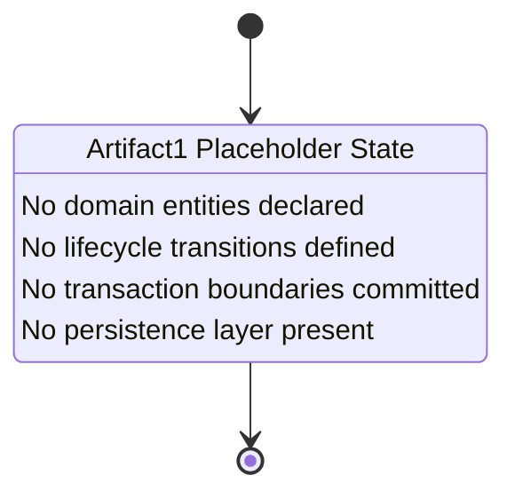

This single-state diagram is preserved so that, upon the introduction of the first durable entity, workflow orchestrator, or state-machine declaration (e.g., AWS Step Functions definition, Temporal workflow, BPMN file, XState machine), the diagram can be expanded by replacing the `Placeholder` state with the concrete state vocabulary of the introduced domain.

### 4.4.4 Integration Sequence Diagram

The required integration sequence diagram is rendered below in its empty-state form. Three conventional participants — User, Artifact1, and External Systems — are preserved as placeholders, and the diagram body consists exclusively of evidence-grounded `Note over` annotations rather than concrete messages.

```mermaid
sequenceDiagram
    participant U as User (undefined)
    participant A as Artifact1 (no components)
    participant E as External Systems (none declared)

    Note over U,E: Participants are placeholders; no actors or systems are formally declared in the repository (Section 1.1.4, Section 1.2.2.2, Section 1.2.1.3).
    Note over U,A: No user-to-system messages exist; no API contracts, message schemas, or event definitions are committed (Section 2.3.1, Section 3.5.1).
    Note over A,E: No system-to-external messages exist; no REST, GraphQL, gRPC, webhook, or message-broker integrations are declared (Section 3.5.1).
    Note over U,E: No timing constraints, SLA budgets, or latency envelopes are recorded (Section 1.2.3.3).
    Note over U,E: Sequence intentionally empty pending implementation artifacts (Section 1.4.2, Section 2.6.3).
```

No request/response pairs, no asynchronous fire-and-forget patterns, no saga or compensation steps, and no idempotency keys or correlation identifiers can be documented because no integration surface exists from which to derive them.

---

## 4.5 SUMMARY OF PROCESS FLOWCHART COVERAGE AND FORWARD COMMITMENT

### 4.5.1 Coverage Summary

The following summary mirrors the precedent set by Section 2.7.1 (Summary of the Current Requirements State) and Section 3.8.1 (Coverage Summary).

| Process Flowchart Dimension | Status | Evidentiary Anchor |
|---|---|---|
| Core Business Processes (Section 4.2.1) | Not documentable | No features (Section 2.2.1); no use cases (Section 1.3.2.4); no stakeholders (Section 1.1.4) |
| Integration Workflows (Section 4.2.2) | Not documentable | No integrations (Section 1.2.1.3); no APIs/messaging (Section 3.5.1); integrations out of scope (Section 1.3.2.3) |
| Required Flowchart Elements (Section 4.3.1) | Not documentable | No process boundaries (Section 1.3.1.2); no behaviours (Section 2.3.1); no SLOs (Section 1.2.3.3) |
| Validation Rules (Section 4.3.2) | Not documentable | No business rules, data validation, security, or compliance declared (Section 2.3.4) |
| State Management (Section 4.4.1) | Not documentable | No state-bearing components (Section 1.2.2.2); no persistence (Section 3.6); no caching (Section 3.6.3) |
| Error Handling Mechanisms (Section 4.4.2) | Not documentable | No source code (Section 1.3.2.1); no observability (Section 3.5.3); no runbooks (Section 2.5.5) |
| High-Level System Workflow (Section 4.2.3) | Rendered as empty-state diagram | Per Section 2.4.1 and Section 3.1.3 precedents |
| Per-Feature Process Flow (Section 4.3.3) | Rendered as empty-state template | Zero `F-XXX` features (Section 2.2.1) |
| Error-Handling Flowchart (Section 4.3.4) | Rendered as empty-state diagram | No error-handling artifacts in repository |
| State Transition Diagram (Section 4.4.3) | Rendered as single-placeholder diagram | No state machines declared |
| Integration Sequence Diagram (Section 4.4.4) | Rendered as notes-only diagram | No integration surface declared (Section 3.5.1) |

### 4.5.2 Conditions Under Which This Section Will Be Updated

Consistent with the revision-trigger pattern established by Section 1.4.3 and reused in Section 2.7.2 and Section 3.8.2, this Process Flowchart section will be expanded under any of the following conditions:

1. **Introduction of source-code modules implementing units of behaviour** — any executable artifact whose control flow is traceable into a process step, decision diamond, or terminal state. This triggers population of Section 4.2.1 (Core Business Processes), Section 4.3.3 (per-feature flow), and Section 4.4.2 (error handling).
2. **Introduction of user-journey, workflow, or process-design documents** — product briefs, user stories with acceptance criteria, journey maps, or BPMN/UML activity diagrams introduced under `docs/`, `design/`, or equivalent locations. This triggers population of Section 4.2.1 (end-to-end user journeys) and Section 4.2.3 (high-level system workflow).
3. **Introduction of integration definitions** — REST, GraphQL, or gRPC contracts; OpenAPI or AsyncAPI documents; message-broker topic/queue configuration; webhook subscriptions; or third-party SDK initialization code. This triggers population of Section 4.2.2 (Integration Workflows) and Section 4.4.4 (Integration Sequence Diagram).
4. **Introduction of state-machine declarations or workflow-orchestration artifacts** — AWS Step Functions definitions, Temporal workflows, BPMN files, XState machines, Camunda BPMN/DMN, Airflow DAGs, Prefect/Dagster flows, or equivalent declarative orchestration. This triggers population of Section 4.4.1 (State Management) and Section 4.4.3 (State Transition Diagram).
5. **Introduction of error-handling, retry, or fallback declarations** — circuit-breaker configurations (Resilience4j, Polly, Hystrix); retry-policy declarations; dead-letter queue configurations; saga or compensation definitions; feature-flag manifests for graceful degradation. This triggers population of Section 4.3.4 (Error Handling Flowchart) and Section 4.4.2 (Error Handling Mechanisms).
6. **Introduction of monitoring, alerting, or SLO definitions** — Prometheus rule files, Grafana dashboards committed as code, OpenTelemetry collector configuration, SLO declarations (e.g., Sloth, Pyrra, OpenSLO), or alert-routing configuration (PagerDuty, Opsgenie, Alertmanager). This triggers population of timing/SLA columns across Section 4.3.1 and Section 4.4.2.
7. **Introduction of authentication or authorization policy declarations** — OIDC/OAuth client configurations, IAM policies, RBAC/ABAC role definitions, or policy-as-code files (e.g., OPA Rego, Cedar). This triggers population of Section 4.3.2 (authorization checkpoints).
8. **Introduction of regulatory or compliance declarations** — data-classification manifests, PII-handling annotations, audit-log configuration, or compliance-control mappings (e.g., SOC 2, ISO 27001, HIPAA, GDPR). This triggers population of Section 4.3.2 (regulatory compliance checks).
9. **Expansion of `README.md`** (or introduction of supplementary documentation) to **explicitly declare workflows, processes, or state machines** with sufficient specificity to be reflected without inference.

Until at least one of the above conditions obtains, this section is expected to remain in its current evidence-grounded, structurally-complete-but-materially-empty form, mirroring the disposition of Sections 2.4, 2.6, 2.7, 3.1, and 3.8.

### 4.5.3 References to Related Technical Specification Content

| Related Section | Relevance to Section 4 |
|---|---|
| 1.1 Executive Summary | Sections 1.1.2 (placeholder state), 1.1.3 (no business problem), 1.1.4 (no stakeholders), and 1.1.5 (no formalized business impact) establish the foundational evidence for the empty-state declaration in Section 4.1.1. |
| 1.2 System Overview | Section 1.2.1.3 anchors the absence of integration workflows (Section 4.2.2); Section 1.2.2.1 anchors the absence of capabilities to flowchart; Section 1.2.2.2 anchors the absence of components from which interactions could be derived (Section 4.2.1, Section 4.4.1); Section 1.2.3.3 anchors the absence of KPIs and SLOs for timing constraints (Section 4.3.1). |
| 1.3 Scope | Section 1.3.1.2 anchors the lack of system boundaries (Section 4.3.1); Section 1.3.2.1 enumerates the out-of-scope categories that align with each Section 4 subsection (source code, runtime configuration, build/deploy, integrations, persistence, authentication, observability); Section 1.3.2.3 anchors the absence of integration coverage; Section 1.3.2.4 anchors the absence of supported use cases. |
| 1.4 Document Basis and Evolution | Section 1.4.1 catalogues the foundational source material; Section 1.4.2 supplies the binding constraint against speculation that governs every diagram and table in Section 4; Section 1.4.3 supplies the revision-trigger pattern reused in Section 4.5.2. |
| 2.2 Feature Catalog | Section 2.2.1 anchors the zero-feature condition that renders Section 4.3.3 (per-feature flow) empty. |
| 2.3 Functional Requirements | Section 2.3.1 anchors zero requirements; Section 2.3.4 anchors the absence of business rules, data validation, security requirements, and compliance requirements — collectively rendering Section 4.3.2 (Validation Rules) empty. |
| 2.4 Feature Relationships | Section 2.4.1 establishes the empty-state Mermaid `flowchart TB` precedent reused in Section 4.1.3 and Section 4.2.3; Section 2.4.2 anchors the absence of integration points reused in Section 4.2.2. |
| 2.5 Implementation Considerations | Section 2.5.4 anchors the deferral of security flows (Section 4.3.2); Section 2.5.5 anchors the absence of operational runbooks (Section 4.4.2). |
| 2.6 Traceability Matrix | Section 2.6.3 directly states that no process flowcharts can meaningfully be authored at this revision — the single most direct evidentiary anchor for the empty-state form of Section 4. |
| 2.7 Section Summary and Forward Commitment | Section 2.7.2 supplies the canonical structure for the trigger-condition subsection reused in Section 4.5.2; Section 2.7.3 supplies the canonical structure for the related-sections cross-reference table reused above. |
| 3.1 Current Stack State Overview | Section 3.1.3 establishes the second Mermaid empty-state diagram precedent (six-layer stack representation) that informs the dimension-by-dimension diagram in Section 4.1.3. |
| 3.5 Third-Party Services | Section 3.5.1 anchors the absence of API/integration workflows (Section 4.2.2, Section 4.4.4); Section 3.5.2 anchors the absence of authentication flows (Section 4.3.2); Section 3.5.3 anchors the absence of observability and notification flows (Section 4.4.2). |
| 3.6 Databases & Storage | Section 3.6 anchors the absence of persistence points, transaction boundaries, and caching requirements (Section 4.4.1); Section 3.6.3 anchors the specific absence of caching layers. |
| 3.7 Development & Deployment | Section 3.7.4 anchors the absence of CI/CD pipeline flows that would otherwise inform batch processing sequences (Section 4.2.2). |
| 3.8 Summary of Technology Stack Coverage and Forward Commitment | Section 3.8.1 supplies the Status / Evidentiary-Anchor table format mirrored in Section 4.5.1; Section 3.8.2 supplies the trigger-condition structure mirrored in Section 4.5.2; Section 3.8.5 supplies the related-sections cross-reference structure mirrored above. |

---

#### References

#### Files Examined

- `README.md` — Sole file in the repository. Verified to contain only the single line `# Artifact1` (11 bytes total). Confirmed as providing the artifact identifier and no workflow, process, business-rule, integration, state-machine, error-handling, retry, fallback, notification, or recovery content. Establishes the evidentiary basis for every empty-state assertion throughout Section 4.

#### Folders Explored

- `/` (repository root, depth 0→1) — Verified to contain exclusively `README.md` and no subdirectories. Confirmed the absence of conventional workflow- and process-related source-tree structures (no `workflows/`, `processes/`, `flows/`, `state/`, `machines/`, `sagas/`, `orchestration/`, `bpmn/`, `dag/`, `dags/`, `steps/`, `handlers/`, `controllers/`, `services/`, `events/`, `messaging/`, `integrations/`, `connectors/`, `api/`, `apis/`, `contracts/`, `schemas/`, `proto/`, `docs/`, `design/`, `runbooks/`, `playbooks/`, `incidents/`, `slo/`, `slos/`, or equivalent). The maximum traversal depth of 1 was achieved because no deeper structure exists.

#### Technical Specification Sections Retrieved

- **1.1 Executive Summary** — Cross-referenced in Sections 4.1.1, 4.2.1, and 4.5.3 to anchor the placeholder state, the absence of an articulated business problem, the undefined stakeholder model, and the unformalized business impact that collectively preclude the authoring of core business processes and end-to-end user journeys.
- **1.2 System Overview** — Cross-referenced throughout Section 4. Section 1.2.1.3 anchors the absence of external integrations underpinning Section 4.2.2 and Section 4.4.4; Section 1.2.2.1 anchors the absence of capabilities; Section 1.2.2.2 anchors the empty component architecture from which Section 4.2.1's system interactions, Section 4.4.1's state management, and Section 4.4.3's state transitions would otherwise be derived; Section 1.2.3.3 anchors the absence of KPIs and SLOs that would otherwise populate Section 4.3.1's timing constraints.
- **1.3 Scope** — Cross-referenced in Sections 4.1.2, 4.2.1, 4.2.2, 4.3.1, 4.3.2, 4.4.1, and 4.5.3. Section 1.3.1.2 anchors the undelineated system boundaries underpinning Section 4.3.1; Section 1.3.2.1 enumerates the out-of-scope categories that align with each Section 4 subsection; Section 1.3.2.3 anchors the absence of integration coverage; Section 1.3.2.4 anchors the absence of supported use cases.
- **1.4 Document Basis and Evolution** — Cross-referenced in Sections 4.1.1, 4.1.2, 4.4.4, 4.5.2, and 4.5.3. Section 1.4.1 anchors the foundational source-material inventory; Section 1.4.2 supplies the binding authoring constraint against process-flow speculation that governs every diagram in Section 4; Section 1.4.3 supplies the revision-trigger pattern reused in Section 4.5.2.
- **2.1 Requirement State Overview** — Consulted to confirm the empty requirement basis ("no product features have been declared, designed, or implemented") that, together with Section 2.2.1 and Section 2.3.1, underpins the empty-state form of Section 4.
- **2.2 Feature Catalog** — Cross-referenced in Sections 4.2.1, 4.3.1, 4.3.3, and 4.5.3. Section 2.2.1 directly anchors the zero-feature condition that renders the per-feature flow template (Section 4.3.3) empty.
- **2.3 Functional Requirements** — Cross-referenced in Sections 4.2.1, 4.2.2, 4.3.1, 4.3.2, 4.3.3, and 4.4.4. Section 2.3.1 anchors zero requirements; Section 2.3.4 anchors the absence of business rules, data validation, security requirements, and compliance requirements that collectively render Section 4.3.2 (Validation Rules) empty.
- **2.4 Feature Relationships** — Section 2.4.1 supplies the canonical empty-state Mermaid `flowchart TB` precedent (Artifact1 Repository subgraph → empty target subgraph with dashed "identifier only" edge) reused in Section 4.1.3 and informing Section 4.2.3; Section 2.4.2 anchors the absence of integration points reused in Section 4.2.2.
- **2.5 Implementation Considerations** — Cross-referenced in Sections 4.3.2 and 4.4.2. Section 2.5.4 anchors the deferral of security implications underpinning the absence of authorization checkpoints (Section 4.3.2); Section 2.5.5 anchors the absence of operational runbooks underpinning the absence of recovery procedures (Section 4.4.2).
- **2.6 Traceability Matrix** — Section 2.6.3 (Process-Flow Cross-References) directly states that no process flowcharts have been authored at this revision and that none can meaningfully be authored without underlying features or behaviours; this is the single most direct evidentiary anchor for the empty-state form of Section 4.
- **2.7 Section Summary and Forward Commitment** — Section 2.7.1 supplies the Subsection / Documented-Instances summary structure that influences Section 4.5.1; Section 2.7.2 supplies the canonical trigger-condition structure mirrored in Section 4.5.2; Section 2.7.3 supplies the canonical related-sections cross-reference table mirrored in Section 4.5.3.
- **3.1 Current Stack State Overview** — Section 3.1.3 supplies the second Mermaid empty-state diagram precedent (RepositoryState subgraph + multi-layer placeholder subgraph + dashed edges from the README node) reused in Section 4.1.3; Section 3.1.2 supplies the four-row Constraint-Source / Constraint-Substance / Effect table structure mirrored in Section 4.1.2.
- **3.5 Third-Party Services** — Cross-referenced in Sections 4.2.2, 4.4.4, and 4.5.3. Section 3.5.1 anchors the absence of REST/GraphQL/gRPC endpoints, webhook subscriptions, message-broker connections, and third-party SDK bindings that collectively render Section 4.4.4 (Integration Sequence Diagram) empty; Section 3.5.2 anchors the absence of authentication and identity services that renders Section 4.3.2's authorization-checkpoint row empty; Section 3.5.3 anchors the absence of observability, monitoring, and notification services that renders Section 4.4.2's error-notification row empty.
- **3.6 Databases & Storage** — Cross-referenced in Section 4.4.1. Section 3.6 anchors the absence of persistence points and transaction boundaries; Section 3.6.3 anchors the specific absence of caching layers, eviction policies, and coherence strategies.
- **3.7 Development & Deployment** — Cross-referenced in Section 4.2.2. Section 3.7.4 anchors the absence of CI/CD pipelines, scheduled jobs, and batch-orchestration definitions that would otherwise populate Section 4.2.2's batch-processing-sequences row.
- **3.8 Summary of Technology Stack Coverage and Forward Commitment** — Section 3.8.1 supplies the Stack-Dimension / Status / Evidentiary-Anchor table structure mirrored in Section 4.5.1; Section 3.8.2 supplies the eight-condition trigger structure (with concrete artifact-introduction examples) mirrored and adapted in Section 4.5.2; Section 3.8.5 supplies the canonical Related-Section / Relevance table structure mirrored in Section 4.5.3.

# 5. System Architecture

## 5.1 CURRENT ARCHITECTURE STATE OVERVIEW

### 5.1.1 Empty-State Declaration

The repository under specification — identified as **Artifact1** per Section 1.1.1 — declares **no system architecture** as of the current revision. There are zero architectural style declarations, zero architectural principle statements, zero component manifests, zero interface contracts, zero data-flow descriptors, zero external-integration definitions, zero architecture decision records (ADRs), and zero cross-cutting-concern configurations committed to the codebase. Section 1.2.2.2 (Major System Components) records that the component architecture is **empty** and that no architectural decomposition can be presented. Section 1.2.2.3 (Core Technical Approach) records that the technical approach is **undetermined** from currently available evidence. Section 1.3.1.2 (Implementation Boundaries) records that system boundaries are **not delineated**.

Accordingly, this System Architecture section is authored to be **structurally complete but materially empty**, mirroring the precedent established by Section 2.4 (Feature Relationships), Section 2.6 (Traceability Matrix), Section 3.1 (Current Stack State Overview), Section 3.8 (Summary of Technology Stack Coverage and Forward Commitment), Section 4.1 (Current Process Flowchart State Overview), and Section 4.5 (Summary of Process Flowchart Coverage and Forward Commitment). Each prescribed subsection is enumerated below for documentary completeness, and each is annotated with the verifiable absence of corresponding artifacts in the repository. No architectural style (monolithic, modular monolith, layered, hexagonal, microservices, event-driven, serverless, or otherwise), no architectural pattern (CQRS, Saga, MVC, MVVM, pub/sub, request/reply, or otherwise), no architectural principle (separation of concerns, single responsibility, dependency inversion, or otherwise), no component decomposition, no interface contract, no data-flow assertion, no integration topology, no caching strategy, no persistence model, no security framework, no observability stack, and no disaster-recovery procedure is inferred, assumed, defaulted, or fabricated.

### 5.1.2 Authoring Constraints Governing This Section

Five binding constraints from earlier sections of this Technical Specification directly govern the content of Section 5. Each constraint is restated explicitly here because it materially shapes every diagram, table, and prose paragraph that follows.

| Constraint Source | Constraint Substance | Effect on Section 5 |
|---|---|---|
| Section 1.4.2 (Authoring Constraints) | Prohibits speculation about the project's intended purpose, audience, technology choices, architectural patterns, or success metrics, because such speculation would compromise the document's role as a faithful, evidence-grounded reference. | No architectural style, pattern, principle, or boundary may be invented within Section 5. |
| Section 1.2.2.2 (Major System Components) | Records that no components — modules, services, libraries, packages, applications, or infrastructure resources — are present in the repository, and that the component architecture is therefore empty. | The Core Components Table (Section 5.2.2) and the Component Inventory (Section 5.3.1) are both necessarily empty. |
| Section 1.3.1.2 (Implementation Boundaries) | Records that system boundaries are **not delineated** in the repository, with user groups, geographic coverage, and data domains all absent. | No system-boundary lines, trust boundaries, or actor envelopes may be drawn in any diagram in Section 5. |
| Section 1.3.2.1 (Explicitly Excluded Capabilities) | Places application source code, runtime configuration, build/deploy/CI-CD, testing, external integrations and APIs, data schemas and persistence, authentication and authorization, and observability and monitoring all explicitly out of scope. | Every functional building block from which a system architecture would normally be assembled is out of scope at this revision. |
| Section 2.6.3 (Process-Flow Cross-References) and Section 3.1.1 (Empty-State Declaration) | Establish, in concert, that no process flowcharts and no technology stack can meaningfully be authored without underlying features, behaviours, or implementation artifacts. | The component-interaction, state-transition, sequence, decision, and error-handling diagrams in Section 5 must be rendered in their empty-state forms only. |

### 5.1.3 Visual Representation of the Current Architecture Surface

Consistent with the empty-state-diagram precedent set by Section 2.4.1 (empty feature-relationship graph), Section 3.1.3 (empty technology-stack graph), Section 4.1.3 (empty process-flow surface), and Section 4.2.3 (empty swim-lane workflow), the current state of the artifact's system-architecture surface is depicted below. The diagram explicitly represents the empty architecture rather than any speculative topology.

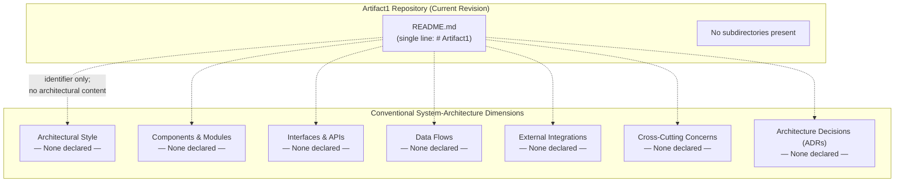

The dashed edges express that `README.md` provides only the artifact identifier (per Section 1.3.1.1) and contributes no content to any dimension of system architecture. The `NoSubfolders` node within the repository-state subgraph reinforces that there are no implementation directories from which an architectural decomposition could be derived.

---

## 5.2 HIGH-LEVEL ARCHITECTURE

### 5.2.1 System Overview

The section prompt requests a textual description of the overall system architecture style and rationale, the key architectural principles and patterns, and the system boundaries and major interfaces. Each of these dimensions is recorded below as it stands at the current revision.

| Architecture Overview Dimension | Documented State | Evidentiary Anchor |
|---|---|---|
| Overall architecture style | None declared — no style is asserted in the repository | Section 1.2.2.3 (technical approach undetermined); Section 1.4.2 (no speculation) |
| Rationale for the chosen style | Not documentable — no style has been chosen | Section 1.2.2.3; Section 1.4.2 |
| Key architectural principles | None declared — no principle statements committed | Section 1.4.2; Section 1.2.2.2 (empty component architecture) |
| Key architectural patterns | None declared — no patterns committed | Section 1.4.2; Section 1.2.2.2 |
| System boundaries | Not delineated | Section 1.3.1.2 (boundaries "Not delineated") |
| Major interfaces | None declared — no API or contract surfaces exist | Section 3.5.1 (REST/GraphQL/gRPC/webhook/broker all "None declared"); Section 1.2.1.3 (no integrations) |

No architectural narrative can be authored at this revision because each of the six dimensions above is independently and verifiably absent from the repository. Per the binding constraint in Section 1.4.2, the document does not assert a monolithic, modular monolith, layered, hexagonal, onion, clean-architecture, microservices, service-oriented, event-driven, reactive, actor-model, serverless, or any other architectural style as a default. Per Section 1.2.2.2, no logical or physical decomposition can be presented. Per Section 1.3.1.2, no system boundary, trust boundary, deployment boundary, or organizational boundary exists from which an interface inventory could be derived.

### 5.2.2 Core Components Table

The section prompt requests a four-column table enumerating component name, primary responsibility, key dependencies, integration points, and critical considerations. Because Section 1.2.2.2 records that no components are present in the repository, the table below is intentionally empty. To preserve the four-column constraint and the inventory shape, a single explicit "no entries" row is included.

| Component Name | Primary Responsibility | Key Dependencies | Critical Considerations |
|---|---|---|---|
| *(no components declared)* | Not documentable — no behaviours specified (Section 2.3.1) | None — no dependency manifests (Section 3.4) | Not documentable — no architectural concerns specified (Section 2.5) |

The "Integration Points" dimension prescribed by the section prompt is independently captured in Section 5.2.4 (External Integration Points) to keep the table within the four-column limit established by the section's output format requirements.

### 5.2.3 Data Flow Description

The section prompt requests prose documentation of primary data flows between components, integration patterns and protocols, data transformation points, and key data stores and caches. Each of these dimensions is recorded below.

| Data Flow Dimension | Documented State | Evidentiary Anchor |
|---|---|---|
| Primary data flows between components | None — no components from which a flow could originate or terminate | Section 1.2.2.2 (no components); Section 4.4.1 (no state transitions) |
| Integration patterns | None declared (no request/reply, pub/sub, event-sourcing, CQRS, saga, or other pattern committed) | Section 3.5.1 (no APIs/messaging); Section 1.2.1.3 (no integrations) |
| Integration protocols | None declared (no HTTP/REST, GraphQL, gRPC, WebSocket, AMQP, MQTT, Kafka, NATS, or other protocol committed) | Section 3.5.1 (all integration dimensions "None declared") |
| Data transformation points | None — no transformation logic exists | Section 1.3.2.1 (source code out of scope); Section 2.3.4 (no data validation declared) |
| Key data stores | None — no databases or storage backends declared | Section 3.6 (no schemas, migrations, ORM/ODM declarations) |
| Key caches | None — no caching layers declared | Section 3.6.3 (no cache-key conventions, eviction policies, or coherence strategies) |

No primary, secondary, or batch data flow can be narrated because there are no producers, no consumers, no transformers, and no persistence sinks declared anywhere in the repository. No protocol selection rationale can be presented because no protocol has been selected. No transformation pipeline (extract-transform-load, change-data-capture, stream-processing, or otherwise) can be enumerated because no transformation surface exists.

### 5.2.4 External Integration Points

The section prompt requests a table enumerating external system name, integration type, data exchange pattern, protocol/format, and SLA requirements. Because Section 1.2.1.3 records that the project declares no integrations with external systems, Section 1.3.2.3 records that no integration points are covered by the current artifact, and Section 3.5.1 records that REST, GraphQL, gRPC, webhook, message-broker, and SDK integrations are all "None declared," the table below is intentionally empty.

| External System | Integration Type | Protocol / Format | SLA Requirements |
|---|---|---|---|
| *(none declared)* | Not documentable — no integration types committed (Section 3.5.1) | Not documentable — no protocols committed (Section 3.5.1) | Not documentable — no SLOs declared (Section 1.2.3.3) |

The "Data Exchange Pattern" dimension prescribed by the section prompt is captured implicitly in Section 5.2.3 (Data Flow Description) above to keep the table within the four-column limit. No identity provider, payment gateway, messaging service, analytics platform, observability backend, or partner API is referenced anywhere in the repository, and per Section 1.4.2 none may be assumed as a default integration target.

---

## 5.3 COMPONENT DETAILS

### 5.3.1 Component Inventory

The section prompt requires, for each major component, documentation of purpose and responsibilities, technologies and frameworks used, key interfaces and APIs, data persistence requirements, and scaling considerations. Because Section 1.2.2.2 records that no components are present in the repository, the inventory below is intentionally empty, with each prescribed dimension recorded against a single "no components declared" row.

| Component Dimension | Documented State | Evidentiary Anchor |
|---|---|---|
| Purpose and responsibilities | Not documentable — no components present | Section 1.2.2.2; Section 2.3.1 (zero functional requirements) |
| Technologies and frameworks used | Not documentable — no languages or frameworks declared | Section 3.2 (no languages); Section 3.3 (no frameworks) |
| Key interfaces and APIs | Not documentable — no API surfaces declared | Section 3.5.1 (no API endpoints, contracts, or SDK bindings) |
| Data persistence requirements | Not documentable — no persistence model declared | Section 3.6 (no databases, schemas, or migrations); Section 4.4.1 (no persistence points) |
| Scaling considerations | Not documentable — no scalability framing exists | Section 2.5.3 (no scalability considerations recorded) |

### 5.3.2 Component Interaction Diagram

The required component-interaction diagram is rendered below in its empty-state form. Because no component is declared in the repository, the diagram represents the empty interaction surface using a single repository-state subgraph and a placeholder component subgraph linked by dashed edges, mirroring the precedent of Section 3.1.3 and Section 4.1.3.

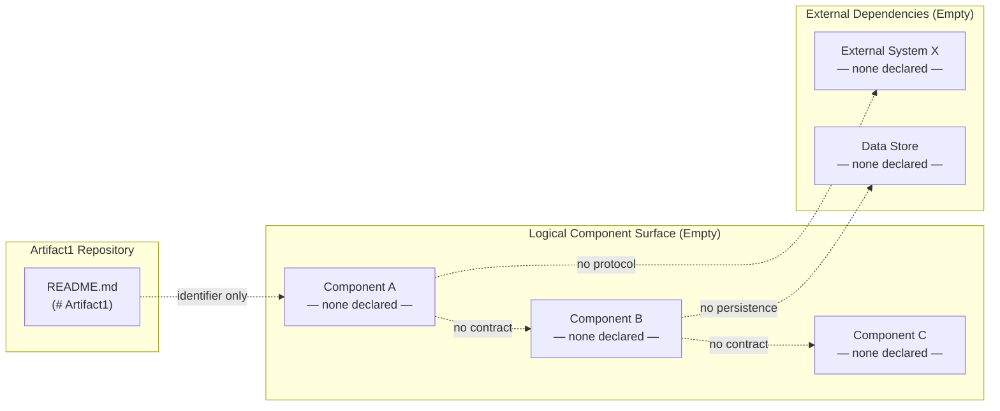

The placeholder nodes `CompA`, `CompB`, `CompC`, `ExtX`, and `ExtY` carry no implementation semantics; they exist solely to preserve the conventional topology of a component-interaction diagram so that, upon the introduction of the first concrete component, the topology can be populated by substitution without altering the diagram's structural skeleton. No request/reply edges, pub/sub channels, shared-database arrows, or anti-corruption-layer boundaries are drawn because none are evidentiarily supportable.

### 5.3.3 State Transition Diagram

The required state-transition diagram is rendered below in its empty-state form, reusing the single-placeholder pattern established in Section 4.4.3. Because no component in the repository carries durable state, no lifecycle transitions are declared, no transaction boundaries are committed, and no persistence layer is present, the diagram represents a single placeholder state to make the empty surface explicit at the system-architecture level.

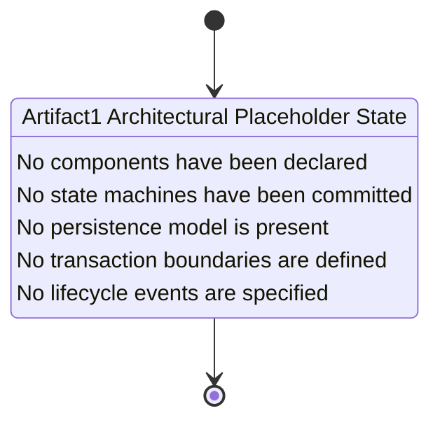

This single-state diagram is preserved so that, upon the introduction of the first state-bearing component (whether implemented as an in-memory finite-state machine, a workflow-orchestrator definition, a database-backed entity lifecycle, or any other state-bearing construct), the diagram can be expanded by replacing the `ArchitecturePlaceholder` state with the concrete state vocabulary of the introduced domain.

### 5.3.4 Sequence Diagram for Key Flows

The required sequence diagram is rendered below in its empty-state form, reusing the notes-only pattern established in Section 4.4.4. Three conventional participants — User, Artifact1, and External Systems — are preserved as placeholders, and the diagram body consists exclusively of evidence-grounded `Note over` annotations rather than concrete messages, because no key flow has been declared at the architectural level.

```mermaid
sequenceDiagram
    participant U as User (undefined)
    participant A as Artifact1 (no components)
    participant E as External Systems (none declared)

    Note over U,E: Participants are placeholders; no actors, components, or external systems are formally declared (Section 1.1.4, Section 1.2.2.2, Section 1.2.1.3).
    Note over U,A: No user-to-system interactions exist; no entry-point contracts, command surfaces, or query surfaces are committed (Section 2.3.1, Section 3.5.1).
    Note over A,A: No intra-system interactions exist; no inter-component messages, internal events, or shared-state mutations are declared (Section 1.2.2.2, Section 4.4.1).
    Note over A,E: No system-to-external interactions exist; no outbound REST, GraphQL, gRPC, webhook, or broker messages are declared (Section 3.5.1).
    Note over U,E: No timing budgets, retry envelopes, or SLA targets are recorded (Section 1.2.3.3, Section 2.5.2).
    Note over U,E: Sequence intentionally empty pending implementation artifacts (Section 1.4.2, Section 2.6.3).
```

No request/response pairs, no asynchronous fire-and-forget patterns, no saga or compensation steps, no idempotency keys, no correlation identifiers, and no causal-ordering markers can be documented because no integration or component surface exists from which to derive them.

---

## 5.4 TECHNICAL DECISIONS

### 5.4.1 Architecture Style Decisions and Tradeoffs

The section prompt requests documentation and justification of architecture style decisions and their tradeoffs. No such decisions have been recorded in the repository. There is no architecture decision record (ADR) document, no design brief, no request-for-comment (RFC) artifact, no whiteboard image, no PowerPoint deck, no Confluence page, and no inline README discussion that asserts a choice among architectural styles. Per Section 1.4.2, the document does not impute a decision that has not been made; per Section 1.2.2.3, the core technical approach remains undetermined.

| Decision Dimension | Recorded Choice | Recorded Rationale | Recorded Tradeoffs |
|---|---|---|---|
| Architecture style | None declared | Not documentable | Not documentable |
| Decomposition strategy | None declared | Not documentable | Not documentable |
| Synchronous vs. asynchronous bias | None declared | Not documentable | Not documentable |
| Stateful vs. stateless bias | None declared | Not documentable | Not documentable |

### 5.4.2 Communication Pattern Choices

The section prompt requests documentation of communication-pattern choices. Per Section 3.5.1, no REST endpoints, GraphQL endpoints, gRPC services, webhook subscriptions, message-broker connections, or third-party SDK bindings are declared. Per Section 1.2.1.3, the project declares no integrations with external systems. Consequently, no communication pattern (request/reply, publish/subscribe, fire-and-forget, streaming, polling, long-polling, server-sent events, WebSocket, queue-based load levelling, claim check, competing consumers, sagas, or otherwise) has been chosen.

| Communication-Pattern Dimension | Recorded Choice | Evidentiary Anchor |
|---|---|---|
| Inter-component communication | None declared | Section 1.2.2.2 (no components) |
| Service-to-service communication | None declared | Section 3.5.1 (no APIs) |
| Asynchronous messaging | None declared | Section 3.5.1 (no message-broker connections) |
| Event distribution | None declared | Section 3.5.1; Section 4.4.4 (no integration sequence) |

### 5.4.3 Data Storage Solution Rationale

The section prompt requests rationale for data storage solution selection. Per Section 3.6 (Databases & Storage), no databases, schemas, migrations, ORM/ODM declarations, or storage backends are present. Per Section 1.3.2.1, data schemas and persistence are explicitly out of scope. Consequently, no rationale exists for choosing among relational, document, key-value, columnar, graph, time-series, search, or object-storage paradigms.

| Storage Decision Dimension | Recorded Choice | Evidentiary Anchor |
|---|---|---|
| Primary data store | None declared | Section 3.6 (no databases) |
| Secondary / analytical store | None declared | Section 3.6 |
| Object / blob storage | None declared | Section 3.6.4 (no object storage) |
| Data residency / partitioning strategy | None declared | Section 1.3.1.2 (no geographic coverage); Section 3.6 |

### 5.4.4 Caching Strategy Justification

The section prompt requests justification of a caching strategy. Per Section 3.6.3, no cache-key conventions, eviction policies, or coherence strategies are declared. Per Section 4.4.1, no caching requirements have been derived from any architectural model. Consequently, no caching tier (client-side, edge/CDN, reverse-proxy, application-level, distributed in-memory, or database-buffer-pool) has been selected, and no read-through, write-through, write-behind, refresh-ahead, or cache-aside pattern is in force.

| Caching Decision Dimension | Recorded Choice | Evidentiary Anchor |
|---|---|---|
| Caching tier(s) | None declared | Section 3.6.3 |
| Cache-coherence strategy | None declared | Section 3.6.3 |
| Eviction policy | None declared | Section 3.6.3 |
| Invalidation mechanism | None declared | Section 3.6.3; Section 4.4.1 |

### 5.4.5 Security Mechanism Selection

The section prompt requests documentation of security-mechanism selection. Per Section 1.3.2.1, authentication and authorization are explicitly out of scope; per Section 3.5.2, identity-provider integration, OAuth/OIDC client configuration, SAML federation, API-key/token issuance, RBAC/ABAC, and session-management strategies are all "None declared." Per Section 2.5.4 (cross-referenced from Section 3.8.3), no identity, access-control, cryptographic, or threat-modelling components exist in the codebase. Consequently, no security mechanism (authentication protocol, authorization model, encryption-at-rest scheme, encryption-in-transit scheme, secret-management approach, or audit-logging policy) has been selected.

| Security Decision Dimension | Recorded Choice | Evidentiary Anchor |
|---|---|---|
| Authentication mechanism | None declared | Section 3.5.2 |
| Authorization model | None declared | Section 3.5.2; Section 1.3.2.1 |
| Encryption-in-transit posture | None declared | Section 3.8.3 (deferred) |
| Encryption-at-rest posture | None declared | Section 3.8.3; Section 3.6 |

### 5.4.6 Decision Tree Diagram

The required decision-tree diagram is rendered below in its empty-state form. Because no architecture-style choice, communication-pattern choice, storage choice, caching choice, or security choice has been committed, the diagram represents a single decision node whose branches are all marked "deferred."

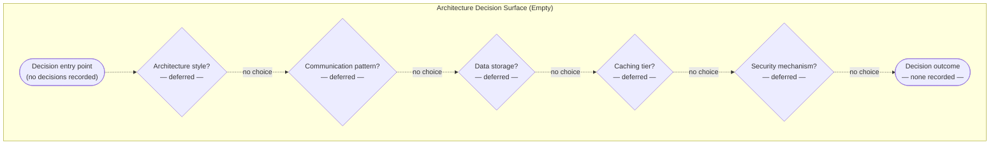

The decision nodes `StyleQ`, `CommQ`, `StoreQ`, `CacheQ`, and `SecQ` correspond directly to subsections 5.4.1 through 5.4.5 above and are preserved so that, upon commitment of a decision under any subsection, the corresponding node can be populated with the recorded choice without altering the diagram's structural skeleton.

### 5.4.7 Architecture Decision Records (ADRs)

The section prompt requests architecture decision records. No ADR directory (e.g., `docs/adr/`, `adr/`, `architecture/decisions/`, or equivalent) exists in the repository; no ADR file in any conventional format (MADR, Nygard, Y-statements, or otherwise) has been committed; and no inline decision narrative is present in `README.md`, which contains only the single line `# Artifact1`. Per Section 1.4.2, no ADR may be retroactively authored on the basis of speculation; per Section 1.4.3, ADR authoring will be triggered by the introduction of corresponding artifacts.

| ADR Attribute | Documented State |
|---|---|
| ADR repository location | None — no `docs/`, `adr/`, or `architecture/` directory present |
| Recorded ADRs (count) | Zero |
| ADR template in use | None — no template committed |
| Last-recorded decision date | Not applicable |

---

## 5.5 CROSS-CUTTING CONCERNS

### 5.5.1 Monitoring and Observability Approach

The section prompt requests documentation of the monitoring and observability approach. Per Section 3.5.3, metrics collection, distributed tracing, centralized log aggregation, application performance monitoring (APM), error/exception tracking, real-user monitoring (RUM), and synthetic monitoring are all "None declared." Per Section 1.2.3.3, no monitoring artifacts, telemetry configurations, observability declarations, or service-level objectives are present in the codebase. Per Section 1.3.2.1, observability and monitoring are explicitly out of scope.

| Observability Pillar | Documented Approach | Evidentiary Anchor |
|---|---|---|
| Metrics | None declared | Section 3.5.3 |
| Distributed traces | None declared | Section 3.5.3 |
| Structured logs | None declared | Section 3.5.3; Section 5.5.2 below |
| APM / RUM / Synthetic | None declared | Section 3.5.3 |

### 5.5.2 Logging and Tracing Strategy

The section prompt requests documentation of the logging and tracing strategy. No logging library is declared (per Section 3.3, no frameworks or libraries are present), no log schema is defined (per Section 1.3.2.1, observability is out of scope), no log-routing configuration exists, no trace-context propagation standard (W3C Trace Context, B3, Jaeger, or otherwise) is selected, and no sampling policy is declared. Per Section 4.4.2, no error-notification flow is declared.

| Logging / Tracing Dimension | Documented Strategy | Evidentiary Anchor |
|---|---|---|
| Log destination(s) | None declared | Section 3.5.3 |
| Log schema / structured-logging library | None declared | Section 3.3 (no frameworks/libraries) |
| Trace-context propagation standard | None declared | Section 3.5.3 |
| Sampling policy | None declared | Section 3.5.3; Section 4.4.2 |

### 5.5.3 Error Handling Patterns

The section prompt requests documentation of error-handling patterns. Per Section 4.4.2, retry mechanisms, fallback processes, error-notification flows, and recovery procedures are all "None." Per Section 1.3.2.1, source code is out of scope, so no exception hierarchies, error taxonomies, or domain-specific error types exist. Per Section 4.3.4, the empty-state error-handling pipeline established in the Process Flowchart section is the canonical empty-state representation of error handling at this revision.

| Error-Handling Pattern | Documented Form | Evidentiary Anchor |
|---|---|---|
| Retry mechanism | None declared | Section 4.4.2 |
| Circuit breaker | None declared | Section 4.4.2 |
| Bulkhead isolation | None declared | Section 4.4.2; Section 1.2.2.2 (no components to isolate) |
| Fallback / graceful degradation | None declared | Section 4.4.2 |
| Dead-letter / poison-message handling | None declared | Section 3.5.1 (no message broker) |

### 5.5.4 Authentication and Authorization Framework

The section prompt requests documentation of the authentication and authorization framework. Per Section 1.3.2.1, authentication and authorization are explicitly out of scope. Per Section 3.5.2, identity-provider integration, OAuth/OIDC client configuration, SAML federation, API-key/token issuance, RBAC/ABAC, and session-management strategies are all "None declared." Per Section 2.5.4 (cross-referenced from Section 3.8.3 deferral table), no identity, access-control, cryptographic, or threat-modelling components exist in the codebase. The authentication and authorization framework is therefore not documentable at this revision.

| Auth Framework Dimension | Documented State | Evidentiary Anchor |
|---|---|---|
| Authentication protocol(s) | None declared | Section 3.5.2 |
| Authorization model | None declared | Section 3.5.2; Section 1.3.2.1 |
| Identity provider | None declared | Section 3.5.2 |
| Session / token management | None declared | Section 3.5.2 |

### 5.5.5 Performance Requirements and SLAs

The section prompt requests documentation of performance requirements and SLAs. Per Section 1.2.3.3, no key performance indicators are defined; there are no monitoring artifacts, telemetry configurations, observability declarations, or service-level objectives present in the codebase. Per Section 2.5.2, no performance requirements are recorded against any feature (because no features exist, per Section 2.2.1). Consequently, no latency target, throughput target, availability target, error-budget envelope, or recovery-time/recovery-point objective can be asserted at this revision.

| Performance / SLA Dimension | Documented Target | Evidentiary Anchor |
|---|---|---|
| Latency (p50 / p95 / p99) | None declared | Section 1.2.3.3; Section 2.5.2 |
| Throughput (requests per second / messages per second) | None declared | Section 2.5.2; Section 2.5.3 (no scalability framing) |
| Availability (uptime target) | None declared | Section 1.2.3.3 |
| Error budget | None declared | Section 1.2.3.3; Section 4.4.2 |
| Recovery Time Objective (RTO) | None declared | Section 5.5.6 below |
| Recovery Point Objective (RPO) | None declared | Section 5.5.6 below |

### 5.5.6 Disaster Recovery Procedures

The section prompt requests documentation of disaster recovery procedures. Per Section 2.5.5, no operational runbooks or maintenance procedures are recorded. Per Section 3.6, no database backup, replication, or point-in-time recovery strategy is declared (because no databases are declared). Per Section 1.3.2.1, runtime configuration is out of scope, so no failover topology, no multi-region strategy, no warm/cold standby configuration, and no chaos-engineering practice is committed.

| Disaster Recovery Dimension | Documented Procedure | Evidentiary Anchor |
|---|---|---|
| Backup strategy | None declared | Section 3.6 (no data stores to back up) |
| Replication strategy | None declared | Section 3.6 |
| Failover topology | None declared | Section 1.3.1.2 (no geographic coverage); Section 3.5.4 (no cloud platform) |
| Runbook / incident response procedures | None declared | Section 2.5.5; Section 4.4.2 |

### 5.5.7 Error Handling Flow Diagram

The required error-handling flow diagram is rendered below in its empty-state form, reusing the structural skeleton established in Section 4.3.4 (Error Handling Flowchart) and adapting it to the system-architecture level. Each conventional error-handling stage — detection, classification, retry, fallback, notification, and recovery — is preserved as a placeholder, and every edge is dashed to indicate that no transition logic has been committed.

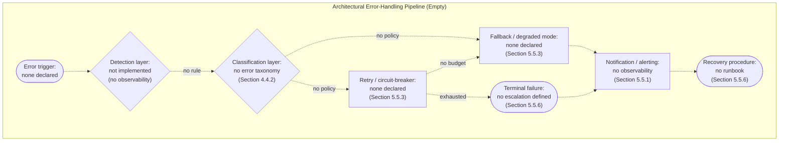

No retry budgets, exponential-backoff parameters, circuit-breaker thresholds, dead-letter destinations, alert severities, paging policies, on-call rotations, or post-incident review procedures are documented because no such artifacts exist in the repository. The diagram is preserved so that, upon the introduction of any resilience-configuration, observability-configuration, or runbook artifact, the corresponding node can be populated with the committed value without altering the diagram's structural skeleton.

---

## 5.6 SUMMARY OF SYSTEM ARCHITECTURE COVERAGE AND FORWARD COMMITMENT

### 5.6.1 Coverage Summary

The following summary mirrors the precedent set by Section 2.7.1 (Summary of the Current Requirements State), Section 3.8.1 (Coverage Summary), and Section 4.5.1 (Coverage Summary).

| System Architecture Dimension | Status | Evidentiary Anchor |
|---|---|---|
| High-Level Architecture: System Overview (Section 5.2.1) | Not documentable | No style/principles/boundaries (Section 1.2.2.3, Section 1.3.1.2, Section 1.4.2) |
| High-Level Architecture: Core Components (Section 5.2.2) | Not documentable | No components (Section 1.2.2.2) |
| High-Level Architecture: Data Flows (Section 5.2.3) | Not documentable | No components, no integrations, no persistence (Section 1.2.2.2, Section 3.5.1, Section 3.6) |
| High-Level Architecture: External Integration Points (Section 5.2.4) | Not documentable | No integrations declared (Section 1.2.1.3, Section 3.5.1); integrations out of scope (Section 1.3.2.3) |
| Component Details: Inventory (Section 5.3.1) | Not documentable | No components (Section 1.2.2.2); no technologies (Section 3.2, Section 3.3); no APIs (Section 3.5.1); no persistence (Section 3.6); no scalability framing (Section 2.5.3) |
| Component Details: Interaction Diagram (Section 5.3.2) | Rendered as empty-state diagram | Per Section 3.1.3 and Section 4.1.3 precedents |
| Component Details: State Transition Diagram (Section 5.3.3) | Rendered as single-placeholder diagram | Per Section 4.4.3 precedent |
| Component Details: Sequence Diagram (Section 5.3.4) | Rendered as notes-only diagram | Per Section 4.4.4 precedent |
| Technical Decisions: Architecture Style (Section 5.4.1) | Not documentable | No decisions recorded (Section 1.2.2.3, Section 1.4.2) |
| Technical Decisions: Communication Patterns (Section 5.4.2) | Not documentable | No communication declared (Section 3.5.1) |
| Technical Decisions: Data Storage (Section 5.4.3) | Not documentable | No databases (Section 3.6); persistence out of scope (Section 1.3.2.1) |
| Technical Decisions: Caching Strategy (Section 5.4.4) | Not documentable | No caching layers (Section 3.6.3) |
| Technical Decisions: Security Mechanisms (Section 5.4.5) | Not documentable | Auth/authz out of scope (Section 1.3.2.1); no identity services (Section 3.5.2) |
| Technical Decisions: Decision Tree (Section 5.4.6) | Rendered as empty-state diagram | No decisions recorded |
| Technical Decisions: ADRs (Section 5.4.7) | Not documentable | No ADR directory or files present |
| Cross-Cutting: Monitoring & Observability (Section 5.5.1) | Not documentable | All observability categories "None declared" (Section 3.5.3); observability out of scope (Section 1.3.2.1) |
| Cross-Cutting: Logging & Tracing (Section 5.5.2) | Not documentable | Section 3.5.3; Section 4.4.2 |
| Cross-Cutting: Error Handling (Section 5.5.3) | Not documentable | All error-handling dimensions "None" (Section 4.4.2); no source code (Section 1.3.2.1) |
| Cross-Cutting: Auth Framework (Section 5.5.4) | Not documentable | Auth/authz out of scope (Section 1.3.2.1); Section 3.5.2 |
| Cross-Cutting: Performance & SLAs (Section 5.5.5) | Not documentable | No KPIs/SLOs (Section 1.2.3.3); no performance requirements (Section 2.5.2) |
| Cross-Cutting: Disaster Recovery (Section 5.5.6) | Not documentable | No runbooks (Section 2.5.5); no backup/replication strategy (Section 3.6) |
| Cross-Cutting: Error Handling Flow Diagram (Section 5.5.7) | Rendered as empty-state diagram | Per Section 4.3.4 precedent |
| Current Architecture Surface Diagram (Section 5.1.3) | Rendered as empty-state diagram | Per Section 3.1.3 and Section 4.1.3 precedents |

### 5.6.2 Conditions Under Which This Section Will Be Updated

Consistent with the revision-trigger pattern established by Section 1.4.3 and reused in Section 2.7.2, Section 3.8.2, and Section 4.5.2, this System Architecture section will be expanded under any of the following conditions:

1. **Introduction of source-code modules creating discoverable components** — any executable artifact (under `src/`, `app/`, `lib/`, `services/`, `pkg/`, `cmd/`, `internal/`, or equivalent) whose presence permits an architectural decomposition. This triggers population of Section 5.2.2 (Core Components), Section 5.3.1 (Component Inventory), and Section 5.3.2 (Component Interaction Diagram).
2. **Introduction of architecture decision records (ADRs)** — files committed under `docs/adr/`, `adr/`, `architecture/decisions/`, or equivalent locations, in any conventional format (MADR, Nygard, Y-statements). This triggers population of Section 5.4.1 through Section 5.4.5 and Section 5.4.7.
3. **Introduction of integration definitions** — REST, GraphQL, or gRPC contracts; OpenAPI or AsyncAPI documents; message-broker topic/queue configuration; webhook subscriptions; or third-party SDK initialization code. This triggers population of Section 5.2.4 (External Integration Points), Section 5.2.3 (Data Flow Description), Section 5.3.4 (Sequence Diagram), and Section 5.4.2 (Communication Pattern Choices).
4. **Introduction of deployment topology declarations** — Kubernetes manifests, Helm charts, Terraform/Pulumi/CloudFormation/Bicep files, Compose files, Dockerfiles, or workflow definitions under `.github/workflows/`, `.gitlab-ci.yml`, `Jenkinsfile`, etc. This triggers population of Section 5.2.1 (System Overview boundaries), Section 5.5.6 (Disaster Recovery), and the deployment-architecture dimensions of Section 5.2.2.
5. **Introduction of data persistence configuration** — database connection strings, schema files, migration scripts, ORM/ODM mappings, or storage backend declarations. This triggers population of Section 5.2.3 (Data Flow Description), Section 5.3.3 (State Transition Diagram), Section 5.4.3 (Data Storage Solution Rationale), and the data-persistence dimensions of Section 5.3.1.
6. **Introduction of caching layer configuration** — cache-client initialization code, cache-key conventions, eviction-policy declarations, or coherence-strategy documents. This triggers population of Section 5.4.4 (Caching Strategy Justification).
7. **Introduction of authentication and authorization policy declarations** — OIDC/OAuth client configurations, IAM policies, RBAC/ABAC role definitions, or policy-as-code files (e.g., OPA Rego, Cedar). This triggers population of Section 5.4.5 (Security Mechanism Selection) and Section 5.5.4 (Authentication and Authorization Framework).
8. **Introduction of observability and monitoring configuration** — Prometheus rule files, Grafana dashboards committed as code, OpenTelemetry collector configuration, structured-logging library configuration, or SLO declarations (e.g., Sloth, Pyrra, OpenSLO). This triggers population of Section 5.5.1 (Monitoring and Observability), Section 5.5.2 (Logging and Tracing), and the SLA dimensions of Section 5.5.5.
9. **Introduction of error-handling, retry, circuit-breaker, or resilience configuration** — Resilience4j, Polly, Hystrix, or framework-native retry-policy declarations; dead-letter queue configurations; saga or compensation definitions; feature-flag manifests for graceful degradation. This triggers population of Section 5.5.3 (Error Handling Patterns) and Section 5.5.7 (Error Handling Flow Diagram).
10. **Introduction of disaster-recovery, backup, or business-continuity declarations** — backup-schedule configurations, replication topology, multi-region failover scripts, or incident-response runbooks. This triggers population of Section 5.5.6 (Disaster Recovery Procedures).
11. **Expansion of `README.md`** (or introduction of supplementary documentation under `docs/`, `architecture/`, or equivalent) to **explicitly declare an architectural style, system boundary, component decomposition, or cross-cutting concern** with sufficient specificity to be reflected without inference.

Until at least one of the above conditions obtains, this section is expected to remain in its current evidence-grounded, structurally-complete-but-materially-empty form, mirroring the disposition of Sections 2.4, 2.6, 2.7, 3.1, 3.8, 4.1, and 4.5.

### 5.6.3 References to Related Technical Specification Content

| Related Section | Relevance to Section 5 |
|---|---|
| 1.1 Executive Summary | Sections 1.1.1 (artifact identifier `Artifact1`), 1.1.2 (placeholder state), 1.1.3 (no business problem), 1.1.4 (no stakeholders), and 1.1.5 (no formalized business impact) establish the foundational evidence for the empty-state declaration in Section 5.1.1. |
| 1.2 System Overview | Section 1.2.1.3 anchors the absence of external integrations underpinning Section 5.2.4 and Section 5.3.4; Section 1.2.2.1 anchors the absence of capabilities; Section 1.2.2.2 anchors the empty component architecture underpinning Section 5.2.2 and Section 5.3.1; Section 1.2.2.3 anchors the undetermined technical approach underpinning Section 5.2.1 and Section 5.4.1; Section 1.2.3.3 anchors the absence of KPIs and SLOs underpinning Section 5.5.5. |
| 1.3 Scope | Section 1.3.1.2 anchors the lack of system boundaries underpinning Section 5.2.1; Section 1.3.2.1 enumerates the out-of-scope categories that align with each Section 5 subsection (source code, runtime configuration, build/deploy, integrations, persistence, authentication, observability); Section 1.3.2.3 anchors the absence of integration coverage underpinning Section 5.2.4. |
| 1.4 Document Basis and Evolution | Section 1.4.1 catalogues the foundational source material; Section 1.4.2 supplies the binding constraint against architectural-pattern speculation that governs every subsection of Section 5; Section 1.4.3 supplies the revision-trigger pattern reused in Section 5.6.2. |
| 2.2 Feature Catalog | Section 2.2.1 anchors the zero-feature condition that prevents the derivation of any architectural component from declared product behaviour. |
| 2.3 Functional Requirements | Section 2.3.1 anchors zero requirements; Section 2.3.4 anchors the absence of business rules, data validation, security requirements, and compliance requirements that collectively render Section 5.4.5 (Security Mechanism Selection) and Section 5.5.4 (Auth Framework) empty. |
| 2.4 Feature Relationships | Section 2.4.1 supplies the canonical empty-state Mermaid `flowchart TB` precedent reused in Section 5.1.3; Section 2.4.2 anchors the absence of integration points reused in Section 5.2.4; Section 2.4.3 anchors the absence of shared components and cross-cutting concerns reused in Section 5.5. |
| 2.5 Implementation Considerations | Section 2.5.1 anchors the absence of technical constraints; Section 2.5.2 anchors the absence of performance requirements underpinning Section 5.5.5; Section 2.5.3 anchors the absence of scalability considerations underpinning Section 5.3.1; Section 2.5.4 anchors the deferral of security implications underpinning Section 5.4.5 and Section 5.5.4; Section 2.5.5 anchors the absence of operational runbooks underpinning Section 5.5.6. |
| 2.6 Traceability Matrix | Section 2.6.3 records that no architectural decompositions, integrations, or process flows can be traced at this revision — providing a direct evidentiary anchor for the empty-state form of Section 5.2 through Section 5.5. |
| 2.7 Section Summary and Forward Commitment | Section 2.7.2 supplies the canonical structure for the trigger-condition subsection reused in Section 5.6.2; Section 2.7.3 supplies the canonical structure for the related-sections cross-reference table reused above. |
| 3.1 Current Stack State Overview | Section 3.1.2 supplies the four-row Constraint-Source / Constraint-Substance / Effect table structure mirrored in Section 5.1.2; Section 3.1.3 supplies the multi-layer empty-state Mermaid diagram template (RepositoryState subgraph plus placeholder dimensional subgraph with dashed edges from the README node) mirrored in Section 5.1.3. |
| 3.2–3.4 (Languages, Frameworks, Dependencies) | The absence of languages, frameworks, and dependencies blocks the population of the "Technologies and Frameworks Used" dimension of Section 5.3.1 and the architectural-style decisions of Section 5.4.1. |
| 3.5 Third-Party Services | Section 3.5.1 anchors the absence of REST/GraphQL/gRPC endpoints, webhook subscriptions, message-broker connections, and third-party SDK bindings that collectively render Section 5.2.4 and Section 5.3.4 empty; Section 3.5.2 anchors the absence of authentication and identity services that renders Section 5.4.5 and Section 5.5.4 empty; Section 3.5.3 anchors the absence of observability services that renders Section 5.5.1 and Section 5.5.2 empty; Section 3.5.4 anchors the absence of a declared cloud platform that renders Section 5.5.6 (Disaster Recovery) empty. |
| 3.6 Databases & Storage | Section 3.6 anchors the absence of persistence underpinning Section 5.2.3, Section 5.3.3, and Section 5.4.3; Section 3.6.3 anchors the specific absence of caching layers underpinning Section 5.4.4. |
| 3.7 Development & Deployment | Section 3.7.3 (no containerization) and Section 3.7.5 (no IaC) anchor the absence of deployment architecture underpinning Section 5.2.1 (boundaries) and Section 5.5.6 (Disaster Recovery). |
| 3.8 Summary of Technology Stack Coverage and Forward Commitment | Section 3.8.1 supplies the Stack-Dimension / Status / Evidentiary-Anchor table structure mirrored in Section 5.6.1; Section 3.8.2 supplies the trigger-condition structure mirrored and expanded in Section 5.6.2; Section 3.8.3 supplies the security-deferral structure mirrored in Section 5.4.5 and Section 5.5.4; Section 3.8.5 supplies the canonical Related-Section / Relevance table structure mirrored above. |
| 4.1 Current Process Flowchart State Overview | Section 4.1.2 supplies the four-row Constraint table format reinforced in Section 5.1.2; Section 4.1.3 supplies the dimension-by-dimension empty-state Mermaid diagram pattern reinforced in Section 5.1.3. |
| 4.2 System Workflows | Section 4.2.3 supplies the empty-state workflow diagram precedent informing the empty-state component-interaction diagram in Section 5.3.2. |
| 4.3 Flowchart Requirements | Section 4.3.4 supplies the empty error-handling pipeline diagram precedent directly adapted in Section 5.5.7. |
| 4.4 Technical Implementation | Section 4.4.1 (state management absence) anchors Section 5.3.3; Section 4.4.2 (error-handling-mechanism absence) anchors Section 5.5.3; Section 4.4.3 supplies the single-placeholder `stateDiagram-v2` template reused in Section 5.3.3; Section 4.4.4 supplies the notes-only `sequenceDiagram` template reused in Section 5.3.4. |
| 4.5 Summary of Process Flowchart Coverage and Forward Commitment | Section 4.5.1 supplies the most recent Status/Evidentiary-Anchor table format mirrored in Section 5.6.1; Section 4.5.2 supplies the most recent expanded trigger-condition format with concrete artifact-introduction examples mirrored and adapted in Section 5.6.2; Section 4.5.3 supplies the most recent related-sections table mirrored above. |

---

#### References

#### Files Examined

- `README.md` — Sole file in the repository. Verified to contain only the single line `# Artifact1` (11 bytes total). Confirmed as providing the artifact identifier and no architectural-style declaration, component manifest, interface contract, data-flow descriptor, integration definition, caching configuration, persistence model, security mechanism, observability configuration, error-handling configuration, performance target, or disaster-recovery procedure. Establishes the evidentiary basis for every empty-state assertion throughout Section 5.

#### Folders Explored

- `/` (repository root, depth 0→1) — Verified to contain exclusively `README.md` and no subdirectories. Confirmed the absence of conventional architectural directories (no `src/`, `app/`, `lib/`, `services/`, `pkg/`, `cmd/`, `internal/`, `components/`, `modules/`, `core/`, `domain/`, `infrastructure/`, `infra/`, `iac/`, `terraform/`, `deploy/`, `deployment/`, `k8s/`, `kubernetes/`, `helm/`, `charts/`, `config/`, `configs/`, `env/`, `architecture/`, `adr/`, `decisions/`, `docs/`, `documentation/`, `design/`, `api/`, `apis/`, `contracts/`, `schemas/`, `proto/`, `protos/`, `events/`, `messaging/`, `integrations/`, `connectors/`, `auth/`, `security/`, `observability/`, `monitoring/`, `logging/`, `tracing/`, `metrics/`, `runbooks/`, `playbooks/`, `incidents/`, `slo/`, `slos/`, or equivalent). The maximum traversal depth of 1 was achieved because no deeper structure exists.

#### Technical Specification Sections Retrieved

- **1.2 System Overview** — Cross-referenced throughout Section 5. Section 1.2.1.3 anchors the absence of external integrations underpinning Section 5.2.4 and Section 5.3.4; Section 1.2.2.1 anchors the absence of capabilities; Section 1.2.2.2 anchors the empty component architecture underpinning Section 5.2.2 and Section 5.3.1; Section 1.2.2.3 anchors the undetermined technical approach underpinning Section 5.2.1, Section 5.4.1, and Section 5.4.7; Section 1.2.3.3 anchors the absence of KPIs and SLOs underpinning Section 5.5.5.
- **1.3 Scope** — Cross-referenced throughout Section 5. Section 1.3.1.2 anchors the lack of system boundaries underpinning Section 5.2.1; Section 1.3.2.1 enumerates the eight out-of-scope categories that align with the architectural-decomposition, integration, persistence, security, and observability subsections of Section 5; Section 1.3.2.3 anchors the absence of integration coverage underpinning Section 5.2.4.
- **1.4 Document Basis and Evolution** — Cross-referenced in Sections 5.1.2, 5.4.1, 5.4.7, 5.6.2, and 5.6.3. Section 1.4.1 anchors the foundational source-material inventory; Section 1.4.2 supplies the binding authoring constraint against architectural-pattern speculation that governs every subsection of Section 5; Section 1.4.3 supplies the revision-trigger pattern reused in Section 5.6.2.
- **3.1 Current Stack State Overview** — Section 3.1.2 supplies the four-row Constraint-Source / Constraint-Substance / Effect table structure mirrored in Section 5.1.2; Section 3.1.3 supplies the multi-layer empty-state Mermaid diagram pattern (RepositoryState subgraph plus placeholder dimensional subgraph with dashed edges from the README node) mirrored in Section 5.1.3.
- **3.5 Third-Party Services** — Section 3.5.1 anchors the absence of integration definitions underpinning Section 5.2.4, Section 5.3.4, and Section 5.4.2; Section 3.5.2 anchors the absence of identity and authentication services underpinning Section 5.4.5 and Section 5.5.4; Section 3.5.3 anchors the absence of observability services underpinning Section 5.5.1 and Section 5.5.2; Section 3.5.4 anchors the absence of a declared cloud platform underpinning Section 5.5.6.
- **3.8 Summary of Technology Stack Coverage and Forward Commitment** — Section 3.8.1 supplies the Stack-Dimension / Status / Evidentiary-Anchor table format mirrored in Section 5.6.1; Section 3.8.2 supplies the trigger-condition structure mirrored and expanded in Section 5.6.2; Section 3.8.3 supplies the security-deferral structure mirrored in Section 5.4.5 and Section 5.5.4; Section 3.8.5 supplies the canonical Related-Section / Relevance table mirrored in Section 5.6.3.
- **4.1 Current Process Flowchart State Overview** — Section 4.1.2 supplies the four-row Constraint-table format reinforced in Section 5.1.2; Section 4.1.3 supplies the dimension-by-dimension empty-state diagram pattern reinforced in Section 5.1.3.
- **4.3 Flowchart Requirements** — Section 4.3.4 supplies the empty error-handling pipeline diagram precedent directly adapted in Section 5.5.7.
- **4.4 Technical Implementation** — Section 4.4.1 anchors the empty state-management surface underpinning Section 5.3.3; Section 4.4.2 anchors the empty error-handling surface underpinning Section 5.5.3; Section 4.4.3 supplies the single-placeholder `stateDiagram-v2` template reused in Section 5.3.3; Section 4.4.4 supplies the notes-only `sequenceDiagram` template reused in Section 5.3.4.
- **4.5 Summary of Process Flowchart Coverage and Forward Commitment** — Section 4.5.1 supplies the most recent Status/Evidentiary-Anchor table format mirrored in Section 5.6.1; Section 4.5.2 supplies the most recent expanded trigger-condition format with concrete artifact-introduction examples mirrored and adapted in Section 5.6.2; Section 4.5.3 supplies the most recent related-sections cross-reference table mirrored in Section 5.6.3.

# 6. SYSTEM COMPONENTS DESIGN

## 6.1 Core Services Architecture

### 6.1.1 Applicability Determination

**Core Services Architecture is not applicable for this system.**

This determination follows directly from the section prompt's own escape clause, which provides that when "the system does not require microservices, distributed architecture, or distinct service components," the section is to declare itself not applicable and explain why. Each of the three triggering conditions for non-applicability is independently and verifiably satisfied at the current revision of the `Artifact1` repository.

#### 6.1.1.1 Repository Substrate Underlying This Determination

The entire repository substrate from which a Core Services Architecture could be derived consists of a single file. Per Section 1.4.1, the foundational source materials are exhausted by `README.md` (whose substantive content is the single line `# Artifact1`) and the repository root directory (which contains only that file and no subfolders). No source modules, no service manifests, no container images, no deployment topology, no infrastructure-as-code, no API contracts, no message schemas, no resilience-library configurations, no orchestrator manifests, and no runbooks exist anywhere in the repository.

#### 6.1.1.2 Justification Against the Three Section-Prompt Triggers

| Section-Prompt Trigger | Evidence of Non-Existence | Evidentiary Anchor |
|---|---|---|
| Microservices required? | No — no service decomposition committed | Section 1.2.2.2 (component architecture is empty); Section 5.2.1 (no architectural style declared) |
| Distributed architecture required? | No — no deployment topology committed | Section 3.7.3 (no containerization); Section 3.5.4 (no cloud platform); Section 5.5.6 (no failover topology) |
| Distinct service components required? | No — no service-shaped artifacts committed | Section 1.2.2.2 (no modules/services/libraries); Section 5.3.1 (component inventory empty); Section 5.4.2 (no communication pattern chosen) |

#### 6.1.1.3 Governing Authoring Constraint

Per Section 1.4.2, "this section deliberately refrains from speculating about the project's intended purpose, audience, technology choices, architectural patterns, or success metrics." Per Section 5.2.1, "the document does not assert a monolithic, modular monolith, layered, hexagonal, onion, clean-architecture, microservices, service-oriented, event-driven, reactive, actor-model, serverless, or any other architectural style as a default." Consequently, no service-component model — and no scalability or resilience apparatus dependent on such a model — may be invented in this section.

Notwithstanding the non-applicability verdict, this section preserves the full sub-topic scaffolding requested by the section prompt (Service Components, Scalability Design, Resilience Patterns) and renders each dimension as a verifiable empty state with explicit evidentiary anchors, mirroring the "structurally complete but materially empty" precedent established throughout Sections 2–5 (see Sections 2.7, 3.8, 4.5, and 5.6).

---

### 6.1.2 Service Components (Empty State)

The section prompt requests documentation across six sub-topics: service boundaries and responsibilities, inter-service communication patterns, service discovery mechanisms, load balancing strategy, circuit breaker patterns, and retry and fallback mechanisms. Each sub-topic is recorded below in its evidence-grounded empty form.

#### 6.1.2.1 Service Boundaries and Responsibilities

No services exist from which boundaries or responsibilities could be derived. Per Section 1.2.2.2, "no components — modules, services, libraries, packages, applications, or infrastructure resources — are present in the repository." Per Section 5.3.1, the component inventory is empty. Per Section 1.3.1.2, system boundaries are "Not delineated." Consequently, no domain partition, no bounded context, no aggregate root, no service contract, and no ownership boundary can be authored.

#### 6.1.2.2 Inter-Service Communication Patterns

No communication patterns are declared. Per Section 5.4.2, "no communication pattern (request/reply, publish/subscribe, fire-and-forget, streaming, polling, long-polling, server-sent events, WebSocket, queue-based load levelling, claim check, competing consumers, sagas, or otherwise) has been chosen." Per Section 3.5.1, REST/GraphQL/gRPC endpoints, webhook subscriptions, message-broker connections, and third-party SDK bindings are all "None declared." Per Section 1.2.1.3, the project declares no integrations with external systems.

#### 6.1.2.3 Service Discovery Mechanisms

No service discovery mechanism is declared. Per Section 3.5.4, compute services, network services (including load balancers), and managed messaging/event services are all "None declared." Per Section 3.7.3, no `Dockerfile`, no `Containerfile`, no `docker-compose.yml`, no Kubernetes manifests, and no Helm charts are present. Consequently, no DNS-based discovery, no service-registry pattern (Consul, Eureka, etcd, ZooKeeper), no sidecar/mesh discovery (Istio, Linkerd, Consul Connect), and no client-side load-balancing discovery has been committed.

#### 6.1.2.4 Load Balancing Strategy

No load-balancing strategy is declared. Per Section 3.5.4, network services — explicitly including load balancers — are "None declared." Per Section 3.7.3, no container orchestrator manifests are present to introduce internal traffic shaping. Consequently, no Layer-4 vs Layer-7 selection, no round-robin/least-connections/weighted/hash-based algorithm, no sticky-session policy, and no health-check probe configuration has been committed.

#### 6.1.2.5 Circuit Breaker Patterns

No circuit-breaker patterns are declared. Per Section 5.5.3, both "Circuit breaker" and "Bulkhead isolation" are recorded as "None declared." Per Section 4.4.2, no retry mechanisms, no fallback processes, no error notification flows, and no recovery procedures exist. No Resilience4j, Polly, Hystrix, Sentinel, gobreaker, or framework-native circuit-breaker configuration is present anywhere in the repository.

#### 6.1.2.6 Retry and Fallback Mechanisms

No retry or fallback mechanisms are declared. Per Section 4.4.2, "Retry Mechanisms: None — no resilience configuration" and "Fallback Processes: None — no degraded-mode logic." Per Section 5.5.3, "Retry mechanism: None declared," "Fallback / graceful degradation: None declared," and "Dead-letter / poison-message handling: None declared." Consequently, no exponential-backoff schedule, no jitter strategy, no idempotency-key convention, no compensation/saga handler, and no dead-letter destination has been committed.

#### 6.1.2.7 Service Components — Consolidated Empty-State Table

| Service-Component Sub-Topic | Documented State | Evidentiary Anchor |
|---|---|---|
| Service boundaries and responsibilities | Not applicable — no services declared | Section 1.2.2.2; Section 5.3.1; Section 1.3.1.2 |
| Inter-service communication patterns | Not applicable — no patterns chosen | Section 5.4.2; Section 3.5.1; Section 1.2.1.3 |
| Service discovery mechanisms | Not applicable — no discovery surface | Section 3.5.4; Section 3.7.3 |
| Load balancing strategy | Not applicable — no balancer declared | Section 3.5.4 (network services); Section 3.7.3 |
| Circuit breaker patterns | Not applicable — none declared | Section 5.5.3; Section 4.4.2 |
| Retry and fallback mechanisms | Not applicable — none declared | Section 4.4.2; Section 5.5.3 |

---

### 6.1.3 Scalability Design (Empty State)

The section prompt requests documentation across five sub-topics: horizontal/vertical scaling approach, auto-scaling triggers and rules, resource allocation strategy, performance optimization techniques, and capacity planning guidelines. Each sub-topic is recorded below in its evidence-grounded empty form.

#### 6.1.3.1 Horizontal and Vertical Scaling Approach

No scaling approach is declared. Per Section 2.5.3, "No scalability considerations are documented. The repository contains no architectural decomposition (per Section 1.2.2.2), no deployment topology, no infrastructure-as-code definitions, and no capacity-planning artifacts. Horizontal-scaling strategies, vertical-scaling limits, data-partitioning approaches, and elasticity criteria cannot be specified in the absence of these inputs." Per Section 2.5.6, the Scalability Considerations row is recorded as "Not documentable" because "no architecture or topology present (Section 1.2.2.2)."

#### 6.1.3.2 Auto-Scaling Triggers and Rules

No auto-scaling triggers or rules are declared. Per Section 3.5.4, no cloud platform is declared as a deployment target (no Terraform, CloudFormation, Pulumi, ARM, Bicep, or CDK artifacts). Per Section 3.7.3, no Kubernetes manifests, Helm charts, or container orchestrator artifacts exist. Consequently, no Horizontal Pod Autoscaler (HPA), Vertical Pod Autoscaler (VPA), Cluster Autoscaler, KEDA event-driven autoscaler, AWS Auto Scaling Group policy, Azure Scale Set rule, GCP Managed Instance Group policy, or Cloud Run autoscaler threshold has been committed.

#### 6.1.3.3 Resource Allocation Strategy

No resource allocation strategy is declared. Per Section 3.7.3, no containerization artifacts exist that would declare CPU/memory requests/limits, GPU allocations, ephemeral-storage requests, or QoS classes. Per the forward-commitment table in Section 5.6.2 (item 4), the introduction of "deployment topology declarations" — including Kubernetes manifests, Helm charts, Terraform/Pulumi/CloudFormation/Bicep files, Compose files, Dockerfiles, or workflow definitions — is the trigger that would populate this dimension. No such artifact is presently committed.

#### 6.1.3.4 Performance Optimization Techniques

No performance optimization techniques are declared. Per Section 2.5.2, "no performance requirements have been recorded" because "no KPIs, no observability declarations, and no service-level objectives are present in the codebase." Per Section 5.5.5, latency (p50/p95/p99), throughput, availability, error budget, RTO, and RPO are all "None declared." Per Section 3.6.3, no caching layers are declared, so no cache-aside, read-through, write-through, write-behind, or refresh-ahead optimization has been chosen.

#### 6.1.3.5 Capacity Planning Guidelines

No capacity planning guidelines are declared. Per Section 1.2.3.3, "no KPIs are defined" and "there are no monitoring artifacts, telemetry configurations, observability declarations, or service-level objectives present in the codebase." Per Section 2.5.3, no capacity-planning artifacts exist. Consequently, no baseline workload model, no peak-to-trough ratio, no growth-rate projection, no headroom buffer, and no over-provisioning safety factor has been recorded.

#### 6.1.3.6 Scalability Design — Consolidated Empty-State Table

| Scalability Sub-Topic | Documented State | Evidentiary Anchor |
|---|---|---|
| Horizontal/vertical scaling approach | Not applicable — no topology declared | Section 2.5.3; Section 1.2.2.2 |
| Auto-scaling triggers and rules | Not applicable — no orchestrator manifests | Section 3.5.4; Section 3.7.3 |
| Resource allocation strategy | Not applicable — no resource declarations | Section 3.7.3; Section 5.6.2 (trigger item 4) |
| Performance optimization techniques | Not applicable — no targets declared | Section 2.5.2; Section 5.5.5; Section 3.6.3 |
| Capacity planning guidelines | Not applicable — no baseline declared | Section 1.2.3.3; Section 2.5.3 |

---

### 6.1.4 Resilience Patterns (Empty State)

The section prompt requests documentation across five sub-topics: fault tolerance mechanisms, disaster recovery procedures, data redundancy approach, failover configurations, and service degradation policies. Each sub-topic is recorded below in its evidence-grounded empty form.

#### 6.1.4.1 Fault Tolerance Mechanisms

No fault tolerance mechanisms are declared. Per Section 4.4.2, all four error-handling dimensions — Retry Mechanisms, Fallback Processes, Error Notification Flows, and Recovery Procedures — are recorded as "None." Per Section 5.5.3, every cross-cutting error-handling pattern — Retry mechanism, Circuit breaker, Bulkhead isolation, Fallback/graceful degradation, and Dead-letter/poison-message handling — is recorded as "None declared." Per Section 1.2.2.2 (no components to isolate), bulkhead partitioning has no substrate. No timeout policy, deadline propagation, hedged-request strategy, idempotent-handler convention, or compensating-transaction definition is committed.

#### 6.1.4.2 Disaster Recovery Procedures

No disaster recovery procedures are declared. Per Section 5.5.6, "Backup strategy: None declared," "Replication strategy: None declared," "Failover topology: None declared," and "Runbook / incident response procedures: None declared." Per Section 2.5.5, "no operational runbooks, upgrade procedures, monitoring playbooks, support-tier definitions, or lifecycle declarations" exist. Per Section 3.6 (Databases & Storage), no databases or persistence backends are declared, so no backup, restore, point-in-time-recovery, or replication procedure has any substrate.

#### 6.1.4.3 Data Redundancy Approach

No data redundancy approach is declared. Per Section 5.4.3, "Primary data store," "Secondary / analytical store," "Object / blob storage," and "Data residency / partitioning strategy" are all "None declared." Per Section 5.5.6, "Replication strategy: None declared." No synchronous-vs-asynchronous replication mode, no quorum policy (Paxos, Raft, ZAB), no read-replica topology, no sharding strategy, no erasure-coding policy, and no multi-AZ/multi-region storage class has been committed.

#### 6.1.4.4 Failover Configurations

No failover configurations are declared. Per Section 5.5.6, "Failover topology: None declared" with the evidentiary anchor "Section 1.3.1.2 (no geographic coverage); Section 3.5.4 (no cloud platform)." Per Section 1.3.1.2, "Geographic or market coverage" is "Not specified." Per Section 3.5.4, "Region / availability-zone strategy" is "None declared." Consequently, no active-active, active-passive, pilot-light, warm-standby, or multi-region failover pattern has been committed, and no DNS-failover or anycast routing policy is in force.

#### 6.1.4.5 Service Degradation Policies

No service degradation policies are declared. Per Section 5.5.3, "Fallback / graceful degradation: None declared." Per Section 4.4.2, "Fallback Processes: None — no degraded-mode logic" with the corroborating note that "no alternative-path declarations, feature flags, or graceful-degradation manifests exist." No load-shedding policy, no brownout strategy, no traffic-prioritization tier, no quota/rate-limit envelope, and no graceful-restart procedure has been committed.

#### 6.1.4.6 Resilience Patterns — Consolidated Empty-State Table

| Resilience Sub-Topic | Documented State | Evidentiary Anchor |
|---|---|---|
| Fault tolerance mechanisms | Not applicable — no patterns declared | Section 4.4.2; Section 5.5.3 |
| Disaster recovery procedures | Not applicable — no procedures declared | Section 5.5.6; Section 2.5.5; Section 3.6 |
| Data redundancy approach | Not applicable — no storage declared | Section 5.4.3; Section 5.5.6 |
| Failover configurations | Not applicable — no topology declared | Section 5.5.6; Section 1.3.1.2; Section 3.5.4 |
| Service degradation policies | Not applicable — no fallback declared | Section 5.5.3; Section 4.4.2 |

---

### 6.1.5 Required Diagrams (Empty-State Renderings)

The section prompt requires three diagrams: a service interaction diagram, a scalability architecture diagram, and a resilience pattern implementation diagram. Each is rendered below as an empty-state Mermaid diagram, following the precedents established in Sections 3.1.3 (multi-layer dimensional-surface template), 5.3.2 (empty component-interaction template), and 5.5.7 (empty resilience-pipeline template). All edges are dashed to indicate that no transition, no contract, and no policy has been committed. Each placeholder node carries an inline annotation identifying the anchor that records its absence.

#### 6.1.5.1 Diagram 1 — Service Interaction Diagram (Empty State)

This diagram represents the empty service-interaction surface. The repository state subgraph anchors the substrate; the service-interaction surface subgraph enumerates the canonical service-architecture elements (service nodes, discovery registry, load balancer) requested by the section prompt's Service Components sub-topics. All inter-element edges are dashed and annotated with the absence of contract, registry, or routing rule.

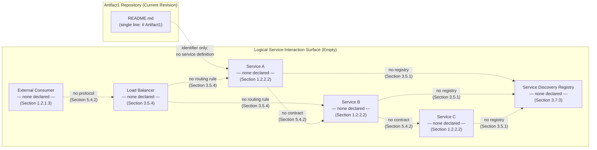

#### 6.1.5.2 Diagram 2 — Scalability Architecture (Empty State)

This diagram represents the empty scalability surface. The five Scalability Design sub-topics requested by the section prompt — horizontal scaling, vertical scaling, auto-scaling rules, resource allocation, and capacity planning — are preserved as placeholder nodes, each annotated with the anchor that records its absence.

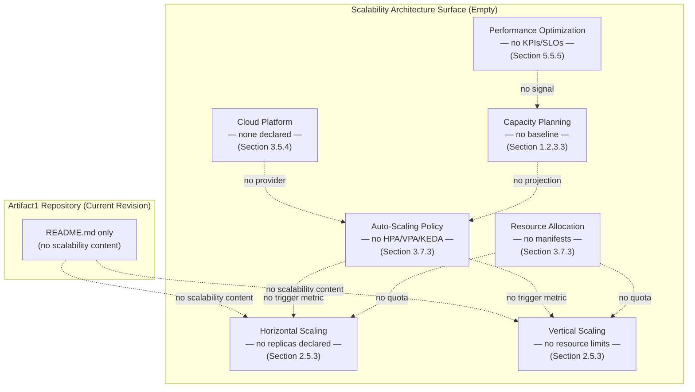

#### 6.1.5.3 Diagram 3 — Resilience Pattern Implementation (Empty State)

This diagram represents the empty resilience-pattern pipeline. Each conventional resilience stage — detection, retry, circuit-breaker, bulkhead, fallback, failover, disaster recovery, and terminal escalation — is preserved as a placeholder. The structural skeleton mirrors Section 5.5.7 (Error Handling Flow Diagram), extended to incorporate the failover and DR stages requested by the Resilience Patterns sub-topics of this section prompt.

```mermaid
flowchart TB
    subgraph ResiliencePipeline["Resilience Pattern Pipeline (Empty)"]
        FailTrigger(["Failure trigger<br/>— none declared —<br/>(Section 4.4.2)"])
        DetectNode["Detection layer<br/>— no observability —<br/>(Section 5.5.1)"]
        RetryNode["Retry policy<br/>— none declared —<br/>(Section 5.5.3)"]
        BreakerNode["Circuit breaker<br/>— none declared —<br/>(Section 5.5.3)"]
        BulkheadNode["Bulkhead isolation<br/>— none declared —<br/>(Section 5.5.3)"]
        FallbackNode["Fallback / degraded mode<br/>— none declared —<br/>(Section 5.5.3)"]
        FailoverNode["Failover topology<br/>— none declared —<br/>(Section 5.5.6)"]
        DRNode["Disaster recovery procedure<br/>— no runbook —<br/>(Section 5.5.6)"]
        RedundancyNode["Data redundancy<br/>— no replication —<br/>(Section 5.4.3)"]
        TerminalNode(["Terminal failure<br/>— no escalation defined —<br/>(Section 5.5.6)"])
    end

    FailTrigger -.-> DetectNode
    DetectNode -.->|"no rule"| RetryNode
    RetryNode -.->|"no budget"| BreakerNode
    BreakerNode -.->|"no threshold"| BulkheadNode
    BulkheadNode -.->|"no partition"| FallbackNode
    FallbackNode -.->|"no degraded mode"| FailoverNode
    FailoverNode -.->|"no standby"| DRNode
    DRNode -.->|"no replica"| RedundancyNode
    DRNode -.-> TerminalNode
    RetryNode -.->|"exhausted"| TerminalNode
```

Each of the three diagrams is preserved so that, upon the introduction of any service definition, autoscaling manifest, or resilience-library configuration, the corresponding placeholder node can be populated with the committed value without altering the diagram's structural skeleton.

---

### 6.1.6 Coverage Summary

The following summary mirrors the precedent set by Section 2.7.1, Section 3.8.1, Section 4.5.1, and Section 5.6.1.

| Sub-Section | Status | Evidentiary Anchor |
|---|---|---|
| 6.1.2.1 Service boundaries and responsibilities | Not applicable | Section 1.2.2.2; Section 5.3.1; Section 1.3.1.2 |
| 6.1.2.2 Inter-service communication patterns | Not applicable | Section 5.4.2; Section 3.5.1 |
| 6.1.2.3 Service discovery mechanisms | Not applicable | Section 3.5.4; Section 3.7.3 |
| 6.1.2.4 Load balancing strategy | Not applicable | Section 3.5.4 |
| 6.1.2.5 Circuit breaker patterns | Not applicable | Section 5.5.3; Section 4.4.2 |
| 6.1.2.6 Retry and fallback mechanisms | Not applicable | Section 4.4.2; Section 5.5.3 |
| 6.1.3.1 Horizontal/vertical scaling | Not applicable | Section 2.5.3; Section 1.2.2.2 |
| 6.1.3.2 Auto-scaling triggers and rules | Not applicable | Section 3.5.4; Section 3.7.3 |
| 6.1.3.3 Resource allocation strategy | Not applicable | Section 3.7.3 |
| 6.1.3.4 Performance optimization | Not applicable | Section 2.5.2; Section 5.5.5 |
| 6.1.3.5 Capacity planning | Not applicable | Section 1.2.3.3; Section 2.5.3 |
| 6.1.4.1 Fault tolerance mechanisms | Not applicable | Section 4.4.2; Section 5.5.3 |
| 6.1.4.2 Disaster recovery procedures | Not applicable | Section 5.5.6; Section 2.5.5 |
| 6.1.4.3 Data redundancy approach | Not applicable | Section 5.4.3; Section 5.5.6 |
| 6.1.4.4 Failover configurations | Not applicable | Section 5.5.6; Section 1.3.1.2 |
| 6.1.4.5 Service degradation policies | Not applicable | Section 5.5.3; Section 4.4.2 |
| 6.1.5.1 Service interaction diagram | Rendered as empty-state diagram | Per Section 5.3.2 precedent |
| 6.1.5.2 Scalability architecture diagram | Rendered as empty-state diagram | Per Section 3.1.3 precedent |
| 6.1.5.3 Resilience pattern diagram | Rendered as empty-state diagram | Per Section 5.5.7 precedent |

---

### 6.1.7 Conditions Under Which This Section Will Be Updated

Consistent with the revision-trigger pattern established by Section 1.4.3 and reused in Section 2.7.2, Section 3.8.2, Section 4.5.2, and Section 5.6.2, the Core Services Architecture section will be re-evaluated for applicability — and, when applicable, populated — under any of the following conditions.

#### 6.1.7.1 Triggers That Would Populate Service Components (6.1.2)

1. **Introduction of multiple independently-deployable service modules** — for example, multiple `service-*/`, `services/<name>/`, or equivalent directories each carrying its own build manifest (`package.json`, `pom.xml`, `Cargo.toml`, `go.mod`, `pyproject.toml`, `*.csproj`). This triggers population of Section 6.1.2.1 (Service Boundaries).
2. **Introduction of inter-service communication artifacts** — OpenAPI/Swagger specs, AsyncAPI documents, `.proto` files, GraphQL SDL, message-broker topic/queue definitions (Kafka, RabbitMQ, NATS, Pulsar, SQS), or webhook subscription manifests. This triggers population of Section 6.1.2.2.
3. **Introduction of service discovery configuration** — Consul, Eureka, etcd, ZooKeeper client configuration; Kubernetes `Service` and `Endpoints` manifests; Istio/Linkerd/Consul-Connect mesh manifests; or DNS-SD/SRV-record declarations. This triggers population of Section 6.1.2.3.
4. **Introduction of load-balancer configuration** — AWS ALB/NLB, GCP Load Balancer, Azure Front Door, NGINX, HAProxy, Envoy, Traefik, or API-gateway (Kong, Ambassador, Tyk) declarations. This triggers population of Section 6.1.2.4.
5. **Introduction of resilience-library configurations** — Resilience4j, Polly, Hystrix, Sentinel, gobreaker, or framework-native (Spring Cloud Circuit Breaker, ASP.NET Core Resilience, FastAPI middleware) circuit-breaker/retry/bulkhead declarations. This triggers population of Section 6.1.2.5 and Section 6.1.2.6.

#### 6.1.7.2 Triggers That Would Populate Scalability Design (6.1.3)

6. **Introduction of container orchestrator manifests** — Kubernetes `Deployment`, `StatefulSet`, `DaemonSet`, `Job`, `CronJob`, `HorizontalPodAutoscaler`, `VerticalPodAutoscaler`, or KEDA `ScaledObject` definitions; Nomad job specs; ECS task definitions; or Cloud Run/Cloud Functions/Lambda configuration. This triggers population of Section 6.1.3.1, Section 6.1.3.2, and Section 6.1.3.3.
7. **Introduction of infrastructure-as-code manifests** — Terraform, Pulumi, CloudFormation, ARM, Bicep, or CDK files declaring autoscaling groups, scale sets, managed instance groups, or compute-fleet configuration. This triggers population of Section 6.1.3.2 and Section 6.1.3.3.
8. **Introduction of performance targets and KPIs** — Service-level objective declarations (Sloth, Pyrra, OpenSLO), error-budget policies, load-test results, or benchmarking artifacts. This triggers population of Section 6.1.3.4 and Section 6.1.3.5.

#### 6.1.7.3 Triggers That Would Populate Resilience Patterns (6.1.4)

9. **Introduction of disaster-recovery runbooks** — files committed under `runbooks/`, `playbooks/`, `incidents/`, or `docs/runbooks/`, including DR drills, RTO/RPO declarations, or backup/restore procedures. This triggers population of Section 6.1.4.2.
10. **Introduction of data-replication configuration** — database replica declarations, storage-class replication settings (S3 cross-region replication, GCS dual-region buckets, Azure GZRS), or stream-replication topologies (Kafka MirrorMaker, Debezium). This triggers population of Section 6.1.4.3.
11. **Introduction of multi-region or active-passive failover topology** — Route 53/Cloud DNS/Traffic Manager failover policies, multi-region Kubernetes federation, or pilot-light/warm-standby declarations. This triggers population of Section 6.1.4.4.
12. **Introduction of graceful-degradation manifests** — feature-flag declarations (LaunchDarkly, Unleash, Flagsmith, OpenFeature), load-shedding configuration, or rate-limit/quota manifests. This triggers population of Section 6.1.4.5.

#### 6.1.7.4 Trigger That Would Re-Evaluate Section Applicability

13. **Expansion of `README.md`** (or introduction of supplementary documentation under `docs/`, `architecture/`, or equivalent) to **explicitly declare a service-oriented, microservices, event-driven, or distributed architectural style** with sufficient specificity to be reflected without inference. Such a declaration would itself revise the Section 6.1.1 applicability determination from "not applicable" to "applicable, empty pending implementation artifacts."

Until at least one of the above conditions obtains, this section is expected to remain in its current evidence-grounded, structurally-complete-but-materially-empty form, consistent with the disposition of Sections 2.4, 2.6, 2.7, 3.1, 3.8, 4.1, 4.5, 5.1, and 5.6.

---

### 6.1.8 References to Related Technical Specification Content

The following cross-reference table identifies the upstream specification sections that anchor each empty-state declaration in this section.

| Related Section | Relevance to Section 6.1 |
|---|---|
| 1.2 System Overview | Section 1.2.1.3 anchors the absence of external integrations; Section 1.2.2.1 anchors the absence of capabilities; Section 1.2.2.2 anchors the empty component architecture that underpins every "not applicable" verdict in Section 6.1.2 and Section 6.1.4; Section 1.2.2.3 anchors the undetermined technical approach; Section 1.2.3.3 anchors the absence of KPIs/SLOs underpinning Section 6.1.3.4, Section 6.1.3.5, and Section 6.1.4. |
| 1.3 Scope | Section 1.3.1.2 anchors the absence of system boundaries, user groups, geographic coverage, and data domains underpinning Section 6.1.4.4 (Failover); Section 1.3.2.1 enumerates the eight out-of-scope categories that align with the service, integration, persistence, security, and observability sub-topics of Section 6.1; Section 1.3.2.3 anchors the absence of integration coverage underpinning Section 6.1.2.2. |
| 1.4 Document Basis and Evolution | Section 1.4.1 catalogues the foundational source material; Section 1.4.2 supplies the binding constraint against architectural-pattern speculation that governs the Section 6.1.1 applicability determination; Section 1.4.3 supplies the revision-trigger pattern reused in Section 6.1.7. |
| 2.5 Implementation Considerations | Section 2.5.2 directly anchors Section 6.1.3.4 (Performance Optimization); Section 2.5.3 directly anchors Section 6.1.3.1 (Horizontal/Vertical Scaling) and Section 6.1.3.5 (Capacity Planning); Section 2.5.5 directly anchors Section 6.1.4.2 (Disaster Recovery). |
| 3.5 Third-Party Services | Section 3.5.1 anchors the absence of REST/GraphQL/gRPC endpoints, webhooks, message-broker connections, and SDK bindings underpinning Section 6.1.2.2 (Inter-Service Communication); Section 3.5.4 anchors the absence of compute, network (load balancer), and managed-messaging services underpinning Section 6.1.2.3, Section 6.1.2.4, Section 6.1.3.2, and Section 6.1.4.4. |
| 3.6 Databases & Storage | Section 3.6 (overall) anchors the absence of persistence underpinning Section 6.1.4.3 (Data Redundancy); Section 3.6.3 anchors the absence of caching layers underpinning Section 6.1.3.4 (Performance Optimization). |
| 3.7 Development & Deployment | Section 3.7.3 anchors the absence of containerization underpinning Section 6.1.2.3 (Service Discovery), Section 6.1.3.2 (Auto-Scaling), and Section 6.1.3.3 (Resource Allocation); Section 3.7.5 anchors the absence of infrastructure-as-code underpinning Section 6.1.3.2 and Section 6.1.4.4. |
| 4.4 Technical Implementation | Section 4.4.1 anchors the absence of state management; Section 4.4.2 directly anchors Section 6.1.2.5 (Circuit Breaker), Section 6.1.2.6 (Retry/Fallback), Section 6.1.4.1 (Fault Tolerance), and Section 6.1.4.5 (Service Degradation); Section 4.4.4 anchors the absence of an integration sequence underpinning Section 6.1.2.2. |
| 5.2 High-Level Architecture | Section 5.2.1 directly anchors the Section 6.1.1.3 governing constraint by enumerating the styles (including microservices, service-oriented, event-driven, serverless) explicitly refused as defaults; Section 5.2.2 anchors the empty component table; Section 5.2.4 anchors the absence of external integration points. |
| 5.3 Component Details | Section 5.3.1 anchors the empty component inventory underpinning Section 6.1.2.1; Section 5.3.2 supplies the empty-state component-interaction diagram precedent reused in Section 6.1.5.1. |
| 5.4 Technical Decisions | Section 5.4.1 anchors the absence of architecture style decisions; Section 5.4.2 directly anchors Section 6.1.2.2 (Inter-Service Communication); Section 5.4.3 directly anchors Section 6.1.4.3 (Data Redundancy); Section 5.4.7 confirms no ADRs exist that could supply a service-architecture decision. |
| 5.5 Cross-Cutting Concerns | Section 5.5.1 and Section 5.5.2 anchor the absence of observability underpinning Section 6.1.4.1; Section 5.5.3 directly anchors Section 6.1.2.5 (Circuit Breaker), Section 6.1.2.6 (Retry/Fallback), Section 6.1.4.1 (Fault Tolerance), and Section 6.1.4.5 (Service Degradation); Section 5.5.5 directly anchors Section 6.1.3.4 (Performance Optimization); Section 5.5.6 directly anchors Section 6.1.4.2 (Disaster Recovery) and Section 6.1.4.4 (Failover); Section 5.5.7 supplies the empty resilience-pipeline diagram precedent reused in Section 6.1.5.3. |
| 5.6 Summary of System Architecture Coverage | Section 5.6.1 supplies the Coverage Summary table format mirrored in Section 6.1.6; Section 5.6.2 supplies the trigger-condition structure mirrored and expanded in Section 6.1.7; Section 5.6.3 supplies the Related-Section cross-reference table format mirrored in this Section 6.1.8. |

---

#### References

#### Files Examined

- `README.md` — Sole file in the repository. Verified contents consist of a single line containing the Markdown level-one heading `# Artifact1` (11 bytes). Confirmed as providing only the artifact identifier and no service definition, communication contract, discovery declaration, load-balancer configuration, circuit-breaker policy, retry policy, scaling manifest, capacity baseline, fault-tolerance mechanism, disaster-recovery procedure, replication strategy, failover topology, or degradation policy. Establishes the evidentiary basis for every "not applicable" assertion throughout Section 6.1.

#### Folders Explored

- `/` (repository root, depth 0→1) — Verified to contain exclusively `README.md` and no subdirectories. Confirmed the absence of all conventional service-architecture directories — including `services/`, `microservices/`, `apis/`, `gateway/`, `mesh/`, `k8s/`, `kubernetes/`, `helm/`, `charts/`, `infra/`, `infrastructure/`, `iac/`, `terraform/`, `deploy/`, `deployment/`, `config/`, `configs/`, `env/`, `runbooks/`, `playbooks/`, `incidents/`, `slo/`, `slos/`, `observability/`, `monitoring/`, `logging/`, `tracing/`, `metrics/`, `resilience/`, `policies/`, `auth/`, `security/`, `events/`, `messaging/`, `integrations/`, `connectors/`, `proto/`, `protos/`, `schemas/`, `contracts/`, `architecture/`, `adr/`, `decisions/`, `docs/`, `documentation/`, and `design/`. Maximum traversal depth of 1 achieved because no deeper structure exists.

#### Technical Specification Sections Retrieved

- **1.2 System Overview** — Section 1.2.1.3 (no integrations), Section 1.2.2.1 (no capabilities), Section 1.2.2.2 (no components/services/modules/libraries), Section 1.2.2.3 (technical approach undetermined), and Section 1.2.3.3 (no KPIs/SLOs) supply the foundational anchors for the Section 6.1.1 applicability determination and for every empty-state declaration in Sections 6.1.2, 6.1.3, and 6.1.4.
- **1.3 Scope** — Section 1.3.1.2 (no boundaries, no geographic coverage) anchors Section 6.1.4.4; Section 1.3.2.1 (eight out-of-scope categories) anchors every "not applicable" verdict; Section 1.3.2.3 (no integration coverage) anchors Section 6.1.2.2.
- **1.4 Document Basis and Evolution** — Section 1.4.1 anchors the foundational source material; Section 1.4.2 supplies the binding constraint forbidding architectural-pattern speculation that governs Section 6.1.1.3; Section 1.4.3 supplies the revision-trigger pattern reused in Section 6.1.7.
- **2.5 Implementation Considerations** — Section 2.5.2 directly anchors Section 6.1.3.4; Section 2.5.3 directly anchors Section 6.1.3.1 and Section 6.1.3.5; Section 2.5.5 directly anchors Section 6.1.4.2; Section 2.5.6 provides the consolidated empty-state status table that Section 6.1.6 mirrors.
- **3.5 Third-Party Services** — Section 3.5.1 (no APIs/SDKs/brokers) anchors Section 6.1.2.2; Section 3.5.4 (no cloud platform, no load balancers, no region/AZ strategy) anchors Section 6.1.2.3, Section 6.1.2.4, Section 6.1.3.2, and Section 6.1.4.4.
- **4.4 Technical Implementation** — Section 4.4.2 directly enumerates "Retry Mechanisms: None," "Fallback Processes: None," "Error Notification Flows: None," and "Recovery Procedures: None," constituting the single most directly-cited anchor for Section 6.1.2.5, Section 6.1.2.6, Section 6.1.4.1, and Section 6.1.4.5.
- **5.2 High-Level Architecture** — Section 5.2.1 explicitly refuses to assert microservices, service-oriented, event-driven, reactive, actor-model, or serverless styles as defaults, providing the most direct authority for the Section 6.1.1 not-applicable verdict.
- **5.4 Technical Decisions** — Section 5.4.1 (no architecture-style decisions), Section 5.4.2 (no communication patterns), Section 5.4.3 (no storage), and Section 5.4.7 (no ADRs) collectively anchor every sub-topic of Section 6.1.2 and Section 6.1.4.3.
- **5.5 Cross-Cutting Concerns** — Section 5.5.3 (no retry/circuit-breaker/bulkhead/fallback/DLQ), Section 5.5.5 (no latency/throughput/availability/error-budget/RTO/RPO), Section 5.5.6 (no backup/replication/failover/runbook), and Section 5.5.7 (empty resilience-pipeline diagram precedent) collectively anchor Section 6.1.2.5, Section 6.1.2.6, Section 6.1.3.4, Section 6.1.4.1, Section 6.1.4.2, Section 6.1.4.3, Section 6.1.4.4, Section 6.1.4.5, and Section 6.1.5.3.
- **5.6 Summary of System Architecture Coverage and Forward Commitment** — Section 5.6.1 supplies the Coverage Summary table format mirrored in Section 6.1.6; Section 5.6.2 supplies the trigger-condition structure mirrored and expanded in Section 6.1.7; Section 5.6.3 supplies the Related-Section cross-reference table format mirrored in Section 6.1.8.

## 6.2 Database Design

### 6.2.1 Applicability Determination

**Database Design is not applicable to this system.**

This determination follows directly from the section prompt's own escape clause, which provides that when "the system does not require or direct database or persistent storage interactions are not clearly evident," the section is to declare itself not applicable and explain why. At the current revision of the `Artifact1` repository, every database-related dimension recorded across the upstream Technical Specification — relational, document, key-value, columnar, graph, time-series, search, and vector/embedding stores; schema definitions; migration tooling; replication topology; backup and restore strategy; retention and archival policy; data-residency constraints; caching layers; and object-storage targets — is recorded as "None declared" or "None present." No artifact in the repository supports the authoring of a schema diagram, indexing strategy, partitioning approach, migration procedure, archival policy, backup architecture, audit mechanism, query-optimization pattern, connection-pool configuration, or replication topology.

This section mirrors the structural precedent established by Section 6.1 (Core Services Architecture): each sub-topic requested by the section prompt is preserved as a verifiable empty state with explicit evidentiary anchors, ensuring that the documentation remains structurally complete while remaining materially faithful to the absence of database artifacts in the repository.

### 6.1.1 Repository Substrate Underlying This Determination

The entire repository substrate from which a Database Design could be derived consists of a single file. Per Section 1.4.1, the foundational source materials are exhausted by `README.md` (whose substantive content is the single line `# Artifact1`) and the repository root directory (which contains only that file and no subfolders). The following table enumerates the database-design artifacts that would be required to populate this section and confirms each as absent.

| Required Artifact Category | Conventional Form | Repository State |
|---|---|---|
| Connection configuration | `database.yml`, `prisma.schema`, `.env`, JDBC URLs | None present |
| Schema definitions | `*.sql` DDL, ORM/ODM model files, `*.proto` schemas | None present |
| Migration scripts | `migrations/`, `alembic/versions/`, `db/migrate/` | None present |
| Persistence directories | `db/`, `database/`, `data/`, `seeds/`, `fixtures/` | None present |
| Caching configuration | Redis/Memcached client config, cache decorators | None present |
| Backup / replication config | `pg_dump` scripts, replica-set configs, IaC manifests | None present |

### 6.1.2 Justification Against the Four Section-Prompt Categories

The section prompt requests documentation across four categories: Schema Design, Data Management, Compliance Considerations, and Performance Optimization. Each category is independently and verifiably empty at the current revision.

| Section-Prompt Category | Evidence of Non-Existence | Evidentiary Anchor |
|---|---|---|
| Schema Design | No databases, schemas, or storage backends declared | Section 3.6.1; Section 3.6.2 |
| Data Management | No migrations, versioning, retention, or caching policies | Section 3.6.2; Section 3.6.3 |
| Compliance Considerations | No retention rules, privacy controls, or audit mechanisms | Section 1.3.2.1; Section 5.5.4 |
| Performance Optimization | No query patterns, pooling, replication, or batch artifacts | Section 3.6.1; Section 5.5.5 |

### 6.1.3 Governing Authoring Constraint

Per Section 1.4.2, "this section deliberately refrains from speculating about the project's intended purpose, audience, technology choices, architectural patterns, or success metrics. Such speculation would not be supported by the contents of the repository and would compromise the document's role as a faithful, evidence-grounded reference for the artifact's actual state." Per Section 1.3.2.1, "Data schemas and persistence" appears as an explicitly out-of-scope category with the rationale "No data models, migrations, or storage configuration present." Per Section 3.6.1, every database engine column (Engine, Version, Connection Configuration) is recorded as either "None declared" or "None present." Consequently, no relational schema, no document collection, no key-value namespace, no graph topology, no caching tier, and no backup or replication policy may be invented in this section.

Notwithstanding the non-applicability verdict, this section preserves the full sub-topic scaffolding requested by the section prompt and renders each dimension as a verifiable empty state with explicit evidentiary anchors, mirroring the "structurally complete but materially empty" precedent established throughout Sections 2–6 (see Sections 2.7, 3.8, 4.5, 5.6, and 6.1).

---

### 6.2.2 Schema Design (Empty State)

The section prompt requests documentation across six sub-topics: entity relationships, data models and structures, indexing strategy, partitioning approach, replication configuration, and backup architecture. Each sub-topic is recorded below in its evidence-grounded empty form.

#### 6.2.2.1 Entity Relationships

No entity relationships are declared. Per Section 3.6.2, "schema definitions" are recorded as "None present." Per Section 5.2.3, primary data flows, integration patterns, integration protocols, data transformation points, key data stores, and key caches are all recorded as either "None — no components from which a flow could originate or terminate" or "None declared." Per Section 1.3.1.2, "Data domains included" is recorded as "None present." Consequently, no domain entity, no aggregate root, no one-to-one association, no one-to-many association, no many-to-many junction table, no inheritance hierarchy (single-table, joined-table, or table-per-concrete-class), and no polymorphic association has been committed. No entity-relationship diagram, no conceptual data model, no logical data model, and no physical data model is documentable at this revision.

#### 6.2.2.2 Data Models and Structures

No data models or structures are declared. Per Section 1.3.2.1, "Data schemas and persistence" appears as an explicitly out-of-scope category. Per Section 2.3.3 (Functional Requirements), no data domains are present and no data requirements have been recorded. Per Section 2.3.4, "Data Validation" is recorded as "None — no data structures defined." No relational schema (third-normal-form, denormalized, star-schema, snowflake-schema, or data-vault), no document-collection layout, no column family, no graph schema (property-graph or RDF), no time-series measurement, no full-text inverted index, and no vector-embedding dimensionality has been committed.

#### 6.2.2.3 Indexing Strategy

No indexing strategy is declared. Per Section 3.6.1, every database category — primary OLTP, secondary/analytical, document/NoSQL, key-value, time-series, graph, search, and vector/embedding — is recorded as "None declared" with no engine, version, or connection configuration. Per Section 3.6.2, no schema definitions exist from which index candidates could be derived. Consequently, no B-tree index, no hash index, no bitmap index, no GiST/GIN/BRIN index, no composite/covering index, no partial index, no unique constraint, no full-text index, no geospatial index, and no vector index (IVF, HNSW, PQ) has been committed.

#### 6.2.2.4 Partitioning Approach

No partitioning approach is declared. Per Section 5.4.3, "Data residency / partitioning strategy" is recorded as "None declared" with the evidentiary anchor "Section 1.3.1.2 (no geographic coverage); Section 3.6." Per Section 1.3.1.2, "Geographic or market coverage" is recorded as "Not specified." Consequently, no horizontal partitioning (sharding by hash, range, list, or composite key), no vertical partitioning (column-family separation), no time-based partitioning, no tenant-based partitioning, and no consistent-hashing ring topology has been committed.

#### 6.2.2.5 Replication Configuration

No replication configuration is declared. Per Section 3.6.2, "Replication topology" is recorded as "None declared." Per Section 5.5.6, "Replication strategy: None declared" with the evidentiary anchor "Section 3.6." Per Section 6.1.4.3, "no synchronous-vs-asynchronous replication mode, no quorum policy (Paxos, Raft, ZAB), no read-replica topology, no sharding strategy, no erasure-coding policy, and no multi-AZ/multi-region storage class has been committed." Consequently, no primary–replica, multi-primary, leaderless, chain-replication, or cross-region active-active replication scheme is in force.

#### 6.2.2.6 Backup Architecture

No backup architecture is declared. Per Section 3.6.2, "Backup and restore strategy" is recorded as "None declared." Per Section 5.5.6, "Backup strategy: None declared" with the evidentiary anchor "Section 3.6 (no data stores to back up)." Per Section 2.5.5, no operational runbooks, upgrade procedures, monitoring playbooks, support-tier definitions, or lifecycle declarations exist. Consequently, no full/incremental/differential backup cadence, no point-in-time-recovery (PITR) configuration, no logical-vs-physical backup convention, no snapshot policy, no offsite-replication target, no encryption-at-rest backup key, and no restore-validation procedure has been committed.

#### 6.2.2.7 Schema Design — Consolidated Empty-State Table

| Schema Design Sub-Topic | Documented State | Evidentiary Anchor |
|---|---|---|
| Entity relationships | Not applicable — no entities declared | Section 3.6.2; Section 5.2.3 |
| Data models and structures | Not applicable — no schemas declared | Section 1.3.2.1; Section 2.3.3 |
| Indexing strategy | Not applicable — no databases declared | Section 3.6.1; Section 3.6.2 |
| Partitioning approach | Not applicable — no partitioning declared | Section 5.4.3; Section 1.3.1.2 |
| Replication configuration | Not applicable — no replication declared | Section 3.6.2; Section 5.5.6 |
| Backup architecture | Not applicable — no backup declared | Section 3.6.2; Section 5.5.6 |

---

### 6.2.3 Data Management (Empty State)

The section prompt requests documentation across five sub-topics: migration procedures, versioning strategy, archival policies, data storage and retrieval mechanisms, and caching policies. Each sub-topic is recorded below in its evidence-grounded empty form.

#### 6.2.3.1 Migration Procedures

No migration procedures are declared. Per Section 3.6.2, "Migration tooling" is recorded as "None present." No conventional migration directory (`migrations/`, `alembic/versions/`, `db/migrate/`, `prisma/migrations/`, `liquibase/changelog/`, or `flyway/sql/`) exists in the repository. No declarative-schema tooling (Atlas, Skeema, Bytebase) or imperative-migration framework (Knex, Sequelize, TypeORM, ActiveRecord, Django migrations, Goose, Flyway, Liquibase, Alembic, Diesel, Refinery) configuration is committed. Consequently, no forward-migration procedure, no down-migration procedure, no migration ordering/dependency graph, no shadow-database validation step, and no zero-downtime migration pattern (expand–contract, blue-green schema, branch-by-abstraction) has been recorded.

#### 6.2.3.2 Versioning Strategy

No versioning strategy is declared. Per Section 3.6.2, no schema-versioning artifacts exist in the repository. No schema-version table, no migration-checksum file, no version-control branching strategy specific to schemas, and no contract-versioning convention (semantic versioning of schemas, Avro schema-registry compatibility modes, Protobuf field-deprecation policy) has been committed. Consequently, no backward-compatibility policy (BACKWARD, FORWARD, FULL, NONE), no breaking-change governance, and no schema-deprecation lifecycle is in force.

#### 6.2.3.3 Archival Policies

No archival policies are declared. Per Section 3.6.2, "Retention and archival policy" is recorded as "None declared." Per Section 1.3.2.1, data schemas and persistence are out of scope. Consequently, no hot/warm/cold storage tiering, no time-to-live (TTL) policy, no archival-to-cold-storage cadence, no records-management classification (transactional, reporting, audit, regulatory), no legal-hold mechanism, and no purge-and-tombstone convention has been committed.

#### 6.2.3.4 Data Storage and Retrieval Mechanisms

No data storage and retrieval mechanisms are declared. Per Section 3.6 (entire), no relational, document, key-value, columnar, graph, time-series, search, or vector/embedding store is declared, and no object storage, blob storage, file/network share, block storage, or content-delivery target is declared. Per Section 4.4.1, "Data Persistence Points" is recorded as "None — no databases declared" and "Transaction Boundaries" is recorded as "None — no data stores." Per Section 5.2.3, "Key data stores" is recorded as "None — no databases or storage backends declared." Consequently, no read-path topology (driver, connection pool, query layer, ORM, cache, store), no write-path topology, no transaction-isolation level (Read Uncommitted, Read Committed, Repeatable Read, Serializable, Snapshot), no consistency model (strong, eventual, causal, session, monotonic), and no durability guarantee (sync replication, fsync policy, group commit) has been recorded.

#### 6.2.3.5 Caching Policies

No caching policies are declared. Per Section 3.6.3, every caching layer — in-process cache, distributed cache (Redis-class, Memcached-class), HTTP/reverse-proxy cache, CDN edge cache, and query-result cache — is recorded as "None declared." Per Section 5.4.4, all four caching decision dimensions (caching tiers, cache-coherence strategy, eviction policy, invalidation mechanism) are recorded as "None declared." Per Section 4.4.1, "Caching Requirements" is recorded as "None — no caching layers declared." Consequently, no cache-key convention, no TTL/TTI policy, no eviction algorithm (LRU, LFU, FIFO, ARC, W-TinyLFU), no cache-coherence protocol (write-through, write-behind, write-around, refresh-ahead, cache-aside), no invalidation mechanism (tag-based, time-based, event-driven, manual), and no warm-up strategy is in force.

#### 6.2.3.6 Data Management — Consolidated Empty-State Table

| Data Management Sub-Topic | Documented State | Evidentiary Anchor |
|---|---|---|
| Migration procedures | Not applicable — no migration tooling | Section 3.6.2 |
| Versioning strategy | Not applicable — no schema versioning | Section 3.6.2 |
| Archival policies | Not applicable — no retention policy | Section 3.6.2; Section 1.3.2.1 |
| Data storage and retrieval | Not applicable — no stores declared | Section 3.6; Section 4.4.1 |
| Caching policies | Not applicable — no caches declared | Section 3.6.3; Section 5.4.4 |

---

### 6.2.4 Compliance Considerations (Empty State)

The section prompt requests documentation across five sub-topics: data retention rules, backup and fault tolerance policies, privacy controls, audit mechanisms, and access controls. Each sub-topic is recorded below in its evidence-grounded empty form.

#### 6.2.4.1 Data Retention Rules

No data retention rules are declared. Per Section 3.6.2, "Retention and archival policy" is recorded as "None declared." Per Section 2.3.4, "Compliance Requirements" is recorded as "None — no regulatory framing in the codebase." Per Section 1.3.2.1, data schemas and persistence are out of scope. Consequently, no GDPR Article-17 erasure procedure, no CCPA right-to-delete workflow, no HIPAA minimum-necessary retention boundary, no PCI-DSS cardholder-data retention envelope, no SOX 7-year financial-record retention, and no records-management schedule (RIM/IRM) has been committed.

#### 6.2.4.2 Backup and Fault Tolerance Policies

No backup or fault tolerance policies are declared. Per Section 5.5.6, "Backup strategy: None declared," "Replication strategy: None declared," "Failover topology: None declared," and "Runbook / incident response procedures: None declared." Per Section 3.6.2, no replication topology, backup/restore strategy, or data-residency constraints are present. Per Section 5.5.5, "Recovery Time Objective (RTO)" and "Recovery Point Objective (RPO)" are both recorded as "None declared." Consequently, no backup cadence, no offsite-replication frequency, no cross-region failover policy, no chaos-engineering practice, and no game-day exercise has been recorded.

#### 6.2.4.3 Privacy Controls

No privacy controls are declared. Per Section 1.3.2.1, "Authentication and authorization" appears as an explicitly out-of-scope category with the rationale "No identity, access-control, or security components defined." Per Section 2.3.4, no compliance requirements (data validation, regulatory framing) have been recorded. Per Section 5.4.5, all five security decision dimensions (authentication mechanism, authorization model, encryption-in-transit posture, encryption-at-rest posture, and the implicit secret-management posture) are recorded as "None declared." Consequently, no personally-identifiable-information (PII) classification, no data-subject-access-request (DSAR) workflow, no pseudonymization or anonymization technique, no field-level encryption, no tokenization scheme, no differential-privacy mechanism, and no data-residency-by-jurisdiction policy has been committed.

#### 6.2.4.4 Audit Mechanisms

No audit mechanisms are declared. Per Section 5.5.1, metrics, distributed traces, structured logs, and APM/RUM/synthetic monitoring are all recorded as "None declared." Per Section 5.5.2, log destinations, log schema/structured-logging library, trace-context propagation standard, and sampling policy are all recorded as "None declared." Per Section 1.2.3.3, no monitoring artifacts, telemetry configurations, observability declarations, or service-level objectives are present in the codebase. Consequently, no database audit log (pgAudit, MySQL audit plugin, SQL Server Audit, Oracle Unified Auditing), no change-data-capture audit stream, no temporal/system-versioned table, no append-only event-source ledger, and no tamper-evident hash-chained audit trail has been committed.

#### 6.2.4.5 Access Controls

No access controls are declared. Per Section 5.5.4, all four auth-framework dimensions (authentication protocol(s), authorization model, identity provider, session/token management) are recorded as "None declared." Per Section 3.5.2, identity-provider integration, OAuth/OIDC client configuration, SAML federation, API-key/token issuance, RBAC/ABAC, and session-management strategies are all "None declared." Per Section 5.4.5, "Authentication mechanism" and "Authorization model" are both recorded as "None declared." Consequently, no database-user catalogue, no role hierarchy, no row-level-security policy, no column-masking rule, no Kerberos/IAM/AAD authentication integration, no IP-allowlist, no service-account convention, and no privileged-access-management (PAM) workflow has been committed.

#### 6.2.4.6 Compliance Considerations — Consolidated Empty-State Table

| Compliance Sub-Topic | Documented State | Evidentiary Anchor |
|---|---|---|
| Data retention rules | Not applicable — no retention policy | Section 3.6.2; Section 2.3.4 |
| Backup and fault tolerance | Not applicable — no DR procedures | Section 5.5.6; Section 5.5.5 |
| Privacy controls | Not applicable — auth/security out of scope | Section 1.3.2.1; Section 5.4.5 |
| Audit mechanisms | Not applicable — no observability | Section 5.5.1; Section 5.5.2 |
| Access controls | Not applicable — no auth framework | Section 5.5.4; Section 3.5.2 |

---

### 6.2.5 Performance Optimization (Empty State)

The section prompt requests documentation across five sub-topics: query optimization patterns, caching strategy, connection pooling, read/write splitting, and batch processing approach. Each sub-topic is recorded below in its evidence-grounded empty form.

#### 6.2.5.1 Query Optimization Patterns

No query optimization patterns are declared. Per Section 3.6.1, every database category is recorded as "None declared," so no query surface exists from which optimization patterns could be derived. Per Section 5.5.5, all six performance/SLA dimensions (latency p50/p95/p99, throughput, availability, error budget, RTO, RPO) are recorded as "None declared." Per Section 2.5.2, no performance requirements are recorded against any feature. Consequently, no execution-plan analysis convention, no covering-index strategy, no query-rewriting rule, no materialized-view refresh policy, no statistics/histogram cadence, no plan-cache configuration, no parameterized-query convention, and no N+1 mitigation pattern (eager loading, dataloader batching) has been committed.

#### 6.2.5.2 Caching Strategy

No caching strategy is declared. This dimension is fully redundant with the empty-state declaration in Section 6.2.3.5 (Caching Policies) and Section 5.4.4 (Caching Strategy Justification). Per Section 5.4.4, "no caching tier (client-side, edge/CDN, reverse-proxy, application-level, distributed in-memory, or database-buffer-pool) has been selected, and no read-through, write-through, write-behind, refresh-ahead, or cache-aside pattern is in force." Per Section 3.6.3, every caching layer is recorded as "None declared." Consequently, no cache-warming, no cache-stampede mitigation (single-flight, request coalescing, probabilistic early expiration), no cache-tier hierarchy (L1/L2/L3), and no negative-caching policy has been committed.

#### 6.2.5.3 Connection Pooling

No connection pooling is declared. Per Section 3.6.1, no database connections exist to be pooled. Per Section 1.3.2.1, runtime configuration is out of scope, so no pool-sizing parameters (minimum, maximum, idle timeout, connection lifetime, leak-detection threshold), no pool implementation (HikariCP, c3p0, DBCP, pgbouncer, PgPool-II, ProxySQL, RDS Proxy, Aurora Data API), and no pool-warming or pool-recycling policy has been committed. No statement-cache size, no prepared-statement reuse policy, and no connection-multiplexing strategy is in force.

#### 6.2.5.4 Read/Write Splitting

No read/write splitting is declared. Per Section 3.6.2, "Replication topology" is recorded as "None declared," so no read-replica surface exists from which to route read traffic. Per Section 5.5.6, "Replication strategy: None declared" and "Failover topology: None declared." Per Section 6.1.4.3, "no read-replica topology, no sharding strategy" has been committed. Consequently, no driver-level read/write split (Hibernate's `@Transactional(readOnly=true)`, Rails' `ActiveRecord::Base.connected_to(role: :reading)`, Sequelize's `useMaster` hint), no proxy-level split (ProxySQL query rules, MaxScale read-write split filter, RDS Proxy endpoints), and no application-level CQRS split has been recorded.

#### 6.2.5.5 Batch Processing Approach

No batch processing approach is declared. Per Section 1.2.2.1 (Major Functions, cross-referenced via Section 1.2.2.2), no data-processing functions exist in the repository. Per Section 4.4.1, "Data Persistence Points" is recorded as "None — no databases declared" and "Transaction Boundaries" is recorded as "None — no data stores." Per Section 2.3.3 (Functional Requirements), no data domains are present. Consequently, no bulk-insert convention (multi-row INSERT, COPY, LOAD DATA INFILE, BULK INSERT), no batch-update strategy, no ETL/ELT pipeline (Airflow, Dagster, Prefect, Luigi, dbt, Spark, Flink, Beam), no change-data-capture (CDC) topology (Debezium, AWS DMS, Maxwell, Kafka Connect), and no scheduled-job catalogue has been committed.

#### 6.2.5.6 Performance Optimization — Consolidated Empty-State Table

| Performance Sub-Topic | Documented State | Evidentiary Anchor |
|---|---|---|
| Query optimization patterns | Not applicable — no queries to optimize | Section 3.6.1; Section 5.5.5 |
| Caching strategy | Not applicable — no caches declared | Section 3.6.3; Section 5.4.4 |
| Connection pooling | Not applicable — no connections to pool | Section 3.6.1; Section 1.3.2.1 |
| Read/write splitting | Not applicable — no replication declared | Section 3.6.2; Section 5.5.6 |
| Batch processing approach | Not applicable — no processing logic | Section 4.4.1; Section 2.3.3 |

---

### 6.2.6 Required Diagrams (Empty-State Renderings)

The section prompt requires three diagrams: a database schema diagram, a data flow diagram, and a replication architecture diagram. Each is rendered below as an empty-state Mermaid diagram, following the precedents established in Sections 3.1.3 (multi-layer dimensional-surface template), 4.4.3 (empty state-transition diagram), 5.4.6 (empty decision-tree diagram), 5.5.7 (empty resilience-pipeline diagram), and 6.1.5 (empty service/scalability/resilience diagrams). All edges are dashed to indicate that no relationship, no flow, and no replication channel has been committed. Each placeholder node carries an inline annotation identifying the anchor that records its absence.

#### 6.2.6.1 Diagram 1 — Database Schema Diagram (Empty State)

This diagram represents the empty database-schema surface. The repository state subgraph anchors the substrate; the schema surface subgraph enumerates the canonical schema-design elements (entity tables, primary keys, foreign keys, indexes, constraints) requested by the section prompt's Schema Design sub-topics. All inter-element edges are dashed and annotated with the absence of declared structure.

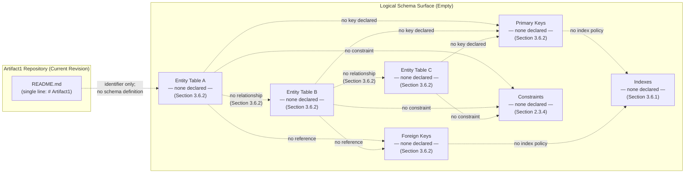

#### 6.2.6.2 Diagram 2 — Data Flow Diagram (Empty State)

This diagram represents the empty data-flow surface. The canonical data-pipeline elements requested by Section 5.2.3 — producer, transformation/ETL stage, primary store, secondary/analytical store, cache layer, and consumer — are preserved as placeholder nodes, each annotated with the anchor that records its absence. The diagram mirrors the structural skeleton of Section 5.2.3 (Data Flow Description) extended to incorporate the storage and caching tiers requested by the section prompt.

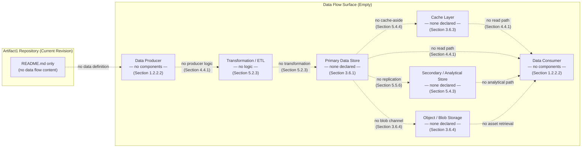

#### 6.2.6.3 Diagram 3 — Replication Architecture (Empty State)

This diagram represents the empty replication-architecture surface. The canonical replication topology elements requested by the section prompt — primary node, replica nodes, replication channel, failover orchestrator, and backup target — are preserved as placeholder nodes, each annotated with the anchor that records its absence. The structural skeleton mirrors the empty resilience-pipeline precedent established in Section 5.5.7 and the empty failover precedent established in Section 6.1.5.3.

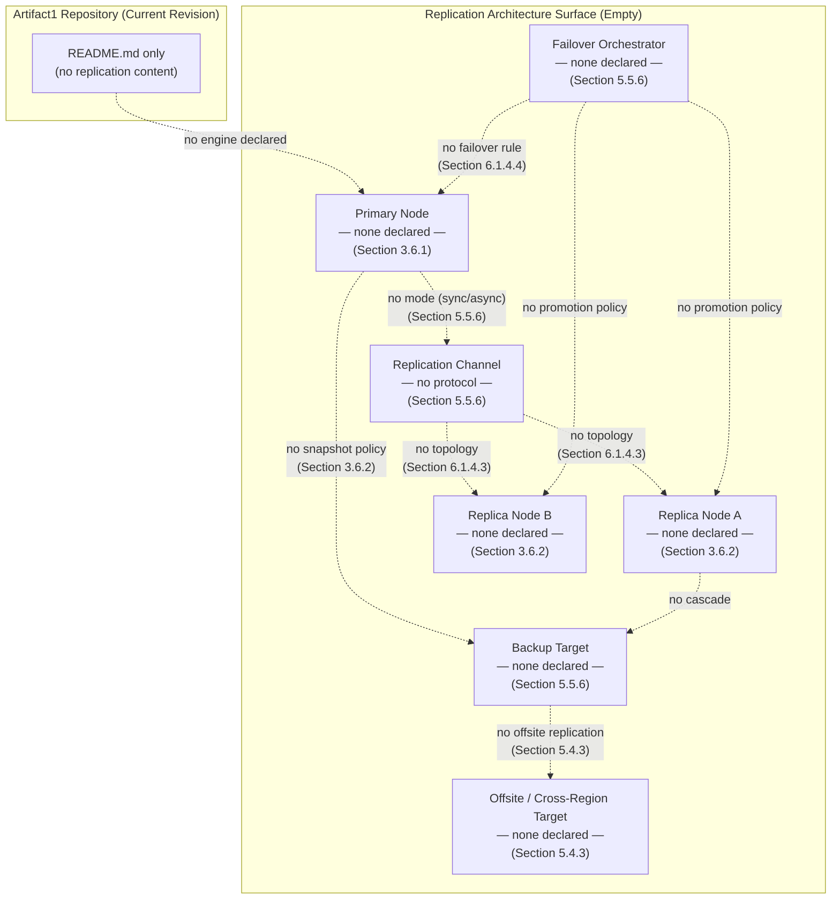

Each of the three diagrams is preserved so that, upon the introduction of any schema definition, data-flow declaration, or replication-topology configuration, the corresponding placeholder node can be populated with the committed value without altering the diagram's structural skeleton.

---

### 6.2.7 Coverage Summary

The following summary mirrors the precedent set by Section 2.7.1, Section 3.8.1, Section 4.5.1, Section 5.6.1, and Section 6.1.6.

| Sub-Section | Status | Evidentiary Anchor |
|---|---|---|
| 6.2.2.1 Entity relationships | Not applicable | Section 3.6.2; Section 5.2.3 |
| 6.2.2.2 Data models and structures | Not applicable | Section 1.3.2.1; Section 2.3.3 |
| 6.2.2.3 Indexing strategy | Not applicable | Section 3.6.1; Section 3.6.2 |
| 6.2.2.4 Partitioning approach | Not applicable | Section 5.4.3; Section 1.3.1.2 |
| 6.2.2.5 Replication configuration | Not applicable | Section 3.6.2; Section 5.5.6 |
| 6.2.2.6 Backup architecture | Not applicable | Section 3.6.2; Section 5.5.6 |
| 6.2.3.1 Migration procedures | Not applicable | Section 3.6.2 |
| 6.2.3.2 Versioning strategy | Not applicable | Section 3.6.2 |
| 6.2.3.3 Archival policies | Not applicable | Section 3.6.2; Section 1.3.2.1 |
| 6.2.3.4 Data storage and retrieval | Not applicable | Section 3.6; Section 4.4.1 |
| 6.2.3.5 Caching policies | Not applicable | Section 3.6.3; Section 5.4.4 |
| 6.2.4.1 Data retention rules | Not applicable | Section 3.6.2; Section 2.3.4 |
| 6.2.4.2 Backup and fault tolerance | Not applicable | Section 5.5.6; Section 5.5.5 |
| 6.2.4.3 Privacy controls | Not applicable | Section 1.3.2.1; Section 5.4.5 |
| 6.2.4.4 Audit mechanisms | Not applicable | Section 5.5.1; Section 5.5.2 |
| 6.2.4.5 Access controls | Not applicable | Section 5.5.4; Section 3.5.2 |
| 6.2.5.1 Query optimization patterns | Not applicable | Section 3.6.1; Section 5.5.5 |
| 6.2.5.2 Caching strategy | Not applicable | Section 3.6.3; Section 5.4.4 |
| 6.2.5.3 Connection pooling | Not applicable | Section 3.6.1; Section 1.3.2.1 |
| 6.2.5.4 Read/write splitting | Not applicable | Section 3.6.2; Section 5.5.6 |
| 6.2.5.5 Batch processing approach | Not applicable | Section 4.4.1; Section 2.3.3 |
| 6.2.6.1 Database schema diagram | Rendered as empty-state diagram | Per Section 5.4.6 / Section 6.1.5 precedent |
| 6.2.6.2 Data flow diagram | Rendered as empty-state diagram | Per Section 5.2.3 / Section 6.1.5 precedent |
| 6.2.6.3 Replication architecture diagram | Rendered as empty-state diagram | Per Section 5.5.7 / Section 6.1.5 precedent |

---

### 6.2.8 Conditions Under Which This Section Will Be Updated

Consistent with the revision-trigger pattern established by Section 1.4.3 and reused in Section 2.7.2, Section 3.8.2, Section 4.5.2, Section 5.6.2, and Section 6.1.7, the Database Design section will be re-evaluated for applicability — and, when applicable, populated — under any of the following conditions.

#### 6.2.8.1 Triggers That Would Populate Schema Design (6.2.2)

1. **Introduction of schema definition files** — DDL files (`*.sql`), Prisma schema files (`schema.prisma`), SQLAlchemy declarative models, TypeORM entities, Mongoose schemas, ActiveRecord migrations carrying `create_table` directives, Entity Framework `DbContext` declarations, GORM model structs, Hibernate `@Entity` classes, Protocol Buffers schemas with persistence intent, or Avro/JSON-Schema definitions registered against a schema registry. This triggers population of Section 6.2.2.1 (Entity Relationships) and Section 6.2.2.2 (Data Models and Structures).
2. **Introduction of explicit index declarations** — `CREATE INDEX` statements, ORM-level `@Index` annotations, Prisma `@@index` directives, MongoDB `createIndex` invocations, or vector-index configuration (HNSW, IVF, PQ parameters). This triggers population of Section 6.2.2.3 (Indexing Strategy).
3. **Introduction of partitioning configuration** — partitioned-table DDL (PostgreSQL declarative partitioning, MySQL partition clauses, Oracle interval partitioning), sharding configuration (Citus, Vitess, MongoDB sharded-cluster manifests), or consistent-hashing topology declarations. This triggers population of Section 6.2.2.4 (Partitioning Approach).
4. **Introduction of replication configuration** — primary–replica configuration files, MongoDB replica-set manifests, PostgreSQL `pg_hba.conf` replication entries, MySQL `CHANGE MASTER TO` scripts, Galera/PXC cluster configs, or cloud-managed replica declarations (AWS RDS read replicas, Azure SQL geo-replication, GCP Cloud SQL replicas). This triggers population of Section 6.2.2.5 (Replication Configuration).
5. **Introduction of backup configuration** — `pg_dump`/`pg_basebackup` scripts, `mysqldump`/Xtrabackup configurations, MongoDB `mongodump`/Ops Manager backups, snapshot policies (AWS Backup, Azure Backup, GCP snapshot schedules), or PITR/WAL-archival configurations (Barman, WAL-G, Litestream). This triggers population of Section 6.2.2.6 (Backup Architecture).

#### 6.2.8.2 Triggers That Would Populate Data Management (6.2.3)

6. **Introduction of migration scripts and frameworks** — files committed under `migrations/`, `alembic/versions/`, `db/migrate/`, `prisma/migrations/`, `liquibase/changelog/`, or `flyway/sql/`; framework-configuration files (`alembic.ini`, `knexfile.js`, `flyway.conf`, `liquibase.properties`). This triggers population of Section 6.2.3.1 (Migration Procedures).
7. **Introduction of schema-versioning artifacts** — schema-registry compatibility configuration (Confluent Schema Registry, AWS Glue Schema Registry, Apicurio), semantic-versioning conventions for schemas, deprecation policies, or schema-evolution governance documents. This triggers population of Section 6.2.3.2 (Versioning Strategy).
8. **Introduction of data-lifecycle and retention policies** — TTL declarations on tables/collections, archival workflows (S3 Lifecycle rules, Azure Blob Lifecycle, GCS Object Lifecycle), records-management policies, or legal-hold mechanisms. This triggers population of Section 6.2.3.3 (Archival Policies).
9. **Introduction of database connection configuration** — `database.yml`, `application.properties`/`application.yml` JDBC URLs, `.env` files carrying connection strings, Mongoose connection setup, Knex connection objects, or cloud-provider connection-secret declarations. This triggers population of Section 6.2.3.4 (Data Storage and Retrieval).
10. **Introduction of caching configuration** — Redis/Memcached client configuration, application-tier cache decorators (Spring `@Cacheable`, Django `cache_page`, Rails `Rails.cache`), CDN configuration (CloudFront, Cloudflare, Fastly), or reverse-proxy cache rules (Varnish VCL, Nginx `proxy_cache`). This triggers population of Section 6.2.3.5 (Caching Policies).

#### 6.2.8.3 Triggers That Would Populate Compliance Considerations (6.2.4)

11. **Introduction of data-classification or retention manifests** — GDPR/CCPA/HIPAA/PCI-DSS compliance documentation, data-classification labels (Confidential/Internal/Public), data-residency-by-jurisdiction policies, or records-retention schedules. This triggers population of Section 6.2.4.1 (Data Retention Rules).
12. **Introduction of disaster-recovery configuration** — backup-policy YAML/JSON, replication-topology IaC declarations, RTO/RPO statements in service-level objective files, or DR runbooks committed under `runbooks/`. This triggers population of Section 6.2.4.2 (Backup and Fault Tolerance Policies).
13. **Introduction of privacy and PII-handling controls** — field-level-encryption decorators, tokenization/masking declarations (AWS Macie, GCP DLP, Azure Purview), pseudonymization libraries, DSAR-workflow definitions, or differential-privacy library configurations. This triggers population of Section 6.2.4.3 (Privacy Controls).
14. **Introduction of audit-logging configuration** — database audit-log extensions (pgAudit, MySQL audit plugin), temporal/system-versioned table declarations, change-data-capture audit streams (Debezium audit topics), or append-only event-source ledgers. This triggers population of Section 6.2.4.4 (Audit Mechanisms).
15. **Introduction of database access-control declarations** — `GRANT`/`REVOKE` scripts, role-hierarchy definitions, row-level-security policies, column-masking rules, identity-provider integration for database access (IAM database authentication, Azure AD integration, Kerberos), or privileged-access-management workflows. This triggers population of Section 6.2.4.5 (Access Controls).

#### 6.2.8.4 Triggers That Would Populate Performance Optimization (6.2.5)

16. **Introduction of query-performance baselines** — `EXPLAIN`/`EXPLAIN ANALYZE` output committed under `docs/`, slow-query logs, pg_stat_statements snapshots, or query-optimization runbooks. This triggers population of Section 6.2.5.1 (Query Optimization Patterns).
17. **Introduction of connection-pool configuration** — HikariCP/c3p0/DBCP properties, pgbouncer/PgPool-II/ProxySQL configuration, AWS RDS Proxy declarations, or driver-level pool settings (Sequelize pool, Mongoose `poolSize`, Knex `pool` options). This triggers population of Section 6.2.5.3 (Connection Pooling).
18. **Introduction of read/write-split configuration** — driver-level read-replica routing hints, proxy-level read/write-split rules (ProxySQL query rules, MaxScale read-write split filter), or application-level CQRS write-model/read-model separation. This triggers population of Section 6.2.5.4 (Read/Write Splitting).
19. **Introduction of batch-processing artifacts** — bulk-load scripts (`COPY`, `LOAD DATA INFILE`, `BULK INSERT`), ETL/ELT pipeline definitions (Airflow DAGs, Dagster jobs, Prefect flows, dbt models, Spark jobs, Flink topologies), or CDC topologies (Debezium connectors, AWS DMS tasks, Maxwell daemons). This triggers population of Section 6.2.5.5 (Batch Processing Approach).

#### 6.2.8.5 Trigger That Would Re-Evaluate Section Applicability

20. **Expansion of `README.md`** (or introduction of supplementary documentation under `docs/`, `architecture/`, `data/`, `db/`, `database/`, or equivalent) to **explicitly declare a database engine, persistence model, storage backend, or data domain** with sufficient specificity to be reflected without inference. Such a declaration would itself revise the Section 6.2.1 applicability determination from "not applicable" to "applicable, empty pending implementation artifacts," and would trigger a full re-authoring of Sections 6.2.2 through 6.2.5 against the newly committed artifacts.

Until at least one of the above conditions obtains, this section is expected to remain in its current evidence-grounded, structurally-complete-but-materially-empty form, consistent with the disposition of Sections 2.4, 2.6, 2.7, 3.1, 3.8, 4.1, 4.5, 5.1, 5.6, and 6.1.

---

### 6.2.9 References to Related Technical Specification Content

The following cross-reference table identifies the upstream specification sections that anchor each empty-state declaration in this section.

| Related Section | Relevance to Section 6.2 |
|---|---|
| 1.2 System Overview | Section 1.2.2.2 anchors the absence of components/modules from which a database could be derived; Section 1.2.2.3 anchors the undetermined technical approach (no persistence paradigm chosen); Section 1.2.3.3 anchors the absence of KPIs underpinning Section 6.2.5.1 (Query Optimization). |
| 1.3 Scope | Section 1.3.1.2 records "Data domains included: None present" — the foundational evidentiary anchor for the entire Section 6.2 not-applicable verdict; Section 1.3.2.1 lists "Data schemas and persistence" as an explicitly out-of-scope capability with the rationale "No data models, migrations, or storage configuration present"; Section 1.3.2.3 anchors the absence of integration points that could carry data into or out of the system. |
| 1.4 Document Basis and Evolution | Section 1.4.1 catalogues the foundational source material (only `README.md`); Section 1.4.2 supplies the binding constraint against technology-choice speculation that governs the Section 6.2.1 applicability determination; Section 1.4.3 supplies the revision-trigger pattern reused in Section 6.2.8. |
| 2.3 Functional Requirements | Section 2.3.3 records "Data Requirements: None — no data domains present"; Section 2.3.4 records "Data Validation: None — no data structures defined" and "Compliance Requirements: None — no regulatory framing in the codebase" — anchoring Section 6.2.2.2, Section 6.2.4.1, and Section 6.2.4.3. |
| 2.5 Implementation Considerations | Section 2.5.2 anchors the absence of performance requirements underpinning Section 6.2.5.1; Section 2.5.4 anchors the absence of security components underpinning Section 6.2.4.3 and Section 6.2.4.5; Section 2.5.5 anchors the absence of operational runbooks underpinning Section 6.2.4.2. |
| 3.5 Third-Party Services | Section 3.5.2 anchors the absence of identity-provider integration underpinning Section 6.2.4.5; Section 3.5.3 anchors the absence of observability/audit-log destinations underpinning Section 6.2.4.4; Section 3.5.4 anchors the absence of cloud platform underpinning every managed-database, managed-cache, and managed-backup dimension. |
| 3.6 Databases & Storage | The primary upstream anchor for Section 6.2 in its entirety. Section 3.6.1 anchors the absence of all eight database engine categories; Section 3.6.2 anchors the absence of schema definitions, migration tooling, replication topology, backup/restore strategy, retention/archival policy, and data-residency constraints; Section 3.6.3 anchors the absence of every caching layer; Section 3.6.4 anchors the absence of every object-storage and file-persistence target. |
| 4.4 Technical Implementation | Section 4.4.1 records "Data Persistence Points: None — no databases declared," "Caching Requirements: None — no caching layers declared," and "Transaction Boundaries: None — no data stores" — the most directly-cited anchor for Section 6.2.3.4 (Data Storage and Retrieval), Section 6.2.3.5 (Caching Policies), and Section 6.2.5.3 (Connection Pooling); Section 4.4.2 anchors the absence of recovery procedures underpinning Section 6.2.4.2; Section 4.4.3 supplies the empty-state diagram precedent reused in Section 6.2.6. |
| 5.2 High-Level Architecture | Section 5.2.3 (Data Flow Description) records "Key data stores: None" and "Key caches: None" — the direct evidentiary anchor for Section 6.2.6.2 (Data Flow Diagram); Section 5.2.4 anchors the absence of external integration points that could exchange data. |
| 5.4 Technical Decisions | Section 5.4.3 (Data Storage Solution Rationale) records every storage decision dimension — primary data store, secondary/analytical store, object/blob storage, and data residency/partitioning strategy — as "None declared," directly anchoring Section 6.2.2 (Schema Design) and Section 6.2.2.4 (Partitioning Approach); Section 5.4.4 (Caching Strategy Justification) records every caching decision dimension — caching tiers, cache-coherence strategy, eviction policy, invalidation mechanism — as "None declared," directly anchoring Section 6.2.3.5 (Caching Policies) and Section 6.2.5.2 (Caching Strategy); Section 5.4.5 anchors the absence of encryption-at-rest posture underpinning Section 6.2.4.3 (Privacy Controls); Section 5.4.7 anchors the absence of ADRs that could record a storage decision. |
| 5.5 Cross-Cutting Concerns | Section 5.5.1 and Section 5.5.2 anchor the absence of observability underpinning Section 6.2.4.4 (Audit Mechanisms); Section 5.5.4 (Authentication and Authorization Framework) records every auth dimension as "None declared," directly anchoring Section 6.2.4.5 (Access Controls); Section 5.5.5 records every performance/SLA dimension as "None declared," directly anchoring Section 6.2.5.1 (Query Optimization); Section 5.5.6 (Disaster Recovery Procedures) records backup, replication, failover, and runbook procedures as "None declared," directly anchoring Section 6.2.2.5 (Replication), Section 6.2.2.6 (Backup), Section 6.2.4.2 (Backup and Fault Tolerance), and Section 6.2.5.4 (Read/Write Splitting). |
| 5.6 Summary of System Architecture Coverage | Section 5.6.1 supplies the Coverage Summary table format mirrored in Section 6.2.7; Section 5.6.2 supplies the trigger-condition structure mirrored and expanded in Section 6.2.8; Section 5.6.3 supplies the Related-Section cross-reference table format mirrored in this Section 6.2.9. |
| 6.1 Core Services Architecture | The direct structural precedent for Section 6.2. Section 6.1.1 establishes the applicability-determination pattern; Section 6.1.5 establishes the empty-state diagram convention (dashed edges, RepositoryState subgraph, dimensional placeholder subgraph) reused in Section 6.2.6; Section 6.1.6 establishes the coverage-summary table format reused in Section 6.2.7; Section 6.1.7 establishes the revision-trigger structure reused in Section 6.2.8; Section 6.1.4.3 (Data Redundancy Approach) provides the direct cross-reference for Section 6.2.2.5 (Replication Configuration). |

---

#### References

#### Files Examined

- `README.md` — Sole file in the repository. Verified contents consist of a single line containing the Markdown level-one heading `# Artifact1` (11 bytes). Confirmed as providing only the artifact identifier and no schema definition, no entity relationship, no data model, no index declaration, no partition key, no replication topology, no backup policy, no migration script, no versioning manifest, no retention rule, no archival policy, no storage configuration, no caching policy, no compliance manifest, no audit-logging configuration, no access-control declaration, no query-optimization artifact, no connection-pool configuration, no read/write-split rule, and no batch-processing definition. Establishes the evidentiary basis for every "not applicable" assertion throughout Section 6.2.

#### Folders Explored

- `/` (repository root, depth 0→1) — Verified to contain exclusively `README.md` and no subdirectories. Confirmed the absence of all conventional database-related directories — including `migrations/`, `schemas/`, `models/`, `db/`, `database/`, `sql/`, `prisma/`, `alembic/`, `entities/`, `orm/`, `cache/`, `redis/`, `data/`, `seeds/`, `fixtures/`, `flyway/`, `liquibase/`, `dbt/`, `dwh/`, `etl/`, `pipelines/`, `cdc/`, `backups/`, `dumps/`, `replica/`, `cluster/`, `shards/`, `partitions/`, `audit/`, `retention/`, `compliance/`, `gdpr/`, `hipaa/`, `pci/`, `policies/`, `governance/`, and `dataclassification/`. Maximum traversal depth of 1 achieved because no deeper structure exists.

#### Technical Specification Sections Retrieved

- **1.3 Scope** — Section 1.3.1.2 (no data domains, no boundaries), Section 1.3.2.1 ("Data schemas and persistence" out of scope), and Section 1.3.2.3 (no integration points) supply the foundational anchors for the Section 6.2.1 applicability determination.
- **1.4 Document Basis and Evolution** — Section 1.4.1 anchors the foundational source material; Section 1.4.2 supplies the binding constraint forbidding technology-choice speculation that governs Section 6.2.1.3; Section 1.4.3 supplies the revision-trigger pattern reused in Section 6.2.8.
- **3.6 Databases & Storage** — The single most directly-cited upstream section. Section 3.6.1 (no databases, all eight engine categories empty), Section 3.6.2 (no schemas, migrations, replication, backups, retention, or residency), Section 3.6.3 (no caching layers), and Section 3.6.4 (no object/blob/file/block storage) collectively anchor every sub-topic of Section 6.2.2, Section 6.2.3, Section 6.2.4, and Section 6.2.5.
- **4.4 Technical Implementation** — Section 4.4.1 directly enumerates "Data Persistence Points: None," "Caching Requirements: None," and "Transaction Boundaries: None," constituting the most directly-cited anchor for Section 6.2.3.4, Section 6.2.3.5, and Section 6.2.5.3; Section 4.4.3 supplies the empty-state diagram precedent reused in Section 6.2.6.
- **5.2 High-Level Architecture** — Section 5.2.3 (Data Flow Description) records "Key data stores: None" and "Key caches: None" — the direct anchor for Section 6.2.6.2 (Data Flow Diagram).
- **5.4 Technical Decisions** — Section 5.4.3 (Data Storage Solution Rationale) and Section 5.4.4 (Caching Strategy Justification) record every storage and caching decision dimension as "None declared," collectively anchoring Section 6.2.2 (Schema Design), Section 6.2.3 (Data Management), and Section 6.2.5 (Performance Optimization).
- **5.5 Cross-Cutting Concerns** — Section 5.5.1 and Section 5.5.2 (no observability) anchor Section 6.2.4.4 (Audit Mechanisms); Section 5.5.4 (no auth framework) anchors Section 6.2.4.5 (Access Controls); Section 5.5.5 (no performance/SLA targets) anchors Section 6.2.5.1 (Query Optimization); Section 5.5.6 (no backup/replication/failover/runbooks) anchors Section 6.2.2.5, Section 6.2.2.6, Section 6.2.4.2, and Section 6.2.5.4.
- **6.1 Core Services Architecture** — The direct structural precedent for Section 6.2. Section 6.1.1 establishes the applicability-determination pattern; Section 6.1.5 establishes the empty-state diagram convention reused in Section 6.2.6; Section 6.1.6 establishes the coverage-summary table format reused in Section 6.2.7; Section 6.1.7 establishes the revision-trigger structure reused in Section 6.2.8; Section 6.1.4.3 provides the direct cross-reference for Section 6.2.2.5 (Replication Configuration).

## 6.3 Integration Architecture

### 6.3.1 Applicability Determination

**Integration Architecture is not applicable for this system.**

This determination follows directly from the section prompt's own escape clause, which provides that when "the system does not require integration with external systems or services," the section is to declare itself not applicable and explain why. The repository at its current revision contains no API contracts, no authentication mechanisms, no authorization model, no message brokers, no event-processing pipelines, no batch flows, no third-party SDKs, no legacy-system interfaces, no API gateway manifests, and no external service contracts. Each of the three integration domains requested by the section prompt — API Design, Message Processing, and External Systems — is independently and verifiably empty.

#### 6.3.1.1 Repository Substrate Underlying This Determination

The entire repository substrate from which an Integration Architecture could be derived consists of a single file. Per Section 1.4.1, the foundational source materials are exhausted by `README.md` (whose substantive content is the single line `# Artifact1`) and the repository root directory (which contains only that file and no subfolders). No source modules, no API specification documents (OpenAPI/Swagger/AsyncAPI/GraphQL SDL/`.proto`), no message-broker configuration, no webhook manifests, no authentication client configuration, no API gateway descriptors, no third-party SDK declarations, no dependency manifests, no infrastructure-as-code declaring integration-layer resources, and no service contracts exist anywhere in the repository.

#### 6.3.1.2 Justification Against the Section-Prompt Triggers

The section prompt enumerates fifteen distinct integration dimensions across three thematic groupings. Each dimension is independently and verifiably absent from the repository, as recorded in the table below.

| Section-Prompt Dimension | Evidence of Non-Existence | Evidentiary Anchor |
|---|---|---|
| API protocol specifications | REST, GraphQL, gRPC, webhooks all "None declared" | Section 3.5.1 |
| Authentication methods | OAuth/OIDC, SAML, API-key, session management all "None declared" | Section 3.5.2; Section 5.5.4 |
| Authorization framework | RBAC/ABAC, authorization model both "None declared" | Section 3.5.2; Section 5.5.4 |
| Rate limiting strategy | No quota/rate-limit envelope committed | Section 6.1.4.5; Section 5.5.3 |
| API versioning approach | No ADRs; no API contracts to version | Section 5.4.7; Section 3.5.1 |
| API documentation standards | No OpenAPI/Swagger/AsyncAPI/GraphQL SDL present | Section 3.5.1 |
| Event processing patterns | "Asynchronous messaging: None declared" | Section 5.4.2; Section 5.2.3 |
| Message queue architecture | "Message-broker connections: None declared" | Section 3.5.1 |
| Stream processing design | No streaming protocol committed | Section 5.4.2; Section 5.2.3 |
| Batch processing flows | No state transitions, no persistence points | Section 4.4.1 |
| Error handling strategy | Retry/Circuit breaker/Fallback/DLQ all "None declared" | Section 4.4.2; Section 5.5.3 |
| Third-party integration patterns | "Third-party SDK bindings: None declared" | Section 3.5.1; Section 1.2.1.3 |
| Legacy system interfaces | "No predecessor system, legacy platform, or upgrade context" | Section 1.2.1.2 |
| API gateway configuration | "Network services (VPC, load balancers, CDN): None declared" | Section 3.5.4 |
| External service contracts | External Integration Points table empty: "(none declared)" | Section 5.2.4 |

#### 6.3.1.3 Governing Authoring Constraints

Per Section 1.4.2, "this section deliberately refrains from speculating about the project's intended purpose, audience, technology choices, architectural patterns, or success metrics." Per Section 5.2.1, "the document does not assert a monolithic, modular monolith, layered, hexagonal, onion, clean-architecture, microservices, service-oriented, event-driven, reactive, actor-model, serverless, or any other architectural style as a default." Per Section 1.3.2.3, "no integration points are covered by the current artifact, because no integrations are declared, configured, or implemented anywhere in the repository." Consequently, no integration protocol, authentication scheme, authorization model, rate-limit policy, versioning convention, documentation standard, event topology, message broker, stream processor, batch job, third-party connector, legacy bridge, or API gateway configuration may be invented in this section.

Notwithstanding the non-applicability verdict, this section preserves the full sub-topic scaffolding requested by the section prompt (API Design, Message Processing, External Systems) and renders each dimension as a verifiable empty state with explicit evidentiary anchors, mirroring the "structurally complete but materially empty" precedent established in Section 6.1 (Core Services Architecture) and reused throughout Sections 2.7, 3.8, 4.5, and 5.6.

---

### 6.3.2 API Design (Empty State)

The section prompt requests documentation across six API design sub-topics: protocol specifications, authentication methods, authorization framework, rate-limiting strategy, versioning approach, and documentation standards. Each sub-topic is recorded below in its evidence-grounded empty form.

#### 6.3.2.1 Protocol Specifications

No API protocol specifications are declared. Per Section 3.5.1, REST endpoints, GraphQL endpoints, gRPC services, webhook subscriptions, message-broker connections, and third-party SDK bindings are uniformly recorded as "None declared." Per Section 5.2.3, no integration protocol (HTTP/REST, GraphQL, gRPC, WebSocket, AMQP, MQTT, Kafka, NATS, or any other) is committed. Per Section 5.4.2, no communication pattern (request/reply, publish/subscribe, fire-and-forget, streaming, polling, long-polling, server-sent events, WebSocket, queue-based load levelling, claim check, competing consumers, sagas, or otherwise) has been chosen.

| Protocol Dimension | Documented State | Evidentiary Anchor |
|---|---|---|
| REST / HTTP API | Not applicable — none declared | Section 3.5.1 |
| GraphQL API | Not applicable — none declared | Section 3.5.1 |
| gRPC / Protocol Buffers | Not applicable — none declared | Section 3.5.1 |
| WebSocket / SSE | Not applicable — none declared | Section 5.4.2 |
| Webhook callbacks | Not applicable — none declared | Section 3.5.1 |

Consequently, no transport-layer selection (TLS version, cipher suite preference), no content-type negotiation policy (JSON, Protobuf, MessagePack, Avro, CBOR), no idempotency-key convention, and no correlation-identifier propagation rule has been committed.

#### 6.3.2.2 Authentication Methods

No authentication methods are declared. Per Section 3.5.2, identity-provider integration, OAuth 2.0 / OIDC client configuration, SAML federation configuration, API-key / token issuance, role-based / attribute-based access control, and session management strategy are all recorded as "None declared." Per Section 1.3.2.1, authentication and authorization are explicitly out of scope as currently constituted. Per Section 5.5.4, the authentication framework dimensions — authentication protocol(s), identity provider, and session/token management — are all "None declared." Per Section 2.5.4 (as cross-referenced from Section 5.5.4), no identity, access-control, cryptographic, or threat-modelling components exist in the codebase.

| Authentication Dimension | Documented State | Evidentiary Anchor |
|---|---|---|
| Identity Provider integration | Not applicable — none declared | Section 3.5.2; Section 5.5.4 |
| OAuth 2.0 / OIDC client | Not applicable — none declared | Section 3.5.2 |
| SAML federation | Not applicable — none declared | Section 3.5.2 |
| API key / token issuance | Not applicable — none declared | Section 3.5.2 |
| Mutual TLS (mTLS) | Not applicable — no transport declared | Section 3.5.2; Section 3.5.4 |
| Session / token lifecycle | Not applicable — none declared | Section 3.5.2; Section 5.5.4 |

Consequently, no bearer-token format (JWT, PASETO, opaque token), no token-issuance endpoint, no refresh-token strategy, no introspection endpoint, no key-rotation schedule, no JWKS publication endpoint, and no client-credential provisioning workflow has been committed.

#### 6.3.2.3 Authorization Framework

No authorization framework is declared. Per Section 3.5.2, role-based and attribute-based access control are recorded as "None declared." Per Section 5.5.4, the authorization model is "None declared." Per Section 1.3.2.1, authorization is explicitly out of scope. Per Section 5.4.5 (as anchored in Section 6.1's references), no security mechanisms have been chosen.

| Authorization Dimension | Documented State | Evidentiary Anchor |
|---|---|---|
| Authorization model (RBAC/ABAC/ReBAC) | Not applicable — none declared | Section 3.5.2; Section 5.5.4 |
| Policy decision point (PDP) | Not applicable — none declared | Section 5.5.4 |
| Policy enforcement point (PEP) | Not applicable — none declared | Section 5.5.4 |
| Scope / claim taxonomy | Not applicable — none declared | Section 3.5.2 |
| Multi-tenancy isolation model | Not applicable — none declared | Section 1.3.1.2 |

Consequently, no permission catalogue, no role hierarchy, no attribute schema, no policy language (OPA Rego, AWS IAM, Cedar, XACML), no policy-evaluation cache, and no audit-trail destination has been committed.

#### 6.3.2.4 Rate Limiting Strategy

No rate-limiting strategy is declared. Per Section 6.1.4.5, "no quota/rate-limit envelope ... has been committed." Per Section 5.5.3, no fallback or graceful-degradation pattern has been declared that could host a load-shedding decision. Per Section 3.5.4, no network services (including API-gateway-class load balancers that customarily host rate-limit policies) are declared. No request-quota declaration, token-bucket parameter, leaky-bucket parameter, fixed-window/sliding-window policy, sliding-log policy, per-tenant quota, per-IP quota, per-API-key quota, or burst-allowance has been committed.

| Rate-Limit Dimension | Documented State | Evidentiary Anchor |
|---|---|---|
| Algorithm (token bucket / leaky bucket / window) | Not applicable — none declared | Section 6.1.4.5 |
| Quota tier / plan structure | Not applicable — none declared | Section 6.1.4.5 |
| Enforcement point (gateway / sidecar / library) | Not applicable — no gateway declared | Section 3.5.4 |
| Throttle response semantics (429, retry-after) | Not applicable — no API surface | Section 3.5.1 |

#### 6.3.2.5 Versioning Approach

No API versioning approach is declared. Per Section 5.4.7, zero architectural decision records exist and no template is committed; consequently, no decision regarding API versioning strategy has been recorded. Per Section 3.5.1, no API contracts exist that could carry a version identifier. Per Section 1.4.2, no versioning convention may be assumed as a default.

| Versioning Dimension | Documented State | Evidentiary Anchor |
|---|---|---|
| Version-identifier location (URI / header / media type) | Not applicable — no API exists | Section 3.5.1; Section 5.4.7 |
| Compatibility policy (semver / breaking-change rules) | Not applicable — no contracts to evolve | Section 5.4.7 |
| Deprecation / sunset policy | Not applicable — no versions exist | Section 5.4.7; Section 2.5.5 (no runbooks) |
| Schema-evolution policy (Avro / Protobuf compatibility) | Not applicable — no schemas exist | Section 3.5.1 |

Consequently, no URI-path version segment (e.g., `/v1`, `/v2`), no `Accept` header negotiation (e.g., `application/vnd.artifact1.v1+json`), no query-parameter version selector, no Protobuf backwards-/forwards-compatibility convention, no GraphQL `@deprecated` directive policy, and no sunset-date publication rule has been committed.

#### 6.3.2.6 Documentation Standards

No API documentation standards are declared. Per Section 3.5.1, no REST, GraphQL, or gRPC surface exists from which an OpenAPI / Swagger document, GraphQL SDL document, AsyncAPI document, or `.proto` IDL document could be derived. No `docs/` directory, no `openapi/` directory, no `swagger/` directory, no `proto/` directory, no `schemas/` directory, and no `contracts/` directory exists in the repository.

| Documentation Dimension | Documented State | Evidentiary Anchor |
|---|---|---|
| OpenAPI / Swagger document | Not applicable — none present | Section 3.5.1 |
| GraphQL SDL document | Not applicable — none present | Section 3.5.1 |
| AsyncAPI document | Not applicable — none present | Section 3.5.1 |
| Protocol Buffers IDL (`.proto`) | Not applicable — none present | Section 3.5.1 |
| Postman / Insomnia / Bruno collection | Not applicable — none present | Section 3.5.1 |
| Developer portal / SDK documentation | Not applicable — no SDKs declared | Section 3.5.1 |

Consequently, no documentation-generation toolchain (Redoc, Swagger UI, Stoplight Elements, GraphiQL, GraphQL Voyager, Buf docs), no contract-test framework (Pact, Spring Cloud Contract, Dredd), and no API-changelog convention has been committed.

#### 6.3.2.7 API Design — Consolidated Empty-State Table

| API Design Sub-Topic | Documented State | Evidentiary Anchor |
|---|---|---|
| 6.3.2.1 Protocol specifications | Not applicable — none declared | Section 3.5.1; Section 5.2.3; Section 5.4.2 |
| 6.3.2.2 Authentication methods | Not applicable — none declared | Section 3.5.2; Section 5.5.4; Section 1.3.2.1 |
| 6.3.2.3 Authorization framework | Not applicable — none declared | Section 3.5.2; Section 5.5.4 |
| 6.3.2.4 Rate limiting strategy | Not applicable — none declared | Section 6.1.4.5; Section 3.5.4 |
| 6.3.2.5 Versioning approach | Not applicable — no contracts to version | Section 5.4.7; Section 3.5.1 |
| 6.3.2.6 Documentation standards | Not applicable — no surface to document | Section 3.5.1 |

---

### 6.3.3 Message Processing (Empty State)

The section prompt requests documentation across five message-processing sub-topics: event processing patterns, message queue architecture, stream processing design, batch processing flows, and error handling strategy. Each sub-topic is recorded below in its evidence-grounded empty form.

#### 6.3.3.1 Event Processing Patterns

No event-processing patterns are declared. Per Section 5.4.2, "no communication pattern (request/reply, publish/subscribe, fire-and-forget, streaming, polling, long-polling, server-sent events, WebSocket, queue-based load levelling, claim check, competing consumers, sagas, or otherwise) has been chosen." Per Section 5.2.3, "Integration patterns: None declared (no request/reply, pub/sub, event-sourcing, CQRS, saga, or other pattern committed)." Per Section 3.5.1, "Message-broker connections: None declared." No event schema registry, no event taxonomy, no event-ordering guarantee, no exactly-once / at-least-once / at-most-once delivery semantic, and no event-versioning convention has been committed.

| Event Pattern Dimension | Documented State | Evidentiary Anchor |
|---|---|---|
| Publish / subscribe topology | Not applicable — none declared | Section 5.4.2; Section 5.2.3 |
| Event sourcing | Not applicable — no persistence layer | Section 4.4.1; Section 3.6 |
| CQRS (command query responsibility segregation) | Not applicable — no commands or queries | Section 5.4.2 |
| Saga / process manager | Not applicable — no orchestrator declared | Section 5.4.2 |
| Claim-check pattern | Not applicable — no broker, no blob store | Section 3.5.1; Section 5.4.3 |

#### 6.3.3.2 Message Queue Architecture

No message queue architecture is declared. Per Section 3.5.1, message-broker connections are recorded as "None declared." Per Section 3.5.4, managed messaging / event services are "None declared." Per Section 1.2.1.3, "the repository declares no integrations with external systems."

| Queue Architecture Dimension | Documented State | Evidentiary Anchor |
|---|---|---|
| Broker platform (Kafka / RabbitMQ / NATS / Pulsar / SQS / EventBridge) | Not applicable — none declared | Section 3.5.1; Section 3.5.4 |
| Topic / queue / exchange topology | Not applicable — no broker | Section 3.5.1 |
| Partitioning / sharding strategy | Not applicable — no broker | Section 3.5.1 |
| Consumer group / subscription model | Not applicable — no broker | Section 3.5.1; Section 5.4.2 |
| Delivery semantics (at-least-once / exactly-once) | Not applicable — no broker | Section 5.4.2 |

Consequently, no message-broker authentication (SASL/PLAIN, SASL/SCRAM, mTLS, IAM-based), no TLS configuration, no consumer-lag monitoring, no replay/retention policy (`log.retention.ms`, `cleanup.policy=compact`, TTL), no message-key strategy, and no header-propagation convention has been committed.

#### 6.3.3.3 Stream Processing Design

No stream-processing design is declared. Per Section 5.4.2, asynchronous messaging is "None declared." Per Section 5.2.3, no streaming protocol (Kafka, NATS, MQTT, AMQP, WebSocket, server-sent events) is committed. Per Section 3.5.1, no message-broker substrate exists from which a stream could originate.

| Stream Processing Dimension | Documented State | Evidentiary Anchor |
|---|---|---|
| Stream-processing framework (Kafka Streams / Flink / Spark / Beam) | Not applicable — no stream substrate | Section 3.5.1; Section 5.4.2 |
| Windowing strategy (tumbling / sliding / session) | Not applicable — no stream | Section 5.4.2 |
| Stateful operator backing store | Not applicable — no persistence layer | Section 4.4.1; Section 3.6 |
| Watermark / out-of-order policy | Not applicable — no stream | Section 5.4.2 |
| Backpressure / flow-control policy | Not applicable — no stream | Section 5.4.2; Section 5.5.5 |

#### 6.3.3.4 Batch Processing Flows

No batch processing flows are declared. Per Section 4.4.1, "no state transitions; no data persistence points" exist. Per Section 3.6 (Databases & Storage), no data stores exist from which a batch input could be read or to which a batch output could be written. No scheduler manifests, no DAG definitions, and no workflow engine configurations are present.

| Batch Processing Dimension | Documented State | Evidentiary Anchor |
|---|---|---|
| Scheduler (cron / Airflow / Prefect / Dagster / Step Functions / Argo) | Not applicable — no scheduler declared | Section 4.4.1; Section 3.7.3 |
| DAG / workflow definition | Not applicable — no orchestrator | Section 4.4.1 |
| Idempotency / checkpointing | Not applicable — no state layer | Section 4.4.1; Section 3.6 |
| ETL / ELT pipeline framework | Not applicable — no transformation surface | Section 5.2.3 |
| Bulk-load / change-data-capture | Not applicable — no data stores | Section 3.6 |

#### 6.3.3.5 Error Handling Strategy

No integration-layer error-handling strategy is declared. Per Section 4.4.2, retry mechanisms, fallback processes, error-notification flows, and recovery procedures are all "None." Per Section 5.5.3, retry mechanism, circuit breaker, bulkhead isolation, fallback / graceful degradation, and dead-letter / poison-message handling are all "None declared." Per Section 3.5.1, no message-broker substrate exists from which a dead-letter destination could be derived. The empty-state error-handling pipeline rendered in Section 5.5.7 is the canonical architectural representation of error handling at this revision.

| Error-Handling Dimension | Documented State | Evidentiary Anchor |
|---|---|---|
| Retry policy (exponential backoff / jitter / budget) | Not applicable — none declared | Section 4.4.2; Section 5.5.3 |
| Circuit breaker | Not applicable — none declared | Section 5.5.3 |
| Bulkhead isolation | Not applicable — no components to isolate | Section 5.5.3; Section 1.2.2.2 |
| Fallback / graceful degradation | Not applicable — none declared | Section 4.4.2; Section 5.5.3 |
| Dead-letter / poison-message destination | Not applicable — no broker | Section 5.5.3; Section 3.5.1 |
| Compensation / saga / outbox pattern | Not applicable — no orchestrator | Section 5.4.2 |

#### 6.3.3.6 Message Processing — Consolidated Empty-State Table

| Message Processing Sub-Topic | Documented State | Evidentiary Anchor |
|---|---|---|
| 6.3.3.1 Event processing patterns | Not applicable — none declared | Section 5.4.2; Section 5.2.3 |
| 6.3.3.2 Message queue architecture | Not applicable — no broker declared | Section 3.5.1; Section 3.5.4 |
| 6.3.3.3 Stream processing design | Not applicable — no streaming declared | Section 5.4.2; Section 5.2.3 |
| 6.3.3.4 Batch processing flows | Not applicable — no batch surface | Section 4.4.1; Section 3.6 |
| 6.3.3.5 Error handling strategy | Not applicable — none declared | Section 4.4.2; Section 5.5.3 |

---

### 6.3.4 External Systems (Empty State)

The section prompt requests documentation across four external-systems sub-topics: third-party integration patterns, legacy system interfaces, API gateway configuration, and external service contracts. Each sub-topic is recorded below in its evidence-grounded empty form.

#### 6.3.4.1 Third-Party Integration Patterns

No third-party integration patterns are declared. Per Section 3.5.1, third-party SDK bindings are recorded as "None declared." Per Section 1.2.1.3, "the project's relationship to a broader enterprise landscape ... cannot be documented from the current artifact" because "the repository declares no integrations with external systems" and "there are no API contracts, message schemas, service descriptors, infrastructure-as-code definitions, environment configurations, third-party SDK references, or dependency declarations." Per Section 3.4 (as referenced from Section 5.2.2), no dependency manifests exist that could enumerate SDK packages.

| Third-Party Pattern Dimension | Documented State | Evidentiary Anchor |
|---|---|---|
| SDK-based integration | Not applicable — no SDK bindings declared | Section 3.5.1 |
| HTTP-client-based integration | Not applicable — no HTTP clients declared | Section 3.3 (no frameworks/libraries) |
| Anti-corruption layer | Not applicable — no integration surface | Section 1.2.1.3 |
| Adapter / Façade pattern | Not applicable — no adapters declared | Section 5.2.4 |
| BFF (backend-for-frontend) | Not applicable — no client tier declared | Section 1.2.2.2 |

#### 6.3.4.2 Legacy System Interfaces

No legacy system interfaces are declared. Per Section 1.2.1.2, "no predecessor system, legacy platform, or upgrade context is referenced anywhere in the repository. There is no documentation indicating that **Artifact1** is intended to replace, extend, modernize, or migrate from an existing system." Consequently, no strangler-fig migration plan, no anti-corruption-layer translation contract, no protocol-bridge (SOAP-to-REST, EDI-to-JSON, mainframe-to-cloud), no file-transfer-based integration (FTP/SFTP/MFT), no database-link integration, and no shared-database integration pattern can be documented.

| Legacy Interface Dimension | Documented State | Evidentiary Anchor |
|---|---|---|
| Predecessor system reference | Not applicable — none referenced | Section 1.2.1.2 |
| Strangler-fig migration plan | Not applicable — no predecessor | Section 1.2.1.2 |
| Protocol-bridge / translation layer | Not applicable — no source protocol | Section 1.2.1.2; Section 3.5.1 |
| File-transfer interface (FTP/SFTP/MFT/EDI) | Not applicable — none declared | Section 3.5.1 |
| Shared-database / database-link interface | Not applicable — no database declared | Section 3.6; Section 1.2.1.2 |

#### 6.3.4.3 API Gateway Configuration

No API gateway configuration is declared. Per Section 3.5.4, "Network services (VPC, load balancers, CDN): None declared." Per Section 6.1.2.4, no load-balancer or API-gateway declaration (AWS ALB/NLB, GCP Load Balancer, Azure Front Door, NGINX, HAProxy, Envoy, Traefik, Kong, Ambassador, Tyk) is committed. Per Section 3.7.3 (as referenced from Section 6.1.7), no orchestrator manifests are present from which a gateway sidecar or ingress controller could be derived.

| Gateway Configuration Dimension | Documented State | Evidentiary Anchor |
|---|---|---|
| Gateway product (Kong / Apigee / AWS API Gateway / Azure APIM / Ambassador / Tyk) | Not applicable — none declared | Section 3.5.4; Section 6.1.2.4 |
| Ingress controller (NGINX / Envoy / Traefik / Istio) | Not applicable — none declared | Section 6.1.2.4 |
| Route / path-mapping configuration | Not applicable — no routes to map | Section 3.5.1 |
| Cross-cutting policy plugins (auth / quota / transform / cache) | Not applicable — no gateway substrate | Section 3.5.4; Section 5.5.4 |
| Mutual-TLS / certificate management | Not applicable — no transport declared | Section 3.5.4 |

Consequently, no upstream-service registration, no path-rewriting rule, no request/response transformation policy, no CORS policy, no header-propagation rule, no API-key validation plugin, no JWT-verification plugin, no quota-enforcement plugin, no caching plugin, no canary / blue-green / weighted-routing rule, and no observability-injection plugin has been committed.

#### 6.3.4.4 External Service Contracts

No external service contracts are declared. Per Section 5.2.4, the External Integration Points table is intentionally empty with the marker "(none declared)" and "no identity provider, payment gateway, messaging service, analytics platform, observability backend, or partner API is referenced anywhere in the repository, and per Section 1.4.2 none may be assumed as a default integration target." Per Section 3.5.1, all six integration dimensions (REST, GraphQL, gRPC, webhooks, message-broker, SDK) are uniformly "None declared."

| Service Contract Dimension | Documented State | Evidentiary Anchor |
|---|---|---|
| External system catalogue | Not applicable — empty in Section 5.2.4 | Section 5.2.4 |
| Service-level agreement (SLA) target | Not applicable — no SLO substrate | Section 1.2.3.3; Section 5.5.5 |
| Data exchange pattern (sync / async / batch) | Not applicable — no exchange surface | Section 5.2.3 |
| Schema / contract registry | Not applicable — no schemas | Section 3.5.1 |
| Contract-test suite (Pact / consumer-driven contracts) | Not applicable — no test suites | Section 1.3.2.1 |

#### 6.3.4.5 External Systems — Consolidated Empty-State Table

| External Systems Sub-Topic | Documented State | Evidentiary Anchor |
|---|---|---|
| 6.3.4.1 Third-party integration patterns | Not applicable — none declared | Section 3.5.1; Section 1.2.1.3 |
| 6.3.4.2 Legacy system interfaces | Not applicable — no predecessor | Section 1.2.1.2 |
| 6.3.4.3 API gateway configuration | Not applicable — none declared | Section 3.5.4; Section 6.1.2.4 |
| 6.3.4.4 External service contracts | Not applicable — empty integration table | Section 5.2.4; Section 3.5.1 |

---

### 6.3.5 Required Diagrams (Empty-State Renderings)

The section prompt requires three diagrams (integration flow, API architecture, message flow) plus sequence diagrams for key flows. Each is rendered below as an empty-state Mermaid diagram, following the precedents established in Section 4.4.4 (empty integration sequence template), Section 5.3.2 (empty component-interaction template), Section 5.5.7 (empty error-handling pipeline template), and Section 6.1.5 (empty-state diagram triad). All edges are dashed (`-.->`) to indicate that no contract, no policy, and no routing rule has been committed. Each placeholder node carries an inline annotation identifying the anchor that records its absence.

#### 6.3.5.1 Diagram 1 — Integration Flow Diagram (Empty State)

This diagram represents the empty integration-flow surface. The repository state subgraph anchors the substrate; the integration surface subgraph enumerates the canonical integration elements — API gateway, internal services, external systems, message brokers, third-party providers — requested by the section prompt. All inter-element edges are dashed and annotated with the absence of contract, gateway, or broker.

```mermaid
flowchart LR
    subgraph RepoState["Artifact1 Repository (Current Revision)"]
        ReadmeIF["README.md<br/>(single line: # Artifact1)<br/>no integration content"]
    end
    subgraph IntegrationSurface["Logical Integration Surface (Empty)"]
        ExtClient["External Client / Consumer<br/>— none declared —<br/>(Section 1.2.1.3)"]
        Gateway["API Gateway<br/>— none declared —<br/>(Section 3.5.4)"]
        InternalSvc["Internal Service<br/>— none declared —<br/>(Section 1.2.2.2)"]
        Broker["Message Broker<br/>— none declared —<br/>(Section 3.5.1)"]
        ExtSystem["External System / Partner API<br/>— none declared —<br/>(Section 5.2.4)"]
        ThirdParty["Third-Party SaaS Provider<br/>— none declared —<br/>(Section 3.5.1)"]
        LegacySys["Legacy System<br/>— none referenced —<br/>(Section 1.2.1.2)"]
    end

    ReadmeIF -.->|"identifier only;<br/>no contract"| Gateway
    ExtClient -.->|"no protocol<br/>(Section 3.5.1)"| Gateway
    Gateway -.->|"no route<br/>(Section 3.5.4)"| InternalSvc
    InternalSvc -.->|"no producer<br/>(Section 5.4.2)"| Broker
    Broker -.->|"no consumer<br/>(Section 5.4.2)"| InternalSvc
    InternalSvc -.->|"no SDK binding<br/>(Section 3.5.1)"| ThirdParty
    InternalSvc -.->|"no contract<br/>(Section 5.2.4)"| ExtSystem
    InternalSvc -.->|"no bridge<br/>(Section 1.2.1.2)"| LegacySys
```

#### 6.3.5.2 Diagram 2 — API Architecture Diagram (Empty State)

This diagram represents the empty API-architecture surface. The four canonical layers — consumers, API surface, authentication/authorization layer, backend services — are preserved as subgraphs, with each layer's principal elements rendered as annotated placeholders. The diagram mirrors the multi-layer dimensional-surface template established in Section 6.1.5.1.

```mermaid
flowchart TB
    subgraph ConsumerLayer["Consumer Layer (Empty)"]
        WebClient["Web Client<br/>— none declared —<br/>(Section 1.2.2.2)"]
        MobileClient["Mobile Client<br/>— none declared —<br/>(Section 1.2.2.2)"]
        PartnerClient["Partner Client<br/>— none declared —<br/>(Section 5.2.4)"]
    end
    subgraph APISurface["API Surface (Empty)"]
        RESTApi["REST API<br/>— none declared —<br/>(Section 3.5.1)"]
        GraphQLApi["GraphQL API<br/>— none declared —<br/>(Section 3.5.1)"]
        GrpcApi["gRPC API<br/>— none declared —<br/>(Section 3.5.1)"]
        WebhookApi["Webhook Surface<br/>— none declared —<br/>(Section 3.5.1)"]
    end
    subgraph AuthLayer["Authentication & Authorization Layer (Empty)"]
        AuthN["Authentication<br/>(OAuth/OIDC/SAML/API-key)<br/>— none declared —<br/>(Section 3.5.2)"]
        AuthZ["Authorization<br/>(RBAC/ABAC/policy)<br/>— none declared —<br/>(Section 5.5.4)"]
        RateLimit["Rate Limiting<br/>— none declared —<br/>(Section 6.1.4.5)"]
    end
    subgraph BackendLayer["Backend Services (Empty)"]
        BackendSvc["Backend Service<br/>— none declared —<br/>(Section 1.2.2.2)"]
        DataStore["Data Store<br/>— none declared —<br/>(Section 3.6)"]
    end

    WebClient -.->|"no protocol"| RESTApi
    MobileClient -.->|"no protocol"| GraphQLApi
    PartnerClient -.->|"no protocol"| GrpcApi
    RESTApi -.->|"no policy"| AuthN
    GraphQLApi -.->|"no policy"| AuthN
    GrpcApi -.->|"no policy"| AuthN
    AuthN -.->|"no claims"| AuthZ
    AuthZ -.->|"no quota"| RateLimit
    RateLimit -.->|"no route"| BackendSvc
    WebhookApi -.->|"no subscriber"| BackendSvc
    BackendSvc -.->|"no schema"| DataStore
```

#### 6.3.5.3 Diagram 3 — Message Flow Diagram (Empty State)

This diagram represents the empty message-flow pipeline. Each conventional messaging stage — publisher, broker (topic / exchange / queue), subscriber, dead-letter destination — is preserved as a placeholder. The structural skeleton mirrors Section 6.1.5.3 (Resilience Pattern Implementation), adapted to the publish/subscribe topology requested by the Message Processing section.

```mermaid
flowchart LR
    subgraph PublisherLayer["Publishers (Empty)"]
        ProducerA["Producer A<br/>— none declared —<br/>(Section 5.4.2)"]
        ProducerB["Producer B<br/>— none declared —<br/>(Section 5.4.2)"]
    end
    subgraph BrokerLayer["Message Broker (Empty)"]
        TopicNode["Topic / Exchange<br/>— no broker connection —<br/>(Section 3.5.1)"]
        QueueNode["Queue / Partition<br/>— no broker connection —<br/>(Section 3.5.1)"]
        StreamNode["Stream / Log<br/>— no streaming declared —<br/>(Section 5.4.2)"]
    end
    subgraph SubscriberLayer["Subscribers (Empty)"]
        ConsumerA["Consumer A<br/>— none declared —<br/>(Section 5.4.2)"]
        ConsumerB["Consumer B<br/>— none declared —<br/>(Section 5.4.2)"]
        BatchProc["Batch Processor<br/>— none declared —<br/>(Section 4.4.1)"]
    end
    subgraph ErrorLayer["Error / Dead-Letter Handling (Empty)"]
        DLQ["Dead-Letter Queue<br/>— none declared —<br/>(Section 5.5.3)"]
        RetryPolicy["Retry Policy<br/>— none declared —<br/>(Section 4.4.2)"]
        TerminalErr["Terminal Failure<br/>— no escalation —<br/>(Section 5.5.6)"]
    end

    ProducerA -.->|"no schema"| TopicNode
    ProducerB -.->|"no schema"| QueueNode
    TopicNode -.->|"no subscription"| ConsumerA
    QueueNode -.->|"no consumer group"| ConsumerB
    StreamNode -.->|"no windowing"| BatchProc
    ConsumerA -.->|"no retry budget"| RetryPolicy
    ConsumerB -.->|"no retry budget"| RetryPolicy
    RetryPolicy -.->|"exhausted"| DLQ
    DLQ -.-> TerminalErr
```

#### 6.3.5.4 Diagram 4 — Integration Sequence Diagram for Key Flows (Empty State)

This sequence diagram preserves the participants established in Section 4.4.4 (User, Artifact1, External Systems) and extends them with the integration-specific participants requested by this section's prompt (API Gateway, Message Broker, Third-Party Provider). The diagram body consists exclusively of evidence-grounded `Note over` annotations rather than concrete messages, mirroring the notes-only pattern of Section 4.4.4.

```mermaid
sequenceDiagram
    participant U as User (undefined)
    participant G as API Gateway (none declared)
    participant A as Artifact1 (no components)
    participant B as Message Broker (none declared)
    participant T as Third-Party Provider (none declared)
    participant L as Legacy System (none referenced)

    Note over U,L: Participants are placeholders; no actors, gateways, brokers, third-party providers, or legacy systems are declared in the repository (Section 1.2.1.2, Section 1.2.1.3, Section 1.2.2.2, Section 3.5.1, Section 3.5.4).
    Note over U,G: No client-to-gateway protocol is declared (REST/GraphQL/gRPC/WebSocket all "None declared", Section 3.5.1).
    Note over G,A: No gateway-to-service routing rule, authentication policy, authorization policy, or rate-limit policy is declared (Section 3.5.2, Section 5.5.4, Section 6.1.4.5).
    Note over A,B: No producer/consumer contract, no event schema, and no delivery semantic is declared (Section 5.4.2, Section 3.5.1).
    Note over A,T: No SDK binding, no HTTP-client configuration, and no external service contract is declared (Section 3.5.1, Section 5.2.4).
    Note over A,L: No legacy-system bridge, no protocol translator, and no migration adapter exists (Section 1.2.1.2).
    Note over U,L: No timing constraints, latency budgets, SLA envelopes, retry budgets, or correlation-identifier propagation rules are recorded (Section 1.2.3.3, Section 5.5.5, Section 5.5.3).
    Note over U,L: Sequence intentionally empty pending integration artifacts (Section 1.4.2, Section 1.3.2.3).
```

Each of the four diagrams is preserved so that, upon the introduction of any API specification, authentication client, gateway manifest, message-broker configuration, third-party SDK declaration, or legacy-bridge connector, the corresponding placeholder node or participant can be populated with the committed value without altering the diagram's structural skeleton.

---

### 6.3.6 Coverage Summary

The following summary mirrors the precedent set by Section 6.1.6, Section 5.6.1, Section 4.5.1, Section 3.8.1, and Section 2.7.1.

| Sub-Section | Status | Evidentiary Anchor |
|---|---|---|
| 6.3.2.1 Protocol specifications | Not applicable | Section 3.5.1; Section 5.2.3; Section 5.4.2 |
| 6.3.2.2 Authentication methods | Not applicable | Section 3.5.2; Section 5.5.4 |
| 6.3.2.3 Authorization framework | Not applicable | Section 3.5.2; Section 5.5.4 |
| 6.3.2.4 Rate limiting strategy | Not applicable | Section 6.1.4.5; Section 3.5.4 |
| 6.3.2.5 Versioning approach | Not applicable | Section 5.4.7; Section 3.5.1 |
| 6.3.2.6 Documentation standards | Not applicable | Section 3.5.1 |
| 6.3.3.1 Event processing patterns | Not applicable | Section 5.4.2; Section 5.2.3 |
| 6.3.3.2 Message queue architecture | Not applicable | Section 3.5.1; Section 3.5.4 |
| 6.3.3.3 Stream processing design | Not applicable | Section 5.4.2; Section 5.2.3 |
| 6.3.3.4 Batch processing flows | Not applicable | Section 4.4.1; Section 3.6 |
| 6.3.3.5 Error handling strategy | Not applicable | Section 4.4.2; Section 5.5.3 |
| 6.3.4.1 Third-party integration patterns | Not applicable | Section 3.5.1; Section 1.2.1.3 |
| 6.3.4.2 Legacy system interfaces | Not applicable | Section 1.2.1.2 |
| 6.3.4.3 API gateway configuration | Not applicable | Section 3.5.4; Section 6.1.2.4 |
| 6.3.4.4 External service contracts | Not applicable | Section 5.2.4; Section 3.5.1 |
| 6.3.5.1 Integration flow diagram | Rendered as empty-state diagram | Per Section 6.1.5.1 precedent |
| 6.3.5.2 API architecture diagram | Rendered as empty-state diagram | Per Section 5.3.2 precedent |
| 6.3.5.3 Message flow diagram | Rendered as empty-state diagram | Per Section 5.5.7 precedent |
| 6.3.5.4 Integration sequence diagram | Rendered as empty-state diagram | Per Section 4.4.4 precedent |

---

### 6.3.7 External Dependencies (Documented Empty State)

The section prompt explicitly requires that all external dependencies be documented. The consolidated empty-state external dependency inventory is recorded below, drawing from every upstream specification section that catalogues a potential external dependency category. The table is partitioned into four logical groupings to keep each row's anchor specific to the dimension it documents.

#### 6.3.7.1 External API Dependencies

| External API Dependency Category | Documented State | Evidentiary Anchor |
|---|---|---|
| Inbound REST consumers | None declared | Section 3.5.1; Section 5.2.4 |
| Outbound REST clients | None declared | Section 3.5.1 |
| GraphQL endpoints (consumed or exposed) | None declared | Section 3.5.1 |
| gRPC services (consumed or exposed) | None declared | Section 3.5.1 |
| Webhook subscriptions (inbound or outbound) | None declared | Section 3.5.1 |

#### 6.3.7.2 External Identity & Security Dependencies

| Identity / Security Dependency Category | Documented State | Evidentiary Anchor |
|---|---|---|
| Identity Provider (IdP) | None declared | Section 3.5.2 |
| OAuth 2.0 / OIDC authorization server | None declared | Section 3.5.2 |
| SAML federation peer | None declared | Section 3.5.2 |
| Secrets management service | None declared | Section 3.5.4 |
| Certificate authority / PKI service | None declared | Section 3.5.4 |

#### 6.3.7.3 External Messaging & Data Dependencies

| Messaging / Data Dependency Category | Documented State | Evidentiary Anchor |
|---|---|---|
| Message broker connections (Kafka/RabbitMQ/NATS/Pulsar) | None declared | Section 3.5.1 |
| Cloud messaging service (SQS/SNS/EventBridge/Pub/Sub/Service Bus) | None declared | Section 3.5.4 |
| External database / data warehouse | None declared | Section 3.6 |
| External object / blob storage | None declared | Section 5.4.3 |
| External cache (Redis/Memcached) | None declared | Section 3.6.3 |

#### 6.3.7.4 External Platform & Observability Dependencies

| Platform / Observability Dependency Category | Documented State | Evidentiary Anchor |
|---|---|---|
| Cloud platform (AWS/Azure/GCP/other) | None declared | Section 3.5.4 |
| API gateway / load balancer service | None declared | Section 3.5.4; Section 6.1.2.4 |
| Metrics / tracing / log-aggregation backend | None declared | Section 3.5.3 |
| Third-party SaaS provider / partner system | None declared | Section 3.5.1; Section 5.2.4 |
| Legacy / predecessor system | None referenced | Section 1.2.1.2 |

Every category above is intentionally empty. No dependency manifest (`package.json`, `pom.xml`, `Cargo.toml`, `go.mod`, `pyproject.toml`, `requirements.txt`, `Gemfile`, `*.csproj`) exists in the repository (per Section 3.4, as cross-referenced from Section 5.2.2). No environment configuration file (`.env`, `application.yaml`, `appsettings.json`, `config.toml`) exists. No infrastructure-as-code declaration exists from which managed-service dependencies could be derived. Consequently, the external dependency surface is empty across every dimension.

---

### 6.3.8 Conditions Under Which This Section Will Be Updated

Consistent with the revision-trigger pattern established by Section 1.4.3 and reused in Section 6.1.7, the Integration Architecture section will be re-evaluated for applicability — and, when applicable, populated — under any of the following conditions.

#### 6.3.8.1 Triggers That Would Populate API Design (6.3.2)

1. **Introduction of API contract files** — `openapi.yaml`/`openapi.json`/`swagger.json` for REST, GraphQL SDL documents (`schema.graphql`, `*.gql`), AsyncAPI documents, Protocol Buffers IDL files (`*.proto`), or JSON Schema documents under `schemas/`, `contracts/`, `openapi/`, `proto/`, or equivalent directories. This triggers population of Section 6.3.2.1 and Section 6.3.2.6.
2. **Introduction of authentication client configuration** — OAuth/OIDC client manifests, SAML service-provider metadata, JWT-library configuration, API-key issuance code, certificate stores, JWKS configuration, or identity-provider SDK declarations. This triggers population of Section 6.3.2.2.
3. **Introduction of authorization policy artifacts** — OPA Rego policy files, AWS IAM policy documents, Cedar policy files, XACML documents, RBAC role definitions, or ABAC attribute schemas. This triggers population of Section 6.3.2.3.
4. **Introduction of rate-limiting middleware or quota declarations** — gateway plugin configurations (Kong rate-limiting plugin, Tyk quota policies, AWS API Gateway usage plans), application-level rate-limit libraries, or quota-management manifests. This triggers population of Section 6.3.2.4.
5. **Introduction of API versioning strategy** — ADR documenting a versioning approach, URI-path version prefixes in route declarations, `Accept`-header media-type version selectors, or Protobuf/Avro schema-evolution-compatibility settings. This triggers population of Section 6.3.2.5.

#### 6.3.8.2 Triggers That Would Populate Message Processing (6.3.3)

6. **Introduction of message broker configuration** — Kafka client configuration, RabbitMQ exchange/queue declarations, NATS subjects, Pulsar topics, AWS SQS queue manifests, AWS SNS topics, EventBridge buses, Google Pub/Sub topics, Azure Service Bus namespaces, or any other broker-client artifact. This triggers population of Section 6.3.3.1 and Section 6.3.3.2.
7. **Introduction of stream-processing framework configuration** — Kafka Streams topology declarations, Apache Flink job graphs, Apache Spark Structured Streaming jobs, Apache Beam pipelines, ksqlDB statements, or Materialize SQL views. This triggers population of Section 6.3.3.3.
8. **Introduction of batch / workflow orchestration manifests** — cron declarations, Apache Airflow DAGs, Prefect flows, Dagster pipelines, AWS Step Functions state machines, Argo Workflows, Temporal workflow definitions, or BPMN files. This triggers population of Section 6.3.3.4.
9. **Introduction of integration-layer error-handling artifacts** — Resilience4j/Polly/Hystrix configuration applied to integration adapters, dead-letter-queue declarations, retry-policy decorators, saga or outbox-pattern implementations, or compensation-handler registrations. This triggers population of Section 6.3.3.5.

#### 6.3.8.3 Triggers That Would Populate External Systems (6.3.4)

10. **Introduction of third-party SDK declarations** in dependency manifests (e.g., AWS SDK, Stripe SDK, Twilio SDK, SendGrid SDK, Auth0 SDK, Salesforce SDK, Datadog SDK), or HTTP-client wrappers targeting a named external partner API. This triggers population of Section 6.3.4.1 and Section 6.3.4.4.
11. **Introduction of legacy-system bridge artifacts** — mainframe-bridge connectors (CICS Transaction Gateway, IBM MQ), SOAP-to-REST gateway configuration, EDI translator configuration, SFTP/MFT file-transfer manifests, database-link declarations, or strangler-fig migration plans referenced in `README.md` or `docs/`. This triggers population of Section 6.3.4.2.
12. **Introduction of API gateway manifests** — Kong declarative configuration (`kong.yml`), Apigee proxy bundles, AWS API Gateway OpenAPI extensions, Azure API Management policies, Ambassador `Mapping` resources, Tyk API definitions, Envoy gateway listener configuration, or Istio `VirtualService`/`Gateway` resources. This triggers population of Section 6.3.4.3.
13. **Introduction of external service contract artifacts** — Pact consumer-driven contract files, Spring Cloud Contract groovy files, Dredd test fixtures, partner-system MOUs/SLAs committed to `docs/`, or external-system catalogue entries committed to `architecture/` or equivalent. This triggers population of Section 6.3.4.4.

#### 6.3.8.4 Trigger That Would Re-Evaluate Section Applicability

14. **Expansion of `README.md`** (or introduction of supplementary documentation under `docs/`, `architecture/`, or equivalent) to **explicitly declare an integration target, partner system, external service contract, message-broker topic, API surface, or authentication scheme** with sufficient specificity to be reflected without inference. Such a declaration would itself revise the Section 6.3.1 applicability determination from "not applicable" to "applicable, empty pending implementation artifacts."

Until at least one of the above conditions obtains, this section is expected to remain in its current evidence-grounded, structurally-complete-but-materially-empty form, consistent with the disposition of Sections 2.4, 2.6, 2.7, 3.1, 3.8, 4.1, 4.5, 5.1, 5.6, and 6.1.

---

### 6.3.9 References to Related Technical Specification Content

The following cross-reference table identifies the upstream specification sections that anchor each empty-state declaration in this section.

| Related Section | Relevance to Section 6.3 |
|---|---|
| 1.2 System Overview | Section 1.2.1.2 directly anchors Section 6.3.4.2 (Legacy System Interfaces); Section 1.2.1.3 directly anchors Section 6.3.4.1 (Third-Party Integration Patterns) and Section 6.3.5.1 (Integration Flow Diagram); Section 1.2.2.1 anchors the absence of "integration or connector capabilities"; Section 1.2.2.2 anchors the empty component substrate underpinning every integration absence; Section 1.2.3.3 anchors Section 6.3.4.4 (no SLA targets). |
| 1.3 Scope | Section 1.3.1.2 anchors the absence of system boundaries underpinning Section 6.3.4.4; Section 1.3.2.1 enumerates "External integrations and APIs" and "Authentication and authorization" as out-of-scope; Section 1.3.2.3 directly anchors the Section 6.3.1 applicability determination by stating "no integration points are covered by the current artifact." |
| 1.4 Document Basis and Evolution | Section 1.4.1 catalogues the foundational source material; Section 1.4.2 supplies the binding constraint against speculation about technology choices and architectural patterns that governs Section 6.3.1.3; Section 1.4.3 supplies the revision-trigger pattern reused in Section 6.3.8. |
| 2.5 Implementation Considerations | Section 2.5.4 anchors the absence of identity, access-control, cryptographic, and threat-modelling components underpinning Section 6.3.2.2 and Section 6.3.2.3; Section 2.5.5 anchors the absence of operational runbooks underpinning Section 6.3.3.5. |
| 3.3 Frameworks & Libraries | Section 3.3 anchors the absence of HTTP clients, API consumers, serialization libraries, and structured-logging libraries underpinning Section 6.3.4.1 (no SDK-based or HTTP-client-based integrations). |
| 3.4 Open-Source Dependencies | Section 3.4 (as cross-referenced from Section 5.2.2) anchors the absence of dependency manifests underpinning the external dependency inventory in Section 6.3.7. |
| 3.5 Third-Party Services | The single most directly relevant upstream section. Section 3.5.1 (External APIs and Integrations) anchors Section 6.3.2.1, Section 6.3.2.6, Section 6.3.3.1, Section 6.3.3.2, Section 6.3.4.1, and Section 6.3.4.4; Section 3.5.2 (Authentication and Identity Services) anchors Section 6.3.2.2 and Section 6.3.2.3; Section 3.5.3 (Monitoring, Logging, and Observability) anchors the absence of observability dependencies in Section 6.3.7.4; Section 3.5.4 (Cloud Platform Services) anchors Section 6.3.2.4, Section 6.3.3.2, and Section 6.3.4.3. |
| 3.6 Databases & Storage | Section 3.6 anchors Section 6.3.3.4 (no batch persistence layer); Section 3.6.3 anchors Section 6.3.3.3 (no stateful operator backing store). |
| 3.7 Development & Deployment | Section 3.7.3 anchors the absence of containerization underpinning Section 6.3.4.3 (no ingress controller substrate). |
| 4.4 Technical Implementation | Section 4.4.1 directly anchors Section 6.3.3.4 (Batch Processing Flows) by recording "no state transitions; no data persistence points"; Section 4.4.2 directly anchors Section 6.3.3.5 (Error Handling Strategy) by recording "Retry Mechanisms: None," "Fallback Processes: None," "Error Notification Flows: None," and "Recovery Procedures: None"; Section 4.4.4 supplies the empty integration-sequence diagram precedent reused in Section 6.3.5.4. |
| 5.2 High-Level Architecture | Section 5.2.1 directly anchors the Section 6.3.1.3 governing constraint by refusing to assert any architectural style (including event-driven, reactive, actor-model, serverless) as a default; Section 5.2.3 directly anchors Section 6.3.2.1 (Protocol Specifications) and Section 6.3.3.1 (Event Processing Patterns) by recording "no integration protocol" and "no integration pattern"; Section 5.2.4 directly anchors Section 6.3.4.4 (External Service Contracts) by recording the External Integration Points table as "(none declared)." |
| 5.3 Component Details | Section 5.3.1 anchors the empty component inventory underpinning the absence of API providers, message producers, and message consumers; Section 5.3.2 supplies the empty-state component-interaction diagram precedent reused in Section 6.3.5.2. |
| 5.4 Technical Decisions | Section 5.4.2 directly anchors Section 6.3.3.1 (Event Processing Patterns), Section 6.3.3.3 (Stream Processing Design), and Section 6.3.3.5 (Error Handling Strategy) by recording that no communication pattern has been chosen; Section 5.4.3 anchors Section 6.3.3.1 (no claim-check backing store); Section 5.4.7 directly anchors Section 6.3.2.5 (Versioning Approach) by recording "zero ADRs." |
| 5.5 Cross-Cutting Concerns | Section 5.5.3 directly anchors Section 6.3.3.5 (Error Handling Strategy) by recording retry, circuit-breaker, bulkhead, fallback, and DLQ as "None declared"; Section 5.5.4 directly anchors Section 6.3.2.2 (Authentication Methods) and Section 6.3.2.3 (Authorization Framework) by recording the authentication and authorization framework dimensions as "None declared"; Section 5.5.5 anchors the absence of SLA targets in Section 6.3.4.4; Section 5.5.7 supplies the empty error-handling pipeline precedent reused in Section 6.3.5.3. |
| 5.6 Summary of System Architecture Coverage | Section 5.6.1 supplies the Coverage Summary table format mirrored in Section 6.3.6; Section 5.6.2 supplies the trigger-condition structure mirrored and expanded in Section 6.3.8; Section 5.6.3 supplies the Related-Section cross-reference table format mirrored in this Section 6.3.9. |
| 6.1 Core Services Architecture | Section 6.1.1 supplies the applicability-determination pattern mirrored in Section 6.3.1; Section 6.1.2.2 anchors Section 6.3.2.1 (Protocol Specifications) by enumerating refused communication patterns; Section 6.1.2.4 directly anchors Section 6.3.4.3 (API Gateway Configuration) by recording "no load-balancer declared"; Section 6.1.4.5 directly anchors Section 6.3.2.4 (Rate Limiting Strategy) by recording "no quota/rate-limit envelope"; Section 6.1.5 supplies the empty-state diagram triad pattern mirrored in Section 6.3.5; Section 6.1.6 supplies the coverage summary table format mirrored in Section 6.3.6; Section 6.1.7 supplies the revision-trigger structure mirrored and expanded in Section 6.3.8; Section 6.1.8 supplies the cross-reference table format mirrored in this Section 6.3.9. |

---

#### References

#### Files Examined

- `README.md` — Sole file in the repository. Verified contents consist of a single line containing the Markdown level-one heading `# Artifact1` (11 bytes). Confirmed as providing only the artifact identifier and no API contract, protocol specification, authentication client configuration, authorization policy, rate-limit declaration, versioning convention, documentation standard, event topology, message-broker configuration, stream-processing pipeline, batch-job manifest, error-handling policy, third-party SDK reference, legacy-system bridge, API gateway descriptor, or external service contract. Establishes the evidentiary basis for every "not applicable" assertion throughout Section 6.3.

#### Folders Explored

- `/` (repository root, depth 0→1) — Verified to contain exclusively `README.md` and no subdirectories. Confirmed the absence of all conventional integration-architecture directories — including `apis/`, `api/`, `services/`, `microservices/`, `gateway/`, `mesh/`, `events/`, `messaging/`, `integrations/`, `connectors/`, `proto/`, `protos/`, `schemas/`, `contracts/`, `openapi/`, `swagger/`, `webhooks/`, `webhook/`, `queues/`, `streams/`, `auth/`, `security/`, `identity/`, `docs/`, `documentation/`, and `architecture/`. Maximum traversal depth of 1 achieved because no deeper structure exists.

#### Technical Specification Sections Retrieved

- **1.2 System Overview** — Section 1.2.1.2 (no predecessor system) directly anchors Section 6.3.4.2; Section 1.2.1.3 (no integrations with external systems) directly anchors Section 6.3.1, Section 6.3.4.1, and Section 6.3.5.1; Section 1.2.2.1 (no integration or connector capabilities) and Section 1.2.2.2 (no components) anchor the empty integration substrate; Section 1.2.3.3 (no KPIs/SLOs) anchors the absence of SLA targets in Section 6.3.4.4.
- **1.3 Scope** — Section 1.3.1.2 (no system boundaries) anchors Section 6.3.4.4; Section 1.3.2.1 lists "External integrations and APIs" and "Authentication and authorization" among the eight out-of-scope categories; Section 1.3.2.3 directly anchors the Section 6.3.1 applicability determination.
- **1.4 Document Basis and Evolution** — Section 1.4.1 anchors the foundational source material (one `README.md` file, one root directory); Section 1.4.2 supplies the binding anti-speculation constraint that governs Section 6.3.1.3; Section 1.4.3 supplies the revision-trigger pattern reused in Section 6.3.8.
- **3.5 Third-Party Services** — The most directly relevant upstream section. Section 3.5.1 (REST/GraphQL/gRPC/webhook/broker/SDK all "None declared") anchors the majority of Section 6.3.2 and Section 6.3.3; Section 3.5.2 (OAuth/SAML/API-key/RBAC all "None declared") anchors Section 6.3.2.2 and Section 6.3.2.3; Section 3.5.3 (no observability backends) anchors the absence of observability dependencies in Section 6.3.7; Section 3.5.4 (no cloud platform, no network services, no managed messaging) anchors Section 6.3.2.4, Section 6.3.3.2, and Section 6.3.4.3.
- **4.4 Technical Implementation** — Section 4.4.1 directly anchors Section 6.3.3.4; Section 4.4.2 directly anchors Section 6.3.3.5; Section 4.4.4 supplies the empty integration-sequence diagram precedent reused in Section 6.3.5.4.
- **5.2 High-Level Architecture** — Section 5.2.1 refuses all default architectural styles, providing the most direct authority for the Section 6.3.1 not-applicable verdict; Section 5.2.3 directly anchors Section 6.3.2.1 and Section 6.3.3.1 by recording the absence of integration patterns and protocols; Section 5.2.4 directly anchors Section 6.3.4.4 with the "(none declared)" External Integration Points table.
- **5.5 Cross-Cutting Concerns** — Section 5.5.3 directly anchors Section 6.3.3.5 (retry/circuit-breaker/bulkhead/fallback/DLQ all "None declared"); Section 5.5.4 directly anchors Section 6.3.2.2 and Section 6.3.2.3; Section 5.5.5 anchors the absence of SLA targets; Section 5.5.7 supplies the empty error-handling pipeline precedent reused in Section 6.3.5.3.
- **6.1 Core Services Architecture** — The single most directly relevant precedent. Section 6.1.1 supplies the applicability-determination pattern; Section 6.1.2.2 (no communication patterns), Section 6.1.2.4 (no load balancer), and Section 6.1.4.5 (no quota/rate-limit envelope) supply direct anchors for Section 6.3.2.1, Section 6.3.4.3, and Section 6.3.2.4 respectively; Section 6.1.5 supplies the empty-state diagram triad pattern mirrored in Section 6.3.5; Section 6.1.6, Section 6.1.7, and Section 6.1.8 supply the coverage-summary, revision-trigger, and cross-reference table formats respectively.

## 6.4 Security Architecture

### 6.4.1 Applicability Determination

**Detailed Security Architecture is not applicable for this system.**

This determination follows directly from the section prompt's own escape clause, which provides that when "the system does not require specific security considerations beyond standard practices," the section is to declare itself not applicable and explain which standard practices apply instead. At the current revision of the `Artifact1` repository, every security-related dimension recorded across the upstream Technical Specification — authentication protocols, identity-provider integration, multi-factor authentication, session and token management, password policies, role-based and attribute-based access control, permission catalogues, policy decision and enforcement points, audit-logging configuration, encryption-in-transit and encryption-at-rest postures, key-management services, data-masking rules, secure-communication protocols, and compliance controls — is recorded as "None declared," "None present," or "explicitly out of scope." No artifact in the repository supports the authoring of an authentication flow, an authorization policy, an encryption configuration, an identity-provider integration, a secrets-management workflow, an audit-trail destination, or a compliance manifest.

This section mirrors the structural precedent established by Section 6.1 (Core Services Architecture), Section 6.2 (Database Design), and Section 6.3 (Integration Architecture): each sub-topic requested by the section prompt is preserved as a verifiable empty state with explicit evidentiary anchors, ensuring that the documentation remains structurally complete while remaining materially faithful to the absence of security artifacts in the repository.

#### 6.4.1.1 Repository Substrate Underlying This Determination

The entire repository substrate from which a Security Architecture could be derived consists of a single file. Per Section 1.4.1, the foundational source materials are exhausted by `README.md` (whose substantive content is the single line `# Artifact1`) and the repository root directory (which contains only that file and no subfolders). The following table enumerates the security-architecture artifact categories that would be required to populate this section and confirms each as absent.

| Required Artifact Category | Conventional Form | Repository State |
|---|---|---|
| Authentication client configuration | OAuth/OIDC client manifests, SAML SP metadata, JWT library config | None present |
| Authorization policy artifacts | OPA Rego, AWS IAM, Cedar, XACML, RBAC role definitions | None present |
| Encryption configuration | TLS certificates, at-rest encryption config, KMS integration | None present |
| Secrets management configuration | Vault, Secrets Manager, Key Vault manifests, env templates | None present |
| Identity provider integration | Auth0/Okta/Azure AD/Cognito/Keycloak client configuration | None present |
| Audit-logging configuration | Database audit extensions, append-only ledgers, hash chains | None present |
| Compliance manifests | Data-classification policies, regulatory framing documents | None present |
| Security policy directories | `security/`, `auth/`, `policies/`, `iam/`, `crypto/`, `compliance/` | None present |

#### 6.4.1.2 Justification Against the Three Section-Prompt Categories

The section prompt requests documentation across three thematic categories — Authentication Framework, Authorization System, and Data Protection — comprising fifteen distinct security dimensions in total. Each dimension is independently and verifiably absent from the repository, as recorded in the table below.

| Section-Prompt Dimension | Evidence of Non-Existence | Evidentiary Anchor |
|---|---|---|
| Identity management | IdP integration "None declared" | Section 3.5.2; Section 5.5.4 |
| Multi-factor authentication | No authentication framework declared | Section 3.5.2; Section 1.3.2.1 |
| Session management | Session management strategy "None declared" | Section 3.5.2; Section 5.5.4 |
| Token handling | API-key / token issuance "None declared" | Section 3.5.2; Section 5.4.5 |
| Password policies | No identity model; no credential storage | Section 3.5.2; Section 3.8.3 |
| Role-based access control | RBAC / ABAC "None declared" | Section 3.5.2; Section 5.5.4 |
| Permission management | No permission catalogue declared | Section 5.4.5; Section 5.5.4 |
| Resource authorization | No resources/components declared | Section 1.2.2.2; Section 5.5.4 |
| Policy enforcement points | No PEP/PDP declared | Section 5.5.4; Section 3.5.2 |
| Audit logging | No observability or audit substrate | Section 5.5.1; Section 5.5.2 |
| Encryption standards | Encryption-in-transit / at-rest "None declared" | Section 5.4.5; Section 3.8.3 |
| Key management | Secrets management "None declared" | Section 3.5.4; Section 3.8.3 |
| Data masking rules | No data structures defined | Section 2.3.4; Section 6.2.4.3 |
| Secure communication | No transport / network services declared | Section 3.5.4; Section 3.8.3 |
| Compliance controls | Compliance requirements "None" | Section 2.3.4; Section 6.2.4.1 |

#### 6.4.1.3 Governing Authoring Constraints

Per Section 1.4.2, "this section deliberately refrains from speculating about the project's intended purpose, audience, technology choices, architectural patterns, or success metrics. Such speculation would not be supported by the contents of the repository and would compromise the document's role as a faithful, evidence-grounded reference for the artifact's actual state." Per Section 1.3.2.1, "Authentication and authorization" appears as an explicitly out-of-scope category with the rationale "No identity, access-control, or security components defined." Per Section 5.2.1 (as cited in Section 6.1.1.3), no architectural style is asserted as a default, and consequently no security model appropriate to any particular style may be assumed. Per Section 2.5.4, "no security implications are recorded at the feature level ... no identity, access-control, cryptographic, or threat-modelling components exist in the codebase." Per Section 5.4.5, all four security decision dimensions — authentication mechanism, authorization model, encryption-in-transit posture, and encryption-at-rest posture — are recorded as "None declared." Consequently, no authentication scheme, no authorization model, no encryption standard, no key-management approach, no data-masking rule, no secure-communication protocol, and no compliance control may be invented in this section.

Notwithstanding the non-applicability verdict, this section preserves the full sub-topic scaffolding requested by the section prompt (Authentication Framework, Authorization System, Data Protection) and renders each dimension as a verifiable empty state with explicit evidentiary anchors, mirroring the "structurally complete but materially empty" precedent established throughout Sections 2.7, 3.8, 4.5, 5.6, 6.1, 6.2, and 6.3.

#### 6.4.1.4 Standard Security Practices Status

The section prompt instructs that, when Detailed Security Architecture is declared not applicable, the documentation should "explain which standard security practices will be followed instead." At the current revision of the `Artifact1` repository, the explanation is constrained by the same anti-speculation principle that governs every upstream section: because no programming language, framework, dependency manifest, runtime configuration, deployment target, or integration surface has been committed, **no concrete standard security practice can be authoritatively assigned** to a specific component, library, service, or workflow that does not yet exist. Per Section 1.4.2, asserting that the system "follows" any particular industry standard — for example, by naming a specific control catalogue, regulatory framework, or hardening baseline — would constitute speculation about technology and architectural choices that the codebase does not substantiate.

The deferred-security framework already enumerated in **Section 3.8.3** provides the canonical, evidence-grounded substitute for a list of "standard practices." That section identifies eight security dimensions that have been intentionally deferred pending stack commitment, each with an explicit reason for deferral, and constitutes the binding forward commitment for security evaluation. The following table reproduces those eight dimensions and identifies the future evaluation frame for each.

| Deferred Security Dimension (per Section 3.8.3) | Reason for Deferral | Future Evaluation Frame |
|---|---|---|
| Supply-chain risk | No dependency manifests exist | To be assessed when dependency manifests are introduced (Section 3.4) |
| Runtime hardening | No language is declared | To be assessed when language source files are introduced (Section 3.2) |
| Secret management | No secrets-management service declared | To be assessed when secrets-management config appears (Section 3.5.4) |
| Identity and access management | Auth/authz explicitly out of scope | To be assessed when IdP/auth artifacts appear (Section 3.5.2) |
| Transport security | No network components declared | To be assessed when network services appear (Section 3.5.4) |
| Data-at-rest encryption | No data stores declared | To be assessed when data stores appear (Section 3.6) |
| Container / runtime hardening | No container artifacts present | To be assessed when container artifacts appear (Section 3.7.3) |
| Pipeline security | No CI/CD pipeline declared | To be assessed when pipeline artifacts appear (Section 3.7.4) |

The only practice that can be unambiguously stated at this revision is documentary: the present specification commits to (i) declining to assume any specific security standard, control framework, or hardening baseline until corresponding artifacts are present in the repository, and (ii) re-evaluating each of the eight deferred dimensions against committed evidence at every revision under the trigger conditions enumerated in Section 6.4.8. No prescription of specific named standards (such as NIST control families, OWASP guides, ISO management systems, PCI DSS requirements, HIPAA safeguards, GDPR articles, CCPA provisions, or SOC 2 trust services criteria) is recorded here, because none is anchored in the codebase and any such prescription would be inconsistent with Section 1.4.2 and Section 2.3.4 (which records both "Security Requirements: None" and "Compliance Requirements: None — no regulatory framing in the codebase").

---

### 6.4.2 Authentication Framework (Empty State)

The section prompt requests documentation across five Authentication Framework sub-topics: identity management, multi-factor authentication, session management, token handling, and password policies. Each sub-topic is recorded below in its evidence-grounded empty form.

#### 6.4.2.1 Identity Management

No identity management capability is declared. Per Section 3.5.2, "Identity Provider (IdP) integration" is recorded as "None declared." Per Section 5.5.4, the authentication framework dimensions — authentication protocol(s), identity provider, and session/token management — are uniformly recorded as "None declared." Per Section 1.3.2.1, "Authentication and authorization" appears among the eight out-of-scope categories with the rationale "No identity, access-control, or security components defined." Per Section 2.5.4, "no identity, access-control, cryptographic, or threat-modelling components exist in the codebase." Consequently, no user directory, no identity store (Active Directory, LDAP, Azure AD, Okta Universal Directory, Auth0 user database, AWS Cognito user pool, Keycloak realm, FreeIPA), no identity-federation peer (SAML/WS-Federation IdP), no JIT-provisioning rule, no SCIM endpoint, no user-attribute schema, no identity-lifecycle workflow (registration, onboarding, deprovisioning), and no break-glass account convention has been committed.

#### 6.4.2.2 Multi-Factor Authentication

No multi-factor authentication (MFA) capability is declared. Per Section 3.5.2, no authentication framework — encompassing OAuth 2.0 / OIDC, SAML, and API-key/token issuance — exists from which an MFA factor could be enforced. Per Section 1.3.2.1, authentication is explicitly out of scope. Consequently, no factor-category selection (knowledge-based password/PIN, possession-based TOTP/HOTP/U2F/WebAuthn/passkey/push-notification/SMS-OTP/email-OTP, inherence-based fingerprint/face/voice biometric), no step-up authentication rule, no risk-based / adaptive authentication signal, no FIDO2 / WebAuthn relying-party configuration, no recovery-code generation policy, and no backup-factor enrollment workflow has been committed.

#### 6.4.2.3 Session Management

No session management strategy is declared. Per Section 3.5.2, "Session management strategy" is recorded as "None declared." Per Section 5.5.4, the "Session / token management" dimension is recorded as "None declared." Consequently, no session-storage mechanism (server-side session store, signed/encrypted cookie, distributed cache, sticky-session affinity), no session lifecycle policy (idle-timeout, absolute-timeout, sliding-window renewal), no session-fixation mitigation (regeneration on privilege change), no concurrent-session limit, no session-revocation endpoint, no logout cascade (single-sign-out, back-channel logout, front-channel logout), and no cookie security flag policy (HttpOnly, Secure, SameSite=Strict/Lax/None, Path, Domain) has been committed.

#### 6.4.2.4 Token Handling

No token handling approach is declared. Per Section 3.5.2, "API-key / token issuance" is recorded as "None declared." Per Section 5.4.5, "Authentication mechanism" is recorded as "None declared." Per Section 6.3.2.2, "no bearer-token format (JWT, PASETO, opaque token), no token-issuance endpoint, no refresh-token strategy, no introspection endpoint, no key-rotation schedule, no JWKS publication endpoint, and no client-credential provisioning workflow has been committed." Consequently, no token-signing algorithm (RS256, ES256, EdDSA, HS256), no token-encryption scheme (JWE A256GCM, A128CBC-HS256), no token-claim taxonomy (iss, sub, aud, exp, nbf, iat, jti, scope, custom claims), no token-storage convention on the client (memory, localStorage, sessionStorage, HttpOnly cookie, secure enclave), no token-replay defense (jti tracking, nonce), and no token-binding policy (DPoP, mTLS-bound access tokens) has been committed.

#### 6.4.2.5 Password Policies

No password policy is declared. Per Section 3.5.2, no identity store exists in which credentials could be persisted or governed. Per Section 3.8.3 (Secret management row), "no secrets-management service is declared; no env-template files exist," which removes the substrate on which any credential-storage policy could rest. Consequently, no minimum-length requirement, no complexity rule (character-class diversity), no entropy threshold (zxcvbn score, NIST SP 800-63B-style screen against known-breached corpora), no rotation cadence, no history/reuse-prevention window, no lockout threshold and unlock policy, no password-hashing function selection (Argon2id, scrypt, bcrypt, PBKDF2 with iteration parameters), no peppering convention, and no compromised-credential-check workflow has been committed.

#### 6.4.2.6 Authentication Framework — Consolidated Empty-State Table

| Authentication Sub-Topic | Documented State | Evidentiary Anchor |
|---|---|---|
| Identity management | Not applicable — no IdP declared | Section 3.5.2; Section 5.5.4 |
| Multi-factor authentication | Not applicable — no auth framework | Section 3.5.2; Section 1.3.2.1 |
| Session management | Not applicable — no session strategy | Section 3.5.2; Section 5.5.4 |
| Token handling | Not applicable — no token issuance | Section 3.5.2; Section 5.4.5 |
| Password policies | Not applicable — no identity store | Section 3.5.2; Section 3.8.3 |

---

### 6.4.3 Authorization System (Empty State)

The section prompt requests documentation across five Authorization System sub-topics: role-based access control, permission management, resource authorization, policy enforcement points, and audit logging. Each sub-topic is recorded below in its evidence-grounded empty form.

#### 6.4.3.1 Role-Based Access Control

No role-based access control (RBAC) is declared. Per Section 3.5.2, "Role-based / attribute-based access control" is recorded as "None declared." Per Section 5.5.4, the "Authorization model" dimension is recorded as "None declared." Per Section 5.4.5, "Authorization model" is recorded as "None declared" with the evidentiary anchor "Section 3.5.2; Section 1.3.2.1." Per Section 6.2.4.5, no database-user catalogue, no role hierarchy, no row-level-security policy, and no column-masking rule has been committed. Consequently, no role catalogue, no role-inheritance graph, no static separation-of-duties (SoD) constraint, no dynamic SoD constraint, no role-activation workflow, no role-mining baseline, and no attribute-based access control (ABAC) attribute schema, policy-evaluation engine, or relationship-based access control (ReBAC) graph (Zanzibar, OpenFGA, SpiceDB) has been committed.

#### 6.4.3.2 Permission Management

No permission management surface is declared. Per Section 5.5.4, the authorization model is "None declared," so no permission taxonomy exists. Per Section 6.3.2.3 (Authorization Framework table), "no permission catalogue, no role hierarchy, no attribute schema, no policy language (OPA Rego, AWS IAM, Cedar, XACML), no policy-evaluation cache, and no audit-trail destination has been committed." Per Section 1.2.2.2, no components, modules, services, libraries, packages, applications, or infrastructure resources exist over which permissions could be granted. Consequently, no permission-grant model (allow-list, deny-list, hybrid), no fine-grained-permission catalogue, no permission-bundling convention (scopes, claims, roles, groups), no privilege-escalation guard, no JIT-permission workflow (Privileged Identity Management, just-in-time elevation), no privilege-revocation cascade, and no entitlement-review cadence has been committed.

#### 6.4.3.3 Resource Authorization

No resource authorization model is declared. Per Section 1.2.2.2, the component architecture is empty, so no resources exist to authorize. Per Section 1.3.1.2, "Data domains included" is recorded as "None present" and system boundaries are recorded as "Not delineated," so no resource catalogue can be derived. Per Section 5.5.4, no authorization model is declared. Per Section 6.2.4.5, no row-level-security policy, no column-masking rule, no IP-allowlist, no service-account convention, and no privileged-access-management workflow has been committed. Consequently, no resource taxonomy (object, action, scope), no resource-tagging convention (resource tags / labels / categories), no multi-tenancy isolation model (silo, pool, bridge), no tenant-scoping rule, no resource-hierarchy traversal policy, and no delegated-administration model has been committed.

#### 6.4.3.4 Policy Enforcement Points

No policy enforcement architecture is declared. Per Section 5.5.4, no authorization model exists, so no policy decision point (PDP) and no policy enforcement point (PEP) is in force. Per Section 6.3.2.3, "no policy decision point (PDP) ... none declared" and "no policy enforcement point (PEP) ... none declared." Per Section 6.1.2.4, no API gateway or load balancer is declared, removing the canonical PEP substrate. Per Section 3.5.4, no managed identity / IAM service is declared. Consequently, no PEP placement (in-process middleware, sidecar proxy, gateway plugin, mesh authorization filter, database-level row/column security), no PDP technology choice (OPA, Cedar, AWS Verified Permissions, custom policy engine), no Policy Information Point (PIP) integration, no Policy Administration Point (PAP) tooling, no policy-evaluation-cache strategy, and no fail-open / fail-closed default has been committed.

#### 6.4.3.5 Audit Logging

No security audit logging is declared. Per Section 5.5.1, metrics, distributed traces, structured logs, and APM/RUM/synthetic monitoring are all recorded as "None declared." Per Section 5.5.2, log destinations, log schema / structured-logging library, trace-context propagation standard, and sampling policy are all recorded as "None declared." Per Section 1.2.3.3, "no monitoring artifacts, telemetry configurations, observability declarations, or service-level objectives" are present in the codebase. Per Section 6.2.4.4, "no database audit log (pgAudit, MySQL audit plugin, SQL Server Audit, Oracle Unified Auditing), no change-data-capture audit stream, no temporal/system-versioned table, no append-only event-source ledger, and no tamper-evident hash-chained audit trail has been committed." Consequently, no security event taxonomy, no authentication-event log, no authorization-decision log, no administrative-action log, no data-access log, no log-retention envelope, no log-integrity protection (immutable storage, append-only mode, hash-chain), no SIEM destination (Splunk, Sumo Logic, Datadog Cloud SIEM, AWS Security Hub, Azure Sentinel, Google Chronicle, Elastic SIEM), and no incident-response correlation rule has been committed.

#### 6.4.3.6 Authorization System — Consolidated Empty-State Table

| Authorization Sub-Topic | Documented State | Evidentiary Anchor |
|---|---|---|
| Role-based access control | Not applicable — RBAC/ABAC none declared | Section 3.5.2; Section 5.5.4 |
| Permission management | Not applicable — no permission catalogue | Section 5.5.4; Section 6.3.2.3 |
| Resource authorization | Not applicable — no resources declared | Section 1.2.2.2; Section 1.3.1.2 |
| Policy enforcement points | Not applicable — no PEP/PDP declared | Section 5.5.4; Section 6.3.2.3 |
| Audit logging | Not applicable — no observability | Section 5.5.1; Section 5.5.2 |

---

### 6.4.4 Data Protection (Empty State)

The section prompt requests documentation across five Data Protection sub-topics: encryption standards, key management, data masking rules, secure communication, and compliance controls. Each sub-topic is recorded below in its evidence-grounded empty form.

#### 6.4.4.1 Encryption Standards

No encryption standards are declared. Per Section 5.4.5, "Encryption-in-transit posture" is recorded as "None declared" with the evidentiary anchor "Section 3.8.3 (deferred)," and "Encryption-at-rest posture" is recorded as "None declared" with the evidentiary anchor "Section 3.8.3; Section 3.6." Per Section 3.8.3, both "Transport security" and "Data-at-rest encryption" appear among the eight deferred security dimensions with the explicit reasons "No network components or services declared" and "No data stores declared," respectively. Per Section 6.2.4.3 (Privacy Controls), "no field-level encryption, no tokenization scheme" has been committed. Consequently, no symmetric algorithm and mode (AES-128-GCM, AES-256-GCM, ChaCha20-Poly1305, AES-256-CBC, AES-XTS), no asymmetric algorithm (RSA-2048/3072/4096, ECDSA P-256/P-384, EdDSA Ed25519/Ed448), no hash function for integrity (SHA-256, SHA-384, SHA-512, BLAKE3), no MAC (HMAC-SHA-256, KMAC), no key derivation function (HKDF, Argon2id, scrypt, PBKDF2), no envelope-encryption scheme, no client-side-encryption convention, and no FIPS-validated cryptographic-module dependency has been committed.

#### 6.4.4.2 Key Management

No key management approach is declared. Per Section 3.5.4, "Secrets management" is recorded as "None declared" and "Managed identity / IAM" is recorded as "None declared." Per Section 3.8.3, "Secret management" is deferred with the reason "No secrets-management service is declared; no env-template files exist." Per Section 6.2.4.5, no Kerberos / IAM / AAD authentication integration has been committed. Consequently, no key management service (KMS) selection (AWS KMS, GCP Cloud KMS, Azure Key Vault, HashiCorp Vault, CyberArk Conjur, Akeyless), no hardware security module (HSM) tier (CloudHSM, Dedicated HSM, on-premises HSM), no Bring-Your-Own-Key (BYOK) / Hold-Your-Own-Key (HYOK) policy, no key-hierarchy model (root key, key-encryption key, data-encryption key), no key-rotation schedule (per envelope, per data class, per tenant, per fixed interval), no key-versioning convention, no key-access-control policy (KMS grants, IAM policies, Vault policies), no envelope-encryption workflow, and no key-escrow / key-recovery procedure has been committed.

#### 6.4.4.3 Data Masking Rules

No data masking rules are declared. Per Section 2.3.4, "Data Validation" is recorded as "None — no data structures defined" and "Compliance Requirements" is recorded as "None — no regulatory framing in the codebase." Per Section 6.2.4.3, "no personally-identifiable-information (PII) classification, no data-subject-access-request (DSAR) workflow, no pseudonymization or anonymization technique, no field-level encryption, no tokenization scheme, no differential-privacy mechanism" has been committed. Per Section 1.3.1.2, "Data domains included" is recorded as "None present." Consequently, no PII / PHI / PCI data-element catalogue, no dynamic data masking rule (column mask, row filter, query rewrite), no static data masking job (test data anonymization, lower-environment data shaping), no format-preserving encryption (FPE) profile, no tokenization-vault topology, no redaction policy in log streams (regex-based, library-based, sidecar-based), no synthetic-data generation pipeline, and no differential-privacy ε-budget has been committed.

#### 6.4.4.4 Secure Communication

No secure communication configuration is declared. Per Section 3.5.4, "Network services (VPC, load balancers, CDN)" is recorded as "None declared." Per Section 3.8.3, "Transport security (TLS termination, mutual TLS, certificate management)" appears as a deferred dimension with the reason "No network components or services declared." Per Section 6.1.2.2, "no transport-layer selection (TLS version, cipher suite preference)" has been committed. Per Section 6.3.2.2, "no transport declared" for mutual TLS. Consequently, no TLS-version floor (TLS 1.2 / 1.3 minimum), no cipher-suite allowlist, no certificate-issuance source (public CA via ACME / Let's Encrypt / ZeroSSL, enterprise CA, Smallstep, cert-manager + Vault PKI), no certificate-rotation cadence, no OCSP / CRL revocation-checking policy, no Certificate Transparency monitoring, no HSTS policy / preload-list inclusion, no mTLS client-authentication policy (mesh-internal or external), no SSH key-authority configuration, no VPN / Zero-Trust Network Access tier, and no DNS-over-TLS / DNS-over-HTTPS resolver convention has been committed.

#### 6.4.4.5 Compliance Controls

No compliance controls are declared. Per Section 2.3.4, "Compliance Requirements" is recorded as "None — no regulatory framing in the codebase." Per Section 6.2.4.1, "no GDPR Article-17 erasure procedure, no CCPA right-to-delete workflow, no HIPAA minimum-necessary retention boundary, no PCI-DSS cardholder-data retention envelope, no SOX 7-year financial-record retention, and no records-management schedule (RIM/IRM) has been committed." Per Section 1.3.1.2, no geographic coverage is specified, so no jurisdictional compliance frame applies. Per Section 1.4.2, no compliance framework may be assumed as a default. Consequently, no compliance-attestation target (SOC 2 Type I / II, ISO/IEC 27001, ISO/IEC 27017, ISO/IEC 27018, PCI DSS, HIPAA, HITRUST, FedRAMP, IRAP, C5, ENS, ASD Essential Eight), no privacy-regulation alignment (GDPR, UK GDPR, CCPA / CPRA, LGPD, PIPL, POPIA, APPI), no industry-vertical regulation (HIPAA, GLBA, FERPA, COPPA, NERC CIP), no data-residency policy, no cross-border-transfer mechanism (SCCs, BCRs, adequacy decision, EU-US DPF), and no compliance-evidence collection workflow has been committed.

#### 6.4.4.6 Data Protection — Consolidated Empty-State Table

| Data Protection Sub-Topic | Documented State | Evidentiary Anchor |
|---|---|---|
| Encryption standards | Not applicable — no posture declared | Section 5.4.5; Section 3.8.3 |
| Key management | Not applicable — no secrets service | Section 3.5.4; Section 3.8.3 |
| Data masking rules | Not applicable — no data structures | Section 2.3.4; Section 6.2.4.3 |
| Secure communication | Not applicable — no transport declared | Section 3.5.4; Section 3.8.3 |
| Compliance controls | Not applicable — no regulatory framing | Section 2.3.4; Section 6.2.4.1 |

---

### 6.4.5 Required Diagrams (Empty-State Renderings)

The section prompt requires three diagrams: an authentication flow diagram, an authorization flow diagram, and a security zone diagram. Each is rendered below as an empty-state Mermaid diagram, following the precedents established in Section 5.5.7 (empty error-handling pipeline), Section 6.1.5 (empty service / scalability / resilience diagram triad), Section 6.2.6 (empty schema / data-flow / replication diagrams), and Section 6.3.5 (empty integration / API / message-flow diagrams). All edges are dashed (`-.->`) to indicate that no transition, no policy, and no trust boundary has been committed. Each placeholder node carries an inline annotation identifying the anchor that records its absence.

#### 6.4.5.1 Diagram 1 — Authentication Flow Diagram (Empty State)

This diagram represents the empty authentication-flow surface. The canonical layered authentication topology requested by the section prompt — consumer, authentication mechanism, identity provider, and protected service — is preserved as a set of layered subgraphs with each layer's principal elements rendered as annotated placeholders. The structural skeleton mirrors the multi-layer dimensional-surface template established in Section 6.3.5.2 (API Architecture Diagram).

```mermaid
flowchart LR
    subgraph ConsumerLayer["Consumer Layer (Empty)"]
        UserPrincipal["User / Principal<br/>— identity undefined —<br/>(Section 1.3.1.2)"]
        ClientApp["Client Application<br/>— none declared —<br/>(Section 1.2.2.2)"]
    end
    subgraph AuthMechLayer["Authentication Mechanism (Empty)"]
        OAuthClient["OAuth 2.0 / OIDC<br/>— none declared —<br/>(Section 3.5.2)"]
        SAMLClient["SAML Federation<br/>— none declared —<br/>(Section 3.5.2)"]
        APIKeyClient["API Key / Token<br/>— none declared —<br/>(Section 3.5.2)"]
        MFAFactor["MFA Factor<br/>— none declared —<br/>(Section 3.5.2)"]
    end
    subgraph IdPLayer["Identity Provider Layer (Empty)"]
        IdPNode["Identity Provider<br/>— none declared —<br/>(Section 3.5.2)"]
        TokenSvc["Token Service<br/>— no issuance —<br/>(Section 5.4.5)"]
        SessionStore["Session Store<br/>— none declared —<br/>(Section 5.5.4)"]
    end
    subgraph ProtectedLayer["Protected Service Layer (Empty)"]
        BackendSvc["Backend Service<br/>— no components —<br/>(Section 1.2.2.2)"]
        AuditSink["Authentication Audit Log<br/>— no observability —<br/>(Section 5.5.1)"]
    end

    UserPrincipal -.->|"no credential channel<br/>(Section 1.3.2.1)"| ClientApp
    ClientApp -.->|"no protocol chosen<br/>(Section 3.5.2)"| OAuthClient
    ClientApp -.->|"no protocol chosen<br/>(Section 3.5.2)"| SAMLClient
    ClientApp -.->|"no protocol chosen<br/>(Section 3.5.2)"| APIKeyClient
    OAuthClient -.->|"no IdP binding"| IdPNode
    SAMLClient -.->|"no IdP binding"| IdPNode
    APIKeyClient -.->|"no issuer binding"| TokenSvc
    IdPNode -.->|"no MFA enforcement<br/>(Section 3.5.2)"| MFAFactor
    MFAFactor -.->|"no factor verified"| TokenSvc
    TokenSvc -.->|"no token format<br/>(Section 5.4.5)"| SessionStore
    SessionStore -.->|"no session policy<br/>(Section 5.5.4)"| BackendSvc
    BackendSvc -.->|"no audit event<br/>(Section 5.5.2)"| AuditSink
```

#### 6.4.5.2 Diagram 2 — Authorization Flow Diagram (Empty State)

This diagram represents the empty authorization-decision flow. The canonical XACML-style topology requested by the section prompt — subject/principal, policy decision point (PDP), policy enforcement point (PEP), resource, and audit destination — is preserved as a set of placeholder nodes. The structural skeleton mirrors the empty resilience-pipeline precedent established in Section 6.1.5.3.

```mermaid
flowchart TB
    subgraph SubjectLayer["Subject Layer (Empty)"]
        SubjectPrincipal["Subject / Principal<br/>— no identity model —<br/>(Section 5.5.4)"]
        SubjectAttrs["Subject Attributes<br/>(role / group / scope / claim)<br/>— none declared —<br/>(Section 3.5.2)"]
    end
    subgraph EnforcementZone["Policy Enforcement (Empty)"]
        PEPNode["Policy Enforcement Point<br/>— none declared —<br/>(Section 5.5.4)"]
        PEPGateway["Gateway / Middleware PEP<br/>— no gateway —<br/>(Section 6.1.2.4)"]
    end
    subgraph DecisionZone["Policy Decision (Empty)"]
        PDPNode["Policy Decision Point<br/>— none declared —<br/>(Section 5.5.4)"]
        PolicyStore["Policy Store<br/>(OPA / Cedar / IAM / XACML)<br/>— none declared —<br/>(Section 6.3.2.3)"]
        PIPNode["Policy Information Point<br/>— no attribute source —<br/>(Section 3.5.2)"]
    end
    subgraph ResourceLayer["Resource Layer (Empty)"]
        ResourceNode["Protected Resource<br/>— no components —<br/>(Section 1.2.2.2)"]
        ResourceAttrs["Resource Attributes<br/>— no taxonomy —<br/>(Section 1.3.1.2)"]
    end
    subgraph AuditDestLayer["Audit Destination (Empty)"]
        AuthZAudit["Authorization Audit Log<br/>— no observability —<br/>(Section 5.5.2)"]
        SIEMSink["SIEM / Event Sink<br/>— none declared —<br/>(Section 5.5.1)"]
    end

    SubjectPrincipal -.->|"no claim set<br/>(Section 5.5.4)"| SubjectAttrs
    SubjectAttrs -.->|"no auth context<br/>(Section 3.5.2)"| PEPNode
    PEPNode -.->|"no proxy / mesh"| PEPGateway
    PEPNode -.->|"no decision request<br/>(Section 6.3.2.3)"| PDPNode
    PDPNode -.->|"no policy loaded"| PolicyStore
    PDPNode -.->|"no attribute fetch"| PIPNode
    PolicyStore -.->|"no policy version"| PDPNode
    PIPNode -.->|"no attribute returned"| PDPNode
    PDPNode -.->|"no decision (permit/deny)"| PEPNode
    PEPNode -.->|"no enforcement<br/>(Section 1.2.2.2)"| ResourceNode
    ResourceNode -.->|"no tagging"| ResourceAttrs
    PEPNode -.->|"no audit event<br/>(Section 5.5.2)"| AuthZAudit
    AuthZAudit -.->|"no forwarding"| SIEMSink
```

#### 6.4.5.3 Diagram 3 — Security Zone Diagram (Empty State)

This diagram represents the empty security-zone topology. The canonical multi-zone trust-boundary model requested by the section prompt — public zone / DMZ, application zone, data zone, management/admin zone — is preserved as a set of subgraphs with each zone's principal elements rendered as annotated placeholders. All trust boundaries are dashed because Section 1.3.1.2 records "System boundaries: Not delineated." The structural skeleton mirrors the multi-layer dimensional-surface template established in Section 6.1.5.2 (Scalability Architecture).

```mermaid
flowchart TB
    subgraph UntrustedNet["Untrusted Network (Empty)"]
        Internet["Public Internet / Untrusted Caller<br/>— no perimeter declared —<br/>(Section 1.3.1.2)"]
    end
    subgraph PublicZone["Public Zone / DMZ (Empty)"]
        EdgeProxy["Edge Proxy / WAF / CDN<br/>— none declared —<br/>(Section 3.5.4)"]
        GatewayZone["API Gateway<br/>— none declared —<br/>(Section 6.1.2.4)"]
        LBZone["Load Balancer<br/>— none declared —<br/>(Section 3.5.4)"]
    end
    subgraph AppZone["Application Zone (Empty)"]
        AppSvcZone["Application Service<br/>— no components —<br/>(Section 1.2.2.2)"]
        AuthSvcZone["Authentication Service<br/>— none declared —<br/>(Section 3.5.2)"]
        AuthZSvcZone["Authorization Service<br/>— none declared —<br/>(Section 5.5.4)"]
    end
    subgraph DataZone["Data Zone (Empty)"]
        PrimaryDB["Primary Data Store<br/>— none declared —<br/>(Section 3.6.1)"]
        SecretStore["Secrets / Key Vault<br/>— none declared —<br/>(Section 3.5.4)"]
        BackupStore["Backup / Audit Store<br/>— none declared —<br/>(Section 5.5.6)"]
    end
    subgraph MgmtZone["Management / Admin Zone (Empty)"]
        AdminBastion["Admin Bastion / Jump Host<br/>— none declared —<br/>(Section 3.5.4)"]
        IaCPlane["Infrastructure-as-Code Plane<br/>— none declared —<br/>(Section 3.7.3)"]
        CICDPlane["CI/CD Pipeline Plane<br/>— none declared —<br/>(Section 3.8.3)"]
    end

    Internet -.->|"no trust boundary<br/>(Section 1.3.1.2)"| EdgeProxy
    EdgeProxy -.->|"no TLS termination<br/>(Section 3.8.3)"| GatewayZone
    GatewayZone -.->|"no routing<br/>(Section 3.5.4)"| LBZone
    LBZone -.->|"no mTLS<br/>(Section 5.4.5)"| AppSvcZone
    AppSvcZone -.->|"no auth call<br/>(Section 3.5.2)"| AuthSvcZone
    AppSvcZone -.->|"no policy call<br/>(Section 5.5.4)"| AuthZSvcZone
    AppSvcZone -.->|"no DB credentials<br/>(Section 3.6.1)"| PrimaryDB
    AppSvcZone -.->|"no secret fetch<br/>(Section 3.5.4)"| SecretStore
    PrimaryDB -.->|"no backup channel<br/>(Section 5.5.6)"| BackupStore
    AdminBastion -.->|"no admin path<br/>(Section 1.3.2.1)"| AppZone
    IaCPlane -.->|"no provisioning<br/>(Section 3.7.3)"| AppZone
    CICDPlane -.->|"no deploy artifact<br/>(Section 3.8.3)"| AppZone
```

Each of the three diagrams is preserved so that, upon the introduction of any authentication client, authorization policy, encryption configuration, identity-provider integration, secrets-management binding, or network-tier declaration, the corresponding placeholder node can be populated with the committed value without altering the diagram's structural skeleton.

---

### 6.4.6 Security Control Matrix (Documented Empty State)

The section prompt explicitly requires the inclusion of "security control matrices." The consolidated empty-state control matrix is recorded below, partitioned into four thematic groupings so that each row's anchor remains specific to the dimension it documents and each table remains within the four-column ceiling mandated by the section prompt.

#### 6.4.6.1 Preventive Control Matrix

| Preventive Control Area | Documented State | Evidentiary Anchor |
|---|---|---|
| Network ingress filtering (WAF / firewall / security groups) | None declared | Section 3.5.4 |
| Identity verification (authentication factor) | None declared | Section 3.5.2 |
| Authorization gate (PDP/PEP) | None declared | Section 5.5.4 |
| Input validation framework | None declared | Section 2.3.4 (no data validation) |
| Transport encryption (TLS / mTLS) | None declared | Section 3.8.3 |
| Data-at-rest encryption | None declared | Section 5.4.5 |
| Secrets storage (vault / KMS) | None declared | Section 3.5.4 |
| Supply-chain scanning (SCA / SAST / signing) | None declared | Section 3.8.3 |

#### 6.4.6.2 Detective Control Matrix

| Detective Control Area | Documented State | Evidentiary Anchor |
|---|---|---|
| Authentication-event logging | None declared | Section 5.5.2 |
| Authorization-decision logging | None declared | Section 5.5.2 |
| Administrative-action logging | None declared | Section 5.5.2; Section 2.5.5 |
| Data-access logging | None declared | Section 6.2.4.4 |
| Anomaly / threat detection (SIEM, UEBA) | None declared | Section 5.5.1 |
| Vulnerability scanning (DAST / image scanning) | None declared | Section 3.8.3 |
| File-integrity / configuration drift detection | None declared | Section 5.5.1 |
| Real-user / synthetic monitoring | None declared | Section 3.5.3 |

#### 6.4.6.3 Responsive Control Matrix

| Responsive Control Area | Documented State | Evidentiary Anchor |
|---|---|---|
| Incident-response runbook | None declared | Section 2.5.5; Section 5.5.6 |
| Session revocation / token invalidation | None declared | Section 5.5.4 |
| Key rotation / re-keying procedure | None declared | Section 3.5.4 |
| Account lockout / step-up authentication | None declared | Section 3.5.2 |
| Quarantine / network isolation procedure | None declared | Section 3.5.4 |
| Backup-restore / DR runbook | None declared | Section 5.5.6 |
| Forensic-evidence preservation | None declared | Section 5.5.2 |
| Breach-notification workflow | None declared | Section 2.3.4 (no compliance) |

#### 6.4.6.4 Governance and Compliance Control Matrix

| Governance / Compliance Area | Documented State | Evidentiary Anchor |
|---|---|---|
| Data classification policy | None declared | Section 6.2.4.3 |
| Data retention schedule | None declared | Section 6.2.4.1 |
| Privacy-regulation alignment (GDPR / CCPA / etc.) | None declared | Section 2.3.4 |
| Industry attestation (SOC 2 / ISO 27001 / PCI / HIPAA) | None declared | Section 2.3.4; Section 1.4.2 |
| Access-review / entitlement-certification cadence | None declared | Section 5.5.4 |
| Risk register / threat model | None declared | Section 2.5.4 |
| Security training / awareness program | None declared | Section 1.3.2.1 |
| Vendor / third-party risk assessment | None declared | Section 3.5 |

Every cell in the four matrices above is intentionally empty. Per Section 1.4.2, none of these controls may be prescribed in the absence of corresponding repository artifacts. The matrices are preserved so that, upon the introduction of any preventive, detective, responsive, or governance control artifact, the corresponding row can be populated with the committed value without altering the matrix's structural skeleton.

---

### 6.4.7 Coverage Summary

The following summary mirrors the precedent set by Section 2.7.1, Section 3.8.1, Section 4.5.1, Section 5.6.1, Section 6.1.6, Section 6.2.7, and Section 6.3.6.

| Sub-Section | Status | Evidentiary Anchor |
|---|---|---|
| 6.4.2.1 Identity management | Not applicable | Section 3.5.2; Section 5.5.4 |
| 6.4.2.2 Multi-factor authentication | Not applicable | Section 3.5.2; Section 1.3.2.1 |
| 6.4.2.3 Session management | Not applicable | Section 3.5.2; Section 5.5.4 |
| 6.4.2.4 Token handling | Not applicable | Section 3.5.2; Section 5.4.5 |
| 6.4.2.5 Password policies | Not applicable | Section 3.5.2; Section 3.8.3 |
| 6.4.3.1 Role-based access control | Not applicable | Section 3.5.2; Section 5.5.4 |
| 6.4.3.2 Permission management | Not applicable | Section 5.5.4; Section 6.3.2.3 |
| 6.4.3.3 Resource authorization | Not applicable | Section 1.2.2.2; Section 1.3.1.2 |
| 6.4.3.4 Policy enforcement points | Not applicable | Section 5.5.4; Section 6.3.2.3 |
| 6.4.3.5 Audit logging | Not applicable | Section 5.5.1; Section 5.5.2 |
| 6.4.4.1 Encryption standards | Not applicable | Section 5.4.5; Section 3.8.3 |
| 6.4.4.2 Key management | Not applicable | Section 3.5.4; Section 3.8.3 |
| 6.4.4.3 Data masking rules | Not applicable | Section 2.3.4; Section 6.2.4.3 |
| 6.4.4.4 Secure communication | Not applicable | Section 3.5.4; Section 3.8.3 |
| 6.4.4.5 Compliance controls | Not applicable | Section 2.3.4; Section 6.2.4.1 |
| 6.4.5.1 Authentication flow diagram | Rendered as empty-state diagram | Per Section 6.3.5.2 precedent |
| 6.4.5.2 Authorization flow diagram | Rendered as empty-state diagram | Per Section 6.1.5.3 precedent |
| 6.4.5.3 Security zone diagram | Rendered as empty-state diagram | Per Section 6.1.5.2 precedent |
| 6.4.6 Security control matrix | Rendered as empty-state matrix set | Per Section 6.3.7 precedent |

---

### 6.4.8 Conditions Under Which This Section Will Be Updated

Consistent with the revision-trigger pattern established by Section 1.4.3 and reused in Section 2.7.2, Section 3.8.2, Section 4.5.2, Section 5.6.2, Section 6.1.7, Section 6.2.8, and Section 6.3.8, the Security Architecture section will be re-evaluated for applicability — and, when applicable, populated — under any of the following conditions.

#### 6.4.8.1 Triggers That Would Populate Authentication Framework (6.4.2)

1. **Introduction of identity-provider integration artifacts** — Auth0/Okta/Azure AD/AWS Cognito/Keycloak/Google Identity Platform/Ping Identity client configuration files, SCIM endpoint definitions, identity-federation peer metadata, or directory-service connection strings (LDAP/Active Directory/FreeIPA). This triggers population of Section 6.4.2.1 (Identity Management).
2. **Introduction of multi-factor authentication configuration** — WebAuthn/FIDO2 relying-party configuration, TOTP/HOTP enrollment workflows, SMS / email OTP integration, push-notification authentication SDK declarations (Duo, Okta Verify, Microsoft Authenticator), or biometric-authentication enrollment manifests. This triggers population of Section 6.4.2.2 (Multi-Factor Authentication).
3. **Introduction of session-management configuration** — server-side session-store declarations (Redis-backed session, database-backed session, encrypted-cookie configuration), session-timeout policy declarations, cookie security-flag configuration, or single-sign-out / back-channel-logout endpoint declarations. This triggers population of Section 6.4.2.3 (Session Management).
4. **Introduction of token-handling configuration** — JWT signing-key configuration, JWKS publication endpoint, token-introspection endpoint, refresh-token rotation policy, DPoP / mTLS-bound-token configuration, or opaque-token-store declarations. This triggers population of Section 6.4.2.4 (Token Handling).
5. **Introduction of password-policy configuration** — password-complexity declarations, password-hashing configuration (Argon2id / bcrypt / scrypt / PBKDF2 parameter selections), breached-password-screening integration (HaveIBeenPwned API), or password-rotation/lockout policy files. This triggers population of Section 6.4.2.5 (Password Policies).

#### 6.4.8.2 Triggers That Would Populate Authorization System (6.4.3)

6. **Introduction of authorization-policy artifacts** — OPA Rego policy files, AWS IAM policy documents, Cedar policy files, XACML documents, AWS Verified Permissions policies, Casbin model/policy files, Oso policy files, or RBAC role-definition manifests. This triggers population of Section 6.4.3.1 (Role-Based Access Control).
7. **Introduction of permission-catalogue artifacts** — permission-taxonomy definitions, scope/claim declarations in OAuth/OIDC clients, fine-grained-permission catalogues, or entitlement schema declarations. This triggers population of Section 6.4.3.2 (Permission Management).
8. **Introduction of resource-classification artifacts** — resource-tagging conventions, tenancy-isolation declarations, resource-hierarchy schemas (Zanzibar/OpenFGA/SpiceDB tuples), or row-level-security policy declarations. This triggers population of Section 6.4.3.3 (Resource Authorization).
9. **Introduction of policy enforcement / decision-point configuration** — middleware authorization filters, sidecar authorization proxies (Envoy ext_authz, Istio AuthorizationPolicy), gateway authorization plugins (Kong ACL, AWS API Gateway authorizers), or PDP service deployment manifests. This triggers population of Section 6.4.3.4 (Policy Enforcement Points).
10. **Introduction of security audit-logging configuration** — append-only audit-event ledgers, SIEM integration (Splunk HEC, Sumo Logic collector, Datadog forwarder, AWS Security Hub findings, Azure Sentinel connector, Elastic SIEM agent), database audit-extension activation, or tamper-evident hash-chain log configuration. This triggers population of Section 6.4.3.5 (Audit Logging).

#### 6.4.8.3 Triggers That Would Populate Data Protection (6.4.4)

11. **Introduction of encryption configuration** — TLS certificate declarations (cert-manager / Certbot / AWS ACM / Azure Key Vault Certificates / GCP Certificate Manager configuration), at-rest encryption configuration (KMS key references in storage manifests, transparent data encryption settings), or envelope-encryption library configuration. This triggers population of Section 6.4.4.1 (Encryption Standards).
12. **Introduction of key-management configuration** — AWS KMS / Azure Key Vault / GCP Cloud KMS / HashiCorp Vault / CyberArk Conjur / Akeyless client configuration, HSM (CloudHSM / Dedicated HSM) integration, BYOK / HYOK workflow declarations, key-rotation policy files, or KMS grant/policy documents. This triggers population of Section 6.4.4.2 (Key Management).
13. **Introduction of data-masking / tokenization configuration** — field-level encryption library configuration, format-preserving encryption (FPE) deployment, tokenization-vault integration (TokenEx, Very Good Security, AWS Macie data-identifier definitions), differential-privacy library configuration, or static-data-masking pipeline declarations. This triggers population of Section 6.4.4.3 (Data Masking Rules).
14. **Introduction of secure-communication configuration** — TLS-version / cipher-suite allowlists, HSTS / Certificate Transparency monitoring configuration, mTLS mesh policies (Istio PeerAuthentication, Linkerd identity, Consul Connect intentions), Zero-Trust Network Access manifests (BeyondCorp Enterprise, Cloudflare Access, Zscaler ZPA), or DoT / DoH resolver declarations. This triggers population of Section 6.4.4.4 (Secure Communication).
15. **Introduction of compliance manifests** — data-classification policies (Confidential / Internal / Public labels), GDPR / CCPA / HIPAA / PCI DSS / SOC 2 / ISO 27001 documentation, data-residency policies, cross-border-transfer documentation (SCCs / BCRs), or compliance-evidence collection workflow declarations (Drata, Vanta, Tugboat Logic, Secureframe, AuditBoard). This triggers population of Section 6.4.4.5 (Compliance Controls).

#### 6.4.8.4 Trigger That Would Re-Evaluate Section Applicability

16. **Expansion of `README.md`** (or introduction of supplementary documentation under `docs/`, `security/`, `compliance/`, `architecture/`, or equivalent) to **explicitly declare an authentication scheme, authorization model, encryption posture, data classification, identity provider, secrets-management approach, or compliance attestation target** with sufficient specificity to be reflected without inference. Such a declaration would itself revise the Section 6.4.1 applicability determination from "not applicable" to "applicable, empty pending implementation artifacts" and would trigger a full re-authoring of Sections 6.4.2 through 6.4.4 against the newly committed artifacts.

Until at least one of the above conditions obtains, this section is expected to remain in its current evidence-grounded, structurally-complete-but-materially-empty form, consistent with the disposition of Sections 2.4, 2.6, 2.7, 3.1, 3.8, 4.1, 4.5, 5.1, 5.6, 6.1, 6.2, and 6.3.

---

### 6.4.9 References to Related Technical Specification Content

The following cross-reference table identifies the upstream specification sections that anchor each empty-state declaration in this section.

| Related Section | Relevance to Section 6.4 |
|---|---|
| 1.2 System Overview | Section 1.2.2.2 anchors the empty component substrate underpinning Section 6.4.3.3 (Resource Authorization); Section 1.2.3.3 anchors the absence of KPIs / SLOs underpinning Section 6.4.3.5 (Audit Logging). |
| 1.3 Scope | Section 1.3.1.2 anchors the absence of system boundaries, user groups, geographic coverage, and data domains underpinning Section 6.4.3.3 (Resource Authorization) and Section 6.4.4.5 (Compliance Controls); Section 1.3.2.1 directly lists "Authentication and authorization" as out-of-scope with rationale "No identity, access-control, or security components defined" — the single most directly-cited anchor for Section 6.4.1. |
| 1.4 Document Basis and Evolution | Section 1.4.1 catalogues the foundational source material (only `README.md`); Section 1.4.2 supplies the binding constraint against speculation about technology and architectural choices that governs Section 6.4.1.3 and Section 6.4.1.4; Section 1.4.3 supplies the revision-trigger pattern reused in Section 6.4.8. |
| 2.3 Functional Requirements | Section 2.3.4 directly anchors Section 6.4.4.3 (Data Masking Rules) and Section 6.4.4.5 (Compliance Controls) by recording "Data Validation: None — no data structures defined" and "Compliance Requirements: None — no regulatory framing in the codebase." |
| 2.5 Implementation Considerations | Section 2.5.4 directly anchors Section 6.4.1 by recording "Security Implications: Not documentable" with the explicit reason "Auth/authz out of scope (Section 1.3.2.1)"; Section 2.5.5 anchors the absence of operational runbooks underpinning Section 6.4.6.3 (Responsive Control Matrix). |
| 3.5 Third-Party Services | The single most directly-cited upstream section for Section 6.4. Section 3.5.2 (Authentication and Identity Services) records all six identity/auth capabilities — IdP integration, OAuth/OIDC, SAML, API-key/token, RBAC/ABAC, session management — as "None declared," directly anchoring every sub-topic of Section 6.4.2 and Section 6.4.3; Section 3.5.3 anchors the absence of observability backends underpinning Section 6.4.3.5; Section 3.5.4 records "Managed identity / IAM," "Secrets management," and "Network services" as "None declared," directly anchoring Section 6.4.4.2 and Section 6.4.4.4. |
| 3.8 Summary of Technology Stack Coverage | Section 3.8.3 enumerates the eight deferred security dimensions (supply-chain risk, runtime hardening, secret management, IAM, transport security, data-at-rest encryption, container hardening, pipeline security) — the canonical evidence-grounded substitute for any prescription of "standard security practices" in Section 6.4.1.4. |
| 4.4 Technical Implementation | Section 4.4.2 anchors the absence of error-notification flows underpinning Section 6.4.3.5 (Audit Logging) and Section 6.4.6.2 (Detective Control Matrix). |
| 5.2 High-Level Architecture | Section 5.2.1 refuses to assert any architectural style as a default, anchoring the Section 6.4.1.3 governing constraint that no security model appropriate to any particular style may be assumed. |
| 5.4 Technical Decisions | Section 5.4.5 (Security Mechanism Selection) records every security decision dimension — authentication mechanism, authorization model, encryption-in-transit posture, encryption-at-rest posture — as "None declared," directly anchoring Section 6.4.2.4 (Token Handling) and Section 6.4.4.1 (Encryption Standards); Section 5.4.7 anchors the absence of ADRs that could record a security decision. |
| 5.5 Cross-Cutting Concerns | Section 5.5.1 and Section 5.5.2 anchor the absence of observability underpinning Section 6.4.3.5 (Audit Logging) and Section 6.4.6.2 (Detective Controls); Section 5.5.4 (Authentication and Authorization Framework) directly records every auth-framework dimension — authentication protocol(s), authorization model, identity provider, session/token management — as "None declared," and is the single most directly-cited anchor for Section 6.4.2 and Section 6.4.3; Section 5.5.6 anchors the absence of disaster-recovery procedures underpinning Section 6.4.6.3 (Responsive Controls). |
| 5.6 Summary of System Architecture Coverage | Section 5.6.1 supplies the Coverage Summary table format mirrored in Section 6.4.7; Section 5.6.2 supplies the trigger-condition structure mirrored and expanded in Section 6.4.8. |
| 6.1 Core Services Architecture | The primary structural precedent for Section 6.4. Section 6.1.1 supplies the applicability-determination pattern mirrored in Section 6.4.1; Section 6.1.2.4 anchors the absence of API gateway / load balancer underpinning Section 6.4.5.3 (Security Zone Diagram); Section 6.1.5 supplies the empty-state diagram triad pattern mirrored in Section 6.4.5; Section 6.1.6 supplies the coverage-summary table format mirrored in Section 6.4.7; Section 6.1.7 supplies the revision-trigger structure mirrored in Section 6.4.8. |
| 6.2 Database Design | Section 6.2.4.1 (Data Retention Rules), Section 6.2.4.3 (Privacy Controls), Section 6.2.4.4 (Audit Mechanisms), and Section 6.2.4.5 (Access Controls) provide direct upstream anchors for Section 6.4.3.5 (Audit Logging), Section 6.4.4.3 (Data Masking Rules), and Section 6.4.4.5 (Compliance Controls). |
| 6.3 Integration Architecture | Section 6.3.2.2 (Authentication Methods) and Section 6.3.2.3 (Authorization Framework) provide direct upstream templates for Section 6.4.2 and Section 6.4.3; Section 6.3.5.2 (API Architecture Diagram) provides the structural precedent for Section 6.4.5.1 (Authentication Flow Diagram); Section 6.3.7 (External Dependencies) provides the structural precedent for the security-control matrix format used in Section 6.4.6. |

---

#### References

#### Files Examined

- `README.md` — Sole file in the repository. Verified contents consist of a single line containing the Markdown level-one heading `# Artifact1` (11 bytes). Confirmed as providing only the artifact identifier and no authentication client configuration, no identity-provider integration, no multi-factor-authentication factor declaration, no session-store configuration, no token-issuance or token-signing configuration, no password policy, no authorization-policy artifact (OPA Rego, AWS IAM, Cedar, XACML), no permission catalogue, no resource-classification declaration, no policy-enforcement-point binding, no audit-log destination, no encryption-in-transit configuration (TLS / mTLS), no encryption-at-rest configuration, no key-management-service binding, no secrets-management binding, no data-masking rule, no compliance manifest, and no security control declaration of any kind. Establishes the evidentiary basis for every "not applicable" assertion throughout Section 6.4.

#### Folders Explored

- `/` (repository root, depth 0→1) — Verified to contain exclusively `README.md` and no subdirectories. Confirmed the absence of all conventional security-architecture directories — including `auth/`, `authentication/`, `authorization/`, `security/`, `identity/`, `idp/`, `iam/`, `rbac/`, `abac/`, `policies/`, `oauth/`, `oidc/`, `saml/`, `jwt/`, `tokens/`, `sessions/`, `mfa/`, `crypto/`, `cryptography/`, `keys/`, `kms/`, `secrets/`, `vault/`, `certs/`, `certificates/`, `pki/`, `tls/`, `mtls/`, `compliance/`, `gdpr/`, `hipaa/`, `pci/`, `soc2/`, `iso27001/`, `audit/`, `audits/`, `governance/`, `risk/`, `threat-model/`, `dataclassification/`, and `privacy/`. Maximum traversal depth of 1 achieved because no deeper structure exists.

#### Technical Specification Sections Retrieved

- **1.3 Scope** — Section 1.3.1.2 (no boundaries, no user groups, no geographic coverage, no data domains) anchors Section 6.4.3.3 and Section 6.4.4.5; Section 1.3.2.1 directly lists "Authentication and authorization" as an out-of-scope category with the rationale "No identity, access-control, or security components defined" — the foundational anchor for the entire Section 6.4 not-applicable verdict.
- **1.4 Document Basis and Evolution** — Section 1.4.1 anchors the foundational source material (one `README.md`, one root directory); Section 1.4.2 supplies the binding anti-speculation constraint that governs Section 6.4.1.3 and prevents prescription of any specific security standard or control framework; Section 1.4.3 supplies the revision-trigger pattern reused in Section 6.4.8.
- **2.5 Implementation Considerations** — Section 2.5.4 directly records "Security Implications: Not documentable" with the explicit reason "Auth/authz out of scope (Section 1.3.2.1)," constituting the most directly-cited anchor for Section 6.4.1; Section 2.5.5 anchors the absence of operational runbooks underpinning Section 6.4.6.3.
- **3.5 Third-Party Services** — The single most directly-cited upstream section. Section 3.5.2 (Authentication and Identity Services) records all six identity/auth capabilities as "None declared," directly anchoring every sub-topic of Section 6.4.2 and Section 6.4.3; Section 3.5.3 anchors the absence of observability dependencies underpinning Section 6.4.3.5; Section 3.5.4 records "Managed identity / IAM," "Secrets management," and "Network services" as "None declared," anchoring Section 6.4.4.2 and Section 6.4.4.4.
- **3.8 Summary of Technology Stack Coverage and Forward Commitment** — Section 3.8.3 enumerates the eight deferred security dimensions with explicit reasons for deferral — the canonical evidence-grounded substitute for any prescription of "standard security practices" referenced in Section 6.4.1.4.
- **5.4 Technical Decisions** — Section 5.4.5 (Security Mechanism Selection) records every security decision dimension as "None declared," directly anchoring Section 6.4.2.4 (Token Handling) and Section 6.4.4.1 (Encryption Standards); Section 5.4.7 anchors the absence of ADRs that could record a security decision.
- **5.5 Cross-Cutting Concerns** — Section 5.5.1 and Section 5.5.2 (no observability) anchor Section 6.4.3.5 (Audit Logging); Section 5.5.4 (no auth framework) is the single most directly-cited anchor for Section 6.4.2 and Section 6.4.3; Section 5.5.6 anchors Section 6.4.6.3 (Responsive Control Matrix).
- **6.1 Core Services Architecture** — The primary structural precedent. Section 6.1.1 supplies the applicability-determination pattern; Section 6.1.2.4 anchors the absence of API gateway / load balancer underpinning Section 6.4.5.3; Section 6.1.5 supplies the empty-state diagram triad pattern reused in Section 6.4.5; Section 6.1.6, Section 6.1.7, and Section 6.1.8 supply the coverage-summary, revision-trigger, and cross-reference table formats mirrored in Section 6.4.7, Section 6.4.8, and Section 6.4.9 respectively.
- **6.2 Database Design** — Section 6.2.4.1 (Data Retention Rules), Section 6.2.4.3 (Privacy Controls), Section 6.2.4.4 (Audit Mechanisms), and Section 6.2.4.5 (Access Controls) provide direct upstream anchors for Section 6.4.3.5, Section 6.4.4.3, and Section 6.4.4.5.
- **6.3 Integration Architecture** — Section 6.3.2.2 (Authentication Methods) and Section 6.3.2.3 (Authorization Framework) provide direct templates for Section 6.4.2 and Section 6.4.3; Section 6.3.5.2 (API Architecture Diagram) provides the structural precedent for Section 6.4.5.1 (Authentication Flow Diagram); Section 6.3.7 (External Dependencies) provides the partitioned-matrix precedent reused in Section 6.4.6.

## 6.5 Monitoring and Observability

### 6.5.1 Applicability Determination

**Detailed Monitoring Architecture is not applicable for this system.**

This determination follows directly from the section prompt's own escape clause, which provides that when "the system does not require specific monitoring beyond basic health checks," the section is to declare itself not applicable and explain which basic monitoring practices will be followed instead. At the current revision of the `Artifact1` repository, every monitoring- and observability-related dimension recorded across the upstream Technical Specification — metrics collection, distributed tracing, centralized log aggregation, application performance monitoring, error tracking, real-user monitoring, synthetic monitoring, structured-log destinations, log schemas, trace-context propagation standards, sampling policies, latency/throughput/availability targets, error budgets, recovery objectives, backup strategies, replication strategies, failover topologies, and incident-response runbook procedures — is recorded as "None declared," "None present," or "explicitly out of scope." No artifact in the repository supports the authoring of a metrics pipeline, a log-aggregation route, a trace-collection topology, an alert-routing tree, a dashboard manifest, a health-check probe, an SLO declaration, an on-call rotation, an escalation policy, a runbook, or a post-mortem template.

This section mirrors the structural precedent established by Section 6.1 (Core Services Architecture), Section 6.2 (Database Design), Section 6.3 (Integration Architecture), and Section 6.4 (Security Architecture): each sub-topic requested by the section prompt is preserved as a verifiable empty state with explicit evidentiary anchors, ensuring that the documentation remains structurally complete while remaining materially faithful to the absence of observability artifacts in the repository.

#### 6.5.1.1 Repository Substrate Underlying This Determination

The entire repository substrate from which a Monitoring and Observability architecture could be derived consists of a single file. Per Section 1.4.1, the foundational source materials are exhausted by `README.md` (whose substantive content is the single line `# Artifact1`) and the repository root directory (which contains only that file and no subfolders). The following table enumerates the monitoring- and observability-architecture artifact categories that would be required to populate this section and confirms each as absent.

| Required Artifact Category | Conventional Form | Repository State |
|---|---|---|
| Metrics collection configuration | Prometheus rules, OTel collector config, StatsD/DogStatsD agent config | None present |
| Log aggregation configuration | Fluent Bit/Fluentd config, Logstash pipelines, Vector/Loki config | None present |
| Distributed tracing configuration | OTel SDK init, Jaeger/Zipkin/Tempo agent config, W3C/B3 propagation | None present |
| Alert manager configuration | Alertmanager config, Grafana alert rules, CloudWatch Alarms | None present |
| Dashboard-as-code artifacts | Grafana JSON, Datadog dashboards, Kibana saved objects | None present |
| Health-check endpoint declarations | `/health` handlers, Kubernetes liveness/readiness probes | None present |
| SLO / SLI declarations | Sloth / Pyrra / OpenSLO YAML files, `slo/` or `slos/` directories | None present |
| Runbook / playbook artifacts | `runbooks/`, `playbooks/`, `incidents/`, `postmortems/` directories | None present |
| Observability policy directories | `monitoring/`, `observability/`, `telemetry/`, `metrics/`, `tracing/` | None present |

#### 6.5.1.2 Justification Against the Section-Prompt Categories

The section prompt requests documentation across three thematic categories — Monitoring Infrastructure, Observability Patterns, and Incident Response — comprising fifteen distinct observability dimensions in total. Each dimension is independently and verifiably absent from the repository, as recorded in the table below.

| Section-Prompt Dimension | Evidence of Non-Existence | Evidentiary Anchor |
|---|---|---|
| Metrics collection | Time-series backend "None declared" | Section 3.5.3; Section 5.5.1 |
| Log aggregation | Centralized log aggregation "None declared" | Section 3.5.3; Section 5.5.2 |
| Distributed tracing | Distributed tracing backend "None declared" | Section 3.5.3; Section 5.5.2 |
| Alert management | No observability or notification services | Section 3.5.3; Section 4.4.2 |
| Dashboard design | No dashboard-as-code artifacts present | Section 3.5.3; Section 1.2.3.3 |
| Health checks | No components to probe | Section 1.2.2.2; Section 5.5.1 |
| Performance metrics | KPIs and SLOs "None defined" | Section 1.2.3.3; Section 2.5.2 |
| Business metrics | No capabilities or features declared | Section 1.2.2.1; Section 1.2.3.1 |
| SLA monitoring | Latency / throughput / availability "None declared" | Section 5.5.5; Section 1.2.3.3 |
| Capacity tracking | No baseline workload model declared | Section 1.2.3.3; Section 2.5.3 |
| Alert routing | Error notification flows "None" | Section 4.4.2; Section 5.5.1 |
| Escalation procedures | No operational runbooks | Section 2.5.5; Section 5.5.6 |
| Runbooks | Runbook / incident response procedures "None declared" | Section 5.5.6; Section 2.5.5 |
| Post-mortem processes | No incident artifacts present | Section 4.4.2; Section 5.5.6 |
| Improvement tracking | No KPI baseline against which to track improvement | Section 1.2.3.3; Section 2.5.2 |

#### 6.5.1.3 Governing Authoring Constraints

Per Section 1.4.2, "this section deliberately refrains from speculating about the project's intended purpose, audience, technology choices, architectural patterns, or success metrics. Such speculation would not be supported by the contents of the repository and would compromise the document's role as a faithful, evidence-grounded reference for the artifact's actual state." Per Section 1.3.2.1, "Observability and monitoring" appears as an explicitly out-of-scope category with the rationale "No logging, metrics, or tracing artifacts present" — constituting the foundational anchor for the entire Section 6.5 not-applicable verdict. Per Section 1.2.3.3, "No KPIs are defined. There are no monitoring artifacts, telemetry configurations, observability declarations, or service-level objectives present in the codebase from which performance criteria could be inferred or formalized." Per Section 2.5.2, "no performance requirements have been recorded ... no KPIs, no observability declarations, and no service-level objectives are present in the codebase." Per Section 5.2.1 (as cited in Section 6.1.1.3), no architectural style is asserted as a default, and consequently no observability topology appropriate to any particular style may be assumed. Per Section 5.5.1, all four observability pillars — metrics, distributed traces, structured logs, and APM/RUM/synthetic — are recorded as "None declared." Per Section 5.5.2, all four logging/tracing dimensions — log destinations, log schema, trace-context propagation, and sampling policy — are recorded as "None declared." Consequently, no metrics-collection backend, no log-aggregation route, no tracing topology, no alerting policy, no dashboard, no health-check probe, no SLO, no runbook, and no escalation chain may be invented in this section.

Notwithstanding the non-applicability verdict, this section preserves the full sub-topic scaffolding requested by the section prompt (Monitoring Infrastructure, Observability Patterns, Incident Response) and renders each dimension as a verifiable empty state with explicit evidentiary anchors, mirroring the "structurally complete but materially empty" precedent established throughout Sections 2.7, 3.8, 4.5, 5.6, 6.1, 6.2, 6.3, and 6.4.

#### 6.5.1.4 Basic Monitoring Practices Status

The section prompt instructs that, when Detailed Monitoring Architecture is declared not applicable, the documentation should "explain which basic monitoring practices will be followed instead." At the current revision of the `Artifact1` repository, the explanation is constrained by the same anti-speculation principle that governs every upstream section: because no programming language, framework, runtime configuration, deployment target, integration surface, persistence layer, or component has been committed, **no concrete basic monitoring practice can be authoritatively assigned** to a specific component, library, service, or workflow that does not yet exist. Per Section 1.4.2, asserting that the system "follows" any particular monitoring standard — for example, by naming a specific metrics backend, log-aggregation product, tracing protocol, or SLO framework — would constitute speculation about technology and architectural choices that the codebase does not substantiate. Per Section 4.4.2, error notification flows are explicitly recorded as "None — no observability services," which removes the substrate on which any baseline practice could rest.

The deferred-dimensions framework already enumerated in **Section 3.8.3** provides the canonical, evidence-grounded substitute for a list of "basic monitoring practices." That section identifies eight deferred dimensions pending stack commitment, each with an explicit reason for deferral. While Section 3.8.3 frames these dimensions through a security lens, the same deferral logic applies to monitoring: until the underlying technology stack, runtime, persistence layer, and integration surface are committed, no specific monitoring backend, telemetry SDK, alerting platform, or SLO target can be prescribed. The following table reproduces the monitoring-relevant deferral structure for the observability domain.

| Deferred Observability Dimension | Reason for Deferral | Future Evaluation Frame |
|---|---|---|
| Metrics instrumentation library | No language is declared | To be assessed when source files are introduced (Section 3.2) |
| Structured-logging library | No frameworks/libraries declared | To be assessed when frameworks appear (Section 3.3) |
| Trace-context propagation standard | No integration surface declared | To be assessed when integrations appear (Section 3.5.1) |
| Metrics collection backend (Prometheus/Datadog/etc.) | No third-party observability services declared | To be assessed when observability services appear (Section 3.5.3) |
| Log aggregation destination | No third-party observability services declared | To be assessed when observability services appear (Section 3.5.3) |
| Distributed tracing backend | No third-party observability services declared | To be assessed when observability services appear (Section 3.5.3) |
| Health-check endpoint pattern | No components to probe; no deployment target | To be assessed when components appear (Section 1.2.2.2) and orchestration appears (Section 3.7.3) |
| SLO / SLA target framework | No KPIs, no performance requirements declared | To be assessed when KPIs / SLOs appear (Section 1.2.3.3; Section 5.5.5) |
| Runbook / playbook repository | No operational runbooks declared | To be assessed when runbook directories appear (Section 2.5.5; Section 5.5.6) |

The only practice that can be unambiguously stated at this revision is documentary: the present specification commits to (i) declining to assume any specific monitoring backend, observability stack, alerting platform, dashboard product, or SLO target until corresponding artifacts are present in the repository, and (ii) re-evaluating each of the deferred observability dimensions against committed evidence at every revision under the trigger conditions enumerated in Section 6.5.8. No prescription of specific named tools (such as Prometheus, Grafana, Datadog, New Relic, Dynatrace, Splunk, Elastic Stack, OpenTelemetry, Jaeger, Zipkin, Tempo, Loki, Mimir, VictoriaMetrics, InfluxDB, PagerDuty, Opsgenie, VictorOps, Sloth, Pyrra, or OpenSLO) is recorded here, because none is anchored in the codebase and any such prescription would be inconsistent with Section 1.4.2 and Section 1.3.2.1.

---

### 6.5.2 Monitoring Infrastructure (Empty State)

The section prompt requests documentation across five Monitoring Infrastructure sub-topics: metrics collection, log aggregation, distributed tracing, alert management, and dashboard design. Each sub-topic is recorded below in its evidence-grounded empty form.

#### 6.5.2.1 Metrics Collection

No metrics collection pipeline is declared. Per Section 3.5.3, "Metrics collection / time-series backend" is recorded as "None declared." Per Section 5.5.1, the "Metrics" pillar of the observability approach is recorded as "None declared." Per Section 1.2.3.3, "there are no monitoring artifacts, telemetry configurations, observability declarations, or service-level objectives present in the codebase from which performance criteria could be inferred or formalized." Per Section 1.3.2.1, "Observability and monitoring" appears as an out-of-scope category with the rationale "No logging, metrics, or tracing artifacts present." Consequently, no metrics protocol (Prometheus exposition format, OpenMetrics, StatsD, Graphite plaintext, OTLP, InfluxDB Line Protocol), no instrumentation library (Prometheus client_python/client_java/client_golang, Micrometer, OpenTelemetry SDK, DogStatsD client, New Relic agent), no metric taxonomy (RED — Rate/Errors/Duration; USE — Utilization/Saturation/Errors; the four golden signals — latency/traffic/errors/saturation), no metric-cardinality budget, no scrape interval, no retention envelope, no aggregation rule (Prometheus recording rules), no time-series backend (Prometheus, Thanos, Cortex, Mimir, VictoriaMetrics, InfluxDB, TimescaleDB, M3DB, Datadog Metrics, AWS CloudWatch Metrics, Azure Monitor Metrics, GCP Cloud Monitoring), and no histogram bucket strategy (linear / exponential / native histogram) has been committed.

#### 6.5.2.2 Log Aggregation

No log aggregation infrastructure is declared. Per Section 3.5.3, "Centralized log aggregation" is recorded as "None declared." Per Section 5.5.1, the "Structured logs" pillar is recorded as "None declared." Per Section 5.5.2, "Log destination(s)" and "Log schema / structured-logging library" are both recorded as "None declared." Per Section 3.3, no frameworks or libraries are present — including no logging library from which any structured-logging contract could be derived. Consequently, no log format (JSON, logfmt, CEF, ECS, OTLP-Logs), no logging library (Winston, Pino, Bunyan, log4js, Log4j, Logback, SLF4J, Serilog, NLog, zerolog, zap, logrus, Python `logging`, structlog, loguru, `tracing` for Rust), no log-shipping agent (Fluent Bit, Fluentd, Vector, Filebeat, Promtail, Logstash, rsyslog, syslog-ng, AWS CloudWatch Agent, Datadog Agent, New Relic Agent), no log destination (Elasticsearch/OpenSearch, Loki, Splunk, Sumo Logic, Graylog, Papertrail, Logz.io, Datadog Logs, New Relic Logs, AWS CloudWatch Logs, Azure Monitor Logs, GCP Cloud Logging), no retention envelope, no log-level taxonomy, no PII-redaction policy, and no log-index schema has been committed.

#### 6.5.2.3 Distributed Tracing

No distributed tracing infrastructure is declared. Per Section 3.5.3, "Distributed tracing backend" is recorded as "None declared." Per Section 5.5.1, the "Distributed traces" pillar is recorded as "None declared." Per Section 5.5.2, "Trace-context propagation standard" and "Sampling policy" are both recorded as "None declared." Per Section 1.2.1.3, "the project declares no integrations with external systems" — removing any substrate across which a trace could propagate. Per Section 5.4.2, "no communication pattern ... has been chosen," so no inter-service hop exists to instrument. Consequently, no trace-context propagation standard (W3C Trace Context, B3 single/multi-header, Jaeger, AWS X-Ray, GCP Cloud Trace, Datadog DD-Trace), no tracing SDK (OpenTelemetry SDK, OpenTracing, Jaeger client, Zipkin Brave, AWS X-Ray SDK, GCP Cloud Trace SDK, Datadog dd-trace), no sampling strategy (head-based / tail-based / probabilistic / rate-limited / adaptive), no trace-collector deployment (OpenTelemetry Collector, Jaeger Agent, Zipkin Collector, AWS X-Ray Daemon), no tracing backend (Jaeger, Zipkin, Tempo, AWS X-Ray, GCP Cloud Trace, Datadog APM, New Relic APM, Honeycomb, Lightstep), and no span-attribute taxonomy has been committed.

#### 6.5.2.4 Alert Management

No alert management infrastructure is declared. Per Section 4.4.2, "Error Notification Flows: None — no observability services" with the corroborating note that all observability/notification capabilities are recorded as "None declared" in Section 3.5.3. Per Section 5.5.1, no metrics pillar exists from which alert conditions could be evaluated. Per Section 3.5.4, no managed messaging service, no managed identity for paging integrations, and no network service has been declared. Consequently, no alert rule definition (PromQL recording / alerting rules, Grafana alert rules, Datadog monitors, CloudWatch Alarms, Azure Monitor alerts, GCP Cloud Monitoring alerts, New Relic NRQL conditions), no alert evaluator (Prometheus Alertmanager, Grafana Alerting, Datadog Alerting, CloudWatch Alarms, Pingdom, StatusCake), no alert routing tree (Alertmanager `route` block, Grafana notification policies, PagerDuty event rules, Opsgenie routing rules), no notification channel (email, SMS, Slack, Microsoft Teams, PagerDuty Events API, Opsgenie API, VictorOps REST, webhook), no deduplication / grouping policy, no silence / inhibition rule, no maintenance-window declaration, and no alert-fatigue mitigation policy has been committed.

#### 6.5.2.5 Dashboard Design

No dashboard design or dashboard-as-code surface is declared. Per Section 3.5.3, no metrics, tracing, or log-aggregation backend exists from which a dashboard could query data. Per Section 1.2.3.3, no KPIs are defined to visualize. Per Section 5.5.1, no observability pillar is declared. Consequently, no dashboard-as-code artifacts (Grafana dashboard JSON, Datadog dashboard manifests, Kibana saved objects, AWS CloudWatch dashboard JSON, Azure Monitor workbooks, GCP Cloud Monitoring dashboards, New Relic dashboards, Honeycomb boards), no dashboard taxonomy (executive / operational / drill-down / on-call), no panel taxonomy (single-stat, time-series, heatmap, histogram, table, log-stream, trace-list, topology, geomap), no templating-variable schema, no annotation source (deploys, incidents, releases), no provisioning workflow (Grafana provisioning, Terraform Grafana provider, Pulumi Grafana provider, Datadog Terraform provider), and no dashboard-version-control convention has been committed.

#### 6.5.2.6 Monitoring Infrastructure — Consolidated Empty-State Table

| Monitoring Infrastructure Sub-Topic | Documented State | Evidentiary Anchor |
|---|---|---|
| Metrics collection | Not applicable — no time-series backend | Section 3.5.3; Section 5.5.1 |
| Log aggregation | Not applicable — no log destination | Section 3.5.3; Section 5.5.2 |
| Distributed tracing | Not applicable — no tracing backend | Section 3.5.3; Section 5.5.2 |
| Alert management | Not applicable — no notification flows | Section 4.4.2; Section 3.5.3 |
| Dashboard design | Not applicable — no dashboard artifacts | Section 3.5.3; Section 1.2.3.3 |

---

### 6.5.3 Observability Patterns (Empty State)

The section prompt requests documentation across five Observability Patterns sub-topics: health checks, performance metrics, business metrics, SLA monitoring, and capacity tracking. Each sub-topic is recorded below in its evidence-grounded empty form.

#### 6.5.3.1 Health Checks

No health-check pattern is declared. Per Section 1.2.2.2, "no components — modules, services, libraries, packages, applications, or infrastructure resources — are present in the repository" — meaning there is nothing to health-check. Per Section 3.7.3 (as cited in Section 6.1.2.3), no Dockerfile, no Compose file, no Kubernetes manifests, and no Helm charts exist that could declare probe configurations. Per Section 6.1.2.3, no service-discovery mechanism is declared. Per Section 6.1.2.4, no load-balancer health-check probe configuration has been committed. Consequently, no health-endpoint convention (`/health`, `/healthz`, `/readyz`, `/livez`, `/status`, `/ping`, `/info`, Spring Boot Actuator `/actuator/health`), no probe-type taxonomy (liveness vs readiness vs startup), no probe protocol (HTTP GET, TCP socket, gRPC health-check protocol, exec command), no probe-failure-threshold policy, no dependency-cascading health-check policy (transitive health vs shallow health), no deep-health-check pattern (verifying database, cache, and downstream-service reachability), no synthetic-probe convention (Pingdom, UptimeRobot, StatusCake, Datadog Synthetics, AWS Route 53 health checks), and no status-page integration (Statuspage.io, Cachet, Instatus) has been committed.

#### 6.5.3.2 Performance Metrics

No performance metric instrumentation is declared. Per Section 5.5.5, every performance dimension — latency (p50/p95/p99), throughput (requests per second / messages per second), availability (uptime target), error budget, RTO, and RPO — is recorded as "None declared." Per Section 2.5.2, "no performance requirements have been recorded" and "no KPIs, no observability declarations, and no service-level objectives are present in the codebase." Per Section 1.2.3.3, "No KPIs are defined." Per Section 6.1.3.4, "no caching layers are declared, so no cache-aside, read-through, write-through, write-behind, or refresh-ahead optimization has been chosen." Consequently, no RED metric set (Rate, Errors, Duration), no USE metric set (Utilization, Saturation, Errors), no four-golden-signal instrumentation (latency, traffic, errors, saturation), no Apdex score configuration, no percentile-aggregation strategy, no histogram resolution (linear vs exponential buckets), no high-cardinality dimension policy, no exemplar linking (trace ID embedded in metric sample), and no metric naming convention (Prometheus `subsystem_unit_suffix`, OpenTelemetry semantic conventions) has been committed.

#### 6.5.3.3 Business Metrics

No business metric instrumentation is declared. Per Section 1.2.2.1, every capability category — user-facing features, backend services, data processing functions, administrative tools, integration capabilities — is recorded as "Not defined." Per Section 1.2.3.1, "No measurable objectives are documented within the repository. The artifact does not contain goal statements, target metrics, acceptance criteria, or quantitative aims of any kind." Per Section 1.2.3.3, no KPIs are defined. Consequently, no domain-event taxonomy, no business-KPI catalogue (signup funnel, conversion rate, monthly active users, daily active users, revenue per user, average order value, churn rate, NPS, CSAT, time-to-value), no event-emission contract, no business-metric pipeline (Segment, RudderStack, Snowplow, Mixpanel, Amplitude, Heap, PostHog), no analytics warehouse integration (Snowflake, BigQuery, Redshift, Databricks), no semantic-layer declaration (dbt metrics, MetricFlow, Cube), and no business-dashboard convention has been committed.

#### 6.5.3.4 SLA Monitoring

No SLA monitoring is declared. Per Section 5.5.5, every SLA dimension is recorded as "None declared":

| SLA Dimension Recorded in Section 5.5.5 | Documented Target |
|---|---|
| Latency (p50 / p95 / p99) | None declared |
| Throughput (requests per second / messages per second) | None declared |
| Availability (uptime target) | None declared |
| Error budget | None declared |
| Recovery Time Objective (RTO) | None declared |
| Recovery Point Objective (RPO) | None declared |

Per Section 1.2.3.3, no service-level objectives are present in the codebase. Per Section 2.5.2, no performance requirements have been recorded. Consequently, no Service-Level Indicator (SLI) catalogue, no Service-Level Objective (SLO) target (availability percentage, latency percentile, error rate), no Service-Level Agreement (SLA) contract with downstream consumers, no error-budget policy (burn-rate alerting, multi-window multi-burn-rate alerts, fast-burn / slow-burn thresholds), no SLO framework (Sloth, Pyrra, OpenSLO, Nobl9, Datadog SLOs, Grafana SLOs, New Relic SLM), no SLO review cadence, and no error-budget-exhaustion freeze policy has been committed.

#### 6.5.3.5 Capacity Tracking

No capacity tracking is declared. Per Section 1.2.3.3, "there are no monitoring artifacts, telemetry configurations, observability declarations, or service-level objectives present in the codebase." Per Section 2.5.3, "Horizontal-scaling strategies, vertical-scaling limits, data-partitioning approaches, and elasticity criteria cannot be specified in the absence of these inputs." Per Section 6.1.3.5, "no baseline workload model, no peak-to-trough ratio, no growth-rate projection, no headroom buffer, and no over-provisioning safety factor has been recorded." Per Section 6.1.3.3, no resource allocation strategy has been declared. Consequently, no capacity-tracking metric (CPU utilization, memory utilization, disk I/O throughput, disk capacity, network throughput, file-descriptor count, thread-pool occupancy, queue depth, connection-pool occupancy), no capacity baseline (historical p50/p99 utilization, peak-to-trough ratio), no growth-projection model (linear / seasonal / ARIMA / Prophet / ML-based), no headroom envelope, no saturation alert threshold, no autoscaling-trigger metric, and no capacity-review cadence has been committed.

#### 6.5.3.6 Observability Patterns — Consolidated Empty-State Table

| Observability Pattern Sub-Topic | Documented State | Evidentiary Anchor |
|---|---|---|
| Health checks | Not applicable — no components to probe | Section 1.2.2.2; Section 3.7.3 |
| Performance metrics | Not applicable — no KPIs / SLOs declared | Section 5.5.5; Section 2.5.2 |
| Business metrics | Not applicable — no capabilities declared | Section 1.2.2.1; Section 1.2.3.1 |
| SLA monitoring | Not applicable — no SLA targets declared | Section 5.5.5; Section 1.2.3.3 |
| Capacity tracking | Not applicable — no baseline declared | Section 1.2.3.3; Section 2.5.3 |

---

### 6.5.4 Incident Response (Empty State)

The section prompt requests documentation across five Incident Response sub-topics: alert routing, escalation procedures, runbooks, post-mortem processes, and improvement tracking. Each sub-topic is recorded below in its evidence-grounded empty form.

#### 6.5.4.1 Alert Routing

No alert routing is declared. Per Section 4.4.2, "Error Notification Flows: None — no observability services" with the explicit anchor "Section 3.5.3 (all observability/notification capabilities 'None declared')." Per Section 5.5.1, no observability pillar exists from which routable alert events could be sourced. Per Section 5.5.2, no log destination exists to which an alerting subscriber could attach. Consequently, no alert-routing tree (Alertmanager `route` and `routes` blocks, Grafana notification policy tree, PagerDuty event-rule chain, Opsgenie routing-rule chain), no severity taxonomy (SEV-1 / SEV-2 / SEV-3 / SEV-4 / SEV-5 or P0 / P1 / P2 / P3 / P4), no team-routing assignment, no service-routing assignment (PagerDuty service definition, Opsgenie team, VictorOps escalation policy), no time-of-day routing (business-hours vs after-hours), no environment-tiered routing (production vs staging vs development), no inhibition rule (suppress lower-severity alerts when higher-severity alert is active), no deduplication-window policy, and no maintenance-window honoring convention has been committed.

#### 6.5.4.2 Escalation Procedures

No escalation procedures are declared. Per Section 2.5.5, "no operational runbooks, upgrade procedures, monitoring playbooks, support-tier definitions, or lifecycle declarations" exist. Per Section 5.5.6, "Runbook / incident response procedures: None declared." Per Section 4.4.2, no error notification flow exists from which an escalation could be invoked. Consequently, no on-call schedule (PagerDuty schedule, Opsgenie schedule, VictorOps rotation, Grafana OnCall, Google Cloud on-call schedule), no rotation pattern (daily / weekly / follow-the-sun), no primary/secondary on-call pairing, no escalation timeout (e.g., 5 minutes to primary, 15 minutes to secondary, 30 minutes to manager), no override convention (vacation, time-off, swap), no escalation-policy chain (engineer → senior engineer → engineering manager → director → VP), no auto-escalation rule on acknowledgement timeout, no incident-commander assignment policy, and no executive-notification threshold has been committed.

#### 6.5.4.3 Runbooks

No runbooks are declared. Per Section 5.5.6, "Runbook / incident response procedures: None declared" with the evidentiary anchor "Section 2.5.5; Section 4.4.2." Per Section 2.5.5, "The repository contains no operational runbooks, upgrade procedures, monitoring playbooks, support-tier definitions, or lifecycle declarations." Per Section 6.1.4.2, "no operational runbooks, upgrade procedures, monitoring playbooks, support-tier definitions, or lifecycle declarations exist" — directly cited from Section 2.5.5. The folder traversal confirmed in Section 6.1's References subsection records the explicit absence of conventional runbook directories (`runbooks/`, `playbooks/`, `incidents/`, or `docs/runbooks/`). Consequently, no runbook format (Markdown under `runbooks/`, BPMN, YAML-based runbook DSL, Rundeck job definitions, AWS Systems Manager Automation documents, Azure Automation runbooks, GCP Workflows), no per-alert runbook link convention (Alertmanager `runbook_url` annotation, Grafana alert annotation `runbook_url`), no runbook-as-code repository, no automated runbook execution platform (Rundeck, StackStorm, AWS SSM, Ansible Tower, Azure Automation), no diagnostic-step taxonomy (gather context → form hypothesis → test → mitigate → verify), and no runbook review/refresh cadence has been committed.

#### 6.5.4.4 Post-Mortem Processes

No post-mortem process is declared. Per Section 2.5.5, no incident-response or maintenance procedure exists. Per Section 4.4.2, no error notification flow exists from which incident records could be sourced. Per Section 1.2.3.3, no KPIs exist against which incident impact could be measured. The folder traversal confirmed in the References subsections of Sections 6.1, 6.2, 6.3, and 6.4 records the absence of `postmortems/`, `incidents/post-mortems/`, or equivalent directories. Consequently, no post-mortem template (Google SRE template, Atlassian blameless template, PagerDuty post-mortem template, Etsy "morgue" template), no blamelessness convention, no incident-timeline-construction practice, no contributing-factor taxonomy (five-whys, fishbone, swiss-cheese), no incident-classification taxonomy (cause: process / technology / people; type: latency / availability / data / security), no incident-severity-to-post-mortem-requirement mapping, no review-meeting cadence (incident-review committee, weekly post-mortem review), no post-mortem-publication policy (internal-only / customer-facing / public), and no post-mortem-repository convention has been committed.

#### 6.5.4.5 Improvement Tracking

No improvement tracking is declared. Per Section 1.2.3.3, no KPIs exist against which improvement could be quantified. Per Section 1.2.3.1, "No measurable objectives are documented within the repository." Per Section 1.2.3.2, "No critical success factors have been recorded." Per Section 2.5.5, no maintenance requirements have been authored. Consequently, no action-item tracking convention (Jira tickets linked to post-mortem, Linear issues, GitHub issues with `incident-action-item` label), no action-item-completion SLA (e.g., "all SEV-1 action items must be closed within 30 days"), no recurring-incident-pattern review (incident-trend analysis, mean-time-between-incidents tracking), no MTTR / MTTD / MTBF / MTTF baseline, no error-budget-burn review cadence, no SLO-attainment dashboard, no quarterly reliability-review cadence, no operational-readiness review (ORR) checklist, and no game-day / chaos-engineering practice (Chaos Mesh, Litmus, AWS Fault Injection Simulator, Gremlin, Chaos Monkey) has been committed.

#### 6.5.4.6 Incident Response — Consolidated Empty-State Table

| Incident Response Sub-Topic | Documented State | Evidentiary Anchor |
|---|---|---|
| Alert routing | Not applicable — no notification flows | Section 4.4.2; Section 3.5.3 |
| Escalation procedures | Not applicable — no on-call schedule | Section 2.5.5; Section 5.5.6 |
| Runbooks | Not applicable — no runbooks declared | Section 5.5.6; Section 2.5.5 |
| Post-mortem processes | Not applicable — no incident records | Section 4.4.2; Section 2.5.5 |
| Improvement tracking | Not applicable — no KPI baseline | Section 1.2.3.3; Section 2.5.5 |

---

### 6.5.5 Required Diagrams (Empty-State Renderings)

The section prompt requires three diagrams: a monitoring architecture diagram, an alert flow diagram, and a dashboard layout diagram. Each is rendered below as an empty-state Mermaid diagram, following the precedents established in Section 5.5.7 (empty error-handling pipeline), Section 6.1.5 (empty service / scalability / resilience diagram triad), Section 6.2.6 (empty schema / data-flow / replication diagrams), Section 6.3.5 (empty integration / API / message-flow diagrams), and Section 6.4.5 (empty authentication / authorization / security-zone diagrams). All edges are dashed (`-.->`) to indicate that no transition, no telemetry path, no alert route, and no dashboard binding has been committed. Each placeholder node carries an inline annotation identifying the anchor that records its absence.

#### 6.5.5.1 Diagram 1 — Monitoring Architecture (Empty State)

This diagram represents the empty monitoring-architecture surface. The canonical four-layer observability topology — telemetry source layer, collection/agent layer, backend/storage layer, and consumption layer (dashboards, alerts, analytics) — is preserved as a set of layered subgraphs with each layer's principal elements rendered as annotated placeholders. The structural skeleton mirrors the multi-layer dimensional-surface template established in Section 6.1.5.2 (Scalability Architecture) and Section 6.4.5.3 (Security Zone Diagram).

```mermaid
flowchart LR
    subgraph RepoState["Artifact1 Repository (Current Revision)"]
        ReadmeNode["README.md<br/>(single line: # Artifact1)"]
    end
    subgraph SourceLayer["Telemetry Source Layer (Empty)"]
        AppSource["Application Source<br/>— no components —<br/>(Section 1.2.2.2)"]
        InfraSource["Infrastructure Source<br/>— no deployment target —<br/>(Section 3.5.4)"]
        IntegrationSource["Integration Source<br/>— no integrations —<br/>(Section 1.2.1.3)"]
        HealthSource["Health Probe Source<br/>— no probes declared —<br/>(Section 3.7.3)"]
    end
    subgraph CollectionLayer["Collection / Agent Layer (Empty)"]
        MetricsAgent["Metrics Agent<br/>— none declared —<br/>(Section 3.5.3)"]
        LogShipper["Log Shipper<br/>— none declared —<br/>(Section 5.5.2)"]
        TraceCollector["Trace Collector<br/>— none declared —<br/>(Section 5.5.2)"]
        OTelCollector["OpenTelemetry Collector<br/>— none declared —<br/>(Section 3.5.3)"]
    end
    subgraph BackendLayer["Backend / Storage Layer (Empty)"]
        TSDB["Time-Series Backend<br/>— none declared —<br/>(Section 3.5.3)"]
        LogStore["Log Store<br/>— none declared —<br/>(Section 3.5.3)"]
        TraceStore["Trace Store<br/>— none declared —<br/>(Section 3.5.3)"]
        APMBackend["APM / RUM Backend<br/>— none declared —<br/>(Section 5.5.1)"]
    end
    subgraph ConsumptionLayer["Consumption Layer (Empty)"]
        DashboardSvc["Dashboards<br/>— no dashboard-as-code —<br/>(Section 3.5.3)"]
        AlertEvaluator["Alert Evaluator<br/>— no rules declared —<br/>(Section 4.4.2)"]
        SLOTracker["SLO Tracker<br/>— no SLOs declared —<br/>(Section 5.5.5)"]
    end

    ReadmeNode -.->|"identifier only;<br/>no observability content"| AppSource
    AppSource -.->|"no instrumentation<br/>(Section 5.5.1)"| MetricsAgent
    AppSource -.->|"no log library<br/>(Section 5.5.2)"| LogShipper
    AppSource -.->|"no trace SDK<br/>(Section 5.5.2)"| TraceCollector
    InfraSource -.->|"no node exporter<br/>(Section 3.5.4)"| MetricsAgent
    IntegrationSource -.->|"no propagation<br/>(Section 5.5.2)"| TraceCollector
    HealthSource -.->|"no probe results<br/>(Section 3.7.3)"| MetricsAgent
    MetricsAgent -.->|"no scrape config<br/>(Section 3.5.3)"| OTelCollector
    LogShipper -.->|"no pipeline<br/>(Section 5.5.2)"| OTelCollector
    TraceCollector -.->|"no exporter<br/>(Section 5.5.2)"| OTelCollector
    OTelCollector -.->|"no remote-write<br/>(Section 3.5.3)"| TSDB
    OTelCollector -.->|"no log forwarding<br/>(Section 3.5.3)"| LogStore
    OTelCollector -.->|"no span export<br/>(Section 3.5.3)"| TraceStore
    OTelCollector -.->|"no APM ingest<br/>(Section 5.5.1)"| APMBackend
    TSDB -.->|"no query API<br/>(Section 1.2.3.3)"| DashboardSvc
    LogStore -.->|"no query API<br/>(Section 5.5.2)"| DashboardSvc
    TraceStore -.->|"no query API<br/>(Section 5.5.2)"| DashboardSvc
    TSDB -.->|"no alert rule<br/>(Section 4.4.2)"| AlertEvaluator
    LogStore -.->|"no log-based alert<br/>(Section 4.4.2)"| AlertEvaluator
    TSDB -.->|"no SLI query<br/>(Section 5.5.5)"| SLOTracker
```

#### 6.5.5.2 Diagram 2 — Alert Flow Diagram (Empty State)

This diagram represents the empty alert-flow pipeline. The canonical publish/subscribe-style alert pipeline requested by the section prompt — alert source layer, alert evaluation/manager layer, routing/notification layer, and escalation/incident-response layer — is preserved as a set of placeholder nodes. The structural skeleton adapts the publish/subscribe pipeline precedent (Section 6.3.5.3 style) and the resilience-pipeline precedent established in Section 5.5.7 and Section 6.1.5.3.

```mermaid
flowchart TB
    subgraph SourceZone["Alert Source Layer (Empty)"]
        MetricSource["Metric Threshold<br/>— no rule declared —<br/>(Section 5.5.5)"]
        LogPatternSource["Log Pattern Match<br/>— no log destination —<br/>(Section 5.5.2)"]
        TraceErrorSource["Trace Error Rate<br/>— no tracing backend —<br/>(Section 5.5.2)"]
        HealthFailSource["Health-Probe Failure<br/>— no probe declared —<br/>(Section 6.5.3.1)"]
        SLOBurnSource["SLO Burn-Rate<br/>— no SLO declared —<br/>(Section 5.5.5)"]
    end
    subgraph EvaluationZone["Alert Evaluation / Manager (Empty)"]
        AlertEvalNode["Alert Evaluator<br/>— none declared —<br/>(Section 4.4.2)"]
        DedupeNode["Deduplication / Grouping<br/>— no policy declared —<br/>(Section 6.5.2.4)"]
        InhibitNode["Inhibition / Silence<br/>— no rule declared —<br/>(Section 6.5.2.4)"]
        SeverityNode["Severity Classification<br/>— no taxonomy declared —<br/>(Section 6.5.4.1)"]
    end
    subgraph RoutingZone["Routing / Notification (Empty)"]
        RouteTreeNode["Routing Tree<br/>— none declared —<br/>(Section 6.5.4.1)"]
        ChannelEmail["Email Channel<br/>— none declared —<br/>(Section 4.4.2)"]
        ChannelChat["Chat Channel<br/>(Slack / Teams)<br/>— none declared —<br/>(Section 4.4.2)"]
        ChannelPager["Pager Channel<br/>(PagerDuty / Opsgenie)<br/>— none declared —<br/>(Section 6.5.4.1)"]
        ChannelWebhook["Webhook Channel<br/>— none declared —<br/>(Section 3.5.1)"]
    end
    subgraph EscalationZone["Escalation / Incident Response (Empty)"]
        PrimaryOnCall["Primary On-Call<br/>— no schedule —<br/>(Section 6.5.4.2)"]
        SecondaryOnCall["Secondary On-Call<br/>— no schedule —<br/>(Section 6.5.4.2)"]
        ManagerEscalation["Manager Escalation<br/>— no policy —<br/>(Section 6.5.4.2)"]
        IncidentCommander["Incident Commander<br/>— no role declared —<br/>(Section 5.5.6)"]
        RunbookRef["Runbook Reference<br/>— none declared —<br/>(Section 5.5.6)"]
        PostMortemRef["Post-Mortem Record<br/>— none declared —<br/>(Section 6.5.4.4)"]
    end

    MetricSource -.->|"no PromQL rule"| AlertEvalNode
    LogPatternSource -.->|"no log alert"| AlertEvalNode
    TraceErrorSource -.->|"no trace alert"| AlertEvalNode
    HealthFailSource -.->|"no probe alert"| AlertEvalNode
    SLOBurnSource -.->|"no burn-rate alert"| AlertEvalNode
    AlertEvalNode -.->|"no grouping"| DedupeNode
    DedupeNode -.->|"no silence"| InhibitNode
    InhibitNode -.->|"no severity tag"| SeverityNode
    SeverityNode -.->|"no route match"| RouteTreeNode
    RouteTreeNode -.->|"no SMTP target"| ChannelEmail
    RouteTreeNode -.->|"no webhook target"| ChannelChat
    RouteTreeNode -.->|"no integration key"| ChannelPager
    RouteTreeNode -.->|"no webhook URL"| ChannelWebhook
    ChannelPager -.->|"no on-call assignment"| PrimaryOnCall
    PrimaryOnCall -.->|"no escalation timeout"| SecondaryOnCall
    SecondaryOnCall -.->|"no escalation policy"| ManagerEscalation
    ManagerEscalation -.->|"no incident declaration"| IncidentCommander
    IncidentCommander -.->|"no runbook link"| RunbookRef
    IncidentCommander -.->|"no incident record"| PostMortemRef
```

#### 6.5.5.3 Diagram 3 — Dashboard Layout (Empty State)

This diagram represents the empty dashboard layout surface. The canonical multi-tier dashboard taxonomy — executive overview, service-level operational dashboard, drill-down panels, on-call/incident view — is preserved as a set of placeholder zones with each zone's principal panels rendered as annotated placeholders. The structural skeleton mirrors the multi-zone topology template established in Section 6.4.5.3 (Security Zone Diagram).

```mermaid
flowchart TB
    subgraph DashboardRepo["Dashboard-as-Code Repository (Empty)"]
        DashRepoNode["Dashboard Manifest Store<br/>— none declared —<br/>(Section 6.5.2.5)"]
    end
    subgraph ExecutiveTier["Executive / Business Dashboard (Empty)"]
        BizKPIPanel["Business KPI Panel<br/>— no KPIs declared —<br/>(Section 1.2.3.3)"]
        UptimePanel["Uptime Headline Panel<br/>— no SLO declared —<br/>(Section 5.5.5)"]
        ErrorBudgetPanel["Error Budget Burn Panel<br/>— no error budget —<br/>(Section 5.5.5)"]
    end
    subgraph OperationalTier["Service Operational Dashboard (Empty)"]
        REDPanel["RED Metrics Panel<br/>(Rate / Errors / Duration)<br/>— no instrumentation —<br/>(Section 6.5.3.2)"]
        USEPanel["USE Metrics Panel<br/>(Utilization / Saturation / Errors)<br/>— no capacity tracking —<br/>(Section 6.5.3.5)"]
        GoldenSignals["Four Golden Signals Panel<br/>— no targets declared —<br/>(Section 5.5.5)"]
        HealthPanel["Health Probe Panel<br/>— no probes —<br/>(Section 6.5.3.1)"]
    end
    subgraph DrillDownTier["Drill-Down Panel Tier (Empty)"]
        LogPanel["Log Stream Panel<br/>— no log destination —<br/>(Section 5.5.2)"]
        TracePanel["Trace List Panel<br/>— no tracing backend —<br/>(Section 5.5.2)"]
        TopologyPanel["Service Topology Panel<br/>— no service graph —<br/>(Section 1.2.2.2)"]
        ProfilePanel["Profile / Flamegraph Panel<br/>— no profiler —<br/>(Section 3.5.3)"]
    end
    subgraph OnCallTier["On-Call / Incident Dashboard (Empty)"]
        ActiveAlertsPanel["Active Alerts Panel<br/>— no alert evaluator —<br/>(Section 6.5.2.4)"]
        IncidentTimeline["Incident Timeline Panel<br/>— no incident records —<br/>(Section 6.5.4.4)"]
        RunbookLinkPanel["Runbook Quick-Links Panel<br/>— no runbooks —<br/>(Section 5.5.6)"]
        OnCallScheduleP["On-Call Schedule Panel<br/>— no schedule declared —<br/>(Section 6.5.4.2)"]
    end

    DashRepoNode -.->|"no manifests"| BizKPIPanel
    DashRepoNode -.->|"no manifests"| REDPanel
    DashRepoNode -.->|"no manifests"| LogPanel
    DashRepoNode -.->|"no manifests"| ActiveAlertsPanel
    BizKPIPanel -.->|"no drill-down link"| REDPanel
    UptimePanel -.->|"no drill-down link"| GoldenSignals
    ErrorBudgetPanel -.->|"no drill-down link"| GoldenSignals
    REDPanel -.->|"no exemplar link"| TracePanel
    REDPanel -.->|"no log link"| LogPanel
    GoldenSignals -.->|"no annotation"| ActiveAlertsPanel
    HealthPanel -.->|"no fault link"| ActiveAlertsPanel
    ActiveAlertsPanel -.->|"no annotation"| IncidentTimeline
    ActiveAlertsPanel -.->|"no runbook annotation"| RunbookLinkPanel
    IncidentTimeline -.->|"no on-call link"| OnCallScheduleP
```

Each of the three diagrams is preserved so that, upon the introduction of any metrics-collection configuration, log-aggregation pipeline, tracing topology, alert rule, dashboard manifest, on-call schedule, runbook, or post-mortem template, the corresponding placeholder node can be populated with the committed value without altering the diagram's structural skeleton.

---

### 6.5.6 Alert Threshold Matrix and SLA Requirements (Documented Empty State)

The section prompt explicitly requires the inclusion of "alert threshold matrices" and the documentation of "SLA requirements." The consolidated empty-state matrices are recorded below, partitioned into four thematic groupings so that each row's anchor remains specific to the dimension it documents and each table remains within the four-column ceiling mandated by the section prompt. The partitioning mirrors the precedent established in Section 6.4.6 (Security Control Matrix).

#### 6.5.6.1 Availability and Latency SLA Matrix

| SLA Dimension | Target / Threshold | Documented State | Evidentiary Anchor |
|---|---|---|---|
| Service availability (uptime %) | Not declared | None declared | Section 5.5.5 |
| Latency p50 (median) | Not declared | None declared | Section 5.5.5; Section 2.5.2 |
| Latency p95 | Not declared | None declared | Section 5.5.5; Section 2.5.2 |
| Latency p99 | Not declared | None declared | Section 5.5.5; Section 2.5.2 |
| Error rate ceiling | Not declared | None declared | Section 1.2.3.3 |
| Throughput floor (RPS / MPS) | Not declared | None declared | Section 5.5.5; Section 2.5.3 |
| Recovery Time Objective (RTO) | Not declared | None declared | Section 5.5.5; Section 5.5.6 |
| Recovery Point Objective (RPO) | Not declared | None declared | Section 5.5.5; Section 5.5.6 |

#### 6.5.6.2 Alert Threshold Matrix — Performance and Saturation

| Alert Category | Threshold Type | Documented State | Evidentiary Anchor |
|---|---|---|---|
| High latency (sustained) | Percentile-based, multi-window | None declared | Section 5.5.5 |
| High error rate (sustained) | Ratio-based, multi-window | None declared | Section 4.4.2; Section 5.5.5 |
| Throughput anomaly | Statistical / forecast-based | None declared | Section 5.5.5 |
| Saturation — CPU | Static percentage threshold | None declared | Section 6.1.3.3 |
| Saturation — Memory | Static percentage threshold | None declared | Section 6.1.3.3 |
| Saturation — Disk capacity | Static percentage threshold | None declared | Section 3.6 |
| Saturation — Queue depth | Absolute threshold | None declared | Section 3.5.1 (no broker) |
| Saturation — Connection pool | Ratio threshold | None declared | Section 3.6 (no data stores) |

#### 6.5.6.3 Alert Threshold Matrix — Availability and SLO Burn

| Alert Category | Threshold Type | Documented State | Evidentiary Anchor |
|---|---|---|---|
| Service unavailable (down) | Binary probe outcome | None declared | Section 6.5.3.1 |
| Health-probe failure rate | Ratio-based, sliding window | None declared | Section 6.5.3.1 |
| SLO fast-burn (1h / 5m windows) | Multi-window multi-burn-rate | None declared | Section 5.5.5 |
| SLO slow-burn (24h / 6h windows) | Multi-window multi-burn-rate | None declared | Section 5.5.5 |
| Error-budget exhaustion | Cumulative-burn threshold | None declared | Section 5.5.5 |
| Synthetic-probe failure | Multi-location consensus | None declared | Section 3.5.3 |
| Dependency-availability degradation | Composite SLI | None declared | Section 3.5.1 (no dependencies) |
| Failover triggered | Event-based | None declared | Section 5.5.6 |

#### 6.5.6.4 Alert Threshold Matrix — Operational and Pipeline

| Alert Category | Threshold Type | Documented State | Evidentiary Anchor |
|---|---|---|---|
| Log-pipeline ingestion delay | Time-based, sliding window | None declared | Section 5.5.2 |
| Metric-pipeline scrape failure | Binary, per-target | None declared | Section 5.5.1 |
| Trace-pipeline span-drop rate | Ratio-based | None declared | Section 5.5.2 |
| Alert evaluator unavailable | Binary heartbeat | None declared | Section 4.4.2 |
| On-call rotation gap | Schedule-based | None declared | Section 6.5.4.2 |
| Acknowledgement timeout | Time-since-trigger | None declared | Section 6.5.4.2 |
| Runbook execution failure | Binary outcome | None declared | Section 6.5.4.3 |
| Maintenance-window honoring | Configuration-based | None declared | Section 6.5.2.4 |

Every cell in the four matrices above is intentionally empty. Per Section 1.4.2, none of these thresholds, targets, or alert rules may be prescribed in the absence of corresponding repository artifacts. The matrices are preserved so that, upon the introduction of any SLO declaration, alert rule, threshold definition, or on-call schedule, the corresponding row can be populated with the committed value without altering the matrix's structural skeleton.

---

### 6.5.7 Coverage Summary

The following summary mirrors the precedent set by Section 2.7.1, Section 3.8.1, Section 4.5.1, Section 5.6.1, Section 6.1.6, Section 6.2.7, Section 6.3.6, and Section 6.4.7.

| Sub-Section | Status | Evidentiary Anchor |
|---|---|---|
| 6.5.2.1 Metrics collection | Not applicable | Section 3.5.3; Section 5.5.1 |
| 6.5.2.2 Log aggregation | Not applicable | Section 3.5.3; Section 5.5.2 |
| 6.5.2.3 Distributed tracing | Not applicable | Section 3.5.3; Section 5.5.2 |
| 6.5.2.4 Alert management | Not applicable | Section 4.4.2; Section 3.5.3 |
| 6.5.2.5 Dashboard design | Not applicable | Section 3.5.3; Section 1.2.3.3 |
| 6.5.3.1 Health checks | Not applicable | Section 1.2.2.2; Section 3.7.3 |
| 6.5.3.2 Performance metrics | Not applicable | Section 5.5.5; Section 2.5.2 |
| 6.5.3.3 Business metrics | Not applicable | Section 1.2.2.1; Section 1.2.3.1 |
| 6.5.3.4 SLA monitoring | Not applicable | Section 5.5.5; Section 1.2.3.3 |
| 6.5.3.5 Capacity tracking | Not applicable | Section 1.2.3.3; Section 2.5.3 |
| 6.5.4.1 Alert routing | Not applicable | Section 4.4.2; Section 3.5.3 |
| 6.5.4.2 Escalation procedures | Not applicable | Section 2.5.5; Section 5.5.6 |
| 6.5.4.3 Runbooks | Not applicable | Section 5.5.6; Section 2.5.5 |
| 6.5.4.4 Post-mortem processes | Not applicable | Section 4.4.2; Section 2.5.5 |
| 6.5.4.5 Improvement tracking | Not applicable | Section 1.2.3.3; Section 2.5.5 |
| 6.5.5.1 Monitoring architecture diagram | Rendered as empty-state diagram | Per Section 6.1.5.2 precedent |
| 6.5.5.2 Alert flow diagram | Rendered as empty-state diagram | Per Section 6.1.5.3 precedent |
| 6.5.5.3 Dashboard layout diagram | Rendered as empty-state diagram | Per Section 6.4.5.3 precedent |
| 6.5.6 Alert threshold matrix and SLA requirements | Rendered as empty-state matrix set | Per Section 6.4.6 precedent |

---

### 6.5.8 Conditions Under Which This Section Will Be Updated

Consistent with the revision-trigger pattern established by Section 1.4.3 and reused in Section 2.7.2, Section 3.8.2, Section 4.5.2, Section 5.6.2, Section 6.1.7, Section 6.2.8, Section 6.3.8, and Section 6.4.8 — and in direct alignment with item 8 of Section 5.6.2 (which identifies the introduction of observability artifacts as the trigger for Section 5.5.1, Section 5.5.2, and the SLA dimensions of Section 5.5.5) — the Monitoring and Observability section will be re-evaluated for applicability — and, when applicable, populated — under any of the following conditions.

#### 6.5.8.1 Triggers That Would Populate Monitoring Infrastructure (6.5.2)

1. **Introduction of metrics-collection artifacts** — Prometheus rule files (`*.rules.yml`, `*.rules.yaml`), OpenTelemetry collector configuration (`otel-collector-config.yaml`), StatsD / DogStatsD / Datadog / New Relic / Dynatrace / AppDynamics agent configuration, AWS CloudWatch Metrics manifests, Azure Monitor configuration, GCP Cloud Monitoring configuration, InfluxDB / TimescaleDB / VictoriaMetrics / Mimir / M3DB / Thanos / Cortex deployment manifests, or instrumentation declarations in source code (Prometheus client libraries, Micrometer, OpenTelemetry SDK initialization). This triggers population of Section 6.5.2.1.
2. **Introduction of log-aggregation configuration** — Fluent Bit / Fluentd configuration, Logstash pipelines, Vector configuration, Promtail configuration, Loki configuration, Elasticsearch / OpenSearch index templates, CloudWatch Logs subscription filters, Splunk forwarder configuration, Sumo Logic collector configuration, or structured-logging library initialization (Winston, Pino, Bunyan, Log4j, Logback, Serilog, NLog, zerolog, zap, logrus, structlog). This triggers population of Section 6.5.2.2.
3. **Introduction of distributed-tracing configuration** — OpenTelemetry SDK initialization, Jaeger / Zipkin / Tempo agent configuration, AWS X-Ray daemon configuration, GCP Cloud Trace SDK configuration, W3C Trace Context propagation declarations, B3 propagation header configuration, or sampling-policy declarations (head-based, tail-based, probabilistic, adaptive). This triggers population of Section 6.5.2.3.
4. **Introduction of alert-manager configuration** — Prometheus Alertmanager config (`alertmanager.yml`), Grafana alert rules, Grafana notification policies, PagerDuty integration manifests, Opsgenie configuration, VictorOps REST configuration, AWS CloudWatch Alarms, Azure Monitor alert rules, GCP Cloud Monitoring alert policies, Datadog monitors, or New Relic NRQL conditions. This triggers population of Section 6.5.2.4 and Section 6.5.4.1.
5. **Introduction of dashboard-as-code artifacts** — Grafana JSON dashboards (under `dashboards/`, `grafana/`, or provisioning directories), Datadog dashboard manifests, Kibana saved-object exports, AWS CloudWatch dashboard JSON, Azure Monitor workbooks, GCP Cloud Monitoring dashboards, New Relic dashboards, Honeycomb boards, or Terraform / Pulumi dashboard-provider declarations. This triggers population of Section 6.5.2.5.

#### 6.5.8.2 Triggers That Would Populate Observability Patterns (6.5.3)

6. **Introduction of health-check endpoint declarations** — `/health`, `/healthz`, `/readyz`, `/livez`, `/status`, `/ping`, or Spring Boot Actuator `/actuator/health` handler implementations; Kubernetes `livenessProbe` / `readinessProbe` / `startupProbe` manifests; ECS task health-check configuration; Docker `HEALTHCHECK` directives; or synthetic-probe configuration (Pingdom, UptimeRobot, StatusCake, Datadog Synthetics, AWS Route 53 health checks). This triggers population of Section 6.5.3.1.
7. **Introduction of performance-metric instrumentation** — Prometheus client-library decorators, OpenTelemetry meter instrumentation, custom histogram / counter / gauge declarations, RED / USE / four-golden-signal instrumentation, or Apdex configuration. This triggers population of Section 6.5.3.2.
8. **Introduction of business-metric instrumentation** — domain-event emission, business-KPI metric declarations, product-analytics SDK initialization (Segment, RudderStack, Snowplow, Mixpanel, Amplitude, Heap, PostHog), or analytics-warehouse export configuration. This triggers population of Section 6.5.3.3.
9. **Introduction of SLO declarations** — Sloth YAML files, Pyrra `ServiceLevelObjective` custom resources, OpenSLO YAML files, Nobl9 declarations, Datadog SLO definitions, Grafana SLO definitions, New Relic SLM declarations, or SLI / SLO documentation under `slo/`, `slos/`, or `slis/`. This triggers population of Section 6.5.3.4 and the SLA dimensions of Section 6.5.6.1.
10. **Introduction of capacity-tracking artifacts** — resource-utilization baselines, autoscaling-trigger metric definitions, capacity-forecast models (Prophet, ARIMA, ML-based), or saturation-alert thresholds. This triggers population of Section 6.5.3.5.

#### 6.5.8.3 Triggers That Would Populate Incident Response (6.5.4)

11. **Introduction of alert-routing configuration** — Alertmanager `route` / `routes` blocks, PagerDuty event-rule chains, Opsgenie routing rules, Grafana notification-policy trees, or severity-tagging conventions. This triggers population of Section 6.5.4.1.
12. **Introduction of escalation policies** — PagerDuty escalation policies, Opsgenie escalation policies, VictorOps escalation policies, on-call schedule definitions (rotation pattern, primary/secondary pairing, override conventions), or auto-escalation rules on acknowledgement timeout. This triggers population of Section 6.5.4.2.
13. **Introduction of runbook artifacts** — files committed under `runbooks/`, `playbooks/`, `incidents/`, or `docs/runbooks/`, including per-alert runbook links (Alertmanager `runbook_url` annotation, Grafana `runbook_url`), Rundeck job definitions, AWS Systems Manager Automation documents, Azure Automation runbooks, or GCP Workflows. This triggers population of Section 6.5.4.3.
14. **Introduction of post-mortem templates** — files committed under `postmortems/`, `incidents/post-mortems/`, or equivalent locations; Google SRE / Atlassian / PagerDuty / Etsy "morgue" post-mortem templates; or blameless-post-mortem convention documents. This triggers population of Section 6.5.4.4.
15. **Introduction of improvement-tracking artifacts** — incident-action-item trackers (Jira, Linear, GitHub issues), SLO review cadence documents, MTTR / MTTD / MTBF / MTTF baseline declarations, error-budget review cadence documents, game-day / chaos-engineering practice declarations (Chaos Mesh, Litmus, AWS FIS, Gremlin, Chaos Monkey), or operational-readiness review (ORR) checklists. This triggers population of Section 6.5.4.5.

#### 6.5.8.4 Trigger That Would Re-Evaluate Section Applicability

16. **Expansion of `README.md`** (or introduction of supplementary documentation under `docs/`, `observability/`, `monitoring/`, `architecture/`, or equivalent) to **explicitly declare a monitoring backend, observability stack, alerting platform, dashboard product, SLO target, on-call platform, or incident-response policy** with sufficient specificity to be reflected without inference. Such a declaration would itself revise the Section 6.5.1 applicability determination from "not applicable" to "applicable, empty pending implementation artifacts" and would trigger a full re-authoring of Sections 6.5.2 through 6.5.4 against the newly committed artifacts.

Until at least one of the above conditions obtains, this section is expected to remain in its current evidence-grounded, structurally-complete-but-materially-empty form, consistent with the disposition of Sections 2.4, 2.6, 2.7, 3.1, 3.8, 4.1, 4.5, 5.1, 5.6, 6.1, 6.2, 6.3, and 6.4.

---

### 6.5.9 References to Related Technical Specification Content

The following cross-reference table identifies the upstream specification sections that anchor each empty-state declaration in this section.

| Related Section | Relevance to Section 6.5 |
|---|---|
| 1.2 System Overview | Section 1.2.1.3 anchors the absence of external integrations underpinning Section 6.5.2.3 (no trace propagation paths); Section 1.2.2.1 anchors the absence of capabilities underpinning Section 6.5.3.3 (Business Metrics); Section 1.2.2.2 anchors the empty component substrate underpinning Section 6.5.3.1 (Health Checks); Section 1.2.3.1 anchors the absence of measurable objectives underpinning Section 6.5.3.3 (Business Metrics); Section 1.2.3.3 is the single most directly-cited anchor for Section 6.5 — directly recording the absence of KPIs, monitoring artifacts, telemetry configurations, observability declarations, and service-level objectives. |
| 1.3 Scope | Section 1.3.2.1 directly lists "Observability and monitoring" as an out-of-scope category with the rationale "No logging, metrics, or tracing artifacts present" — the foundational anchor for the entire Section 6.5 not-applicable verdict. |
| 1.4 Document Basis and Evolution | Section 1.4.1 catalogues the foundational source material (only `README.md`); Section 1.4.2 supplies the binding constraint against speculation about technology and architectural choices that governs Section 6.5.1.3 and Section 6.5.1.4; Section 1.4.3 supplies the revision-trigger pattern reused in Section 6.5.8. |
| 2.5 Implementation Considerations | Section 2.5.2 directly anchors Section 6.5.3.2 (Performance Metrics) and Section 6.5.3.4 (SLA Monitoring) by recording "no performance requirements have been recorded"; Section 2.5.3 anchors Section 6.5.3.5 (Capacity Tracking); Section 2.5.5 directly anchors Section 6.5.4.2 (Escalation Procedures), Section 6.5.4.3 (Runbooks), and Section 6.5.4.5 (Improvement Tracking) by recording "no operational runbooks, upgrade procedures, monitoring playbooks, support-tier definitions, or lifecycle declarations." |
| 3.5 Third-Party Services | The single most directly-cited upstream section for Section 6.5. Section 3.5.3 (Monitoring, Logging, and Observability Services) records all seven observability capabilities — metrics collection, distributed tracing, centralized log aggregation, APM, error/exception tracking, RUM, and synthetic monitoring — as "None declared," directly anchoring every sub-topic of Section 6.5.2 and the dashboard/alert dimensions of Section 6.5.2.4 / 6.5.2.5; Section 3.5.4 anchors the absence of network and cloud services underpinning Section 6.5.5.1 (Monitoring Architecture diagram, infrastructure source layer). |
| 3.7 Development & Deployment | Section 3.7.3 (no containerization) anchors Section 6.5.3.1 (Health Checks) by recording the absence of Kubernetes manifests, Helm charts, or container artifacts from which probe declarations could be derived. |
| 3.8 Summary of Technology Stack Coverage | Section 3.8.3 enumerates the deferred dimensions pending stack commitment — the canonical evidence-grounded substitute for any prescription of "basic monitoring practices" in Section 6.5.1.4. |
| 4.4 Technical Implementation | Section 4.4.2 directly records "Error Notification Flows: None — no observability services" with the explicit anchor "Section 3.5.3 (all observability/notification capabilities 'None declared')" — the single most directly-cited anchor for Section 6.5.4.1 (Alert Routing) and Section 6.5.2.4 (Alert Management); also anchors Section 6.5.4.4 (Post-Mortem Processes). |
| 5.5 Cross-Cutting Concerns | Section 5.5.1 (Monitoring and Observability Approach) records all four observability pillars (metrics, distributed traces, structured logs, APM/RUM/synthetic) as "None declared" — directly anchoring Section 6.5.2.1, Section 6.5.2.2, Section 6.5.2.3, and Section 6.5.2.5; Section 5.5.2 (Logging and Tracing Strategy) records all four logging/tracing dimensions (log destinations, log schema, trace-context propagation, sampling policy) as "None declared" — directly anchoring Section 6.5.2.2 and Section 6.5.2.3; Section 5.5.5 (Performance Requirements and SLAs) records all six performance/SLA dimensions as "None declared" — directly anchoring Section 6.5.3.2, Section 6.5.3.4, and Section 6.5.6.1; Section 5.5.6 (Disaster Recovery Procedures) records all four DR dimensions as "None declared" — directly anchoring Section 6.5.4.2 and Section 6.5.4.3. |
| 5.6 Summary of System Architecture Coverage | Section 5.6.1 supplies the Coverage Summary table format mirrored in Section 6.5.7; Section 5.6.2 (item 8) explicitly identifies the introduction of observability/monitoring configuration — Prometheus rule files, Grafana dashboards committed as code, OpenTelemetry collector configuration, structured-logging library configuration, or SLO declarations — as the trigger for Section 5.5.1, Section 5.5.2, and the SLA dimensions of Section 5.5.5, and is the direct precedent for the triggers enumerated in Section 6.5.8. |
| 6.1 Core Services Architecture | The primary structural precedent. Section 6.1.1 supplies the applicability-determination pattern; Section 6.1.3.5 (Capacity Planning) directly anchors Section 6.5.3.5 (Capacity Tracking); Section 6.1.4.2 (Disaster Recovery) anchors Section 6.5.4.2 and Section 6.5.4.3; Section 6.1.5 supplies the empty-state diagram triad pattern mirrored in Section 6.5.5; Section 6.1.6, Section 6.1.7, and Section 6.1.8 supply the coverage-summary, revision-trigger, and cross-reference table formats mirrored in Section 6.5.7, Section 6.5.8, and Section 6.5.9 respectively. |
| 6.2 Database Design | Section 6.2 supplies the partitioned coverage summary format and the empty-state Mermaid diagram convention with dashed edges that is reused throughout Section 6.5.5. |
| 6.3 Integration Architecture | Section 6.3.5.3 (publish/subscribe message-flow pipeline) provides the structural precedent for Section 6.5.5.2 (Alert Flow Diagram); Section 6.3.7 (External Dependencies partitioned-matrix format) provides the precedent for Section 6.5.6's partitioned threshold-matrix structure. |
| 6.4 Security Architecture | The most recent and most directly applicable precedent for Section 6.5. Section 6.4.1.4 (Standard Security Practices Status) is the exact template for Section 6.5.1.4 (Basic Monitoring Practices Status); Section 6.4.6 (Security Control Matrix) with four partitioned tables is the direct precedent for Section 6.5.6 (Alert Threshold and SLA Matrix); Section 6.4.5 (three empty-state diagrams with dashed edges and annotated placeholder nodes) is the precedent for Section 6.5.5. |

---

#### References

#### Files Examined

- `README.md` — Sole file in the repository. Verified contents consist of a single line containing the Markdown level-one heading `# Artifact1` (11 bytes). Confirmed as providing only the artifact identifier and no metrics-collection configuration, no log-aggregation manifest, no distributed-tracing client configuration, no alert-manager configuration, no dashboard definition, no health-check endpoint, no SLO declaration, no on-call rotation, no escalation policy, no runbook, no post-mortem template, and no improvement-tracking artifact of any kind. Establishes the evidentiary basis for every "not applicable" assertion throughout Section 6.5.

#### Folders Explored

- `/` (repository root, depth 0→1) — Verified to contain exclusively `README.md` and no subdirectories. Confirmed the absence of all conventional monitoring, observability, alerting, and incident-response directories — including `monitoring/`, `observability/`, `metrics/`, `logging/`, `logs/`, `tracing/`, `traces/`, `telemetry/`, `prometheus/`, `grafana/`, `dashboards/`, `alerts/`, `alerting/`, `alertmanager/`, `slo/`, `slos/`, `slis/`, `runbooks/`, `playbooks/`, `incidents/`, `postmortems/`, `post-mortems/`, `on-call/`, `oncall/`, `escalations/`, `pagerduty/`, `opsgenie/`, `victorops/`, `datadog/`, `newrelic/`, `splunk/`, `elastic/`, `kibana/`, `jaeger/`, `zipkin/`, `loki/`, `tempo/`, `mimir/`, `victoriametrics/`, `influxdb/`, `opentelemetry/`, `otel/`, `instrumentation/`, `chaos/`, `gameday/`, and `sre/`. Maximum traversal depth of 1 achieved because no deeper structure exists.

#### Technical Specification Sections Retrieved

- **1.2 System Overview** — Section 1.2.1.3 (no integrations) anchors the absence of trace-propagation paths underpinning Section 6.5.2.3; Section 1.2.2.1 (no capabilities) anchors Section 6.5.3.3 (Business Metrics); Section 1.2.2.2 (no components) anchors Section 6.5.3.1 (Health Checks); Section 1.2.3.1 (no measurable objectives) anchors Section 6.5.3.3; Section 1.2.3.3 (no KPIs, no monitoring artifacts, no observability declarations, no SLOs) is the single most directly-cited anchor for Section 6.5 across all three thematic categories.
- **1.3 Scope** — Section 1.3.2.1 directly lists "Observability and monitoring" as an out-of-scope category with the rationale "No logging, metrics, or tracing artifacts present" — the foundational anchor for the Section 6.5.1 not-applicable verdict.
- **1.4 Document Basis and Evolution** — Section 1.4.1 anchors the foundational source-material inventory; Section 1.4.2 supplies the binding anti-speculation constraint that governs Section 6.5.1.3 and prevents prescription of any specific monitoring backend, observability stack, or alerting platform; Section 1.4.3 supplies the revision-trigger pattern reused in Section 6.5.8.
- **2.5 Implementation Considerations** — Section 2.5.2 (no performance requirements) directly anchors Section 6.5.3.2 and Section 6.5.3.4; Section 2.5.3 (no scalability considerations) anchors Section 6.5.3.5; Section 2.5.5 (no operational runbooks) is the single most directly-cited anchor for Section 6.5.4.2, Section 6.5.4.3, and Section 6.5.4.5.
- **3.5 Third-Party Services** — The single most directly-cited upstream section. Section 3.5.3 (Monitoring, Logging, and Observability Services) records all seven observability capabilities as "None declared," directly anchoring every sub-topic of Section 6.5.2; Section 3.5.4 anchors the absence of cloud platform underpinning the infrastructure source layer of Section 6.5.5.1.
- **3.7 Development & Deployment** — Section 3.7.3 (no containerization) anchors Section 6.5.3.1 (Health Checks) by recording the absence of Kubernetes manifests or container artifacts from which probe declarations could be derived.
- **3.8 Summary of Technology Stack Coverage and Forward Commitment** — Section 3.8.3 enumerates the deferred dimensions pending stack commitment — the canonical evidence-grounded substitute for any prescription of "basic monitoring practices" referenced in Section 6.5.1.4.
- **4.4 Technical Implementation** — Section 4.4.2 directly records "Error Notification Flows: None — no observability services," constituting the most directly-cited anchor for Section 6.5.2.4 (Alert Management), Section 6.5.4.1 (Alert Routing), and Section 6.5.4.4 (Post-Mortem Processes).
- **5.5 Cross-Cutting Concerns** — Section 5.5.1 (all four observability pillars "None declared") is the most directly-cited cross-cutting anchor for Section 6.5.2.1, Section 6.5.2.2, Section 6.5.2.3, and Section 6.5.2.5; Section 5.5.2 (all four logging/tracing dimensions "None declared") anchors Section 6.5.2.2 and Section 6.5.2.3; Section 5.5.5 (all six performance/SLA dimensions "None declared") anchors Section 6.5.3.2, Section 6.5.3.4, and Section 6.5.6.1; Section 5.5.6 (all four DR dimensions "None declared") anchors Section 6.5.4.2 and Section 6.5.4.3.
- **5.6 Summary of System Architecture Coverage and Forward Commitment** — Section 5.6.1 supplies the Coverage Summary table format mirrored in Section 6.5.7; Section 5.6.2 (item 8) explicitly enumerates the observability/monitoring trigger conditions reused in Section 6.5.8.
- **6.1 Core Services Architecture** — The primary structural precedent. Section 6.1.1 supplies the applicability-determination pattern; Section 6.1.3.5 (Capacity Planning) directly anchors Section 6.5.3.5; Section 6.1.4.2 (Disaster Recovery) anchors Section 6.5.4.2 and Section 6.5.4.3; Section 6.1.5 supplies the empty-state diagram triad pattern reused in Section 6.5.5; Section 6.1.6, Section 6.1.7, and Section 6.1.8 supply the coverage-summary, revision-trigger, and cross-reference table formats mirrored in Section 6.5.7, Section 6.5.8, and Section 6.5.9 respectively.
- **6.4 Security Architecture** — The most recent and most directly applicable precedent. Section 6.4.1.4 is the exact template for Section 6.5.1.4; Section 6.4.6 (four-partition control matrix) is the direct precedent for Section 6.5.6 (Alert Threshold and SLA Matrix); Section 6.4.5 (three empty-state diagrams with dashed edges and annotated placeholder nodes) is the precedent for Section 6.5.5.

## 6.6 Testing Strategy

### 6.6.1 Applicability Determination

**Detailed Testing Strategy is not applicable for this system.**

This determination follows directly from the section prompt's own escape clause, which provides that when "the system is a simple library, tool, or does not require comprehensive testing," the section is to declare itself not applicable and explain why, then "document only the basic unit testing approach that will be used." At the current revision of the `Artifact1` repository, every testing-, quality-assurance-, and verification-related dimension recorded across the upstream Technical Specification — unit-test frameworks, mocking libraries, coverage tooling, integration-test harnesses, contract-test frameworks, end-to-end test runners, browser automation drivers, performance-test platforms, security-test scanners, CI/CD pipelines, automated test triggers, parallel test orchestration, test-reporting destinations, flaky-test management, coverage targets, quality gates, and test-success-rate floors — is recorded as "None declared," "None present," or "explicitly out of scope." No artifact in the repository supports the authoring of a unit-test suite, an integration-test plan, an end-to-end test scenario, a mocking contract, a coverage configuration, a test-runner manifest, a CI/CD pipeline, a quality gate, or a test-reporting integration.

This section mirrors the structural precedent established by Section 6.1 (Core Services Architecture), Section 6.2 (Database Design), Section 6.3 (Integration Architecture), Section 6.4 (Security Architecture), and Section 6.5 (Monitoring and Observability): each sub-topic requested by the section prompt is preserved as a verifiable empty state with explicit evidentiary anchors, ensuring that the documentation remains structurally complete while remaining materially faithful to the absence of testing artifacts in the repository.

#### 6.6.1.1 Repository Substrate Underlying This Determination

The entire repository substrate from which a Testing Strategy could be derived consists of a single file. Per Section 1.4.1, the foundational source materials are exhausted by `README.md` (whose substantive content is the single line `# Artifact1`) and the repository root directory (which contains only that file and no subfolders). The following table enumerates the testing-strategy artifact categories that would be required to populate this section and confirms each as absent.

| Required Artifact Category | Conventional Form | Repository State |
|---|---|---|
| Unit-test source files | `*_test.py`, `*.test.ts`, `*Test.java`, `*.spec.js`, `*_test.go`, `*_spec.rb` | None present |
| Unit-test framework configuration | `jest.config.js`, `pytest.ini`, `phpunit.xml`, `karma.conf.js`, `vitest.config.ts` | None present |
| Coverage tooling configuration | `.coveragerc`, `coverage.py`, `nyc.config`, JaCoCo POM blocks, `istanbul` config | None present |
| Mocking library declarations | jest mocks, `unittest.mock`, Mockito, Moq, Sinon, WireMock manifests | None present |
| Integration-test harness | Testcontainers config, `integration_tests/` directories, `@IntegrationTest` markers | None present |
| Contract-test suite | Pact files, Spring Cloud Contract groovy, Dredd fixtures | None present |
| End-to-end test framework configuration | `cypress.config.js`, `playwright.config.ts`, `wdio.conf.js`, `cucumber.js` | None present |
| Performance / load testing scripts | k6, Gatling, JMeter, Locust, Artillery, wrk script files | None present |
| Security testing configuration | OWASP ZAP, Burp Suite, SAST/DAST/IAST scanner manifests | None present |
| CI/CD pipeline definitions | `.github/workflows/`, `.gitlab-ci.yml`, `Jenkinsfile`, `azure-pipelines.yml` | None present |
| Test reporting / coverage upload | Allure, ReportPortal, Codecov, Coveralls, SonarQube configuration | None present |
| Testing-policy directories | `test/`, `tests/`, `spec/`, `__tests__/`, `e2e/`, `qa/`, `quality/`, `fixtures/` | None present |

#### 6.6.1.2 Justification Against the Section-Prompt Categories

The section prompt requests documentation across four thematic categories — Testing Approach (with Unit, Integration, and End-to-End sub-domains), Test Automation, Quality Metrics, and Required Diagrams — comprising twenty-three distinct testing dimensions in total. Each dimension is independently and verifiably absent from the repository, as recorded in the four tables below. Each table is partitioned thematically to keep within the four-column ceiling mandated by the section prompt.

**Unit Testing Dimensions**

| Section-Prompt Dimension | Evidence of Non-Existence | Evidentiary Anchor |
|---|---|---|
| Testing frameworks and tools | Testing / Quality framework "None declared" | Section 3.3.1 |
| Test organization structure | No `test/`, `tests/`, `spec/`, `__tests__/` directories | Section 1.4.1 |
| Mocking strategy | No frameworks, no libraries, no test substrate | Section 3.3.2 |
| Code coverage requirements | No coverage tooling; no KPIs | Section 1.3.2.1; Section 1.2.3.3 |
| Test naming conventions | No source files of any kind | Section 1.3.2.1 |
| Test data management | No data structures; no fixtures | Section 2.3.4 |

**Integration Testing Dimensions**

| Section-Prompt Dimension | Evidence of Non-Existence | Evidentiary Anchor |
|---|---|---|
| Service integration test approach | No services declared | Section 1.2.2.2; Section 6.1.2.1 |
| API testing strategy | No API contracts declared | Section 3.5.1; Section 6.3.2.1 |
| Database integration testing | No databases declared | Section 3.6; Section 6.2.2 |
| External service mocking | No third-party services | Section 3.5.1; Section 6.3.4.1 |
| Test environment management | No deployment topology | Section 3.7.3; Section 3.7.4 |

**End-to-End and Test Automation Dimensions**

| Section-Prompt Dimension | Evidence of Non-Existence | Evidentiary Anchor |
|---|---|---|
| E2E test scenarios | No use cases defined | Section 1.3.2.4 |
| UI automation approach | Frontend framework "None declared" | Section 3.3.1 |
| Test data setup / teardown | No data domains declared | Section 1.3.1.2 |
| Performance testing requirements | All performance dimensions "None declared" | Section 5.5.5; Section 2.5.2 |
| Cross-browser testing strategy | No client-side framework declared | Section 3.3.1 |
| CI/CD integration | No CI/CD pipeline declared | Section 3.7.4; Section 1.3.2.1 |
| Automated test triggers | No workflow definitions present | Section 3.7.4 |
| Parallel test execution | No test runner; no orchestration | Section 3.3.1; Section 3.7.4 |

**Quality Metrics and Reporting Dimensions**

| Section-Prompt Dimension | Evidence of Non-Existence | Evidentiary Anchor |
|---|---|---|
| Test reporting requirements | No observability stack declared | Section 5.5.1; Section 5.5.2 |
| Failed test handling | Error notification flows "None" | Section 4.4.2 |
| Flaky test management | No test history or retry policy | Section 5.5.3 |
| Code coverage targets | No KPIs; no source code | Section 1.2.3.3; Section 1.3.2.1 |
| Test success rate requirements | No SLA targets declared | Section 5.5.5 |
| Performance test thresholds | All performance dimensions "None declared" | Section 5.5.5; Section 2.5.2 |
| Quality gates | No CI/CD gates; no branch protection | Section 3.7.4; Section 3.7.6 |
| Documentation requirements | Only `# Artifact1` README exists | Section 1.4.1 |

#### 6.6.1.3 Governing Authoring Constraints

Per Section 1.4.2, "this section deliberately refrains from speculating about the project's intended purpose, audience, technology choices, architectural patterns, or success metrics. Such speculation would not be supported by the contents of the repository and would compromise the document's role as a faithful, evidence-grounded reference for the artifact's actual state." Per Section 1.3.2.1, "Test suites and quality assurance" appears as an explicitly out-of-scope category with the rationale "No test fixtures, frameworks, or coverage tooling exist" — constituting the foundational anchor for the entire Section 6.6 not-applicable verdict. Per the same Section 1.3.2.1, "Build, deployment, and CI/CD" also appears as out-of-scope with the rationale "No build files, Dockerfiles, or pipeline definitions exist," directly anchoring the Section 6.6.5 (Test Automation) empty state. Per Section 3.3.1, the "Testing / Quality" row of the Core Framework Inventory is recorded as "None declared" with the configuration evidence "None present" — the single most directly-cited framework-level anchor for this entire section. Per Section 3.7.4, "No CI/CD pipeline is defined" with an exhaustive enumeration of absent platforms, removing the substrate from which any automated test trigger, parallel test orchestration, or quality gate could be derived. Per Section 1.2.2.3, "Testing frameworks or fixtures" is recorded as "None" among the verifiable absent technical elements. Per Section 1.2.3.3, "No KPIs are defined" with the corroborating statement that "there are no monitoring artifacts, telemetry configurations, observability declarations, or service-level objectives present in the codebase," removing the substrate on which any coverage target, test-success-rate floor, or performance-test threshold could rest. Consequently, no testing framework, no test runner, no mocking library, no coverage tool, no integration-test harness, no contract-test framework, no E2E test platform, no performance-test tool, no security-test scanner, no CI/CD pipeline, no test-reporting integration, no quality gate, and no flaky-test management mechanism may be invented in this section.

Notwithstanding the non-applicability verdict, this section preserves the full sub-topic scaffolding requested by the section prompt (Testing Approach with Unit/Integration/E2E sub-domains, Test Automation, Quality Metrics, and the three Required Diagrams) and renders each dimension as a verifiable empty state with explicit evidentiary anchors, mirroring the "structurally complete but materially empty" precedent established throughout Sections 2.7, 3.8, 4.5, 5.6, 6.1, 6.2, 6.3, 6.4, and 6.5.

#### 6.6.1.4 Basic Testing Practices Status

The section prompt instructs that, when Detailed Testing Strategy is declared not applicable, the documentation should "document only the basic unit testing approach that will be used." At the current revision of the `Artifact1` repository, the explanation is constrained by the same anti-speculation principle that governs every upstream section: because no programming language, framework, dependency manifest, runtime configuration, deployment target, integration surface, persistence layer, or component has been committed, **no concrete basic testing practice can be authoritatively assigned** to a specific component, library, service, or workflow that does not yet exist. Per Section 1.4.2, asserting that the system "uses" any particular testing framework — for example, by naming a specific unit-test runner, mocking library, coverage tool, or quality-gate target — would constitute speculation about technology and architectural choices that the codebase does not substantiate. Per Section 3.3.1, the "Testing / Quality" framework row is recorded as "None declared" with the explicit configuration-evidence statement "None present." Per Section 3.3.4, "no justifications can be authored" for framework selection because "speculating about framework choices on behalf of an artifact that declares none would violate the document's foundational authoring constraint."

The deferred-dimensions framework already enumerated in **Section 3.8.3** provides the canonical, evidence-grounded substitute for a list of "basic testing practices." Section 3.8.3 explicitly identifies "Pipeline security (signed builds, provenance attestations)" as a deferred dimension with the reason "No CI/CD pipeline declared (Section 3.7.4)" — a deferral that subsumes the entire test automation surface of Section 6.6.5. The same deferral logic, applied across the testing domain, yields the following enumeration of deferred testing dimensions.

| Deferred Testing Dimension | Reason for Deferral | Future Evaluation Frame |
|---|---|---|
| Unit-testing framework | No language is declared | To be assessed when source files are introduced (Section 3.2) |
| Mocking library | No frameworks / libraries declared | To be assessed when frameworks appear (Section 3.3) |
| Coverage tool | No source code to instrument | To be assessed when source files appear (Section 3.2) |
| Integration test harness | No components to integrate | To be assessed when components appear (Section 1.2.2.2) |
| Contract test framework | No API contracts declared | To be assessed when contracts appear (Section 3.5.1) |
| End-to-end test framework | No UI / no application surface | To be assessed when UI components appear (Section 3.3.1) |
| Performance test framework | No KPIs / no performance requirements | To be assessed when targets appear (Section 5.5.5) |
| Security testing tooling (SAST / DAST / IAST) | No pipeline / no source code | To be assessed when pipeline appears (Section 3.7.4; Section 3.8.3) |
| CI/CD test orchestration | No CI/CD pipeline declared | To be assessed when pipeline appears (Section 3.7.4) |
| Test data management strategy | No data structures defined | To be assessed when data domains appear (Section 1.3.1.2) |

The only practice that can be unambiguously stated at this revision is documentary: the present specification commits to (i) declining to assume any specific testing framework, runner, coverage tool, mocking library, contract-test platform, E2E framework, performance-test tool, security scanner, CI/CD pipeline, or quality-gate target until corresponding artifacts are present in the repository, and (ii) re-evaluating each of the deferred testing dimensions against committed evidence at every revision under the trigger conditions enumerated in Section 6.6.10. No prescription of specific named tools (such as Jest, Vitest, Mocha, Jasmine, Karma, Cypress, Playwright, Selenium, Puppeteer, pytest, unittest, nose, JUnit, TestNG, NUnit, MSTest, xUnit, RSpec, Minitest, Go test, Cargo test, Catch2, Google Test, Boost.Test, PHPUnit, Pest, Codeception, Karate, REST Assured, Pact, WireMock, MockServer, Testcontainers, k6, Gatling, JMeter, Locust, Artillery, OWASP ZAP, Burp Suite, Postman, Newman, Allure, ReportPortal, Codecov, Coveralls, or SonarQube) is recorded here, because none is anchored in the codebase and any such prescription would be inconsistent with Section 1.4.2 and Section 1.3.2.1. Similarly, no example test pattern can be authored: the section prompt's instruction to "provide example test patterns" is fulfilled at this revision exclusively through the empty-state structural skeleton, because no language has been declared in which an example could be written, and any speculative example would violate Section 1.4.2.

---

### 6.6.2 Unit Testing (Empty State)

The section prompt requests documentation across six Unit Testing sub-topics: testing frameworks and tools, test organization structure, mocking strategy, code coverage requirements, test naming conventions, and test data management. Each sub-topic is recorded below in its evidence-grounded empty form.

#### 6.6.2.1 Testing Frameworks and Tools

No unit-testing framework or tool is declared. Per Section 3.3.1, the "Testing / Quality" row of the Core Framework Inventory is recorded as "None declared" with the configuration evidence "None present." Per Section 3.3.2, no supporting library — including no logging/instrumentation library, no validation/parsing library, and no serialization library — is declared from which an in-process assertion or test harness could be derived. Per Section 3.4 (as cross-referenced from Section 5.2.2), no dependency manifest exists from which a unit-test framework could be enumerated. Per Section 1.2.2.3, "Testing frameworks or fixtures" is recorded as "None" among the verifiable absent technical elements. Consequently, no testing framework (Jest, Vitest, Mocha, Jasmine, Karma, AVA, Tape, pytest, unittest, nose, JUnit 4 / 5, TestNG, NUnit, MSTest, xUnit, RSpec, Minitest, Go test, Cargo test, Catch2, Google Test, doctest, Boost.Test, PHPUnit, Pest, ScalaTest, ZIO Test, Hspec), no in-process assertion library (Chai, Sinon-Chai, AssertJ, Hamcrest, Truth, FluentAssertions, Shouldly, expect.js, power-assert), no property-based testing library (fast-check, jsverify, Hypothesis, ScalaCheck, junit-quickcheck, QuickCheck), no snapshot-testing toolkit (Jest snapshots, ApprovalTests, Verify), and no mutation-testing tool (Stryker, PIT, Cosmic Ray, Mutmut) has been committed.

#### 6.6.2.2 Test Organization Structure

No test organization structure is declared. The folder traversal recorded in the References subsections of Sections 6.1 through 6.5 confirms the absence of all conventional test-directory layouts. Per Section 1.4.1, the repository root contains only `README.md` and no subdirectories, so no `test/`, `tests/`, `spec/`, `__tests__/`, `__test__/`, `src/test/java/`, `src/Test/`, `internal/test/`, `cmd/test/`, `pkg/test/`, `e2e/`, `integration/`, `unit/`, `acceptance/`, `regression/`, `smoke/`, `contract/`, `bench/`, `benchmarks/`, `qa/`, or equivalent test-organization directory exists. Per Section 1.3.2.1, "Test suites and quality assurance" appears as an out-of-scope category. Consequently, no test-source-tree convention (test alongside source, test mirrored under `/test/`, language-idiomatic placement such as `src/main/java` paired with `src/test/java`), no test-file naming convention (`*.test.ts`, `*.spec.js`, `*_test.py`, `test_*.py`, `*Test.java`, `*Tests.java`, `*_test.go`, `*_spec.rb`), no package/module-level test boundary, no per-feature test sub-tree, and no test-tagging convention (pytest markers, JUnit categories, TestNG groups, Go build tags) has been committed.

#### 6.6.2.3 Mocking Strategy

No mocking strategy is declared. Per Section 3.3.2, no supporting library — including no HTTP client or validation library that could host a test double — is declared. Per Section 3.3.1, no framework declares a mocking surface. Per Section 1.2.2.2, no components exist over which a test double could substitute, and per Section 1.2.1.3, no integrations exist that would require external mocking. Consequently, no in-process mocking library (jest mocks, ts-mockito, Sinon, unittest.mock, pytest-mock, Mockito, EasyMock, JMock, Moq, NSubstitute, FakeItEasy, RhinoMocks, Mockery for PHP, Mockery for Go, mockall, faux, gomock, mockito-kotlin), no HTTP mocking library (nock, MSW, Mountebank, WireMock, Hoverfly, MockServer, VCR, Betamax, pook), no time / clock mocking (Sinon fake timers, freezegun, MockK, Travelers, Clock.fixed), no filesystem mocking (mock-fs, pyfakefs, jimfs), no random / UUID mocking, no service-virtualization tier, no test-double taxonomy assignment (dummy, stub, spy, mock, fake per Meszaros), and no record-replay vs. setup-verify convention has been committed.

#### 6.6.2.4 Code Coverage Requirements

No code coverage requirement is declared. Per Section 1.2.3.3, "No KPIs are defined" with the corroborating statement that "there are no monitoring artifacts, telemetry configurations, observability declarations, or service-level objectives present in the codebase from which performance criteria could be inferred or formalized." Per Section 1.3.2.1, "Test suites and quality assurance" is out-of-scope with the rationale "No test fixtures, frameworks, or coverage tooling exist." Consequently, no coverage tool (Istanbul / nyc, c8, coverage.py, JaCoCo, Cobertura, OpenCover, Coverlet, dotCover, SimpleCov, gcov, lcov, kcov, llvm-cov, Tarpaulin), no coverage-metric taxonomy (line, branch, statement, function, instruction, condition, MC/DC, path), no coverage threshold (project-level minimum, per-package minimum, per-file minimum, diff-coverage minimum, ratchet policy), no coverage exclusion convention (generated files, vendored dependencies, deprecated modules), no coverage merging strategy across runners, and no coverage report destination (Codecov, Coveralls, SonarQube, Codacy, Code Climate, GitHub Actions artifacts) has been committed.

#### 6.6.2.5 Test Naming Conventions

No test naming convention is declared. Per Section 1.3.2.1, application source code is out of scope and "no source modules, scripts, or executables [are] present in the repository," so no test name can exist against an absent unit under test. Per Section 1.4.2, no naming-convention default may be assumed on behalf of the artifact. Consequently, no test-file naming convention, no test-method naming convention (Given/When/Then phrasing, `should_*`, `test_*`, `it_*`, descriptive sentence-style names, Arrange-Act-Assert section comments), no nested-describe / context grouping convention, no test-tag taxonomy (slow, fast, integration, unit, smoke, regression, contract, security), and no test-identifier-to-requirement traceability format (per Section 2.6, no traceability matrix exists) has been committed.

#### 6.6.2.6 Test Data Management

No test data management strategy is declared. Per Section 2.3.4, "Data Validation" is recorded as "None — no data structures defined" and "Compliance Requirements" is recorded as "None — no regulatory framing in the codebase." Per Section 1.3.1.2, "Data domains included" is recorded as "None present." Per Section 3.6 (as cross-referenced from Section 6.2), no data stores exist from which test data could be sourced or to which test data could be loaded. Consequently, no fixture format (JSON / YAML / SQL / CSV / XML files under `fixtures/` or `testdata/`), no factory library (FactoryBoy, factory_bot, factory-girl, autofixture, NBuilder, Bogus, faker.js, Faker, Mockaroo), no in-process data builder (Object Mother pattern, Test Data Builder pattern), no synthetic-data generator, no database-fixture loader (Django fixtures, Rails fixtures, dbUnit), no snapshot/golden-file approach (jest snapshots, approval testing), no anonymized-production-dataset workflow, no fixture-isolation strategy (per-test / per-class / per-suite), and no PII-redaction policy for test data has been committed.

#### 6.6.2.7 Unit Testing — Consolidated Empty-State Table

| Unit Testing Sub-Topic | Documented State | Evidentiary Anchor |
|---|---|---|
| Testing frameworks and tools | Not applicable — none declared | Section 3.3.1; Section 1.2.2.3 |
| Test organization structure | Not applicable — no directories | Section 1.4.1; Section 1.3.2.1 |
| Mocking strategy | Not applicable — no libraries | Section 3.3.2; Section 1.2.2.2 |
| Code coverage requirements | Not applicable — no tooling | Section 1.2.3.3; Section 1.3.2.1 |
| Test naming conventions | Not applicable — no source files | Section 1.3.2.1; Section 1.4.2 |
| Test data management | Not applicable — no data structures | Section 2.3.4; Section 1.3.1.2 |

---

### 6.6.3 Integration Testing (Empty State)

The section prompt requests documentation across five Integration Testing sub-topics: service integration test approach, API testing strategy, database integration testing, external service mocking, and test environment management. Each sub-topic is recorded below in its evidence-grounded empty form.

#### 6.6.3.1 Service Integration Test Approach

No service integration test approach is declared. Per Section 1.2.2.2, "no components — modules, services, libraries, packages, applications, or infrastructure resources — are present in the repository," so no service exists whose integration could be tested. Per Section 6.1.2.1 (Service Components), no service inventory has been committed. Per Section 5.4.2, "no communication pattern ... has been chosen," so no inter-service hop exists across which an integration boundary could be drawn. Per Section 5.2.3 (as cited in Section 6.3.3.1), "no integration protocol" and "no integration pattern" has been committed. Consequently, no inside-out vs. outside-in integration-test discipline, no service-component integration test (with collaborators stubbed), no slice-test pattern (Spring `@WebMvcTest`, `@DataJpaTest`, FastAPI TestClient slices), no in-process integration harness (Testcontainers-Java in shared mode, pytest fixtures with in-memory deps), no contract-driven integration test (Pact provider verification, Spring Cloud Contract stub runner), no consumer-driven contract convention, and no integration-test markers / tags has been committed.

#### 6.6.3.2 API Testing Strategy

No API testing strategy is declared. Per Section 3.5.1, REST, GraphQL, gRPC, webhook, message-broker, and SDK integration dimensions are all recorded as "None declared." Per Section 6.3.2.1, "no API protocol specifications are declared" — meaning there is no contract from which an API test could be derived. Per Section 6.3.2.6, "no API documentation standards are declared" — meaning there is no OpenAPI, GraphQL SDL, AsyncAPI, or `.proto` document from which a contract-test fixture could be generated. Consequently, no API-testing tool (Postman / Newman, Insomnia, Bruno, Karate, REST Assured, HTTPie, supertest, requests, axios + jest, frisby.js, Pactum), no contract-test framework (Pact, Spring Cloud Contract, Dredd, Hikaku, Schemathesis), no schema-validation harness (ajv against JSON Schema, OpenAPI request/response validators, Buf breaking-change detection for `.proto`), no API-fuzzing tool (RESTler, Schemathesis fuzzing mode, OWASP ZAP API fuzzer), no API-versioning compatibility test suite, and no API-changelog verification workflow has been committed.

#### 6.6.3.3 Database Integration Testing

No database integration testing approach is declared. Per Section 3.6 (Databases & Storage), no database is declared. Per Section 6.2.2 (Schema Design), no schema is declared. Per Section 4.4.1, "no state transitions; no data persistence points" exist. Consequently, no embedded-database test pattern (H2, HSQLDB, SQLite in-memory, MariaDB4j, embedded-postgres), no testcontainers integration (Testcontainers-Java, testcontainers-python, dockertest-go, testcontainers-node, testcontainers-rs), no transactional-rollback test isolation, no database-fixture loader (Flyway / Liquibase test migrations, dbUnit, Sqitch), no per-test schema-clone pattern, no JDBC/JDOR/ORM integration test pattern, no NoSQL integration test pattern (in-memory MongoDB via mongo-memory-server, embedded Redis via redis-mock or testcontainers-redis), and no migration-up / migration-down round-trip test has been committed.

#### 6.6.3.4 External Service Mocking

No external service mocking is declared. Per Section 3.5.1, no third-party SDKs are integrated, and per Section 6.3.4.1, no third-party integration patterns are declared. Per Section 1.2.1.3, "the project declares no integrations with external systems," so no external surface exists to mock. Per Section 6.3.5.4, the integration-sequence diagram is entirely placeholder-based. Consequently, no HTTP-mocking server (WireMock, MockServer, Mountebank, Mockoon, Hoverfly, Pact stub-server, Prism mock-server based on OpenAPI, MSW for browser and Node, nock for Node), no service-virtualization platform (Tricentis Tosca SV, Parasoft Virtualize, IBM Rational Test Virtualization Server, Broadcom Service Virtualization), no cassette-based recorder (VCR, Betamax, pook, Polly.js), no contract-driven stub (Pact stub-server, Spring Cloud Contract stub runner, Stoplight Prism), no chaos / fault-injection mock (toxiproxy, chaos-mesh in tests), and no environmental-mock-toggle convention (env-var-gated, profile-gated, header-gated) has been committed.

#### 6.6.3.5 Test Environment Management

No test environment management strategy is declared. Per Section 3.7.3, no Dockerfile, no Compose file, no Kubernetes manifest, and no Helm chart exists from which an ephemeral or persistent test environment could be provisioned. Per Section 3.7.4, "No CI/CD pipeline is defined," removing any pipeline-orchestrated environment promotion. Per Section 3.7.5, no infrastructure-as-code definitions are present from which a test environment could be declared. Per Section 3.5.4, no cloud platform, no managed identity, no managed messaging service, and no network service has been declared. Consequently, no environment taxonomy (local / dev / test / integration / staging / pre-prod / prod), no ephemeral-environment workflow (per-PR preview environments via Vercel/Netlify/Coder/Render/Fly.io, GitHub Codespaces, GitPod), no environment-provisioning tool (Terraform workspaces, Pulumi stacks, Crossplane environments, Argo CD ApplicationSets per environment), no environment-configuration management (12-factor env vars, AWS SSM Parameter Store, HashiCorp Consul KV, Vault dynamic secrets), no environment-tear-down policy, no environment-cost-cap policy, and no environment-data-refresh policy has been committed.

#### 6.6.3.6 Integration Testing — Consolidated Empty-State Table

| Integration Testing Sub-Topic | Documented State | Evidentiary Anchor |
|---|---|---|
| Service integration test approach | Not applicable — no services declared | Section 1.2.2.2; Section 6.1.2.1 |
| API testing strategy | Not applicable — no API contracts | Section 3.5.1; Section 6.3.2.1 |
| Database integration testing | Not applicable — no databases declared | Section 3.6; Section 6.2.2 |
| External service mocking | Not applicable — no third-party services | Section 3.5.1; Section 6.3.4.1 |
| Test environment management | Not applicable — no environments declared | Section 3.7.3; Section 3.7.4 |

---

### 6.6.4 End-to-End Testing (Empty State)

The section prompt requests documentation across five End-to-End Testing sub-topics: E2E test scenarios, UI automation approach, test data setup and teardown, performance testing requirements, and cross-browser testing strategy. Each sub-topic is recorded below in its evidence-grounded empty form.

#### 6.6.4.1 E2E Test Scenarios

No end-to-end test scenarios are declared. Per Section 1.3.2.4, "because no use cases are defined or implemented within the codebase, all use cases are presently unsupported. The repository in its current state does not provide functional support for any end-user, administrative, operational, batch, or programmatic workflow." Per Section 2.2 (Feature Catalog as cross-referenced from Section 6.3.1.3), no features exist for which an E2E scenario could be authored. Per Section 4.4.1, no state transitions are committed across which a multi-step user journey could be modelled. Consequently, no user-journey catalogue, no happy-path scenario, no critical-path scenario, no exception-path scenario, no smoke-test scenario, no regression-test scenario, no acceptance-criteria-derived scenario (Given-When-Then in Gherkin), no scenario-prioritization framework (P0/P1/P2 by business impact), and no scenario-traceability mapping to requirements has been committed.

#### 6.6.4.2 UI Automation Approach

No UI automation approach is declared. Per Section 3.3.1, the "Frontend / Client-side" framework row is recorded as "None declared" with the configuration evidence "None present" — there is no UI surface to automate. Per Section 1.2.2.2, no client tier, no application, and no UI component is declared. Per Section 6.3.5.2, the API Architecture Diagram records all consumer-layer clients (Web Client, Mobile Client, Partner Client) as "none declared." Consequently, no browser automation driver (Selenium WebDriver, Playwright, Cypress, Puppeteer, WebdriverIO, TestCafe, Nightwatch.js, Mocha + chrome-remote-interface), no mobile automation framework (Appium, Detox, XCUITest, Espresso, Maestro, EarlGrey), no desktop-application automation (WinAppDriver, FlaUI, Squish, AutoIt), no record-and-replay tooling (Selenium IDE, Playwright Codegen, Cypress Studio, BrowserStack TestRecorder), no Page Object Model convention, no Screenplay pattern convention, no visual-regression testing tool (Percy, Applitools Eyes, Chromatic, Loki, BackstopJS, Playwright snapshots), no accessibility-testing tool (axe-core, Pa11y, Lighthouse CI accessibility audits, IBM Equal Access), and no internationalization testing convention has been committed.

#### 6.6.4.3 Test Data Setup and Teardown

No test data setup or teardown strategy is declared. Per Section 1.3.1.2, "Data domains included" is recorded as "None present" — there is no data to set up or tear down. Per Section 6.2.4.1 (as anchored from Section 6.4.4.5), no retention policy, no rollback procedure, and no records-management schedule has been committed. Per Section 5.5.6, no backup strategy and no replication strategy exists from which a test-data refresh could be derived. Consequently, no setup hook taxonomy (beforeAll / beforeEach / setUp / setUpClass / fixture scope conventions), no teardown hook taxonomy (afterAll / afterEach / tearDown / tearDownClass), no transaction-rollback teardown convention, no snapshot/restore teardown convention, no truncate-tables teardown convention, no Selenium-grid session-cleanup hook, no headless-browser context-isolation strategy (Playwright context-per-test, Cypress beforeEach reset), and no E2E-fixture-life-cycle policy has been committed.

#### 6.6.4.4 Performance Testing Requirements

No performance testing requirements are declared. Per Section 5.5.5, every performance/SLA dimension — latency (p50/p95/p99), throughput (requests per second / messages per second), availability (uptime target), error budget, RTO, and RPO — is recorded as "None declared." Per Section 2.5.2, "no performance requirements have been recorded" and "no KPIs, no observability declarations, and no service-level objectives are present in the codebase." Per Section 1.2.3.3, "No KPIs are defined." Consequently, no load-test platform (k6, Gatling, JMeter, Locust, Artillery, Apache Bench, wrk, Vegeta, Tsung, Tank, NeoLoad, LoadRunner, BlazeMeter), no load model (constant rate, ramp-up, soak, spike, breakpoint), no transaction mix declaration, no virtual-user / concurrency target, no think-time distribution, no SLA-assertion harness (k6 thresholds, Gatling assertions, JMeter assertion rules), no chaos-engineering tool (Chaos Mesh, Litmus, AWS Fault Injection Simulator, Gremlin, Chaos Monkey), no resilience-test pattern (latency injection, packet loss, instance termination), no scalability-test pattern (horizontal scale-out, vertical scale-up), and no profiling-during-load convention has been committed.

#### 6.6.4.5 Cross-Browser Testing Strategy

No cross-browser testing strategy is declared. Per Section 3.3.1, no Frontend / Client-side framework is declared. Per Section 3.3.3, "Browser / device compatibility ranges: None declared." Per Section 1.3.1.2, no user groups or geographic coverage is enumerated, so no browser / locale / device matrix can be derived. Consequently, no browser-matrix declaration (Chrome / Edge / Firefox / Safari × stable / beta / canary), no mobile-browser-matrix declaration (Mobile Safari iOS × {15, 16, 17}, Chrome Android × {last 2 versions}), no device-cloud integration (BrowserStack, Sauce Labs, LambdaTest, Perfecto, AWS Device Farm, Firebase Test Lab), no Selenium / Playwright grid strategy (self-hosted Selenium Grid, Moon, Selenoid, Selenium-on-Docker), no responsive / viewport-matrix declaration, no progressive-enhancement test convention, no graceful-degradation test convention, and no headless / headed parity strategy has been committed.

#### 6.6.4.6 End-to-End Testing — Consolidated Empty-State Table

| End-to-End Testing Sub-Topic | Documented State | Evidentiary Anchor |
|---|---|---|
| E2E test scenarios | Not applicable — no use cases | Section 1.3.2.4; Section 4.4.1 |
| UI automation approach | Not applicable — no UI declared | Section 3.3.1; Section 1.2.2.2 |
| Test data setup and teardown | Not applicable — no data domains | Section 1.3.1.2; Section 6.2.4.1 |
| Performance testing requirements | Not applicable — no KPIs / SLAs | Section 5.5.5; Section 2.5.2 |
| Cross-browser testing strategy | Not applicable — no client tier | Section 3.3.1; Section 3.3.3 |

---

### 6.6.5 Test Automation (Empty State)

The section prompt requests documentation across six Test Automation sub-topics: CI/CD integration, automated test triggers, parallel test execution, test reporting requirements, failed test handling, and flaky test management. Each sub-topic is recorded below in its evidence-grounded empty form.

#### 6.6.5.1 CI/CD Integration

No CI/CD integration for tests is declared. Per Section 3.7.4, "No CI/CD pipeline is defined" with the explicit enumeration that "the repository contains no `.github/workflows/`, no `.gitlab-ci.yml`, no `.circleci/config.yml`, no `Jenkinsfile`, no `azure-pipelines.yml`, no `bitbucket-pipelines.yml`, no `.travis.yml`, no Drone or Woodpecker configurations, no Tekton pipeline definitions, no Argo CD/Argo Workflows manifests, and no Spinnaker pipeline descriptors." Per Section 1.3.2.1, "Build, deployment, and CI/CD" appears as an out-of-scope category. Per Section 3.7.6, no branch-protection configuration is present in the working tree. Consequently, no CI platform binding (GitHub Actions, GitLab CI, CircleCI, Jenkins, Azure Pipelines, Bitbucket Pipelines, Travis CI, Drone, Woodpecker, Tekton, AWS CodeBuild / CodePipeline, GCP Cloud Build, Buildkite, Semaphore, TeamCity, Bamboo, Concourse, Argo Workflows, Spinnaker), no job-graph definition, no stage-to-test-type mapping, no test-shard count, no test-execution-runner image / tag (e.g., `ubuntu-latest`, `node:20-alpine`, `python:3.12-slim`), no caching strategy for dependencies, no caching strategy for test artifacts, and no artifact-publishing convention has been committed.

#### 6.6.5.2 Automated Test Triggers

No automated test triggers are declared. Per Section 3.7.4, no workflow definitions exist in which triggers could be declared. Per Section 3.7.1, no pre-commit hook configuration (`.pre-commit-config.yaml`, `.husky/`) is present. Per Section 3.7.6, no commit-signing or branch-protection policy is committed. Consequently, no trigger taxonomy (push to branch, pull-request open / synchronize / reopen, manual `workflow_dispatch`, schedule cron, tag push, release published, comment-driven `/test`, deployment-status event, repository-dispatch event, external webhook), no trigger-to-test-suite mapping (e.g., "PRs trigger unit + integration; nightly schedule triggers E2E + performance"), no path-filtered trigger declaration (`paths:` filters for monorepo-aware execution), no change-detection trigger (Nx affected, Turborepo affected, Bazel rdeps), no concurrency-cancellation group, and no required-status-check binding has been committed.

#### 6.6.5.3 Parallel Test Execution

No parallel test execution strategy is declared. Per Section 3.3.1, no test runner exists to support parallelization. Per Section 3.7.4, no CI orchestrator exists to distribute work across runners. Per Section 6.1.3.1 (as anchored from Section 6.5.3.5), no scaling approach is declared. Consequently, no in-process parallelism strategy (pytest-xdist, jest `--maxWorkers`, mocha `--parallel`, junit-jupiter-parallel, Cargo test `--test-threads`, Go test `-parallel`), no cross-runner sharding strategy (jest `--shard`, pytest-split, Knapsack Pro, GitHub Actions matrix sharding, CircleCI test splitting), no test-graph parallelization (Bazel test rules, Nx parallel test runs, Turborepo `--parallel`), no flaky-isolation parallel strategy (re-run failed tests in serial), no resource-cap on parallelism (CPU-pinned runners, MEMORY-budgeted runners), and no parallelism-vs-cost optimization policy has been committed.

#### 6.6.5.4 Test Reporting Requirements

No test reporting requirements are declared. Per Section 5.5.1, all four observability pillars (metrics, distributed traces, structured logs, APM/RUM/synthetic) are recorded as "None declared" — the canonical anchor for the absence of any test-event sink. Per Section 5.5.2, all four logging/tracing dimensions (log destinations, log schema, trace-context propagation, sampling policy) are recorded as "None declared." Per Section 3.5.3, "Metrics collection / time-series backend," "Distributed tracing backend," and "Centralized log aggregation" are all "None declared." Consequently, no test-report format (JUnit XML, TestNG XML, NUnit XML, xUnit XML, TAP, Allure JSON, Cucumber JSON, JsonResults), no aggregated dashboard (Allure, ReportPortal, TestRail, Xray, Zephyr, qTest, Tesults, Datadog CI Visibility, Buildkite Test Analytics, CircleCI Insights, GitHub Actions test reporting actions), no coverage-upload destination (Codecov, Coveralls, SonarQube, Codacy, Code Climate), no test-history retention policy, no test-duration-trend report, no flakiness-score report, and no SLA-attainment report has been committed.

#### 6.6.5.5 Failed Test Handling

No failed test handling policy is declared. Per Section 4.4.2, "Error Notification Flows: None — no observability services" with the explicit anchor "Section 3.5.3 (all observability/notification capabilities 'None declared')." Per Section 5.5.3, retry mechanism, circuit breaker, bulkhead isolation, fallback / graceful degradation, and dead-letter / poison-message handling are all "None declared." Per Section 6.5.4.1, no alert routing exists from which a test-failure notification could be dispatched. Consequently, no notification channel (Slack, Microsoft Teams, email, PagerDuty incident, Opsgenie alert, GitHub issue auto-open, JIRA ticket auto-create, webhook), no test-failure-severity taxonomy (P0 production-blocker, P1 release-blocker, P2 warning, P3 informational), no fail-fast vs. continue-on-error policy, no test-quarantine convention (mark-as-skip + open issue), no bisect-on-failure workflow (`git bisect run`), no auto-rollback / auto-revert workflow on main-branch failure, and no incident-creation workflow on production-affecting test failure has been committed.

#### 6.6.5.6 Flaky Test Management

No flaky test management policy is declared. Per Section 5.5.3, no test-stability or retry policy has been declared at the architectural level. Per Section 3.3.1, no test runner exists in which flaky-test retry could be configured. Per Section 1.2.3.3, no test-execution KPI exists against which flakiness could be measured. Consequently, no test-retry policy (jest `--retry`, pytest-rerunfailures, Mocha `this.retries(n)`, JUnit `@RepeatedTest`, TestNG `IRetryAnalyzer`, Playwright `retries`, Cypress `retries`), no flaky-test-detection workflow (test-run-history analysis, statistical-flakiness scoring), no flaky-test-quarantine workflow (auto-mark `@Flaky`, auto-skip, auto-open issue), no flaky-test-budget policy (max allowed flakes per build, per week, per release), no flaky-root-cause taxonomy (timing, ordering, environmental, third-party-dependency, randomness, locale, time-zone), no test-determinism convention (frozen time, fixed seed, isolated network), and no flakiness-trend reporting destination has been committed.

#### 6.6.5.7 Test Automation — Consolidated Empty-State Table

| Test Automation Sub-Topic | Documented State | Evidentiary Anchor |
|---|---|---|
| CI/CD integration | Not applicable — no pipeline declared | Section 3.7.4; Section 1.3.2.1 |
| Automated test triggers | Not applicable — no workflows | Section 3.7.4; Section 3.7.1 |
| Parallel test execution | Not applicable — no runner | Section 3.3.1; Section 3.7.4 |
| Test reporting requirements | Not applicable — no observability | Section 5.5.1; Section 5.5.2 |
| Failed test handling | Not applicable — no notification flows | Section 4.4.2; Section 5.5.3 |
| Flaky test management | Not applicable — no retry policy | Section 5.5.3; Section 1.2.3.3 |

---

### 6.6.6 Quality Metrics (Empty State)

The section prompt requests documentation across five Quality Metrics sub-topics: code coverage targets, test success rate requirements, performance test thresholds, quality gates, and documentation requirements. Each sub-topic is recorded below in its evidence-grounded empty form.

#### 6.6.6.1 Code Coverage Targets

No code coverage targets are declared. Per Section 1.2.3.3, "No KPIs are defined" with the corroborating statement that there are no observability declarations or service-level objectives. Per Section 1.3.2.1, "Test suites and quality assurance" is explicitly out of scope with the rationale "No test fixtures, frameworks, or coverage tooling exist." Per Section 5.4.7, "zero ADRs" exist, so no decision regarding coverage targets has been recorded. Consequently, no project-level coverage floor (e.g., "≥80% line coverage"), no per-package coverage floor, no per-file coverage floor, no diff-coverage floor (e.g., "100% coverage on new code"), no coverage-ratchet policy (must-not-decrease vs. baseline), no coverage-by-metric-type target (line / branch / statement / function), no mutation-score target (Stryker, PIT mutation kill ratio), and no coverage-exemption convention has been committed.

#### 6.6.6.2 Test Success Rate Requirements

No test success rate requirements are declared. Per Section 5.5.5, all six performance/SLA dimensions (latency p50/p95/p99, throughput, availability, error budget, RTO, RPO) are recorded as "None declared." Per Section 1.2.3.3, no service-level objectives are present in the codebase. Per Section 4.4.2, no error notification flow exists from which test-failure events could be sourced. Consequently, no main-branch test-pass-rate target (e.g., "≥99%"), no nightly-build-pass-rate target, no release-candidate test-pass-rate gate, no test-suite duration ceiling (e.g., "unit tests <5 minutes, integration tests <30 minutes"), no time-to-feedback target (e.g., "<10 minutes from push to first failure"), no test-suite-stability target (e.g., "flake rate <1%"), and no escape-defect ratio target (defects found in production / defects found in test) has been committed.

#### 6.6.6.3 Performance Test Thresholds

No performance test thresholds are declared. Per Section 5.5.5, every performance dimension is recorded as "None declared." Per Section 2.5.2, no performance requirements have been recorded. Per Section 6.5.6.1 (Availability and Latency SLA Matrix), service availability, latency p50/p95/p99, error-rate ceiling, throughput floor, RTO, and RPO are all "None declared." Per Section 6.1.3.5 (as cited in Section 6.5.3.5), no baseline workload model, no peak-to-trough ratio, and no headroom buffer has been recorded. Consequently, no latency threshold (e.g., "p95 < 200ms"), no throughput threshold (e.g., "≥1,000 RPS sustained"), no error-rate threshold (e.g., "<0.1% under load"), no concurrency threshold (e.g., "≥5,000 concurrent virtual users"), no resource-saturation threshold (CPU, memory, disk I/O, network), no cold-start latency threshold (for serverless surfaces), no graceful-degradation threshold (under what load percent the system enters degraded mode), and no performance-regression threshold (e.g., "p95 must not regress >5% vs. prior release") has been committed.

#### 6.6.6.4 Quality Gates

No quality gates are declared. Per Section 3.7.4, no CI/CD pipeline exists in which a quality gate could be defined. Per Section 3.7.6, no branch-protection configuration is committed. Per Section 1.3.2.1, "Test suites and quality assurance" appears as an out-of-scope category. Per Section 3.8.3, "Pipeline security (signed builds, provenance attestations)" appears as a deferred dimension. Consequently, no required-status-check (unit tests pass, integration tests pass, E2E tests pass, security scan pass, license-compliance scan pass), no coverage gate (block merge if coverage <X%), no security-severity gate (block on critical/high CVEs detected by Trivy / Grype / Snyk / Dependabot / OWASP Dependency-Check), no linter / formatter gate (ESLint errors, Ruff errors, Spotless violations, gofmt violations, Black formatting drift), no static-analysis gate (SonarQube quality gate, CodeQL alerts, Semgrep findings), no signed-commit gate (DCO, GPG signature requirement), no required-reviewer gate (CODEOWNERS-defined approvers, minimum N reviewers), no SBOM-validation gate (CycloneDX, SPDX), and no provenance-attestation gate (SLSA, in-toto, Sigstore cosign) has been committed.

#### 6.6.6.5 Documentation Requirements

No test documentation requirements are declared. Per Section 1.4.1, the only documentation in the repository is `README.md` whose substantive content is the single line `# Artifact1`. Per Section 1.3.2.1, "Test suites and quality assurance" is out of scope. Per Section 2.6 (as cross-referenced from Section 6.3.9), no traceability matrix exists from which test-to-requirement linkage could be documented. Consequently, no test-plan documentation requirement, no test-strategy document template, no test-case documentation format (free-text, Gherkin Given-When-Then, structured YAML), no executable-specification convention (Cucumber `.feature` files, Specflow, Behat, behave, Robot Framework), no requirement-to-test traceability convention, no test-result-artifact retention policy (e.g., "retain JUnit XML for 30 days; retain coverage HTML for 90 days; retain screenshots on failure for 14 days"), no test-tooling documentation under `docs/testing/`, and no contributor testing guide (`CONTRIBUTING.md` test section) has been committed.

#### 6.6.6.6 Quality Metrics — Consolidated Empty-State Table

| Quality Metrics Sub-Topic | Documented State | Evidentiary Anchor |
|---|---|---|
| Code coverage targets | Not applicable — no KPIs / no source | Section 1.2.3.3; Section 1.3.2.1 |
| Test success rate requirements | Not applicable — no SLA targets | Section 5.5.5; Section 1.2.3.3 |
| Performance test thresholds | Not applicable — all "None declared" | Section 5.5.5; Section 2.5.2 |
| Quality gates | Not applicable — no CI/CD | Section 3.7.4; Section 3.7.6 |
| Documentation requirements | Not applicable — only README exists | Section 1.4.1; Section 2.6 |

---

### 6.6.7 Required Diagrams (Empty-State Renderings)

The section prompt requires three diagrams: a test execution flow, a test environment architecture, and a test data flow. Each is rendered below as an empty-state Mermaid diagram, following the precedents established in Section 5.5.7 (empty error-handling pipeline), Section 6.1.5 (empty service / scalability / resilience diagram triad), Section 6.2.6 (empty schema / data-flow / replication diagrams), Section 6.3.5 (empty integration / API / message-flow diagrams), Section 6.4.5 (empty authentication / authorization / security-zone diagrams), and Section 6.5.5 (empty monitoring / alert-flow / dashboard diagrams). All edges are dashed (`-.->`) to indicate that no transition, no orchestration path, and no test-data movement has been committed. Each placeholder node carries an inline annotation identifying the anchor that records its absence.

#### 6.6.7.1 Diagram 1 — Test Execution Flow (Empty State)

This diagram represents the empty test-execution surface. The canonical five-layer test-pipeline topology — trigger layer, test-discovery layer, test-execution layer (with unit / integration / E2E / performance / security partitions), reporting layer, and quality-gate layer — is preserved as a set of layered subgraphs with each layer's principal elements rendered as annotated placeholders. The structural skeleton mirrors the multi-layer dimensional-surface template established in Section 6.5.5.1 (Monitoring Architecture Diagram) and Section 6.4.5.1 (Authentication Flow Diagram).

```mermaid
flowchart LR
    subgraph RepoState["Artifact1 Repository (Current Revision)"]
        ReadmeNode["README.md<br/>(single line: # Artifact1)"]
    end
    subgraph TriggerLayer["Trigger Layer (Empty)"]
        DevPush["Developer Push / Commit<br/>— no hooks declared —<br/>(Section 3.7.1)"]
        PRTrigger["Pull-Request Trigger<br/>— no workflow —<br/>(Section 3.7.4)"]
        ScheduleTrigger["Schedule / Cron Trigger<br/>— no workflow —<br/>(Section 3.7.4)"]
        ManualTrigger["Manual Dispatch<br/>— no workflow —<br/>(Section 3.7.4)"]
    end
    subgraph DiscoveryLayer["Test Discovery Layer (Empty)"]
        TestRunner["Test Runner<br/>— none declared —<br/>(Section 3.3.1)"]
        TestSelector["Affected-Test Selector<br/>— none declared —<br/>(Section 3.7.4)"]
        ShardPlanner["Shard / Parallel Planner<br/>— none declared —<br/>(Section 6.6.5.3)"]
    end
    subgraph ExecutionLayer["Test Execution Layer (Empty)"]
        UnitExec["Unit Tests<br/>— none declared —<br/>(Section 3.3.1)"]
        IntegExec["Integration Tests<br/>— none declared —<br/>(Section 6.1.2.1)"]
        E2EExec["End-to-End Tests<br/>— no UI declared —<br/>(Section 3.3.1)"]
        PerfExec["Performance Tests<br/>— no KPIs —<br/>(Section 5.5.5)"]
        SecExec["Security Tests<br/>(SAST / DAST / IAST)<br/>— no pipeline —<br/>(Section 3.8.3)"]
    end
    subgraph ReportingLayer["Reporting Layer (Empty)"]
        TestReport["Test Report Sink<br/>— none declared —<br/>(Section 5.5.2)"]
        CovUpload["Coverage Upload<br/>— none declared —<br/>(Section 6.6.6.1)"]
        Dashboard["Test Dashboard<br/>— none declared —<br/>(Section 3.5.3)"]
    end
    subgraph GateLayer["Quality Gate Layer (Empty)"]
        PassFailGate["Pass / Fail Gate<br/>— none declared —<br/>(Section 6.6.6.4)"]
        BranchProtect["Branch Protection<br/>— none declared —<br/>(Section 3.7.6)"]
        DeployGate["Deployment Gate<br/>— none declared —<br/>(Section 3.7.4)"]
    end

    ReadmeNode -.->|"identifier only;<br/>no test content"| DevPush
    DevPush -.->|"no hook<br/>(Section 3.7.1)"| TestRunner
    PRTrigger -.->|"no workflow<br/>(Section 3.7.4)"| TestRunner
    ScheduleTrigger -.->|"no cron<br/>(Section 3.7.4)"| TestRunner
    ManualTrigger -.->|"no dispatch<br/>(Section 3.7.4)"| TestRunner
    TestRunner -.->|"no selection rule"| TestSelector
    TestSelector -.->|"no parallelism plan"| ShardPlanner
    ShardPlanner -.->|"no unit suite"| UnitExec
    ShardPlanner -.->|"no integration suite"| IntegExec
    ShardPlanner -.->|"no E2E suite"| E2EExec
    ShardPlanner -.->|"no load profile"| PerfExec
    ShardPlanner -.->|"no scanner"| SecExec
    UnitExec -.->|"no XML output"| TestReport
    IntegExec -.->|"no XML output"| TestReport
    E2EExec -.->|"no artifacts"| TestReport
    PerfExec -.->|"no metrics"| TestReport
    SecExec -.->|"no findings"| TestReport
    UnitExec -.->|"no coverage data"| CovUpload
    IntegExec -.->|"no coverage data"| CovUpload
    TestReport -.->|"no aggregation"| Dashboard
    CovUpload -.->|"no badge / report"| Dashboard
    Dashboard -.->|"no threshold"| PassFailGate
    PassFailGate -.->|"no required check"| BranchProtect
    BranchProtect -.->|"no promotion rule"| DeployGate
```

#### 6.6.7.2 Diagram 2 — Test Environment Architecture (Empty State)

This diagram represents the empty test-environment topology. The canonical multi-zone test-environment model — developer workstation zone, CI runner zone, ephemeral test environment zone, test data store zone, and external service mocks zone — is preserved as a set of subgraphs with each zone's principal elements rendered as annotated placeholders. The structural skeleton mirrors the multi-zone topology template established in Section 6.4.5.3 (Security Zone Diagram) and Section 6.1.5.2 (Scalability Architecture).

```mermaid
flowchart TB
    subgraph RepoSubstrate["Artifact1 Repository (Current Revision)"]
        ReadmeEnv["README.md<br/>(single line: # Artifact1)<br/>no environment content"]
    end
    subgraph DevWorkstation["Developer Workstation Zone (Empty)"]
        LocalIDE["Local IDE / Editor<br/>— no config —<br/>(Section 3.7.1)"]
        DevContainer["Dev Container<br/>— none declared —<br/>(Section 3.7.1)"]
        LocalTests["Local Test Runner<br/>— none declared —<br/>(Section 3.3.1)"]
    end
    subgraph CIRunner["CI Runner Zone (Empty)"]
        RunnerHost["CI Runner Host<br/>— no platform declared —<br/>(Section 3.7.4)"]
        RunnerImage["Runner Image / Tag<br/>— none declared —<br/>(Section 3.7.4)"]
        DepCache["Dependency Cache<br/>— no manifest —<br/>(Section 3.4)"]
    end
    subgraph TestEnv["Test Environment Zone (Empty)"]
        EphemeralEnv["Ephemeral Env<br/>— no orchestrator —<br/>(Section 3.7.3)"]
        DevEnv["Dev Environment<br/>— none declared —<br/>(Section 3.7.4)"]
        StagingEnv["Staging Environment<br/>— none declared —<br/>(Section 3.7.4)"]
        PreProdEnv["Pre-Production<br/>— none declared —<br/>(Section 3.7.4)"]
    end
    subgraph TestDataZone["Test Data Store Zone (Empty)"]
        FixtureStore["Fixture Repository<br/>— none declared —<br/>(Section 6.6.2.6)"]
        TestDB["Test Database<br/>— no data stores —<br/>(Section 3.6)"]
        Seeder["Data Seeder<br/>— none declared —<br/>(Section 6.6.4.3)"]
    end
    subgraph MockZone["External Service Mocks Zone (Empty)"]
        HTTPMock["HTTP Mock Server<br/>— none declared —<br/>(Section 6.6.3.4)"]
        ContractStub["Contract Stub<br/>— no contracts —<br/>(Section 6.3.4.4)"]
        VirtServ["Service Virtualization<br/>— none declared —<br/>(Section 1.2.1.3)"]
    end

    ReadmeEnv -.->|"identifier only"| LocalIDE
    LocalIDE -.->|"no extension config"| LocalTests
    DevContainer -.->|"no devcontainer.json"| LocalTests
    LocalTests -.->|"no push trigger<br/>(Section 3.7.4)"| RunnerHost
    RunnerHost -.->|"no image declared"| RunnerImage
    RunnerImage -.->|"no cache key"| DepCache
    DepCache -.->|"no deps installed"| EphemeralEnv
    EphemeralEnv -.->|"no promotion"| DevEnv
    DevEnv -.->|"no promotion"| StagingEnv
    StagingEnv -.->|"no promotion"| PreProdEnv
    EphemeralEnv -.->|"no seed call"| Seeder
    Seeder -.->|"no fixture load"| FixtureStore
    Seeder -.->|"no DDL apply"| TestDB
    EphemeralEnv -.->|"no mock binding"| HTTPMock
    EphemeralEnv -.->|"no contract bind"| ContractStub
    EphemeralEnv -.->|"no virt binding"| VirtServ
```

#### 6.6.7.3 Diagram 3 — Test Data Flow (Empty State)

This diagram represents the empty test-data pipeline. The canonical six-stage test-data flow — test data source, test data setup, system under test (SUT), mock/stub layer, assertion layer, and test data teardown — is preserved as a set of placeholder nodes. The structural skeleton mirrors the pipeline precedent established in Section 6.2.6.2 (Data Flow Diagram) and Section 5.5.7 (Architectural Error-Handling Pipeline).

```mermaid
flowchart LR
    subgraph SourceStage["Test Data Source (Empty)"]
        FixtureSrc["Static Fixtures<br/>— none declared —<br/>(Section 6.6.2.6)"]
        FactorySrc["Factory / Builder<br/>— none declared —<br/>(Section 6.6.2.6)"]
        GenSrc["Synthetic Generator<br/>— none declared —<br/>(Section 6.6.2.6)"]
        SnapSrc["Snapshot / Golden File<br/>— none declared —<br/>(Section 6.6.2.6)"]
    end
    subgraph SetupStage["Test Data Setup (Empty)"]
        SeedNode["Seed Procedure<br/>— none declared —<br/>(Section 6.6.4.3)"]
        FixtureLoad["Fixture Loader<br/>— none declared —<br/>(Section 6.6.2.6)"]
        FactoryInvoke["Factory Invocation<br/>— none declared —<br/>(Section 6.6.2.6)"]
    end
    subgraph SUTStage["System Under Test (Empty)"]
        SUT["System Under Test<br/>— no components —<br/>(Section 1.2.2.2)"]
        EntryPoint["Entry Point / API<br/>— no contract —<br/>(Section 6.3.2.1)"]
    end
    subgraph MockStage["Mock / Stub Layer (Empty)"]
        HTTPStub["HTTP Stub<br/>— none declared —<br/>(Section 6.6.3.4)"]
        DBStub["DB Stub / In-Memory<br/>— none declared —<br/>(Section 6.6.3.3)"]
        TimeStub["Time / Clock Stub<br/>— none declared —<br/>(Section 6.6.2.3)"]
    end
    subgraph AssertStage["Assertion Layer (Empty)"]
        Assertions["Assertion Library<br/>— none declared —<br/>(Section 3.3.2)"]
        Snapshot["Snapshot Comparator<br/>— none declared —<br/>(Section 6.6.2.1)"]
        ContractCheck["Contract Verifier<br/>— no contracts —<br/>(Section 6.3.4.4)"]
    end
    subgraph TeardownStage["Test Data Teardown (Empty)"]
        Cleanup["Cleanup Procedure<br/>— none declared —<br/>(Section 6.6.4.3)"]
        Rollback["Transaction Rollback<br/>— no DB —<br/>(Section 3.6)"]
        SnapReset["Snapshot Reset<br/>— none declared —<br/>(Section 6.6.4.3)"]
    end

    FixtureSrc -.->|"no file"| FixtureLoad
    FactorySrc -.->|"no factory"| FactoryInvoke
    GenSrc -.->|"no generator"| SeedNode
    SnapSrc -.->|"no golden file"| FixtureLoad
    FixtureLoad -.->|"no records"| SUT
    FactoryInvoke -.->|"no objects"| SUT
    SeedNode -.->|"no seed run"| SUT
    SUT -.->|"no entry"| EntryPoint
    EntryPoint -.->|"no HTTP call"| HTTPStub
    EntryPoint -.->|"no DB call"| DBStub
    EntryPoint -.->|"no time check"| TimeStub
    HTTPStub -.->|"no response"| Assertions
    DBStub -.->|"no row"| Assertions
    TimeStub -.->|"no instant"| Assertions
    Assertions -.->|"no compare"| Snapshot
    Assertions -.->|"no verify"| ContractCheck
    Assertions -.->|"no after-hook"| Cleanup
    Cleanup -.->|"no commit / abort"| Rollback
    Cleanup -.->|"no reset"| SnapReset
```

Each of the three diagrams is preserved so that, upon the introduction of any unit-test framework configuration, integration-test harness, end-to-end test platform, performance-test tool, security-test scanner, CI/CD pipeline, test-reporting integration, fixture repository, mocking library, or quality-gate declaration, the corresponding placeholder node can be populated with the committed value without altering the diagram's structural skeleton.

---

### 6.6.8 Test Strategy Matrices (Documented Empty State)

The section prompt explicitly requires the inclusion of "test strategy matrices" and the requirement to "use Markdown tables for test requirements" with no more than four columns per table. The consolidated empty-state test-strategy matrix is recorded below, partitioned into four thematic groupings so that each row's anchor remains specific to the dimension it documents and each table remains within the four-column ceiling. The partitioning mirrors the precedent established in Section 6.4.6 (Security Control Matrix) and Section 6.5.6 (Alert Threshold and SLA Matrix).

#### 6.6.8.1 Coverage and Quality Target Matrix

| Coverage Dimension | Target Form | Documented State | Evidentiary Anchor |
|---|---|---|---|
| Line coverage | Percentage threshold | None declared | Section 1.2.3.3 |
| Branch coverage | Percentage threshold | None declared | Section 1.2.3.3 |
| Statement coverage | Percentage threshold | None declared | Section 1.2.3.3 |
| Function coverage | Percentage threshold | None declared | Section 1.2.3.3 |
| Mutation testing score | Kill ratio | None declared | Section 3.3.1 |
| Test success rate floor | Ratio threshold | None declared | Section 5.5.5 |
| Test execution duration ceiling | Time threshold | None declared | Section 5.5.5 |
| Test flakiness rate ceiling | Ratio threshold | None declared | Section 5.5.3 |

#### 6.6.8.2 Test-Type Strategy Matrix

| Test Type | Framework / Tool | Documented State | Evidentiary Anchor |
|---|---|---|---|
| Unit tests | None declared | Empty state | Section 3.3.1; Section 6.6.2.1 |
| Integration tests | None declared | Empty state | Section 3.3.1; Section 6.6.3.1 |
| Contract tests | None declared | Empty state | Section 6.3.4.4; Section 6.6.3.2 |
| End-to-end tests | None declared | Empty state | Section 3.3.1; Section 6.6.4.2 |
| Performance / load tests | None declared | Empty state | Section 5.5.5; Section 6.6.4.4 |
| Stress / soak tests | None declared | Empty state | Section 5.5.5; Section 6.6.4.4 |
| Security tests (SAST/DAST/IAST) | None declared | Empty state | Section 3.8.3; Section 6.6.5.1 |
| Accessibility tests | None declared | Empty state | Section 1.3.2.1; Section 6.6.4.2 |

#### 6.6.8.3 Test Automation and CI/CD Integration Matrix

| Automation Dimension | Tool / Platform | Documented State | Evidentiary Anchor |
|---|---|---|---|
| CI platform | None declared | Empty state | Section 3.7.4 |
| Pre-commit hook | None declared | Empty state | Section 3.7.1 |
| PR validation pipeline | None declared | Empty state | Section 3.7.4 |
| Nightly / scheduled run | None declared | Empty state | Section 3.7.4 |
| Test report destination | None declared | Empty state | Section 5.5.2 |
| Coverage upload destination | None declared | Empty state | Section 3.5.3 |
| Failed test notification | None declared | Empty state | Section 4.4.2 |
| Quality gate enforcement | None declared | Empty state | Section 3.7.6 |

#### 6.6.8.4 Quality Gates and Documentation Matrix

| Quality Gate Dimension | Threshold Type | Documented State | Evidentiary Anchor |
|---|---|---|---|
| Minimum coverage gate | Percentage threshold | None declared | Section 3.7.4; Section 6.6.6.1 |
| Maximum failure rate gate | Ratio threshold | None declared | Section 3.7.4; Section 6.6.6.2 |
| Security scan gate | Severity threshold | None declared | Section 3.8.3; Section 6.6.6.4 |
| Linter / formatter gate | Binary outcome | None declared | Section 3.7.1; Section 6.6.6.4 |
| Branch protection policy | Repository config | None declared | Section 3.7.6 |
| Required reviewer count | Numeric threshold | None declared | Section 3.7.6 |
| Test documentation completeness | Manual review | None declared | Section 1.4.1; Section 6.6.6.5 |
| Test artifact retention | Time-based policy | None declared | Section 5.5.2; Section 6.6.6.5 |

Every cell in the four matrices above is intentionally empty. Per Section 1.4.2, none of these targets, thresholds, frameworks, or quality gates may be prescribed in the absence of corresponding repository artifacts. The matrices are preserved so that, upon the introduction of any unit-test framework, integration-test harness, E2E framework, performance-test tool, security scanner, CI/CD pipeline, coverage target, or quality-gate declaration, the corresponding row can be populated with the committed value without altering the matrix's structural skeleton.

---

### 6.6.9 Coverage Summary

The following summary mirrors the precedent set by Section 2.7.1, Section 3.8.1, Section 4.5.1, Section 5.6.1, Section 6.1.6, Section 6.2.7, Section 6.3.6, Section 6.4.7, and Section 6.5.7.

| Sub-Section | Status | Evidentiary Anchor |
|---|---|---|
| 6.6.2.1 Testing frameworks and tools | Not applicable | Section 3.3.1; Section 1.2.2.3 |
| 6.6.2.2 Test organization structure | Not applicable | Section 1.4.1; Section 1.3.2.1 |
| 6.6.2.3 Mocking strategy | Not applicable | Section 3.3.2; Section 1.2.2.2 |
| 6.6.2.4 Code coverage requirements | Not applicable | Section 1.2.3.3; Section 1.3.2.1 |
| 6.6.2.5 Test naming conventions | Not applicable | Section 1.3.2.1; Section 1.4.2 |
| 6.6.2.6 Test data management | Not applicable | Section 2.3.4; Section 1.3.1.2 |
| 6.6.3.1 Service integration test approach | Not applicable | Section 1.2.2.2; Section 6.1.2.1 |
| 6.6.3.2 API testing strategy | Not applicable | Section 3.5.1; Section 6.3.2.1 |
| 6.6.3.3 Database integration testing | Not applicable | Section 3.6; Section 6.2.2 |
| 6.6.3.4 External service mocking | Not applicable | Section 3.5.1; Section 6.3.4.1 |
| 6.6.3.5 Test environment management | Not applicable | Section 3.7.3; Section 3.7.4 |
| 6.6.4.1 E2E test scenarios | Not applicable | Section 1.3.2.4; Section 4.4.1 |
| 6.6.4.2 UI automation approach | Not applicable | Section 3.3.1; Section 1.2.2.2 |
| 6.6.4.3 Test data setup and teardown | Not applicable | Section 1.3.1.2; Section 6.2.4.1 |
| 6.6.4.4 Performance testing requirements | Not applicable | Section 5.5.5; Section 2.5.2 |
| 6.6.4.5 Cross-browser testing strategy | Not applicable | Section 3.3.1; Section 3.3.3 |
| 6.6.5.1 CI/CD integration | Not applicable | Section 3.7.4; Section 1.3.2.1 |
| 6.6.5.2 Automated test triggers | Not applicable | Section 3.7.4; Section 3.7.1 |
| 6.6.5.3 Parallel test execution | Not applicable | Section 3.3.1; Section 3.7.4 |
| 6.6.5.4 Test reporting requirements | Not applicable | Section 5.5.1; Section 5.5.2 |
| 6.6.5.5 Failed test handling | Not applicable | Section 4.4.2; Section 5.5.3 |
| 6.6.5.6 Flaky test management | Not applicable | Section 5.5.3; Section 1.2.3.3 |
| 6.6.6.1 Code coverage targets | Not applicable | Section 1.2.3.3; Section 1.3.2.1 |
| 6.6.6.2 Test success rate requirements | Not applicable | Section 5.5.5; Section 1.2.3.3 |
| 6.6.6.3 Performance test thresholds | Not applicable | Section 5.5.5; Section 2.5.2 |
| 6.6.6.4 Quality gates | Not applicable | Section 3.7.4; Section 3.7.6 |
| 6.6.6.5 Documentation requirements | Not applicable | Section 1.4.1; Section 2.6 |
| 6.6.7.1 Test execution flow diagram | Rendered as empty-state diagram | Per Section 6.5.5.1 precedent |
| 6.6.7.2 Test environment architecture diagram | Rendered as empty-state diagram | Per Section 6.4.5.3 precedent |
| 6.6.7.3 Test data flow diagram | Rendered as empty-state diagram | Per Section 6.2.6.2 precedent |
| 6.6.8 Test strategy matrices | Rendered as empty-state matrix set | Per Section 6.5.6 precedent |

---

### 6.6.10 Conditions Under Which This Section Will Be Updated

Consistent with the revision-trigger pattern established by Section 1.4.3 and reused in Section 2.7.2, Section 3.8.2, Section 4.5.2, Section 5.6.2, Section 6.1.7, Section 6.2.8, Section 6.3.8, Section 6.4.8, and Section 6.5.8, the Testing Strategy section will be re-evaluated for applicability — and, when applicable, populated — under any of the following conditions.

#### 6.6.10.1 Triggers That Would Populate Unit Testing (6.6.2)

1. **Introduction of unit-test source files** under conventional locations or naming patterns — `test/`, `tests/`, `spec/`, `__tests__/`, `src/test/java/`, or file-pattern matches such as `*_test.py`, `test_*.py`, `*.test.ts`, `*.test.tsx`, `*.spec.js`, `*Test.java`, `*Tests.java`, `*_test.go`, `*_spec.rb`, `tests/test_*.rs`, or equivalent. This triggers population of Section 6.6.2.2 and Section 6.6.2.5.
2. **Introduction of unit-test framework configuration** — `jest.config.js`/`jest.config.ts`/`jest.config.mjs`, `vitest.config.ts`, `karma.conf.js`, `pytest.ini`, `pyproject.toml` with `[tool.pytest.ini_options]`, `tox.ini`, `phpunit.xml`, `phpunit.xml.dist`, `.rspec`, `Gemfile` declaring `rspec` / `minitest`, `Cargo.toml` declaring `cargo-test-*` dev-dependencies, `build.gradle` declaring JUnit/TestNG dependencies, `pom.xml` declaring surefire/failsafe, `*.csproj` declaring NUnit/xUnit/MSTest, or `package.json` declaring Mocha/Jasmine/AVA/Tape. This triggers population of Section 6.6.2.1.
3. **Introduction of mocking-library declarations** in dependency manifests — jest mocks (built-in), `unittest.mock` (built-in), pytest-mock, Mockito, Moq, Sinon, MockK, ts-mockito, gomock, mockall, or HTTP-mocking libraries (nock, MSW, WireMock, MockServer, Mountebank). This triggers population of Section 6.6.2.3.
4. **Introduction of coverage-tool configuration** — `.coveragerc`, `coverage.py` in pyproject.toml, `nyc` config in package.json, `c8` config, JaCoCo `pom.xml` plugin block, JaCoCo Gradle plugin, `istanbul` config, `gcov`/`lcov` Makefile targets, OpenCover `*.runsettings`, Coverlet `.runsettings`, SimpleCov `.simplecov`, or `Cargo.toml` with `cargo-tarpaulin` dev-dependency. This triggers population of Section 6.6.2.4.
5. **Introduction of fixture / factory / test-data artifacts** — `fixtures/`, `testdata/`, `__fixtures__/`, `spec/fixtures/`, factory libraries (FactoryBoy, factory_bot, autofixture, NBuilder, Bogus, faker.js, Faker), or in-repository synthetic-data generation scripts. This triggers population of Section 6.6.2.6.

#### 6.6.10.2 Triggers That Would Populate Integration Testing (6.6.3)

6. **Introduction of integration-test directories or markers** — `integration_tests/`, `it/`, `src/integration-test/java/`, `tests/integration/`, `e2e-api/`, pytest markers (`@pytest.mark.integration`), Maven Failsafe configuration, Gradle integration-test source set, or `@IntegrationTest` annotations. This triggers population of Section 6.6.3.1.
7. **Introduction of API-testing tools or contracts** — Postman/Newman collections under `postman/`, Bruno collections, Karate features, REST Assured tests, supertest-based suites, Pact contract files (`pacts/`), Spring Cloud Contract groovy files, Dredd fixtures, Schemathesis configuration, or OpenAPI documents accompanied by validation test runners. This triggers population of Section 6.6.3.2.
8. **Introduction of database-integration test artifacts** — Testcontainers configuration (Testcontainers-Java in pom/gradle, testcontainers-python in pyproject, dockertest-go in go.mod, testcontainers-node), embedded-database dev-dependencies (H2, HSQLDB, SQLite for tests, mongo-memory-server, redis-mock, embedded-postgres), Flyway / Liquibase test-migration profiles, or per-test schema-clone scripts. This triggers population of Section 6.6.3.3.
9. **Introduction of external-service mocking artifacts** — WireMock standalone JSON mappings, MockServer initialization JSON, Mountebank `imposters` files, Pact stub-server configuration, Prism mock-server OpenAPI configuration, VCR / Betamax cassette files, or Mockoon `.json` configuration. This triggers population of Section 6.6.3.4.
10. **Introduction of test-environment provisioning artifacts** — Dockerfile-based test images, `docker-compose.test.yml`, Testcontainers compose modules, Kubernetes test-namespace manifests, Helm test charts, Terraform test-environment workspaces, ephemeral-environment configurations (Vercel previews, Netlify deploy previews, Coder workspaces, GitHub Codespaces `devcontainer.json`), or environment-promotion pipelines. This triggers population of Section 6.6.3.5.

#### 6.6.10.3 Triggers That Would Populate End-to-End Testing (6.6.4)

11. **Introduction of E2E framework configuration** — `cypress.config.js`/`cypress.config.ts` and `cypress/` directory, `playwright.config.ts` and `tests/e2e/` directory, `wdio.conf.js` and `test/e2e/` directory, `cucumber.js`/`*.feature` files, Robot Framework `*.robot` files, `nightwatch.conf.js`, `testcafe.config.json`, or TestCafe `.testcaferc.json`. This triggers population of Section 6.6.4.1 and Section 6.6.4.2.
12. **Introduction of mobile / desktop automation framework configuration** — Appium configuration (`appium.config.js`, `wdio.conf.js` with Appium service), Detox configuration (`.detoxrc.js`), XCUITest scheme references, Espresso Gradle dependencies, Maestro flows under `.maestro/`, EarlGrey configuration, WinAppDriver desired-capabilities files, or FlaUI test references. This triggers population of Section 6.6.4.2.
13. **Introduction of E2E fixture and teardown artifacts** — `cypress/fixtures/`, `playwright/fixtures/`, dedicated `beforeAll`/`afterAll` hook files, seeded-database snapshots, or environment-reset scripts. This triggers population of Section 6.6.4.3.
14. **Introduction of performance / load testing scripts** — k6 scripts under `k6/` or `load/`, Gatling simulations under `src/gatling/`, JMeter `.jmx` files, Locust `locustfile.py`, Artillery YAML files, wrk shell wrappers, or Tsung XML files. This triggers population of Section 6.6.4.4 and Section 6.6.6.3.
15. **Introduction of cross-browser / device-cloud configuration** — BrowserStack / Sauce Labs / LambdaTest credentials and capability matrices, AWS Device Farm test specs, Firebase Test Lab configurations, Selenium Grid Docker Compose files (Selenoid, Moon, Zalenium), or Playwright `projects:` matrix expansions. This triggers population of Section 6.6.4.5.

#### 6.6.10.4 Triggers That Would Populate Test Automation (6.6.5)

16. **Introduction of CI/CD pipeline files** per the exhaustive list enumerated in Section 3.7.4 — `.github/workflows/*.yml`, `.gitlab-ci.yml`, `.circleci/config.yml`, `Jenkinsfile`, `azure-pipelines.yml`, `bitbucket-pipelines.yml`, `.travis.yml`, `.drone.yml`, `.woodpecker.yml`, Tekton `Pipeline`/`PipelineRun` YAML, Argo Workflows `WorkflowTemplate` YAML, AWS CodeBuild `buildspec.yml`, GCP Cloud Build `cloudbuild.yaml`, Buildkite `pipeline.yml`, or `concourse.yml`. This triggers population of Section 6.6.5.1, Section 6.6.5.2, and Section 6.6.5.3.
17. **Introduction of pre-commit / commit-hook configuration** — `.pre-commit-config.yaml`, `.husky/` directory, `lefthook.yml`, `pre-commit-go.yaml`, or Git hooks under `.githooks/` referenced from `core.hooksPath`. This triggers population of Section 6.6.5.2.
18. **Introduction of test-reporting integration** — Allure adapter dependencies (`allure-jest`, `allure-pytest`, `allure-junit5`), ReportPortal agent dependencies, Codecov GitHub Action (`codecov/codecov-action`), Coveralls webhook configuration, SonarQube/SonarCloud scanner configuration, GitHub Actions test-reporter actions (`dorny/test-reporter`, `mikepenz/action-junit-report`), or Buildkite Test Analytics token configuration. This triggers population of Section 6.6.5.4.
19. **Introduction of failed-test notification flows** — Slack webhook URLs in CI configuration, Microsoft Teams connector configuration, PagerDuty Events API V2 integration in CI, GitHub issue-auto-create actions on failure, JIRA-creation webhook configuration, or email-notification SMTP configuration. This triggers population of Section 6.6.5.5.
20. **Introduction of flaky-test management** — pytest-rerunfailures configuration, jest `--testRetryAttempts`, Playwright `retries:` config, Cypress `retries:` config, TestNG `IRetryAnalyzer` implementations, JUnit 5 `@RetryingTest` declarations, test-quarantine plugins, or Datadog CI Visibility flaky-test detection enablement. This triggers population of Section 6.6.5.6.

#### 6.6.10.5 Triggers That Would Populate Quality Metrics (6.6.6)

21. **Introduction of coverage-target declarations** — `nyc.config.js` with `lines`/`branches`/`functions`/`statements` thresholds, `pyproject.toml [tool.coverage.report] fail_under`, JaCoCo `<minimum>` rules in Maven/Gradle, Coverlet `/p:Threshold=...` invocations, `sonar-project.properties` quality-gate references, or `codecov.yml` coverage targets. This triggers population of Section 6.6.6.1.
22. **Introduction of test-success-rate / duration SLA declarations** — ADRs documenting target test durations, README sections defining test-suite SLAs, CI workflow steps with `timeout-minutes:` constraints supported by SLA rationale, or external dashboards (Datadog CI Visibility, Buildkite Test Analytics) referenced from documentation. This triggers population of Section 6.6.6.2.
23. **Introduction of performance-test thresholds** — k6 `thresholds:` blocks, Gatling assertion DSL, JMeter `BackendListener` SLA assertions, Locust `--check-status` flags, or external SLO declarations referenced by performance pipelines. This triggers population of Section 6.6.6.3.
24. **Introduction of quality-gate declarations** — SonarQube `sonar-project.properties` quality-gate IDs, branch-protection JSON committed under `.github/`, CODEOWNERS files, required-status-check configuration committed to the repository, Sigstore/cosign signing-policy declarations, SLSA-provenance attestation workflows, OWASP Dependency-Check Maven/Gradle plugin configuration with `failBuildOnCVSS` thresholds, or Trivy/Grype severity-failure thresholds in CI. This triggers population of Section 6.6.6.4.
25. **Introduction of test-documentation artifacts** — `docs/testing/`, `TESTING.md`, `CONTRIBUTING.md` test sections, executable specifications under `features/` (Cucumber), `specs/` (Spock), or any structured test-plan / test-strategy document. This triggers population of Section 6.6.6.5.

#### 6.6.10.6 Trigger That Would Re-Evaluate Section Applicability

26. **Expansion of `README.md`** (or introduction of supplementary documentation under `docs/`, `testing/`, `quality/`, `qa/`, `engineering/`, or equivalent) to **explicitly declare a testing strategy, testing framework, coverage target, quality gate, CI/CD pipeline, or test-data management approach** with sufficient specificity to be reflected without inference. Such a declaration would itself revise the Section 6.6.1 applicability determination from "not applicable" to "applicable, empty pending implementation artifacts" and would trigger a full re-authoring of Sections 6.6.2 through 6.6.6 against the newly committed artifacts.

Until at least one of the above conditions obtains, this section is expected to remain in its current evidence-grounded, structurally-complete-but-materially-empty form, consistent with the disposition of Sections 2.4, 2.6, 2.7, 3.1, 3.8, 4.1, 4.5, 5.1, 5.6, 6.1, 6.2, 6.3, 6.4, and 6.5.

---

### 6.6.11 References to Related Technical Specification Content

The following cross-reference table identifies the upstream specification sections that anchor each empty-state declaration in this section.

| Related Section | Relevance to Section 6.6 |
|---|---|
| 1.2 System Overview | Section 1.2.1.3 anchors the absence of external integrations underpinning Section 6.6.3.4 (External Service Mocking); Section 1.2.2.1 (no capabilities) and Section 1.2.2.2 (no components) anchor the empty component substrate underpinning Section 6.6.3.1 (Service Integration Test Approach), Section 6.6.4.1 (E2E Test Scenarios), and Section 6.6.4.2 (UI Automation Approach); Section 1.2.2.3 directly records "Testing frameworks or fixtures: None" — a primary anchor for Section 6.6.2.1; Section 1.2.3.3 directly records "No KPIs are defined" — the single most directly-cited anchor for Section 6.6.6 (Quality Metrics). |
| 1.3 Scope | Section 1.3.1.2 anchors the absence of data domains underpinning Section 6.6.2.6 (Test Data Management) and Section 6.6.4.3 (Test Data Setup and Teardown); Section 1.3.2.1 directly lists "Test suites and quality assurance" as the foundational out-of-scope anchor for the entire Section 6.6.1 verdict, and also lists "Build, deployment, and CI/CD" as out-of-scope — anchoring Section 6.6.5 (Test Automation); Section 1.3.2.4 (no use cases) anchors Section 6.6.4.1 (E2E Test Scenarios). |
| 1.4 Document Basis and Evolution | Section 1.4.1 catalogues the foundational source material (only `README.md`); Section 1.4.2 supplies the binding anti-speculation constraint that governs Section 6.6.1.3 and prevents prescription of any specific testing framework, coverage tool, quality gate, or CI/CD platform; Section 1.4.3 supplies the revision-trigger pattern reused in Section 6.6.10. |
| 2.3 Functional Requirements | Section 2.3.4 directly records "Data Validation: None — no data structures defined" — anchoring Section 6.6.2.6 (Test Data Management) and Section 6.6.4.3 (Test Data Setup and Teardown). |
| 2.5 Implementation Considerations | Section 2.5.2 (no performance requirements) directly anchors Section 6.6.4.4 (Performance Testing Requirements) and Section 6.6.6.3 (Performance Test Thresholds); Section 2.5.4 (no security implications) anchors the security-testing dimensions of Section 6.6.5.1 and Section 6.6.8.2; Section 2.5.5 (no operational runbooks) anchors Section 6.6.5.5 (Failed Test Handling). |
| 2.6 Traceability Matrix | Section 2.6 anchors the absence of requirement-to-test traceability underpinning Section 6.6.2.5 (Test Naming Conventions) and Section 6.6.6.5 (Documentation Requirements). |
| 3.2 Programming Languages | Section 3.2 records zero source files of any language extension — preventing identification of any language-specific test framework choice and anchoring the entire Section 6.6.2 empty state. |
| 3.3 Frameworks & Libraries | The single most directly-cited upstream section for Section 6.6. Section 3.3.1 directly records "Testing / Quality | None declared | — | None present" — the foundational framework-level anchor for Section 6.6.2.1; Section 3.3.2 records no supporting libraries (no logging, no validation, no serialization, no UI components) — anchoring Section 6.6.2.3 (Mocking Strategy) and Section 6.6.4.2 (UI Automation Approach); Section 3.3.3 anchors the absence of compatibility / browser-version ranges underpinning Section 6.6.4.5 (Cross-Browser Testing Strategy); Section 3.3.4 directly anchors the Section 6.6.1.4 constraint by stating "no justifications can be authored" for framework selection. |
| 3.4 Open-Source Dependencies | Section 3.4 anchors the absence of dependency manifests — preventing identification of any testing-related library or test-tool transitive dependency. |
| 3.5 Third-Party Services | Section 3.5.1 (no REST/GraphQL/gRPC/webhook/broker/SDK) anchors Section 6.6.3.2 (API Testing Strategy) and Section 6.6.3.4 (External Service Mocking); Section 3.5.3 (no observability backends) anchors Section 6.6.5.4 (Test Reporting Requirements); Section 3.5.4 (no cloud platform / network / messaging services) anchors Section 6.6.3.5 (Test Environment Management). |
| 3.6 Databases & Storage | Section 3.6 (no databases / storage) directly anchors Section 6.6.3.3 (Database Integration Testing). |
| 3.7 Development & Deployment | Section 3.7.1 (no editor / linter / formatter configuration) anchors Section 6.6.5.2 (Automated Test Triggers, pre-commit hooks); Section 3.7.3 (no containerization) anchors Section 6.6.3.5 (Test Environment Management); Section 3.7.4 (no CI/CD pipeline) is the single most directly-cited anchor for Section 6.6.5 (Test Automation); Section 3.7.5 (no IaC) anchors Section 6.6.3.5; Section 3.7.6 (no version-control / source-management artifacts) anchors Section 6.6.6.4 (Quality Gates, branch protection). |
| 3.8 Summary of Technology Stack Coverage | Section 3.8.3 enumerates "Pipeline security (signed builds, provenance attestations)" as a deferred dimension — the canonical evidence-grounded substitute for any prescription of "basic testing practices" in Section 6.6.1.4 and the direct anchor for the security-testing dimensions of Section 6.6.5.1, Section 6.6.6.4, and Section 6.6.8.2. |
| 4.4 Technical Implementation | Section 4.4.1 (no state transitions; no persistence points) anchors Section 6.6.3.3 (Database Integration Testing) and Section 6.6.4.1 (E2E Test Scenarios); Section 4.4.2 directly records "Error Notification Flows: None — no observability services" — the most directly-cited anchor for Section 6.6.5.5 (Failed Test Handling). |
| 5.4 Technical Decisions | Section 5.4.7 (zero ADRs) anchors the absence of decisions regarding API versioning compatibility tests, coverage target choices, and quality-gate configuration. |
| 5.5 Cross-Cutting Concerns | Section 5.5.1 (all four observability pillars "None declared") anchors Section 6.6.5.4 (Test Reporting Requirements); Section 5.5.2 (all four logging/tracing dimensions "None declared") anchors Section 6.6.5.4 and Section 6.6.6.5 (Documentation Requirements, test-artifact retention); Section 5.5.3 (all error-handling patterns "None declared") anchors Section 6.6.5.6 (Flaky Test Management); Section 5.5.5 (all six performance/SLA dimensions "None declared") is the single most directly-cited anchor for Section 6.6.4.4 (Performance Testing Requirements), Section 6.6.6.2 (Test Success Rate Requirements), and Section 6.6.6.3 (Performance Test Thresholds). |
| 5.6 Summary of System Architecture Coverage | Section 5.6.1 supplies the Coverage Summary table format mirrored in Section 6.6.9; Section 5.6.2 supplies the trigger-condition structure mirrored and expanded in Section 6.6.10. |
| 6.1 Core Services Architecture | The primary structural precedent. Section 6.1.1 supplies the applicability-determination pattern mirrored in Section 6.6.1; Section 6.1.2.1 anchors the absence of services underpinning Section 6.6.3.1; Section 6.1.5 supplies the empty-state diagram triad pattern mirrored in Section 6.6.7. |
| 6.2 Database Design | Section 6.2.2 (no schema declared) directly anchors Section 6.6.3.3 (Database Integration Testing); Section 6.2.4.1 (no retention policy) anchors Section 6.6.4.3 (Test Data Setup and Teardown); Section 6.2.6.2 (Data Flow Diagram) provides the precedent for Section 6.6.7.3 (Test Data Flow Diagram). |
| 6.3 Integration Architecture | Section 6.3.2.1 (no API protocol specifications) directly anchors Section 6.6.3.2 (API Testing Strategy); Section 6.3.4.1 (no third-party integration patterns) anchors Section 6.6.3.4 (External Service Mocking); Section 6.3.4.4 directly records "Contract-test suite (Pact / consumer-driven contracts): Not applicable — no test suites" — the most directly applicable anchor for the contract-testing dimensions of Section 6.6.3.2 and Section 6.6.8.2. |
| 6.4 Security Architecture | Section 6.4.1.4 (Standard Security Practices Status) is the exact template for Section 6.6.1.4 (Basic Testing Practices Status); Section 6.4.5.3 (Security Zone Diagram) provides the structural precedent for Section 6.6.7.2 (Test Environment Architecture Diagram); Section 6.4.6 (four-partition control matrix) is the direct precedent for the four-partition test-strategy matrix in Section 6.6.8. |
| 6.5 Monitoring and Observability | The most recent and most directly applicable precedent for Section 6.6. Section 6.5.1.4 (Basic Monitoring Practices Status) is the most recent template for the "not-applicable but enumerate substitute practices" pattern reused in Section 6.6.1.4; Section 6.5.5 (three empty-state diagrams with dashed edges and annotated placeholder nodes) is the immediate precedent for Section 6.6.7; Section 6.5.6 (Alert Threshold and SLA Matrix with four partitioned tables) is the immediate precedent for Section 6.6.8 (Test Strategy Matrices). |

---

#### References

#### Files Examined

- `README.md` — Sole file in the repository. Verified contents consist of a single line containing the Markdown level-one heading `# Artifact1` (11 bytes). Confirmed as providing only the artifact identifier and no unit-test framework configuration, no integration-test harness, no end-to-end test platform configuration, no performance-test scripts, no security-test scanner configuration, no mocking-library declarations, no coverage-tool configuration, no CI/CD pipeline definition, no test-reporting integration, no fixture / factory / test-data artifacts, no quality-gate declaration, no test-success-rate or performance-threshold target, and no test-documentation artifact of any kind. Establishes the evidentiary basis for every "not applicable" assertion throughout Section 6.6.

#### Folders Explored

- `/` (repository root, depth 0→1) — Verified to contain exclusively `README.md` and no subdirectories. Confirmed the absence of all conventional testing-related directories — including `test/`, `tests/`, `spec/`, `__tests__/`, `__test__/`, `src/test/`, `src/Test/`, `qa/`, `quality/`, `e2e/`, `integration/`, `unit/`, `acceptance/`, `regression/`, `performance/`, `load/`, `stress/`, `smoke/`, `security/`, `contract/`, `fixtures/`, `testdata/`, `mocks/`, `stubs/`, `factories/`, `cypress/`, `playwright/`, `selenium/`, `webdriver/`, `coverage/`, `jest/`, `pytest/`, `junit/`, `nunit/`, `xunit/`, `karma/`, `mocha/`, `jasmine/`, `vitest/`, `testcontainers/`, `pact/`, `wiremock/`, `mockserver/`, `mountebank/`, `k6/`, `gatling/`, `jmeter/`, `locust/`, `artillery/`, `bench/`, `benchmarks/`, `features/`, `cucumber/`, `robot/`, `.github/workflows/`, `.gitlab-ci/`, `.circleci/`, `ci/`, `.husky/`, and `.pre-commit-config/`. Maximum traversal depth of 1 achieved because no deeper structure exists.

#### Technical Specification Sections Retrieved

- **1.3 SCOPE** — Section 1.3.1.2 (no data domains, no boundaries) anchors Section 6.6.2.6 and Section 6.6.4.3; Section 1.3.2.1 directly lists "Test suites and quality assurance" and "Build, deployment, and CI/CD" as out-of-scope categories — the foundational anchors for the entire Section 6.6 not-applicable verdict; Section 1.3.2.4 (no use cases) anchors Section 6.6.4.1.
- **1.4 DOCUMENT BASIS AND EVOLUTION** — Section 1.4.1 anchors the foundational source material (only `README.md`); Section 1.4.2 supplies the binding anti-speculation constraint that governs Section 6.6.1.3 and Section 6.6.1.4 and prevents the prescription of any specific testing framework or quality target; Section 1.4.3 supplies the revision-trigger pattern reused in Section 6.6.10.
- **3.3 FRAMEWORKS & LIBRARIES** — Section 3.3.1 directly records "Testing / Quality | None declared | — | None present" — the single most directly-cited framework-level anchor for Section 6.6.2.1; Section 3.3.2 (no supporting libraries) anchors Section 6.6.2.3; Section 3.3.3 (no compatibility ranges) anchors Section 6.6.4.5; Section 3.3.4 directly anchors the Section 6.6.1.4 anti-speculation constraint.
- **3.7 DEVELOPMENT & DEPLOYMENT** — Section 3.7.1 (no editor / linter / formatter / pre-commit configuration) anchors Section 6.6.5.2; Section 3.7.3 (no containerization) anchors Section 6.6.3.5; Section 3.7.4 (no CI/CD pipeline, with exhaustive platform enumeration) is the single most directly-cited anchor for Section 6.6.5 (Test Automation); Section 3.7.5 (no IaC) anchors Section 6.6.3.5; Section 3.7.6 (no version-control artifacts) anchors Section 6.6.6.4 (Quality Gates, branch protection).
- **5.5 CROSS-CUTTING CONCERNS** — Section 5.5.1 (all four observability pillars "None declared") anchors Section 6.6.5.4; Section 5.5.2 (all four logging/tracing dimensions "None declared") anchors Section 6.6.5.4 and Section 6.6.6.5; Section 5.5.3 (all error-handling patterns "None declared") anchors Section 6.6.5.5 and Section 6.6.5.6; Section 5.5.5 (all six performance/SLA dimensions "None declared") is the single most directly-cited anchor for Section 6.6.4.4, Section 6.6.6.2, and Section 6.6.6.3.
- **6.3 Integration Architecture** — Section 6.3.2.1 (no API protocol specifications) anchors Section 6.6.3.2; Section 6.3.4.1 (no third-party integration patterns) anchors Section 6.6.3.4; Section 6.3.4.4 directly records "Contract-test suite (Pact / consumer-driven contracts): Not applicable — no test suites" — the most directly applicable anchor for the contract-testing dimensions of Section 6.6.3.2 and Section 6.6.8.2; Section 6.3.5.4 (empty integration-sequence diagram) provides supplementary precedent for the empty-state mocking topology of Section 6.6.3.4.
- **6.4 Security Architecture** — Section 6.4.1.4 (Standard Security Practices Status) is the exact template for Section 6.6.1.4 (Basic Testing Practices Status); Section 6.4.5.3 (Security Zone Diagram) is the precedent for Section 6.6.7.2 (Test Environment Architecture); Section 6.4.6 (four-partition Security Control Matrix) is the direct precedent for the four-partition test-strategy matrix in Section 6.6.8.
- **6.5 Monitoring and Observability** — The most recent and most directly applicable precedent for Section 6.6. Section 6.5.1.4 (Basic Monitoring Practices Status) is the immediate template for Section 6.6.1.4; Section 6.5.5 (three empty-state diagrams with dashed edges and annotated placeholder nodes) is the immediate precedent for Section 6.6.7; Section 6.5.6 (Alert Threshold and SLA Matrix with four partitioned tables) is the immediate precedent for Section 6.6.8 (Test Strategy Matrices); Section 6.5.8 (Conditions Under Which This Section Will Be Updated) is the immediate precedent for Section 6.6.10.

# 7. User Interface Design

> **No user interface required.**

## 7.1 DETERMINATION RATIONALE

This section records the determination that no user interface is in scope for the **Artifact1** repository as of the current revision, and anchors that determination in repository evidence and cross-referenced specification findings. The conclusion is reached by exhaustive examination of the entire repository surface rather than by partial sampling, and is therefore presented with maximum confidence.

### 7.1.1 Repository State Basis

The repository under specification consists of a single file at its root: a `README.md` whose entire content is the Markdown level-one heading `# Artifact1`. The Executive Summary records that the repository exists as an "initial placeholder repository without implemented source code, configuration artifacts, dependency manifests, build pipelines, runtime components, or supplemental documentation" (Section 1.1.1). The Project State Summary further records that there are **no subfolders present**, **no source code present**, and **no configuration present** (Section 1.1.2).

A filesystem-wide search for files bearing common UI extensions (`*.html`, `*.jsx`, `*.tsx`, `*.vue`, `*.svelte`, `*.css`, `*.scss`) returned **zero matches within the repository scope**. There are no UI source files, no template files, no stylesheet files, no design-asset files, and no scaffolding directories (`pages/`, `components/`, `views/`, `ui/`, `frontend/`, `client/`, or `web/`) anywhere in the codebase. A semantic file search using the query "user interface frontend UI components screens" likewise returned an empty result set.

### 7.1.2 Absence of UI Technologies

The Frameworks & Libraries inventory (Section 3.3.1) records the Frontend / Client-side framework category as **"None declared"** with **"None present"** as the configuration evidence. The Mobile / Cross-platform framework category is likewise recorded as **"None declared"**. The Supporting Libraries inventory (Section 3.3.2) records **"None declared"** for the **"UI components / styling"** category. The repository contains no dependency manifests of any form (`package.json`, `requirements.txt`, `pyproject.toml`, `Gemfile`, `go.mod`, `pom.xml`, `Cargo.toml`, etc.), and consequently no UI framework or library can be transitively present.

| UI Technology Dimension | Documented State | Evidentiary Anchor |
|---|---|---|
| Frontend / Client-side framework | None declared | Section 3.3.1 |
| Mobile / Cross-platform framework | None declared | Section 3.3.1 |
| UI component / styling library | None declared | Section 3.3.2 |
| Templating engine | None declared | Section 3.3.1 (no framework declarations) |
| Design system / token library | None declared | No assets present in repository |
| Build tooling for assets | None declared | Section 1.2.2.3 (no build/compilation tooling) |

### 7.1.3 Cross-Reference Verification

The determination of "no user interface" is independently corroborated by the following specification sections, each reached through its own evidentiary chain:

| Tech Spec Section | Corroborating Finding |
|---|---|
| Section 1.2.2.1 — Primary System Capabilities | The "User-facing features" capability category is recorded as **"Not defined"**. |
| Section 1.3.1.1 — Core Features and Functionalities | The in-scope element set is limited to "Artifact identification" and "Documentation entry point"; no UI capability is present. |
| Section 1.3.2.1 — Explicitly Excluded Capabilities | "Application source code" is explicitly out of scope, on the rationale that "No source modules, scripts, or executables present in the repository." |
| Section 2.2.1 — Feature Inventory | The repository "declares **zero features**", and "no user-facing capabilities … exist in the codebase to be catalogued." |
| Section 5.3.1 — Component Inventory | No components are present; "Purpose and responsibilities" is "Not documentable — no components present." |
| Section 5.3.4 — Sequence Diagram for Key Flows | The diagram explicitly notes: "No user-to-system interactions exist; no entry-point contracts, command surfaces, or query surfaces are committed." |

Because the absence of a UI is established along seven independent dimensions — repository file surface, framework inventory, library inventory, feature catalogue, capability catalogue, component inventory, and sequence-flow inventory — the determination is not contingent on any single line of evidence and is robust to revision of any individual section.

## 7.2 PROMPT-DIRECTED ELEMENTS — NOT APPLICABLE

The section prompt enumerates eight documentation dimensions that would ordinarily be populated for a project with a user interface: core UI technologies, UI use cases, UI / backend interaction boundaries, UI schemas, screens required, user interactions, visual design considerations, and references to actual UI screens in the repository. Each dimension is recorded here as **not applicable** in the current revision, with the supporting evidentiary anchor.

### 7.2.1 Required Documentation Dimensions

| Required Dimension | Documented State | Evidentiary Anchor |
|---|---|---|
| Core UI technologies | None declared | Section 3.3.1 (Frontend / Client-side: None declared); no dependency manifests in repository |
| UI use cases | None declared | Section 2.2.1 (zero features); Section 5.3.4 ("No user-to-system interactions exist") |
| UI / backend interaction boundaries | None declared | Section 1.2.2.2 (no components); no API surfaces declared |
| UI schemas | None declared | No schema files in the repository; no data models declared |
| Screens required | None declared | Filesystem-wide search returns zero UI files; no design assets present |
| User interactions | None declared | Section 5.3.4 ("No user-to-system interactions exist") |
| Visual design considerations | None declared | No design tokens, styling libraries, or CSS/SCSS files in repository |
| Actual UI screens in the repository | None present | Filesystem-wide enumeration confirms zero UI files within repository scope |

No design mockups, wireframes, prototypes, storyboards, accessibility specifications, internationalization plans, responsive-breakpoint definitions, or interaction-pattern catalogues exist in the repository from which any of the above dimensions could be authored. Per the document's foundational authoring constraint (Section 1.4.2 — *Document Basis and Evolution*), speculating about UI choices on behalf of an artifact that declares none would constitute fabrication and is therefore expressly avoided.

### 7.2.2 Forward Commitment

This section will be populated in a future revision of the Technical Specification when, and only when, one or more of the following artifacts are introduced into the repository:

- A frontend framework declaration in a dependency manifest (`package.json`, `pyproject.toml`, or equivalent), accompanied by application bootstrap files and a scaffolding directory consistent with that framework's conventions.
- One or more user-interface source files (`.html`, `.jsx`, `.tsx`, `.vue`, `.svelte`, or equivalent) committed under a recognized UI directory (`pages/`, `components/`, `views/`, `ui/`, `frontend/`, `client/`, or `web/`).
- Design-asset files (Figma exports, image mockups, SVG icons, design-token JSON, or stylesheet files) committed to the repository.
- A formal feature catalogue entry in Section 2.2 declaring a user-facing capability with a `F-XXX` identifier and associated functional requirements in Section 2.3.

Until one or more of these artifacts is present, this section remains a deliberate non-entry rather than an oversight, and the "No user interface required" determination at the head of this section is binding.

## 7.3 REFERENCES

### 7.3.1 Repository Artifacts Examined

- `README.md` — The sole file in the repository, located at the repository root. Verified to contain only the Markdown level-one heading `# Artifact1`, with no UI descriptions, screen references, wireframe pointers, or design statements.
- Repository root (depth 0) — Enumerated to confirm the absence of any subfolders, source directories, asset directories, or UI-related scaffolding. No `src/`, `app/`, `pages/`, `components/`, `views/`, `ui/`, `frontend/`, `client/`, `web/`, `public/`, or `static/` directories exist.

### 7.3.2 Filesystem Verification Performed

- Filesystem-wide search for UI file extensions (`*.html`, `*.jsx`, `*.tsx`, `*.vue`, `*.svelte`, `*.css`, `*.scss`) — Zero matches within repository scope.
- Semantic file search using the query "user interface frontend UI components screens" — Empty result set.

### 7.3.3 Cross-Referenced Specification Sections

- **Section 1.1 EXECUTIVE SUMMARY** — Confirms initial placeholder repository state and absence of implementation artifacts (subsections 1.1.1, 1.1.2).
- **Section 1.2 SYSTEM OVERVIEW** — Confirms "User-facing features: Not defined" in the Primary System Capabilities table (subsection 1.2.2.1) and "Framework declarations: None" in the Core Technical Approach table (subsection 1.2.2.3).
- **Section 1.3 SCOPE** — Confirms in-scope elements are limited to artifact identification and documentation entry point (subsection 1.3.1.1) and that application source code is explicitly out of scope (subsection 1.3.2.1).
- **Section 2.2 FEATURE CATALOG** — Confirms zero features declared, with explicit note that no user-facing capabilities exist in the codebase (subsection 2.2.1).
- **Section 3.3 FRAMEWORKS & LIBRARIES** — Confirms "None declared" for Frontend / Client-side frameworks (subsection 3.3.1) and "None declared" for UI components / styling libraries (subsection 3.3.2).
- **Section 5.3 COMPONENT DETAILS** — Confirms no components are present (subsection 5.3.1) and that "No user-to-system interactions exist; no entry-point contracts, command surfaces, or query surfaces are committed" (subsection 5.3.4).

# 8. Infrastructure

## 8.1 Applicability Determination

**Detailed Infrastructure Architecture is not applicable for this system.**

This determination follows directly from the section prompt's own escape clause, which provides that when "the system is a standalone application or library that does not require deployment infrastructure," the section is to declare itself not applicable, explain why, and document only the minimal build and distribution requirements. At the current revision of the `Artifact1` repository, every infrastructure dimension recorded across the upstream Technical Specification — deployment-environment target, geographic distribution, resource declarations, compliance framing, infrastructure-as-code definitions, configuration management, environment promotion topology, backup and disaster-recovery procedures, cloud-platform bindings, containerization artifacts, orchestration manifests, CI/CD pipeline definitions, and infrastructure-monitoring configuration — is recorded as "None declared," "None present," or "explicitly out of scope." No artifact in the repository supports the authoring of a deployment topology, a runtime target, a build pipeline, a release workflow, a resource-sizing baseline, or an operational cost estimate.

This section mirrors the structural precedent established by Section 6.1 (Core Services Architecture), Section 6.4 (Security Architecture), and Section 6.5 (Monitoring and Observability): each sub-topic requested by the section prompt is preserved as a verifiable empty state with explicit evidentiary anchors, ensuring that the documentation remains structurally complete while remaining materially faithful to the absence of infrastructure artifacts in the repository.

### 8.1.1 Repository Substrate Underlying This Determination

The entire repository substrate from which an Infrastructure architecture could be derived consists of a single file. Per Section 1.4.1, the foundational source materials are exhausted by `README.md` (whose substantive content is the single line `# Artifact1`) and the repository root directory (which contains only that file and no subfolders). The following table enumerates the infrastructure-architecture artifact categories that would be required to populate this section and confirms each as absent.

| Required Artifact Category | Conventional Form | Repository State |
|---|---|---|
| Container image definitions | `Dockerfile`, `Containerfile`, Buildpack project descriptors | None present |
| Container composition files | `docker-compose.yml`, `.dockerignore` | None present |
| Orchestrator manifests | Kubernetes YAML, `kustomization.yaml`, Helm charts | None present |
| Infrastructure-as-Code (IaC) definitions | Terraform, Pulumi, CloudFormation, ARM, Bicep, CDK, Crossplane, Ansible | None present |
| CI/CD pipeline definitions | `.github/workflows/`, `.gitlab-ci.yml`, `Jenkinsfile`, `azure-pipelines.yml`, `.circleci/config.yml` | None present |
| Build scripts and manifests | `Makefile`, `build.sh`, `package.json`, `pyproject.toml`, `pom.xml`, `Cargo.toml`, `go.mod` | None present |
| Cloud platform service descriptors | AWS/Azure/GCP provider-specific manifests, IAM policy documents | None declared |
| Environment configuration files | `.env`, `.env.example`, secret-store manifests, ConfigMap definitions | None present |
| Monitoring / observability configuration | Prometheus rules, OTel collector config, dashboard manifests | None declared |
| Runbook / operational artifacts | `runbooks/`, `playbooks/`, `incidents/`, `postmortems/` directories | None present |
| VM image / serverless package descriptors | Packer, Vagrant, SAM, Serverless Framework manifests | None present |
| Network / load-balancer declarations | VPC manifests, ALB/NLB rules, ingress controller config | None declared |

### 8.1.2 Justification Against the Section-Prompt Categories

The section prompt requests documentation across six thematic categories — Deployment Environment, Cloud Services, Containerization, Orchestration, CI/CD Pipeline, and Infrastructure Monitoring. Each category is independently and verifiably absent from the repository, as recorded in the table below. The prompt itself provides explicit escape clauses for three of these categories (Cloud Services, Containerization, and Orchestration), each of which is independently satisfied.

| Section-Prompt Category | Evidence of Non-Existence | Evidentiary Anchor |
|---|---|---|
| Deployment Environment | No environment target, IaC, or topology declared | Section 3.5.4; Section 3.7.3; Section 3.7.5 |
| Cloud Services (escape clause invoked) | No cloud provider declared as deployment target | Section 3.5.4 |
| Containerization (escape clause invoked) | No container or packaging artifacts present | Section 3.7.3; Section 1.2.2.3 |
| Orchestration (escape clause invoked) | No orchestrator manifests, no compose files | Section 3.7.3 |
| CI/CD Pipeline | No CI provider configuration, no workflow files | Section 3.7.4; Section 1.3.2.1 |
| Infrastructure Monitoring | All observability and telemetry "None declared" | Section 3.5.3; Section 5.5.1; Section 6.5 |

### 8.1.3 Governing Authoring Constraints

Per Section 1.4.2, this specification "deliberately refrains from speculating about the project's intended purpose, audience, technology choices, architectural patterns, or success metrics." Per Section 1.3.2.1, "Build, deployment, and CI/CD" appears as an explicitly out-of-scope category with the rationale "No build files, Dockerfiles, or pipeline definitions exist" — constituting the foundational anchor for the entire Section 8 not-applicable verdict. Per Section 3.5.4, "Cloud-provider-specific defaults (AWS, Azure, GCP, or otherwise) cannot be assigned in the absence of such artifacts and would, per Section 1.4.2, constitute speculation about technology choices." Per Section 1.3.1.2, "Geographic or market coverage" is recorded as "Not specified," so no geographic distribution or multi-region topology may be assumed. Per Section 2.3.4, "Compliance Requirements: None — no regulatory framing in the codebase," so no compliance framework may be prescribed as a default.

Consequently, no environment type (on-premises / cloud / hybrid / multi-cloud), no geographic distribution strategy, no resource sizing, no compliance framing, no IaC tool selection, no configuration-management approach, no environment-promotion pattern, no backup or disaster-recovery procedure, no cloud-provider selection, no container platform, no orchestration platform, no build pipeline, no deployment strategy, and no infrastructure-monitoring backend may be invented in this section.

Notwithstanding the non-applicability verdict, this section preserves the full sub-topic scaffolding requested by the section prompt and renders each dimension as a verifiable empty state with explicit evidentiary anchors, mirroring the "structurally complete but materially empty" precedent established throughout Sections 2.7, 3.8, 4.5, 5.6, 6.1, 6.4, and 6.5.

### 8.1.4 Minimal Build and Distribution Requirements Status

The section prompt instructs that, when Detailed Infrastructure Architecture is declared not applicable, the documentation should "document only the minimal build and distribution requirements." At the current revision of the `Artifact1` repository, the explanation is constrained by the same anti-speculation principle that governs every upstream section: because no programming language, framework, dependency manifest, runtime configuration, or executable artifact has been committed, **no concrete build or distribution requirement can be authoritatively assigned** to a workflow, toolchain, or artifact format that does not yet exist. Per Section 3.7.2, "no build system is declared" and "build or compilation tooling is recorded as None." Per Section 3.4 (Open-Source Dependencies, referenced via Section 3.8.1), no dependency manifests exist and there is nothing to package. Per Section 1.2.2.3, no language source files exist, so there is no artifact to compile, bundle, sign, version, or distribute.

The deferred-dimensions framework already enumerated in **Section 3.8.3** (security and compliance considerations pending stack commitment) provides the canonical, evidence-grounded substitute for any list of "minimal build and distribution requirements." The following table reproduces the build- and distribution-relevant deferral structure for the infrastructure domain, mirroring the format established in Section 6.4.1.4 and Section 6.5.1.4.

| Deferred Build / Distribution Dimension | Reason for Deferral | Future Evaluation Frame |
|---|---|---|
| Build toolchain selection | No language is declared | To be assessed when source files appear (Section 3.2) |
| Compilation / transpilation pipeline | No build manifest is declared | To be assessed when build manifests appear (Section 3.7.2) |
| Dependency-resolution strategy | No dependency manifest exists | To be assessed when manifests appear (Section 3.4) |
| Artifact packaging format | No artifact type declared | To be assessed when packaging descriptors appear (Section 3.7.2) |
| Container image baseline | No container artifacts present | To be assessed when Dockerfile/Containerfile appears (Section 3.7.3) |
| Image versioning convention | No release artifacts present | To be assessed when versioning policy is committed |
| Distribution channel / registry | No registry references declared | To be assessed when registry bindings appear (Section 3.4) |
| Artifact signing / provenance | No signing configuration present | To be assessed when signing artifacts appear (Section 3.7.4) |
| Reproducible-build configuration | No build determinism artifacts present | To be assessed when build manifests appear (Section 3.7.2) |

The only practice that can be unambiguously stated at this revision is documentary: the present specification commits to (i) declining to assume any specific build toolchain, packaging format, registry, signing scheme, or distribution channel until corresponding artifacts are present in the repository, and (ii) re-evaluating each of the deferred dimensions against committed evidence at every revision under the trigger conditions enumerated in Section 8.11. No prescription of specific named build tools (such as Make, npm/Yarn/pnpm, Maven, Gradle, Cargo, Go modules, Bazel, Nx, Turborepo), container platforms (Docker, Podman, Buildah, BuildKit, Kaniko), registry products (Docker Hub, GitHub Container Registry, AWS ECR, Azure Container Registry, GCP Artifact Registry, Harbor, JFrog Artifactory, Sonatype Nexus), or signing tools (Sigstore Cosign, in-toto, SLSA provenance) is recorded here, because none is anchored in the codebase and any such prescription would be inconsistent with Section 1.4.2.

---

## 8.2 Deployment Environment (Empty State)

The section prompt requests documentation across two Deployment Environment sub-categories: Target Environment Assessment and Environment Management. Each is recorded below in its evidence-grounded empty form.

### 8.2.1 Target Environment Assessment

#### 8.2.1.1 Environment Type

No environment type is declared. Per Section 3.5.4, "No cloud platform is declared as a deployment target. The repository contains no infrastructure-as-code definitions (Terraform, CloudFormation, Pulumi, ARM, Bicep, CDK), no provider-specific service descriptors, no IAM policy documents, no resource manifests, and no environment configurations." Per Section 3.7.5, "No infrastructure-as-code definitions are present." Per Section 3.7.3, "No container or runtime-packaging artifacts are present." Consequently, no on-premises tier, no single-cloud target, no hybrid-cloud topology, and no multi-cloud strategy has been committed. Per Section 1.4.2, no environment type may be prescribed as a default.

#### 8.2.1.2 Geographic Distribution

No geographic distribution requirement is declared. Per Section 1.3.1.2, "Geographic or market coverage" is recorded as "Not specified." Per Section 3.5.4, "Region / availability-zone strategy" is recorded as "None declared." Per Section 5.5.6 (as cited in Section 6.1.4.4), "Failover topology: None declared" with the corroborating anchor "Section 1.3.1.2 (no geographic coverage); Section 3.5.4 (no cloud platform)." Consequently, no single-region deployment, no multi-region active-active topology, no multi-region active-passive topology, no follow-the-sun deployment, no data-residency policy (GDPR EU, China data-localization, Russia data-localization, India RBI mandate), no edge / CDN PoP strategy, and no anycast routing convention has been committed.

#### 8.2.1.3 Resource Requirements

No resource requirements are declared. Per Section 6.1.3.3 (Resource Allocation Strategy), "no containerization artifacts exist that would declare CPU/memory requests/limits, GPU allocations, ephemeral-storage requests, or QoS classes." Per Section 6.1.3.5 (Capacity Planning Guidelines), "no baseline workload model, no peak-to-trough ratio, no growth-rate projection, no headroom buffer, and no over-provisioning safety factor has been recorded." Per Section 2.5.3, "Horizontal-scaling strategies, vertical-scaling limits, data-partitioning approaches, and elasticity criteria cannot be specified in the absence of these inputs." Consequently, no compute sizing (vCPU cores, memory GB, instance class), no storage sizing (block / object / file capacity, IOPS class), no network sizing (bandwidth tier, egress envelope), no GPU/accelerator allocation, and no resource-sizing matrix has been committed.

#### 8.2.1.4 Compliance and Regulatory Requirements

No compliance and regulatory requirements are declared. Per Section 2.3.4, "Compliance Requirements: None — no regulatory framing in the codebase." Per Section 6.4.4.5 (as cited in Section 6.4 Coverage Summary), "no compliance-attestation target (SOC 2 Type I / II, ISO/IEC 27001, ISO/IEC 27017, ISO/IEC 27018, PCI DSS, HIPAA, HITRUST, FedRAMP, IRAP, C5, ENS, ASD Essential Eight), no privacy-regulation alignment (GDPR, UK GDPR, CCPA / CPRA, LGPD, PIPL, POPIA, APPI), [and] no industry-vertical regulation" has been committed. Consequently, no regulatory frame, no audit-evidence-collection workflow, no data-classification policy, and no cross-border-transfer mechanism is in force.

#### 8.2.1.5 Target Environment Assessment — Consolidated Empty-State Table

| Target Environment Dimension | Documented State | Evidentiary Anchor |
|---|---|---|
| Environment type (on-prem/cloud/hybrid/multi-cloud) | Not applicable — no deployment target | Section 3.5.4; Section 3.7.3 |
| Geographic distribution | Not applicable — no coverage specified | Section 1.3.1.2; Section 3.5.4 |
| Resource requirements (compute/memory/storage/network) | Not applicable — no sizing declared | Section 6.1.3.3; Section 2.5.3 |
| Compliance and regulatory requirements | Not applicable — no regulatory framing | Section 2.3.4; Section 6.4.4.5 |

### 8.2.2 Environment Management

#### 8.2.2.1 Infrastructure as Code (IaC) Approach

No IaC approach is declared. Per Section 3.7.5, "No infrastructure-as-code definitions are present. There are no Terraform (`.tf`, `.tfvars`, `.terraform.lock.hcl`), Pulumi, CloudFormation (JSON or YAML templates), AWS CDK, Azure Bicep, Google Deployment Manager, Crossplane, or Ansible artifacts in the repository." Per Section 3.5.4, no infrastructure-as-code substrate exists from which a provisioning workflow could be derived. Consequently, no declarative IaC manifest, no programmatic IaC code, no state-management backend (S3 + DynamoDB, Azure Storage + Cosmos, GCS, Terraform Cloud, Spacelift, env0), no policy-as-code framework (Sentinel, OPA Gatekeeper, Checkov, tfsec, kube-bench), and no drift-detection configuration has been committed.

#### 8.2.2.2 Configuration Management Strategy

No configuration management strategy is declared. Per Section 3.7.1, no environment-template files (`.env.example`, `.envrc`) are present and no local secrets / credential templates exist. Per Section 3.5.4, "Secrets management" is recorded as "None declared." Per Section 1.3.2.1, "Runtime configuration" appears as an out-of-scope category with the rationale "No environment files, secrets stores, or configuration manifests defined." Consequently, no configuration management tool (Ansible, Puppet, Chef, Salt, CFEngine), no Kubernetes ConfigMap / Secret pattern, no externalized-configuration service (Consul KV, etcd, AWS AppConfig, Azure App Configuration, Spring Cloud Config), and no configuration-as-code repository convention has been committed.

#### 8.2.2.3 Environment Promotion Strategy

No environment promotion strategy is declared. Per Section 3.7.4, "Deployment-environment definitions" is recorded as "None present." Per Section 3.7.4, no CD / release-promotion configuration exists. Consequently, no environment tier model (dev / staging / production / canary / sandbox / preview), no environment-parity policy (dev-prod parity per Twelve-Factor App), no environment-specific configuration overlay (Kustomize overlays, Helm values files per environment), no promotion gate (manual approval, automated quality gate), no environment-of-record convention, and no branch-to-environment mapping (GitFlow trunk-based / GitHub Flow) has been committed.

#### 8.2.2.4 Backup and Disaster Recovery Plans

No backup and disaster recovery plans are declared. Per Section 5.5.6, "Backup strategy: None declared," "Replication strategy: None declared," "Failover topology: None declared," and "Runbook / incident response procedures: None declared." Per Section 2.5.5, "no operational runbooks, upgrade procedures, monitoring playbooks, support-tier definitions, or lifecycle declarations" exist. Per Section 3.6 (cited via Section 5.5.6), no databases or persistence backends are declared, so no backup, restore, point-in-time-recovery, or replication procedure has any substrate. Consequently, no RTO/RPO target (Section 5.5.5 records both as "None declared"), no backup schedule (continuous CDP / hourly / daily / weekly), no backup destination (cross-region S3 / dual-region GCS / GZRS), no backup encryption policy, no backup retention envelope, no restore-test cadence, no failover topology (active-active / active-passive / pilot-light / warm-standby), no DR runbook, and no chaos / game-day practice has been committed.

#### 8.2.2.5 Environment Management — Consolidated Empty-State Table

| Environment Management Dimension | Documented State | Evidentiary Anchor |
|---|---|---|
| Infrastructure as Code approach | Not applicable — no IaC artifacts | Section 3.7.5; Section 3.5.4 |
| Configuration management strategy | Not applicable — no config artifacts | Section 3.7.1; Section 1.3.2.1 |
| Environment promotion strategy | Not applicable — no environments declared | Section 3.7.4 |
| Backup and disaster recovery plans | Not applicable — no DR procedures | Section 5.5.6; Section 2.5.5 |

---

## 8.3 Cloud Services (Skipped per Section-Prompt Escape Clause)

Per the section prompt's own escape clause: "If the system does not use cloud services, clearly state why and skip this section." At the current revision of the `Artifact1` repository, no cloud services are used. Per Section 3.5.4, the foundational anchor for this section, "No cloud platform is declared as a deployment target. The repository contains no infrastructure-as-code definitions (Terraform, CloudFormation, Pulumi, ARM, Bicep, CDK), no provider-specific service descriptors, no IAM policy documents, no resource manifests, and no environment configurations. Cloud-provider-specific defaults (AWS, Azure, GCP, or otherwise) cannot be assigned in the absence of such artifacts and would, per Section 1.4.2, constitute speculation about technology choices."

### 8.3.1 Cloud Capability Empty-State Confirmation

The following table reproduces the cloud-capability inventory recorded in Section 3.5.4, confirming each dimension as empty at the current revision and aligning each with the section prompt's documentation requirements.

| Cloud Capability (from Section 3.5.4) | Documented State | Section-Prompt Mapping |
|---|---|---|
| Compute services (VMs, serverless, containers) | None declared | Core services required |
| Network services (VPC, load balancers, CDN) | None declared | High-availability design |
| Managed identity / IAM | None declared | Security & compliance |
| Managed messaging / event services | None declared | Core services required |
| Secrets management | None declared | Security & compliance |
| Region / availability-zone strategy | None declared | High-availability design |

### 8.3.2 Skipped Sub-Topics

Per the section-prompt escape clause, the following sub-topics are explicitly skipped at the current revision and will be authored when a cloud-platform binding is committed (see trigger condition 5 in Section 8.11):

- Cloud provider selection and justification
- Core services required with versions
- High availability design
- Cost optimization strategy
- Security and compliance considerations

---

## 8.4 Containerization (Skipped per Section-Prompt Escape Clause)

Per the section prompt's own escape clause: "If the system does not use containers, clearly state why and skip this section." At the current revision of the `Artifact1` repository, no containerization is used. Per Section 3.7.3, the foundational anchor for this section, "No container or runtime-packaging artifacts are present. Per Section 1.2.2.3, containerization or deployment configuration is recorded as None. The repository contains no Dockerfile, no Containerfile, no docker-compose.yml, no .dockerignore, no Buildpack project descriptors, no Kubernetes manifests (\*.yaml resource files, kustomization.yaml, Helm charts), and no virtual-machine image definitions (Packer, Vagrant)."

### 8.4.1 Packaging Dimension Empty-State Confirmation

The following table reproduces the packaging-dimension inventory recorded in Section 3.7.3, confirming each dimension as empty at the current revision and aligning each with the section prompt's documentation requirements.

| Packaging Dimension (from Section 3.7.3) | Documented State | Section-Prompt Mapping |
|---|---|---|
| Container image definition | None present | Container platform & base image |
| Multi-service composition file | None present | Container platform selection |
| Kubernetes manifest set | None present | (Cross-referenced in Section 8.5) |
| Helm chart / Kustomize overlay | None present | (Cross-referenced in Section 8.5) |
| VM image definition | None present | Build optimization techniques |
| Serverless package descriptor | None present | Container platform selection |

### 8.4.2 Skipped Sub-Topics

Per the section-prompt escape clause, the following sub-topics are explicitly skipped at the current revision and will be authored when container or runtime-packaging artifacts are committed (see trigger condition 1 in Section 8.11):

- Container platform selection
- Base image strategy
- Image versioning approach
- Build optimization techniques
- Security scanning requirements

---

## 8.5 Orchestration (Skipped per Section-Prompt Escape Clause)

Per the section prompt's own escape clause: "If the system does not require orchestration, clearly state why and skip this section." At the current revision of the `Artifact1` repository, no orchestration is required because no services, no container images, and no deployment topology have been committed. Per Section 3.7.3, no orchestrator manifests (`*.yaml` resource files, `kustomization.yaml`, Helm charts) exist. Per Section 6.1.1.1 (Repository Substrate), "no service modules, no service manifests, no container images, no deployment topology, no infrastructure-as-code, no API contracts, no message schemas, no resilience-library configurations, no orchestrator manifests, and no runbooks exist anywhere in the repository." Per Section 6.1.2.3, no service-discovery mechanism is declared.

### 8.5.1 Orchestration Dimension Empty-State Confirmation

The following table cross-references the orchestration-relevant findings from Sections 3.7.3, 6.1.2, and 6.1.3, confirming each dimension as empty at the current revision and aligning each with the section prompt's documentation requirements.

| Orchestration Dimension | Documented State | Evidentiary Anchor |
|---|---|---|
| Cluster architecture | Not declared | Section 3.7.3; Section 6.1.2.3 |
| Service deployment strategy | Not declared | Section 6.1.2.1; Section 3.7.4 |
| Auto-scaling configuration | Not declared | Section 6.1.3.2; Section 3.5.4 |
| Resource allocation policies | Not declared | Section 6.1.3.3; Section 3.7.3 |

### 8.5.2 Skipped Sub-Topics

Per the section-prompt escape clause, the following sub-topics are explicitly skipped at the current revision and will be authored when orchestrator manifests are committed (see trigger condition 2 in Section 8.11):

- Orchestration platform selection (Kubernetes, Nomad, ECS, Cloud Run, etc.)
- Cluster architecture (control plane, worker nodes, networking)
- Service deployment strategy
- Auto-scaling configuration (HPA, VPA, KEDA, Cluster Autoscaler)
- Resource allocation policies (requests, limits, QoS classes)

---

## 8.6 CI/CD Pipeline (Empty State)

The section prompt requests documentation across two CI/CD sub-categories: Build Pipeline and Deployment Pipeline. Each is recorded below in its evidence-grounded empty form. Per Section 3.7.4, the foundational anchor: "No CI/CD pipeline is defined. The repository contains no `.github/workflows/`, no `.gitlab-ci.yml`, no `.circleci/config.yml`, no `Jenkinsfile`, no `azure-pipelines.yml`, no `bitbucket-pipelines.yml`, no `.travis.yml`, no Drone or Woodpecker configurations, no Tekton pipeline definitions, no Argo CD/Argo Workflows manifests, and no Spinnaker pipeline descriptors. Per Section 1.3.2.1, build, deployment, and CI/CD are explicitly out of scope as currently constituted."

### 8.6.1 Build Pipeline

#### 8.6.1.1 Source Control Triggers

No source control triggers are declared. Per Section 3.7.6, the repository contains no `.gitignore`, no `.gitattributes`, no `CODEOWNERS`, no `CONTRIBUTING.md`, no `SECURITY.md`, no issue or pull-request templates, and no branch-protection configuration. Per Section 3.7.4, "Branch-protection and merge-policy declarations" is recorded as "None present (no repository-level configuration committed)." Consequently, no push-trigger pattern (branch filters, tag filters, path filters), no pull-request-trigger pattern (synchronize, opened, ready_for_review, labeled), no scheduled trigger (cron-based pipeline), no manual workflow_dispatch, and no external-event trigger (webhook, repository_dispatch) has been committed.

#### 8.6.1.2 Build Environment Requirements

No build environment requirements are declared. Per Section 3.7.2, "No build system is declared ... The repository contains no build scripts (`Makefile`, `build.sh`, `build.ps1`), no language-specific build manifests (`pyproject.toml` build sections, `setup.py`, `package.json` scripts, `Cargo.toml`, `pom.xml`, `build.gradle`, `Rakefile`, `mix.exs`), no task runners (Gulp, Grunt, Just), and no monorepo build orchestrators (Nx, Turborepo, Bazel, Pants, Lerna)." Per Section 3.7.1, no devcontainer / sandbox definition exists. Consequently, no runner-image baseline (ubuntu-latest, windows-latest, macOS-latest, self-hosted), no build-machine specification (vCPU, RAM, disk), no toolchain version pinning, no language-runtime matrix, no caching strategy (dependency cache, build cache, layer cache), and no ephemeral-vs-persistent build environment policy has been committed.

#### 8.6.1.3 Dependency Management

No dependency management approach is declared. Per Section 3.4 (Open-Source Dependencies, referenced via Section 3.8.1), no dependency manifest is present, so there is nothing to resolve, lock, or audit. Per Section 3.7.1, no environment-template files exist. Per Section 3.8.3 (Supply-chain risk row), the dimension is deferred with the explicit reason "No dependency manifests exist." Consequently, no package-manager selection, no lockfile convention, no upgrade-cadence policy (Renovate, Dependabot, Snyk), no software-composition-analysis (SCA) tool, no vulnerability-database integration (OSV, NVD, GitHub Advisory Database), no provenance / SBOM generation (CycloneDX, SPDX), and no transitive-dependency-pinning policy has been committed.

#### 8.6.1.4 Artifact Generation and Storage

No artifact generation and storage workflow is declared. Per Section 3.7.2, "Build-output / artifact targets" is recorded as "None declared." Per Section 3.7.4, "Artifact-signing / provenance configuration" is recorded as "None present." Consequently, no artifact type (executable binary, library, container image, OCI artifact, language-specific package — wheel, jar, war, tarball, nupkg, npm tarball), no artifact registry (Docker Hub, GitHub Container Registry, AWS ECR, Azure ACR, GCP Artifact Registry, Harbor, JFrog Artifactory, Sonatype Nexus, npm registry, PyPI, Maven Central, NuGet Gallery), no artifact-naming convention (semver tags, commit-SHA tags, branch-name tags), no retention policy, no immutability policy, no signing scheme (Sigstore Cosign, Notary v2, GPG-signed artifacts), and no SLSA provenance level has been committed.

#### 8.6.1.5 Quality Gates

No quality gates are declared. Per Section 1.3.2.1, "Test suites and quality assurance" appears as an out-of-scope category with the rationale "No test fixtures, frameworks, or coverage tooling exist." Per Section 3.7.4, no CI provider configuration exists. Per Section 3.8.3 (Pipeline security row), the dimension is deferred with the explicit reason "No CI/CD pipeline declared." Consequently, no unit-test gate, no integration-test gate, no end-to-end-test gate, no code-coverage threshold (minimum line/branch/function coverage), no static-analysis gate (SAST: Semgrep, CodeQL, SonarQube, Snyk Code, Checkmarx), no dependency-vulnerability gate (Trivy, Grype, Snyk Open Source), no container-image-scan gate (Trivy, Grype, Clair, Anchore), no Infrastructure-as-Code-scan gate (Checkov, tfsec, KICS, Terrascan), no secret-scan gate (Gitleaks, TruffleHog, detect-secrets), no license-compliance gate, and no manual-approval gate has been committed.

#### 8.6.1.6 Build Pipeline — Consolidated Empty-State Table

| Build Pipeline Sub-Topic | Documented State | Evidentiary Anchor |
|---|---|---|
| Source control triggers | Not applicable — no pipeline files | Section 3.7.4; Section 3.7.6 |
| Build environment requirements | Not applicable — no build system | Section 3.7.2; Section 3.7.1 |
| Dependency management | Not applicable — no manifests | Section 3.4; Section 3.8.3 |
| Artifact generation and storage | Not applicable — no artifact targets | Section 3.7.2; Section 3.7.4 |
| Quality gates | Not applicable — no test/scan tooling | Section 1.3.2.1; Section 3.7.4 |

### 8.6.2 Deployment Pipeline

#### 8.6.2.1 Deployment Strategy

No deployment strategy is declared. Per Section 3.7.4, "CD / release-promotion configuration" is recorded as "None present." Per Section 3.7.4, "Deployment-environment definitions" is recorded as "None present." Per Section 6.1.2.4 (cited via Section 6.5.5.3), no load balancer is declared, removing the canonical substrate on which blue-green, canary, or weighted-routing strategies depend. Consequently, no blue-green strategy, no canary strategy (Argo Rollouts, Flagger, AWS App Mesh, Istio traffic splitting), no rolling-update strategy (max-surge / max-unavailable parameters), no recreate strategy, no shadow-traffic / dark-launch strategy, no feature-flag-driven release strategy (LaunchDarkly, Unleash, Flagsmith, Split, OpenFeature), and no progressive-delivery policy has been committed.

#### 8.6.2.2 Environment Promotion Workflow

No environment promotion workflow is declared. As recorded in Section 8.2.2.3, no environment promotion strategy exists. Per Section 3.7.4, no CD/release-promotion configuration is present. Consequently, no promotion pipeline (dev → staging → production), no environment-specific approval workflow, no environment-of-record convention, no automated promotion criteria (passing test suites, SLO-attainment thresholds, security-scan clean status), no manual promotion gate (change-advisory-board approval, on-call manager approval), and no promotion-event-publication convention has been committed.

#### 8.6.2.3 Rollback Procedures

No rollback procedures are declared. Per Section 4.4.2, "Retry Mechanisms: None," "Fallback Processes: None," "Error Notification Flows: None," and "Recovery Procedures: None." Per Section 5.5.6, "Runbook / incident response procedures: None declared." Per Section 2.5.5, "no operational runbooks, upgrade procedures, monitoring playbooks, support-tier definitions, or lifecycle declarations" exist. Consequently, no rollback trigger (manual, automated on-failure, automated on-SLO-burn), no rollback technique (image rollback, schema-migration reversal, feature-flag flip, traffic-shift reversal, snapshot restore), no rollback-window envelope, no immutable-deployment convention, no version-pinning strategy for rollback targets, and no rollback-validation workflow has been committed.

#### 8.6.2.4 Post-Deployment Validation

No post-deployment validation workflow is declared. Per Section 6.5.3.1 (Health Checks), "no health-endpoint convention (`/health`, `/healthz`, `/readyz`, `/livez`, `/status`, `/ping`, `/info`, Spring Boot Actuator `/actuator/health`), no probe-type taxonomy (liveness vs readiness vs startup), no probe protocol (HTTP GET, TCP socket, gRPC health-check protocol, exec command) ... has been committed." Per Section 5.5.5, no SLO/SLI targets exist against which deployment success could be measured. Consequently, no smoke-test suite, no synthetic-probe suite (Datadog Synthetics, AWS CloudWatch Synthetics, Pingdom, UptimeRobot), no canary-analysis policy (Kayenta, Argo Rollouts analysis), no SLO-burn-rate gating, no automated rollback on validation failure, and no post-deploy-event publication convention has been committed.

#### 8.6.2.5 Release Management Process

No release management process is declared. Per Section 3.7.6, no version-control policy artifacts (no `CODEOWNERS`, no `CONTRIBUTING.md`, no branch-protection configuration) are present. Per Section 1.2.3.1, "No measurable objectives are documented within the repository," so no release-quality KPI baseline exists. Consequently, no release cadence (continuous, daily, weekly, sprint-aligned, scheduled), no release-versioning scheme (Semantic Versioning, CalVer, Git-SHA-based), no changelog convention (Conventional Commits, Keep a Changelog), no release-notes-publication workflow, no release-train convention, no change-management process (CAB, JIRA Service Management, ServiceNow Change), and no release-rollback-history catalogue has been committed.

#### 8.6.2.6 Deployment Pipeline — Consolidated Empty-State Table

| Deployment Pipeline Sub-Topic | Documented State | Evidentiary Anchor |
|---|---|---|
| Deployment strategy | Not applicable — no CD configuration | Section 3.7.4; Section 6.1.2.4 |
| Environment promotion workflow | Not applicable — no environments | Section 3.7.4; Section 8.2.2.3 |
| Rollback procedures | Not applicable — no runbooks | Section 5.5.6; Section 4.4.2 |
| Post-deployment validation | Not applicable — no health checks | Section 6.5.3.1; Section 5.5.5 |
| Release management process | Not applicable — no versioning policy | Section 3.7.6; Section 1.2.3.1 |

---

## 8.7 Infrastructure Monitoring (Empty State)

The section prompt requests documentation across five Infrastructure Monitoring sub-topics: resource monitoring, performance metrics collection, cost monitoring and optimization, security monitoring, and compliance auditing. Each sub-topic is recorded below in its evidence-grounded empty form. This sub-section is anchored in Section 6.5 (Monitoring and Observability), which records the comprehensive empty state of the observability substrate.

### 8.7.1 Resource Monitoring Approach

No resource monitoring approach is declared. Per Section 3.5.3, "Metrics collection / time-series backend" is recorded as "None declared." Per Section 5.5.1, all four observability pillars (metrics, distributed traces, structured logs, APM/RUM/synthetic) are recorded as "None declared." Per Section 6.5.3.5 (Capacity Tracking), "no capacity-tracking metric (CPU utilization, memory utilization, disk I/O throughput, disk capacity, network throughput, file-descriptor count, thread-pool occupancy, queue depth, connection-pool occupancy)" has been committed. Per Section 3.5.4, no compute, network, or managed messaging services are declared, removing the substrate from which infrastructure-level metrics could be collected. Consequently, no node-level exporter (Prometheus node_exporter, Datadog Agent, New Relic Infrastructure Agent), no container-runtime metric source (cAdvisor, Kubernetes metrics-server), no cloud-provider native metric stream (AWS CloudWatch Metrics, Azure Monitor Metrics, GCP Cloud Monitoring), and no infrastructure-scrape interval has been committed.

### 8.7.2 Performance Metrics Collection

No performance metrics collection is declared. Per Section 6.5.3.2 (Performance Metrics), "no RED metric set (Rate, Errors, Duration), no USE metric set (Utilization, Saturation, Errors), no four-golden-signal instrumentation (latency, traffic, errors, saturation), no Apdex score configuration ... has been committed." Per Section 5.5.5, latency (p50/p95/p99), throughput, availability, error budget, RTO, and RPO are all "None declared." Per Section 2.5.2, "no performance requirements have been recorded." Consequently, no infrastructure-performance baseline, no application-performance baseline, no end-to-end latency measurement, no resource-saturation alerting, and no performance-regression detection has been committed.

### 8.7.3 Cost Monitoring and Optimization

No cost monitoring or optimization approach is declared. Per Section 3.5.4, no cloud platform is declared, so no cloud billing telemetry exists. Per Section 8.2.1.3, no resource requirements are declared, so no cost baseline can be derived. Per Section 1.4.2, no cost model may be invented as a default. Consequently, no cost-allocation tagging convention, no cost-monitoring tool (AWS Cost Explorer, AWS Cost and Usage Reports, Azure Cost Management, GCP Cloud Billing reports, Kubecost, CloudHealth, Cloudability, Vantage, Infracost, OpenCost), no budget / budget-alert configuration, no commitment / reservation strategy (Savings Plans, Reserved Instances, Committed Use Discounts), no rightsizing recommendation workflow, no idle-resource decommissioning policy, no FinOps practice, and no cost-anomaly-detection threshold has been committed. The section-prompt requirement to "Include infrastructure cost estimates" is therefore answered with the empty-state cost matrix in Section 8.9.

### 8.7.4 Security Monitoring

No security monitoring is declared. Per Section 6.4.3.5 (Audit Logging), "no security event taxonomy, no authentication-event log, no authorization-decision log, no administrative-action log, no data-access log, no log-retention envelope, no log-integrity protection ... no SIEM destination (Splunk, Sumo Logic, Datadog Cloud SIEM, AWS Security Hub, Azure Sentinel, Google Chronicle, Elastic SIEM) ... has been committed." Per Section 6.4.6.2 (Detective Control Matrix), all eight detective security controls are recorded as "None declared." Per Section 3.8.3 (Pipeline security row), the dimension is deferred. Consequently, no security-event ingestion pipeline, no anomaly / threat-detection engine (UEBA, behavioral analytics, ML-based detection), no vulnerability-scanning cadence (DAST: OWASP ZAP, Burp Suite Enterprise, Detectify; image scanning: Trivy, Grype, Clair, Anchore; cluster scanning: kube-bench, kube-hunter, Falco), no file-integrity / configuration-drift detection (AIDE, Tripwire, AWS Config, Azure Policy, GCP Security Command Center), and no incident-response correlation rule has been committed.

### 8.7.5 Compliance Auditing

No compliance auditing is declared. Per Section 2.3.4, "Compliance Requirements: None — no regulatory framing in the codebase." Per Section 6.4.6.4 (Governance and Compliance Control Matrix), all eight governance / compliance controls — data classification policy, data retention schedule, privacy-regulation alignment, industry attestation, access-review cadence, risk register, security training, vendor risk assessment — are recorded as "None declared." Per Section 6.4.4.5, "no compliance-evidence collection workflow" has been committed. Consequently, no compliance-evidence-collection platform (Drata, Vanta, Tugboat Logic, Secureframe, AuditBoard, OneTrust GRC, ServiceNow GRC), no continuous-compliance-monitoring service (AWS Audit Manager, Azure Compliance Manager, GCP Assured Workloads, Prisma Cloud, Wiz, Lacework), no audit-evidence repository, and no audit-trail-export workflow has been committed.

### 8.7.6 Infrastructure Monitoring — Consolidated Empty-State Table

| Infrastructure Monitoring Sub-Topic | Documented State | Evidentiary Anchor |
|---|---|---|
| Resource monitoring approach | Not applicable — no metric sources | Section 3.5.3; Section 5.5.1 |
| Performance metrics collection | Not applicable — no KPIs/SLOs | Section 6.5.3.2; Section 5.5.5 |
| Cost monitoring and optimization | Not applicable — no cloud bindings | Section 3.5.4; Section 8.2.1.3 |
| Security monitoring | Not applicable — no SIEM/detection | Section 6.4.3.5; Section 6.4.6.2 |
| Compliance auditing | Not applicable — no regulatory framing | Section 2.3.4; Section 6.4.6.4 |

---

## 8.8 Required Diagrams (Empty-State Renderings)

The section prompt requires four diagrams: an infrastructure architecture diagram, a deployment workflow diagram, an environment promotion flow diagram, and a network architecture diagram. Each is rendered below as an empty-state Mermaid diagram, following the precedents established in Section 5.5.7, Section 6.1.5, Section 6.4.5, and Section 6.5.5. All edges are dashed (`-.->`) to indicate that no transition, no deployment path, no promotion gate, and no network route has been committed. Each placeholder node carries an inline annotation identifying the anchor that records its absence.

### 8.8.1 Diagram 1 — Infrastructure Architecture (Empty State)

This diagram represents the empty infrastructure-architecture surface. The canonical multi-layer infrastructure topology — repository state, source-control plane, build/CI plane, artifact registry, deployment target plane, and runtime plane — is preserved as a set of layered subgraphs with each layer's principal elements rendered as annotated placeholders. The structural skeleton mirrors the multi-layer dimensional-surface template established in Section 6.5.5.1 (Monitoring Architecture) and Section 6.4.5.3 (Security Zone Diagram).

```mermaid
flowchart LR
    subgraph RepoState["Artifact1 Repository (Current Revision)"]
        ReadmeNode["README.md<br/>(single line: # Artifact1)"]
    end
    subgraph SCMPlane["Source Control Plane (Empty)"]
        SCMHost["SCM Host / Branching Model<br/>— no policy declared —<br/>(Section 3.7.6)"]
        BranchProt["Branch Protection<br/>— none declared —<br/>(Section 3.7.4)"]
    end
    subgraph BuildPlane["Build / CI Plane (Empty)"]
        CIRunner["CI Runner<br/>— none declared —<br/>(Section 3.7.4)"]
        BuildSys["Build System<br/>— none declared —<br/>(Section 3.7.2)"]
        QualityGate["Quality Gates<br/>— no tests/scans —<br/>(Section 1.3.2.1)"]
    end
    subgraph ArtifactPlane["Artifact Registry (Empty)"]
        ArtifactStore["Artifact Registry<br/>— none declared —<br/>(Section 3.7.2)"]
        ImageReg["Container Registry<br/>— none declared —<br/>(Section 3.7.3)"]
        SigningSvc["Signing / Provenance<br/>— none declared —<br/>(Section 3.7.4)"]
    end
    subgraph IaCPlane["IaC / Deployment Plane (Empty)"]
        IaCEngine["IaC Engine<br/>— none declared —<br/>(Section 3.7.5)"]
        DeployTool["Deployment Tool<br/>— none declared —<br/>(Section 3.7.4)"]
        ConfigMgmt["Configuration Mgmt<br/>— none declared —<br/>(Section 3.7.1)"]
    end
    subgraph RuntimePlane["Runtime / Deployment Target (Empty)"]
        CloudTarget["Cloud Platform<br/>— none declared —<br/>(Section 3.5.4)"]
        Orchestrator["Orchestrator<br/>— none declared —<br/>(Section 3.7.3)"]
        ComputeTier["Compute Tier<br/>— no sizing —<br/>(Section 8.2.1.3)"]
        DataTier["Data Tier<br/>— no persistence —<br/>(Section 3.6)"]
    end
    subgraph ObsPlane["Observability Plane (Empty)"]
        MetricsBackend["Metrics Backend<br/>— none declared —<br/>(Section 3.5.3)"]
        LogBackend["Log Backend<br/>— none declared —<br/>(Section 5.5.2)"]
        AlertEngine["Alert Engine<br/>— none declared —<br/>(Section 4.4.2)"]
    end

    ReadmeNode -.->|"identifier only;<br/>no infra content"| SCMHost
    SCMHost -.->|"no protection rule"| BranchProt
    SCMHost -.->|"no CI trigger<br/>(Section 3.7.4)"| CIRunner
    CIRunner -.->|"no build step"| BuildSys
    BuildSys -.->|"no test gate"| QualityGate
    QualityGate -.->|"no artifact published"| ArtifactStore
    QualityGate -.->|"no image built"| ImageReg
    ArtifactStore -.->|"no signature"| SigningSvc
    ImageReg -.->|"no signature"| SigningSvc
    SigningSvc -.->|"no provision trigger"| IaCEngine
    IaCEngine -.->|"no plan/apply"| DeployTool
    DeployTool -.->|"no config injection"| ConfigMgmt
    DeployTool -.->|"no provider call<br/>(Section 3.5.4)"| CloudTarget
    CloudTarget -.->|"no cluster"| Orchestrator
    Orchestrator -.->|"no workload"| ComputeTier
    ComputeTier -.->|"no DB binding"| DataTier
    ComputeTier -.->|"no instrumentation<br/>(Section 5.5.1)"| MetricsBackend
    ComputeTier -.->|"no log shipper<br/>(Section 5.5.2)"| LogBackend
    MetricsBackend -.->|"no alert rule"| AlertEngine
```

### 8.8.2 Diagram 2 — Deployment Workflow (Empty State)

This diagram represents the empty deployment-workflow pipeline. The canonical linear deployment-pipeline taxonomy requested by the section prompt — source-control trigger, build stage, quality-gate stage, artifact-publication stage, deployment-strategy stage, post-deploy-validation stage, and rollback-on-failure terminal stage — is preserved as a set of placeholder nodes. The structural skeleton mirrors the linear pipeline precedent established in Section 5.5.7 (Error Handling Flow Diagram) and Section 6.5.5.2 (Alert Flow Diagram).

```mermaid
flowchart TB
    subgraph DeployPipeline["Deployment Workflow Pipeline (Empty)"]
        SrcTrigger(["Source Control Trigger<br/>— none declared —<br/>(Section 3.7.4)"])
        BuildStage["Build Stage<br/>— no build system —<br/>(Section 3.7.2)"]
        DepStage["Dependency Resolution<br/>— no manifests —<br/>(Section 3.4)"]
        QualityStage{"Quality Gates<br/>— no tests/scans —<br/>(Section 1.3.2.1)"}
        ArtifactPub["Artifact Publication<br/>— no registry —<br/>(Section 3.7.2)"]
        SigningStage["Signing / Provenance<br/>— none declared —<br/>(Section 3.7.4)"]
        DeployStrategy{"Deployment Strategy<br/>(blue-green/canary/rolling)<br/>— none declared —<br/>(Section 8.6.2.1)"}
        DeployExec["Deployment Execution<br/>— no CD tool —<br/>(Section 3.7.4)"]
        PostValidate{"Post-Deploy Validation<br/>— no health checks —<br/>(Section 6.5.3.1)"}
        ReleaseRec["Release Record<br/>— no versioning —<br/>(Section 3.7.6)"]
        RollbackPath(["Rollback Procedure<br/>— no runbook —<br/>(Section 5.5.6)"])
        TerminalFail(["Terminal Deployment Failure<br/>— no escalation —<br/>(Section 4.4.2)"])
    end

    SrcTrigger -.->|"no trigger event"| BuildStage
    BuildStage -.->|"no dependency lock"| DepStage
    DepStage -.->|"no compile/bundle"| QualityStage
    QualityStage -.->|"no gate criteria"| ArtifactPub
    QualityStage -.->|"failure path"| TerminalFail
    ArtifactPub -.->|"no signing step"| SigningStage
    SigningStage -.->|"no deploy trigger"| DeployStrategy
    DeployStrategy -.->|"no strategy selected"| DeployExec
    DeployExec -.->|"no smoke test"| PostValidate
    PostValidate -.->|"success path"| ReleaseRec
    PostValidate -.->|"failure path"| RollbackPath
    RollbackPath -.->|"no rollback tech"| TerminalFail
    DeployExec -.->|"failure path"| RollbackPath
```

### 8.8.3 Diagram 3 — Environment Promotion Flow (Empty State)

This diagram represents the empty environment-promotion topology. The canonical multi-environment promotion taxonomy — development, staging, pre-production, production — is preserved as a set of placeholder zones with each zone's principal elements rendered as annotated placeholders. The structural skeleton mirrors the multi-zone topology template established in Section 6.4.5.3 (Security Zone Diagram).

```mermaid
flowchart LR
    subgraph DevZone["Development Environment (Empty)"]
        DevDeploy["Dev Deployment<br/>— not declared —<br/>(Section 8.2.2.3)"]
        DevConfig["Dev Configuration<br/>— no overlay —<br/>(Section 3.7.1)"]
        DevSmoke["Dev Smoke Tests<br/>— no tests —<br/>(Section 1.3.2.1)"]
    end
    subgraph StagingZone["Staging Environment (Empty)"]
        StgDeploy["Staging Deployment<br/>— not declared —<br/>(Section 8.2.2.3)"]
        StgConfig["Staging Configuration<br/>— no overlay —<br/>(Section 3.7.1)"]
        StgValidation["Staging Validation<br/>— no SLO target —<br/>(Section 5.5.5)"]
    end
    subgraph PreProdZone["Pre-Production / UAT (Empty)"]
        PreDeploy["Pre-Prod Deployment<br/>— not declared —<br/>(Section 8.2.2.3)"]
        PreApproval{"Manual Approval Gate<br/>— no CAB process —<br/>(Section 8.6.2.5)"}
        PreSec["Security Validation<br/>— no scans —<br/>(Section 6.4.6.2)"]
    end
    subgraph ProdZone["Production Environment (Empty)"]
        ProdDeploy["Production Deployment<br/>— not declared —<br/>(Section 8.2.2.3)"]
        ProdConfig["Production Configuration<br/>— no overlay —<br/>(Section 3.7.1)"]
        ProdMonitor["Production Monitoring<br/>— no SLO tracker —<br/>(Section 6.5.3.4)"]
        ProdRollback(["Rollback Path<br/>— no runbook —<br/>(Section 5.5.6)"])
    end
    subgraph TriggerZone["Promotion Trigger (Empty)"]
        BuildArtifact(["Build Artifact<br/>— no artifact target —<br/>(Section 3.7.2)"])
        PromoSignal["Promotion Signal<br/>— no policy —<br/>(Section 8.2.2.3)"]
    end

    BuildArtifact -.->|"no auto-promote"| DevDeploy
    DevDeploy -.->|"no config bind"| DevConfig
    DevDeploy -.->|"no smoke gate"| DevSmoke
    DevSmoke -.->|"no promote signal"| PromoSignal
    PromoSignal -.->|"no staging trigger"| StgDeploy
    StgDeploy -.->|"no config bind"| StgConfig
    StgDeploy -.->|"no SLO gate"| StgValidation
    StgValidation -.->|"no promote signal"| PreDeploy
    PreDeploy -.->|"no approval"| PreApproval
    PreApproval -.->|"no scan gate"| PreSec
    PreSec -.->|"no prod trigger"| ProdDeploy
    ProdDeploy -.->|"no config bind"| ProdConfig
    ProdDeploy -.->|"no monitoring bind"| ProdMonitor
    ProdMonitor -.->|"no SLO burn"| ProdRollback
```

### 8.8.4 Diagram 4 — Network Architecture (Empty State)

This diagram represents the empty network-architecture topology. The canonical multi-tier network taxonomy — public ingress (Internet / DNS / CDN / WAF), DMZ / edge (load balancer / API gateway), private application tier, private data tier, and management plane — is preserved as a set of subgraphs with each tier's principal elements rendered as annotated placeholders. All trust boundaries are dashed because Section 1.3.1.2 records "System boundaries: Not delineated." The structural skeleton mirrors the multi-zone trust-boundary template established in Section 6.4.5.3 (Security Zone Diagram).

```mermaid
flowchart TB
    subgraph PublicTier["Public Network Tier (Empty)"]
        InternetTier["Public Internet<br/>— no perimeter —<br/>(Section 1.3.1.2)"]
        DNSTier["DNS / Anycast<br/>— none declared —<br/>(Section 3.5.4)"]
        CDNTier["CDN / Edge Cache<br/>— none declared —<br/>(Section 3.5.4)"]
    end
    subgraph EdgeTier["Edge / DMZ Tier (Empty)"]
        WAFTier["WAF / DDoS Mitigation<br/>— none declared —<br/>(Section 6.4.6.1)"]
        LBTier["Load Balancer<br/>— none declared —<br/>(Section 6.1.2.4)"]
        APIGwTier["API Gateway<br/>— none declared —<br/>(Section 6.1.2.4)"]
    end
    subgraph AppTier["Private Application Tier (Empty)"]
        AppNet["Application Subnet<br/>— no VPC —<br/>(Section 3.5.4)"]
        ServiceMesh["Service Mesh<br/>— none declared —<br/>(Section 6.1.2.3)"]
        AppNode["Application Node<br/>— no components —<br/>(Section 1.2.2.2)"]
    end
    subgraph DataTier["Private Data Tier (Empty)"]
        DataNet["Data Subnet<br/>— no VPC —<br/>(Section 3.5.4)"]
        PrimaryDB["Primary Data Store<br/>— none declared —<br/>(Section 3.6)"]
        SecretsTier["Secrets / KMS Tier<br/>— none declared —<br/>(Section 3.5.4)"]
    end
    subgraph MgmtTier["Management / Operations Plane (Empty)"]
        BastionTier["Bastion / Jump Host<br/>— none declared —<br/>(Section 3.5.4)"]
        IaCRunner["IaC Runner<br/>— none declared —<br/>(Section 3.7.5)"]
        ObsCollect["Observability Collector<br/>— none declared —<br/>(Section 3.5.3)"]
    end

    InternetTier -.->|"no DNS record"| DNSTier
    DNSTier -.->|"no edge route"| CDNTier
    CDNTier -.->|"no origin pull"| WAFTier
    WAFTier -.->|"no rule set"| LBTier
    LBTier -.->|"no backend pool"| APIGwTier
    APIGwTier -.->|"no upstream"| AppNet
    AppNet -.->|"no mesh policy"| ServiceMesh
    ServiceMesh -.->|"no workload"| AppNode
    AppNode -.->|"no DB credential"| DataNet
    DataNet -.->|"no connection"| PrimaryDB
    AppNode -.->|"no secret fetch"| SecretsTier
    BastionTier -.->|"no SSH path"| AppNet
    IaCRunner -.->|"no provision"| AppNet
    IaCRunner -.->|"no provision"| DataNet
    AppNode -.->|"no telemetry"| ObsCollect
```

Each of the four diagrams is preserved so that, upon the introduction of any deployment topology declaration, IaC manifest, CI/CD pipeline file, cloud-provider binding, container artifact, orchestrator manifest, or network/load-balancer declaration, the corresponding placeholder node can be populated with the committed value without altering the diagram's structural skeleton.

---

## 8.9 Cost Estimates and Resource Sizing (Empty-State Matrix)

The section prompt explicitly requires the inclusion of "infrastructure cost estimates" and "resource sizing guidelines." The consolidated empty-state matrices are recorded below, partitioned into four thematic groupings so that each row's anchor remains specific to the dimension it documents and each table remains within the four-column ceiling mandated by the section prompt. The partitioning mirrors the precedent established in Section 6.4.6 (Security Control Matrix) and Section 6.5.6 (Alert Threshold and SLA Matrix).

### 8.9.1 Compute Resource Sizing Matrix (Empty State)

| Compute Sizing Dimension | Target / Sizing | Documented State | Evidentiary Anchor |
|---|---|---|---|
| vCPU per workload instance | Not declared | None declared | Section 6.1.3.3 |
| Memory (GB) per workload instance | Not declared | None declared | Section 6.1.3.3 |
| Minimum replica count | Not declared | None declared | Section 6.1.3.1 |
| Maximum replica count | Not declared | None declared | Section 6.1.3.2 |
| Instance class / VM SKU | Not declared | None declared | Section 3.5.4 |
| GPU / accelerator allocation | Not declared | None declared | Section 6.1.3.3 |
| Ephemeral storage per instance | Not declared | None declared | Section 3.6 |
| QoS class (Guaranteed/Burstable/BestEffort) | Not declared | None declared | Section 3.7.3 |

### 8.9.2 Storage and Network Resource Sizing Matrix (Empty State)

| Storage / Network Dimension | Target / Sizing | Documented State | Evidentiary Anchor |
|---|---|---|---|
| Persistent block storage (GB) | Not declared | None declared | Section 3.6 |
| Object storage capacity | Not declared | None declared | Section 3.6 |
| Database storage capacity | Not declared | None declared | Section 3.6 |
| Storage IOPS class | Not declared | None declared | Section 3.6 |
| Network bandwidth tier | Not declared | None declared | Section 3.5.4 |
| Egress data envelope | Not declared | None declared | Section 3.5.4 |
| Inter-region replication bandwidth | Not declared | None declared | Section 5.5.6 |
| CDN cache capacity | Not declared | None declared | Section 3.5.4 |

### 8.9.3 Cost Estimate Matrix — Recurring (Empty State)

| Cost Category | Cost Driver | Documented State | Evidentiary Anchor |
|---|---|---|---|
| Compute (per-month) | Instance-hours × class price | Not declared | Section 3.5.4; Section 8.2.1.3 |
| Storage (per-month) | GB-months × class price | Not declared | Section 3.5.4; Section 3.6 |
| Network egress (per-month) | GB egress × destination tier | Not declared | Section 3.5.4 |
| Managed services (per-month) | Service-specific metering | Not declared | Section 3.5.4 |
| Observability backend (per-month) | Metric/log/trace ingestion volume | Not declared | Section 3.5.3 |
| Security tooling (per-month) | SIEM/scanning/secrets-mgmt subscription | Not declared | Section 6.4.6 |
| Backup / DR storage (per-month) | Backup GB-months + cross-region replication | Not declared | Section 5.5.6 |
| Support / licensing (per-month) | Support tier + per-seat licenses | Not declared | Section 2.5.5 |

### 8.9.4 Cost Estimate Matrix — Non-Recurring and Optimization Levers (Empty State)

| Cost Lever | Optimization Mechanism | Documented State | Evidentiary Anchor |
|---|---|---|---|
| Reserved capacity commitments | 1-year / 3-year RI / Savings Plans / CUDs | Not declared | Section 3.5.4 |
| Spot / preemptible compute | Spot fleets, preemptible VMs, Spot VMs | Not declared | Section 3.5.4 |
| Autoscaling-driven rightsizing | HPA/VPA/Cluster Autoscaler policies | Not declared | Section 6.1.3.2 |
| Storage tiering | Hot/Warm/Cold/Archive tier promotion | Not declared | Section 3.6 |
| Idle-resource decommissioning | Scheduled scale-to-zero, off-hours shutdown | Not declared | Section 6.1.3.3 |
| Egress-cost minimization | VPC peering, PrivateLink, edge caching | Not declared | Section 3.5.4 |
| Commitment-discount automation | FinOps tooling, automated coverage analysis | Not declared | Section 8.7.3 |
| Initial setup / migration cost | One-time provisioning, data-migration cost | Not declared | Section 3.7.5 |

Every cell in the four matrices above is intentionally empty. Per Section 1.4.2, no resource sizing, cost figure, optimization commitment, or sizing baseline may be prescribed in the absence of corresponding repository artifacts. The matrices are preserved so that, upon the introduction of any IaC manifest, cloud-platform binding, container resource declaration, or cost-model document, the corresponding row can be populated with the committed value without altering the matrix's structural skeleton.

---

## 8.10 External Dependencies Status

The section prompt requires the documentation of "all external dependencies." At the current revision, no external dependencies of any kind have been declared in the repository. This finding is the convergent conclusion of multiple upstream anchors:

| External Dependency Category | Documented State | Evidentiary Anchor |
|---|---|---|
| Programming-language packages | None declared | Section 3.4; Section 3.8.1 |
| External APIs consumed (REST/GraphQL/gRPC) | None declared | Section 3.5.1 |
| Identity / authentication providers | None declared | Section 3.5.2 |
| Observability / monitoring backends | None declared | Section 3.5.3 |
| Cloud-platform managed services | None declared | Section 3.5.4 |
| Container base images | None declared | Section 3.7.3 |
| CI/CD platform dependencies | None declared | Section 3.7.4 |
| IaC provider plugins | None declared | Section 3.7.5 |
| Build-time toolchain dependencies | None declared | Section 3.7.2 |
| Runtime third-party SDKs | None declared | Section 3.5.1 |

The complete external-dependency surface is therefore documented as empty. As external dependencies are introduced under the trigger conditions enumerated in Section 8.11, the corresponding rows above will be populated with each dependency's source, version, license, and operational role.

---

## 8.11 Coverage Summary

The following summary mirrors the precedent set by Section 2.7.1, Section 3.8.1, Section 4.5.1, Section 5.6.1, Section 6.1.6, Section 6.4.7, and Section 6.5.7.

| Sub-Section | Status | Evidentiary Anchor |
|---|---|---|
| 8.2.1.1 Environment type | Not applicable | Section 3.5.4; Section 3.7.3 |
| 8.2.1.2 Geographic distribution | Not applicable | Section 1.3.1.2; Section 3.5.4 |
| 8.2.1.3 Resource requirements | Not applicable | Section 6.1.3.3; Section 2.5.3 |
| 8.2.1.4 Compliance and regulatory | Not applicable | Section 2.3.4; Section 6.4.4.5 |
| 8.2.2.1 Infrastructure as Code | Not applicable | Section 3.7.5; Section 3.5.4 |
| 8.2.2.2 Configuration management | Not applicable | Section 3.7.1; Section 1.3.2.1 |
| 8.2.2.3 Environment promotion | Not applicable | Section 3.7.4 |
| 8.2.2.4 Backup and DR | Not applicable | Section 5.5.6; Section 2.5.5 |
| 8.3 Cloud Services | Skipped per escape clause | Section 3.5.4 |
| 8.4 Containerization | Skipped per escape clause | Section 3.7.3 |
| 8.5 Orchestration | Skipped per escape clause | Section 3.7.3; Section 6.1.1.1 |
| 8.6.1.1 Source control triggers | Not applicable | Section 3.7.4; Section 3.7.6 |
| 8.6.1.2 Build environment | Not applicable | Section 3.7.2; Section 3.7.1 |
| 8.6.1.3 Dependency management | Not applicable | Section 3.4; Section 3.8.3 |
| 8.6.1.4 Artifact generation | Not applicable | Section 3.7.2; Section 3.7.4 |
| 8.6.1.5 Quality gates | Not applicable | Section 1.3.2.1; Section 3.7.4 |
| 8.6.2.1 Deployment strategy | Not applicable | Section 3.7.4; Section 6.1.2.4 |
| 8.6.2.2 Environment promotion workflow | Not applicable | Section 3.7.4; Section 8.2.2.3 |
| 8.6.2.3 Rollback procedures | Not applicable | Section 5.5.6; Section 4.4.2 |
| 8.6.2.4 Post-deployment validation | Not applicable | Section 6.5.3.1; Section 5.5.5 |
| 8.6.2.5 Release management process | Not applicable | Section 3.7.6; Section 1.2.3.1 |
| 8.7.1 Resource monitoring | Not applicable | Section 3.5.3; Section 5.5.1 |
| 8.7.2 Performance metrics | Not applicable | Section 6.5.3.2; Section 5.5.5 |
| 8.7.3 Cost monitoring | Not applicable | Section 3.5.4; Section 8.2.1.3 |
| 8.7.4 Security monitoring | Not applicable | Section 6.4.3.5; Section 6.4.6.2 |
| 8.7.5 Compliance auditing | Not applicable | Section 2.3.4; Section 6.4.6.4 |
| 8.8.1 Infrastructure architecture diagram | Rendered as empty-state diagram | Per Section 6.5.5.1 precedent |
| 8.8.2 Deployment workflow diagram | Rendered as empty-state diagram | Per Section 5.5.7 precedent |
| 8.8.3 Environment promotion diagram | Rendered as empty-state diagram | Per Section 6.4.5.3 precedent |
| 8.8.4 Network architecture diagram | Rendered as empty-state diagram | Per Section 6.4.5.3 precedent |
| 8.9 Cost estimates and resource sizing | Rendered as empty-state matrix set | Per Section 6.4.6 precedent |
| 8.10 External dependencies | Rendered as empty-state inventory | Per Section 3.4 precedent |

---

## 8.12 Conditions Under Which This Section Will Be Updated

Consistent with the revision-trigger pattern established by Section 1.4.3 and reused in Section 2.7.2, Section 3.8.2, Section 4.5.2, Section 5.6.2, Section 6.1.7, Section 6.4.8, and Section 6.5.8 — and in direct alignment with item 4 of Section 5.6.2 (which identifies the introduction of deployment topology declarations as the trigger for Section 5.2.1, Section 5.5.6, and the deployment-architecture dimensions of Section 5.2.2) — the Infrastructure section will be re-evaluated for applicability — and, when applicable, populated — under any of the following conditions.

### 8.12.1 Triggers That Would Populate Containerization (8.4) and Orchestration (8.5)

1. **Introduction of container or runtime-packaging artifacts** — any `Dockerfile`, `Containerfile`, `docker-compose.yml`, `.dockerignore`, Buildpack project descriptor, Packer template, Vagrantfile, or VM image definition. This triggers re-authoring of Section 8.4 (Containerization) and population of the container-image, build-optimization, base-image, and image-versioning dimensions.
2. **Introduction of orchestrator manifests** — Kubernetes `Deployment`, `StatefulSet`, `DaemonSet`, `Job`, `CronJob`, `Service`, `Ingress`, `HorizontalPodAutoscaler`, `VerticalPodAutoscaler`, or KEDA `ScaledObject` definitions; Nomad job specs; ECS task definitions; Cloud Run / Cloud Functions / Lambda configuration; or Helm charts / Kustomize overlays. This triggers re-authoring of Section 8.5 (Orchestration).

### 8.12.2 Triggers That Would Populate IaC, Configuration, and DR (8.2)

3. **Introduction of Infrastructure-as-Code declarations** — Terraform (`*.tf`, `*.tfvars`, `.terraform.lock.hcl`), Pulumi, CloudFormation (JSON / YAML), AWS CDK, Azure Bicep / ARM, GCP Deployment Manager, Crossplane, or Ansible artifacts. This triggers population of Section 8.2.2.1 (IaC), Section 8.2.1.1 (Environment Type), and Section 8.2.1.3 (Resource Requirements).
4. **Introduction of configuration management artifacts** — `.env.example`, `.envrc`, Kubernetes `ConfigMap` / `Secret` manifests, externalized-configuration service bindings (Consul KV, etcd, AWS AppConfig, Azure App Configuration, Spring Cloud Config), or Ansible / Puppet / Chef / Salt configuration. This triggers population of Section 8.2.2.2.
5. **Introduction of environment-promotion artifacts** — environment-specific overlay directories (Kustomize overlays, Helm values files per environment), promotion-pipeline definitions, or environment-of-record declarations. This triggers population of Section 8.2.2.3 and Section 8.6.2.2.
6. **Introduction of backup and disaster-recovery artifacts** — backup-schedule configuration, replication-topology declarations, multi-region failover scripts, runbook directories (`runbooks/`, `playbooks/`, `incidents/`), RTO/RPO declarations, or DR-drill documentation. This triggers population of Section 8.2.2.4.

### 8.12.3 Triggers That Would Populate Cloud Services (8.3)

7. **Introduction of cloud-provider configuration** — AWS / Azure / GCP / Oracle Cloud / Alibaba Cloud / DigitalOcean / Linode / Vultr / Cloudflare service descriptors, IAM policy documents, region / availability-zone declarations, managed-service bindings (RDS, Aurora, DynamoDB, Cosmos DB, Cloud SQL, Spanner, BigQuery, S3, Cloud Storage, EventBridge, Pub/Sub, SQS, Service Bus, etc.). This triggers re-authoring of Section 8.3 (Cloud Services).

### 8.12.4 Triggers That Would Populate CI/CD Pipeline (8.6)

8. **Introduction of CI/CD pipeline definitions** — `.github/workflows/`, `.gitlab-ci.yml`, `.circleci/config.yml`, `Jenkinsfile`, `azure-pipelines.yml`, `bitbucket-pipelines.yml`, `.travis.yml`, Drone, Woodpecker, Tekton, Argo CD / Argo Workflows, or Spinnaker pipeline descriptors. This triggers population of Section 8.6.1 (Build Pipeline) and Section 8.6.2 (Deployment Pipeline).
9. **Introduction of build-system manifests** — `Makefile`, `build.sh`, `package.json` scripts, `pyproject.toml` build sections, `Cargo.toml`, `pom.xml`, `build.gradle`, `Rakefile`, `mix.exs`, or task-runner / monorepo-orchestrator configuration (Gulp, Grunt, Just, Nx, Turborepo, Bazel, Pants, Lerna). This triggers population of Section 8.6.1.2 (Build Environment).
10. **Introduction of quality-gate tooling** — test frameworks, SAST / DAST / SCA / IaC-scan / secret-scan tooling, code-coverage tooling, license-compliance tooling, or manual-approval-gate declarations. This triggers population of Section 8.6.1.5.
11. **Introduction of artifact-signing / provenance configuration** — Sigstore Cosign, in-toto attestations, SLSA provenance declarations, GPG signing configuration, or Notary v2 manifests. This triggers population of Section 8.6.1.4 (Artifact Generation and Storage).

### 8.12.5 Triggers That Would Populate Infrastructure Monitoring (8.7)

12. **Introduction of resource-monitoring artifacts** — Prometheus rule files, OpenTelemetry collector configuration, cloud-native metric subscriptions (CloudWatch, Azure Monitor, Cloud Monitoring), or node / container exporters. This triggers population of Section 8.7.1 and Section 8.7.2 (cross-referenced from Section 6.5.8).
13. **Introduction of cost-monitoring artifacts** — cost-allocation tagging policies, budget configurations, Kubecost / OpenCost / Infracost / CloudHealth / Cloudability / Vantage integration, or FinOps documentation. This triggers population of Section 8.7.3.
14. **Introduction of security-monitoring artifacts** — SIEM integration (Splunk, Sumo Logic, Datadog Cloud SIEM, AWS Security Hub, Azure Sentinel, Elastic SIEM, Google Chronicle), vulnerability-scanning configuration, configuration-drift detection (AWS Config, Azure Policy, GCP SCC), or threat-detection rules. This triggers population of Section 8.7.4.
15. **Introduction of compliance-auditing artifacts** — compliance-evidence collection platforms (Drata, Vanta, Tugboat Logic, Secureframe, AuditBoard), continuous-compliance-monitoring services (AWS Audit Manager, Azure Compliance Manager, Prisma Cloud, Wiz, Lacework), or audit-trail-export workflows. This triggers population of Section 8.7.5.

### 8.12.6 Trigger That Would Re-Evaluate Section Applicability

16. **Expansion of `README.md`** (or introduction of supplementary documentation under `docs/`, `infrastructure/`, `infra/`, `deploy/`, `architecture/`, or equivalent) to **explicitly declare a deployment target, cloud platform, container platform, orchestrator, CI/CD provider, IaC tool, or infrastructure-monitoring backend** with sufficient specificity to be reflected without inference. Such a declaration would itself revise the Section 8.1 applicability determination from "not applicable" to "applicable, empty pending implementation artifacts" and would trigger a full re-authoring of Sections 8.2 through 8.9 against the newly committed artifacts.

Until at least one of the above conditions obtains, this section is expected to remain in its current evidence-grounded, structurally-complete-but-materially-empty form, consistent with the disposition of Sections 2.4, 2.6, 2.7, 3.1, 3.8, 4.1, 4.5, 5.1, 5.6, 6.1, 6.2, 6.3, 6.4, and 6.5.

---

## 8.13 References to Related Technical Specification Content

The following cross-reference table identifies the upstream specification sections that anchor each empty-state declaration in this section.

| Related Section | Relevance to Section 8 |
|---|---|
| 1.1 Executive Summary | Section 1.1.1 (initial placeholder repository), Section 1.1.2 (Repository Composition table confirming single-file substrate) establish the foundational evidence for the Section 8.1 not-applicable verdict. |
| 1.2 System Overview | Section 1.2.1.3 anchors the absence of integrations underpinning Section 8.6 (no deployment-trigger surface); Section 1.2.2.2 anchors the empty component substrate underpinning Section 8.2.1.3 and Section 8.5; Section 1.2.2.3 directly enumerates absent technical-stack elements (containerization, deployment configuration, build tooling) and is the single most directly-cited anchor for the Section 8.1 applicability determination. |
| 1.3 Scope | Section 1.3.1.2 anchors the absence of geographic coverage underpinning Section 8.2.1.2; Section 1.3.2.1 directly lists "Build, deployment, and CI/CD" as an out-of-scope category with the rationale "No build files, Dockerfiles, or pipeline definitions exist" — the foundational anchor for the entire Section 8 not-applicable verdict; Section 1.3.2.1 also lists "Runtime configuration" and "Observability and monitoring" as out-of-scope categories that anchor Section 8.2.2.2 and Section 8.7. |
| 1.4 Document Basis and Evolution | Section 1.4.1 catalogues the foundational source material (only `README.md`); Section 1.4.2 supplies the binding constraint against speculation about technology and architectural choices that governs Section 8.1.3 and Section 8.1.4; Section 1.4.3 supplies the revision-trigger pattern reused in Section 8.12. |
| 2.3 Functional Requirements | Section 2.3.4 directly anchors Section 8.2.1.4 (Compliance and Regulatory Requirements) and Section 8.7.5 (Compliance Auditing) by recording "Compliance Requirements: None — no regulatory framing in the codebase." |
| 2.5 Implementation Considerations | Section 2.5.2 (no performance requirements) anchors Section 8.7.2; Section 2.5.3 (no scalability considerations) anchors Section 8.2.1.3; Section 2.5.5 (no operational runbooks) anchors Section 8.2.2.4 and Section 8.6.2.3. |
| 3.4 Open-Source Dependencies | Anchors Section 8.6.1.3 (Dependency Management) and Section 8.10 (External Dependencies) by recording the absence of all dependency manifests. |
| 3.5 Third-Party Services | The single most directly-cited upstream section for Section 8. Section 3.5.1 anchors Section 8.10 (External Dependencies); Section 3.5.3 anchors Section 8.7.1 and Section 8.7.2 by recording all observability capabilities as "None declared"; Section 3.5.4 is the foundational anchor for Section 8.3 (Cloud Services) — "No cloud platform is declared as a deployment target" — and also anchors Section 8.2.1.1, Section 8.2.1.2, Section 8.2.1.3, Section 8.2.2.1, and Section 8.8.4. |
| 3.7 Development & Deployment | The most directly relevant upstream section for Section 8. Section 3.7.1 (no dev tools) anchors Section 8.2.2.2; Section 3.7.2 (no build system) is the foundational anchor for Section 8.6.1 (Build Pipeline) and Section 8.1.4 (Minimal Build Status); Section 3.7.3 (no containerization) is the foundational anchor for Section 8.4 (Containerization) and Section 8.5 (Orchestration); Section 3.7.4 (no CI/CD pipeline) is the foundational anchor for Section 8.6 (CI/CD Pipeline); Section 3.7.5 (no IaC) is the foundational anchor for Section 8.2.2.1; Section 3.7.6 (no version-control artifacts) anchors Section 8.6.1.1 and Section 8.6.2.5. |
| 3.8 Summary of Technology Stack Coverage | Section 3.8.1 supplies the Coverage Summary table format mirrored in Section 8.11; Section 3.8.2 supplies the trigger-condition structure mirrored and expanded in Section 8.12; Section 3.8.3 enumerates the deferred dimensions pending stack commitment — the canonical evidence-grounded substitute for any prescription of "minimal build and distribution requirements" in Section 8.1.4. |
| 4.4 Technical Implementation | Section 4.4.2 (no error notification flows, no recovery procedures) anchors Section 8.6.2.3 (Rollback Procedures) and Section 8.7.4 (Security Monitoring). |
| 5.5 Cross-Cutting Concerns | Section 5.5.1 anchors Section 8.7.1; Section 5.5.2 anchors Section 8.7.4 (no log destinations); Section 5.5.5 (all six performance/SLA dimensions "None declared") anchors Section 8.6.2.4 and Section 8.7.2; Section 5.5.6 (all four DR dimensions "None declared") is the single most directly-cited anchor for Section 8.2.2.4 (Backup and Disaster Recovery). |
| 5.6 Summary of System Architecture Coverage | Section 5.6.1 supplies the Coverage Summary table format mirrored in Section 8.11; Section 5.6.2 (item 4) explicitly identifies the introduction of "deployment topology declarations — Kubernetes manifests, Helm charts, Terraform/Pulumi/CloudFormation/Bicep files, Compose files, Dockerfiles, or workflow definitions under `.github/workflows/`, `.gitlab-ci.yml`, `Jenkinsfile`, etc." as the trigger for Section 5.2.1, Section 5.5.6, and the deployment-architecture dimensions of Section 5.2.2 — and is the direct precedent for the triggers enumerated in Section 8.12. |
| 6.1 Core Services Architecture | The primary structural precedent. Section 6.1.1 supplies the applicability-determination pattern mirrored in Section 8.1; Section 6.1.2.3 anchors Section 8.5 (Orchestration); Section 6.1.2.4 anchors Section 8.6.2.1 (Deployment Strategy) and Section 8.8.4 (Network Architecture); Section 6.1.3.2 and Section 6.1.3.3 anchor Section 8.5 (auto-scaling and resource allocation) and Section 8.9 (sizing); Section 6.1.4.2 anchors Section 8.2.2.4; Section 6.1.5 supplies the empty-state diagram pattern mirrored in Section 8.8; Section 6.1.6, Section 6.1.7, and Section 6.1.8 supply the coverage-summary, revision-trigger, and cross-reference table formats mirrored in Section 8.11, Section 8.12, and Section 8.13 respectively. |
| 6.4 Security Architecture | Section 6.4.1.4 (Standard Security Practices Status) is the exact template for Section 8.1.4 (Minimal Build and Distribution Requirements Status); Section 6.4.3.5 anchors Section 8.7.4 (Security Monitoring); Section 6.4.4.5 anchors Section 8.2.1.4 and Section 8.7.5; Section 6.4.5.3 (Security Zone Diagram) is the direct precedent for Section 8.8.4 (Network Architecture); Section 6.4.6 (four-partition control matrix) is the precedent for Section 8.9 (four-partition sizing and cost matrices). |
| 6.5 Monitoring and Observability | The most recent and most directly applicable precedent for Section 8.7. Section 6.5.1.4 (Basic Monitoring Practices Status) is the structural twin of Section 8.1.4; Section 6.5.3.1 anchors Section 8.6.2.4 (Post-Deployment Validation); Section 6.5.3.2 anchors Section 8.7.2; Section 6.5.3.5 anchors Section 8.2.1.3; Section 6.5.5.1 (Monitoring Architecture Diagram) is the direct precedent for Section 8.8.1; Section 6.5.6 (four-partition threshold matrix) is the precedent for Section 8.9. |

---

#### References

#### Files Examined

- `README.md` — Sole file in the repository. Verified contents consist of a single line containing the Markdown level-one heading `# Artifact1` (approximately 11 bytes). Confirmed as providing only the artifact identifier and no deployment-environment declaration, no IaC manifest, no configuration-management artifact, no environment-promotion definition, no backup or DR procedure, no cloud-platform binding, no container image definition, no orchestrator manifest, no CI/CD pipeline file, no build script, no quality-gate tooling, no artifact-registry binding, no signing-provenance configuration, no monitoring-backend binding, no cost-model document, no resource-sizing baseline, no compliance manifest, and no infrastructure dependency declaration of any kind. Establishes the evidentiary basis for every "not applicable" assertion throughout Section 8.

#### Folders Explored

- `/` (repository root, depth 0→1) — Verified to contain exclusively `README.md` and no subdirectories. Confirmed the absence of all conventional infrastructure directories — including `infra/`, `infrastructure/`, `iac/`, `terraform/`, `pulumi/`, `cloudformation/`, `bicep/`, `arm/`, `cdk/`, `crossplane/`, `ansible/`, `deploy/`, `deployment/`, `deployments/`, `k8s/`, `kubernetes/`, `helm/`, `charts/`, `kustomize/`, `manifests/`, `compose/`, `docker/`, `containers/`, `images/`, `packer/`, `vagrant/`, `serverless/`, `sam/`, `cdk.out/`, `.github/workflows/`, `.gitlab/`, `.circleci/`, `.azure/`, `.bitbucket/`, `tekton/`, `argo/`, `flux/`, `spinnaker/`, `jenkins/`, `pipelines/`, `ci/`, `cd/`, `build/`, `dist/`, `scripts/`, `tools/`, `bin/`, `config/`, `configs/`, `env/`, `environments/`, `envs/`, `secrets/`, `runbooks/`, `playbooks/`, `incidents/`, `postmortems/`, `slo/`, `slos/`, `observability/`, `monitoring/`, `logging/`, `tracing/`, `metrics/`, `cost/`, `finops/`, `compliance/`, `audit/`, `governance/`, `dr/`, `disaster-recovery/`, `backup/`, `backups/`, `network/`, `networking/`, `vpc/`, and `dns/`. Maximum traversal depth of 1 achieved because no deeper structure exists.

#### Technical Specification Sections Retrieved

- **1.1 Executive Summary** — Section 1.1.1 (initial placeholder repository) and Section 1.1.2 (Project State Summary table) supply the foundational evidence of the single-file substrate underpinning the Section 8.1 not-applicable verdict.
- **1.3 Scope** — Section 1.3.1.2 (geographic coverage "Not specified") anchors Section 8.2.1.2; Section 1.3.2.1 directly lists "Build, deployment, and CI/CD" as an out-of-scope category with the rationale "No build files, Dockerfiles, or pipeline definitions exist" — the single most directly-cited anchor for the entire Section 8 not-applicable verdict.
- **1.4 Document Basis and Evolution** — Section 1.4.1 anchors the foundational source-material inventory; Section 1.4.2 supplies the binding anti-speculation constraint that governs Section 8.1.3 and Section 8.1.4 and prevents prescription of any specific cloud provider, container platform, orchestrator, CI/CD tool, IaC framework, or monitoring backend; Section 1.4.3 supplies the revision-trigger pattern reused in Section 8.12.
- **2.5 Implementation Considerations** — Section 2.5.2 (no performance requirements) anchors Section 8.7.2; Section 2.5.3 (no scalability considerations) anchors Section 8.2.1.3; Section 2.5.5 (no operational runbooks) anchors Section 8.2.2.4 and Section 8.6.2.3.
- **3.5 Third-Party Services** — Section 3.5.3 anchors Section 8.7.1 and Section 8.7.2; Section 3.5.4 is the single most directly-cited upstream anchor for Section 8.3 (Cloud Services) and broadly anchors Section 8.2.1.1, Section 8.2.1.2, Section 8.2.1.3, Section 8.2.2.1, and Section 8.8.4.
- **3.7 Development & Deployment** — The most directly relevant upstream section. Section 3.7.1 (no dev tools) anchors Section 8.2.2.2; Section 3.7.2 (no build system) anchors Section 8.6.1 and Section 8.1.4; Section 3.7.3 (no containerization) anchors Section 8.4 and Section 8.5; Section 3.7.4 (no CI/CD pipeline) anchors Section 8.6; Section 3.7.5 (no IaC) anchors Section 8.2.2.1; Section 3.7.6 (no version-control artifacts) anchors Section 8.6.1.1 and Section 8.6.2.5.
- **3.8 Summary of Technology Stack Coverage and Forward Commitment** — Section 3.8.1 supplies the Coverage Summary table format mirrored in Section 8.11; Section 3.8.3 enumerates the deferred dimensions pending stack commitment — the canonical evidence-grounded substitute for any prescription of "minimal build and distribution requirements" referenced in Section 8.1.4.
- **5.5 Cross-Cutting Concerns** — Section 5.5.5 (all six performance/SLA dimensions "None declared") anchors Section 8.6.2.4 and Section 8.7.2; Section 5.5.6 (all four DR dimensions "None declared") is the single most directly-cited anchor for Section 8.2.2.4.
- **5.6 Summary of System Architecture Coverage and Forward Commitment** — Section 5.6.1 supplies the Coverage Summary table format mirrored in Section 8.11; Section 5.6.2 (item 4) explicitly identifies the introduction of deployment topology declarations as the trigger for Section 5.2.1, Section 5.5.6, and the deployment-architecture dimensions of Section 5.2.2, and is the direct precedent for the triggers enumerated in Section 8.12.
- **6.1 Core Services Architecture** — The primary structural precedent. Section 6.1.1 supplies the applicability-determination pattern; Section 6.1.2.3 (no service discovery), Section 6.1.2.4 (no load balancer), Section 6.1.3.2 (no autoscaling), Section 6.1.3.3 (no resource allocation), Section 6.1.4.2 (no DR) all directly anchor sub-topics of Section 8; Section 6.1.5 supplies the empty-state diagram pattern reused in Section 8.8.
- **6.4 Security Architecture** — Section 6.4.1.4 is the exact template for Section 8.1.4; Section 6.4.3.5 anchors Section 8.7.4; Section 6.4.4.5 anchors Section 8.2.1.4 and Section 8.7.5; Section 6.4.5.3 (Security Zone Diagram) is the direct precedent for Section 8.8.4 (Network Architecture); Section 6.4.6 (four-partition matrix) is the precedent for Section 8.9.
- **6.5 Monitoring and Observability** — The most recent and most directly applicable precedent. Section 6.5.1.4 is the structural twin of Section 8.1.4; Section 6.5.3.1 anchors Section 8.6.2.4; Section 6.5.3.2 anchors Section 8.7.2; Section 6.5.5.1 (Monitoring Architecture Diagram) is the direct precedent for Section 8.8.1; Section 6.5.6 (four-partition threshold matrix) is the precedent for Section 8.9.

# 9. Appendices

This appendix consolidates auxiliary technical information referenced throughout the preceding sections, provides a glossary of specialized terminology used in this Technical Specification, and lists the expanded forms of acronyms appearing across the document. Per the binding constraint established in Section 1.4.2, no term, acronym, technology, or convention is recorded below as if it had been committed to the repository; instead, this appendix functions strictly as a reading aid for the document itself. All content remains consistent with the foundational source-material inventory established in Section 1.4.1 (a single `README.md` file containing only the line `# Artifact1`) and with the structurally-complete-but-materially-empty disposition that pervades Sections 2.4, 2.6, 2.7, 3.1, 3.8, 4.1, 4.5, 5.1, 5.6, 6.1, 6.2, 6.3, 6.4, 6.5, 6.6, 7, and 8.

---

## 9.1 ADDITIONAL TECHNICAL INFORMATION

This subsection captures technical conventions, document-internal relationships, and consolidated reference inventories that have been referenced across the preceding sections but that would not naturally belong in any single section's content. The items recorded here are auxiliary to — and fully consistent with — the binding anti-speculation constraint of Section 1.4.2.

### 9.1.1 Repository Substrate Quick Reference

For the convenience of readers consulting only the Appendices, the table below restates the foundational source-material inventory established in Section 1.4.1 and reused as the evidentiary anchor for every empty-state declaration throughout this Technical Specification.

| Source Element | Type | Verified State |
|---|---|---|
| `README.md` | Markdown file | Single line: `# Artifact1` (approximately 11 bytes) |
| Repository root (`/`) | Directory | Contains only `README.md`; no subdirectories present |
| `.blitzyignore` (any path) | Ignore-file marker | Not present anywhere in the repository |

This inventory establishes the substrate against which every section of this Technical Specification has been authored, and against which every appendix entry below has been validated.

### 9.1.2 Document Inheritance and Precedent Chain

A single set of authoring patterns has been propagated across the Technical Specification through deliberate inheritance. The originating section established each pattern, and inheriting sections adopted the same structural template against their own sub-topic scaffolding. This precedent chain is recorded below as a reference aid for readers tracing the document's internal consistency.

#### 9.1.2.1 Precedent Inheritance Table

| Originating Section | Established Pattern | Inheriting Sections |
|---|---|---|
| 1.4.1 | Foundational source-material inventory | All sections |
| 1.4.2 | Anti-speculation authoring constraint | All sections |
| 1.4.3 | Revision-trigger pattern | 2.7.2, 3.8.2, 4.5.2, 5.6.2, 6.1.7, 6.4.8, 6.5.8, 8.12, 9.5 |
| 2.5.6 | Status / Reason table format | 3.8.1, 4.5.1, 5.6.1 |
| 2.7.3 | References-to-related-content table | 3.8.5, 4.5.3, 5.6.3, 6.1.8, 8.13, 9.6 |
| 3.1.3 | Multi-layer empty-state Mermaid diagram with dashed edges | 4.1.3, 4.2.3, 5.1.3, 5.3.2 |
| 3.8.1 | Coverage Summary table (Dimension / Status / Anchor) | 4.5.1, 5.6.1, 6.1.6, 6.4.7, 6.5.7, 8.11, 9.4 |
| 3.8.3 | Deferred-dimensions framework | 6.4.1.4, 6.5.1.4, 8.1.4 |
| 4.4.3 | Single-placeholder `stateDiagram-v2` template | 5.3.3 |
| 4.4.4 | Notes-only `sequenceDiagram` template | 5.3.4 |
| 6.1.1 | Applicability-determination template | 6.2, 6.3, 6.4, 6.5, 6.6, 8.1 |
| 6.1.5 | Empty-state diagram triad pattern | 6.2.6, 6.3.5, 6.4.5, 6.5.5, 6.6.5, 8.8 |
| 6.4.6 | Four-partition control matrix | 6.5.6, 6.6.6, 8.9 |

#### 9.1.2.2 Precedent Flow Diagram

The diagram below visualizes the principal precedent flows recorded above. Solid arrows are used because each arrow records a real, observable inheritance relationship between sections of the Technical Specification (not an absence of artifact).

```mermaid
flowchart TB
    subgraph Foundation["Foundational Constraints (Section 1.4)"]
        Sec141["Section 1.4.1<br/>Source-Material Inventory"]
        Sec142["Section 1.4.2<br/>Anti-Speculation Constraint"]
        Sec143["Section 1.4.3<br/>Revision-Trigger Pattern"]
    end

    subgraph CoverageFamily["Coverage Summary Lineage"]
        Sec256["Section 2.5.6<br/>Status / Reason Format"]
        Sec381["Section 3.8.1<br/>Coverage Summary Format"]
        Sec383["Section 3.8.3<br/>Deferred-Dimensions Framework"]
    end

    subgraph TemplateFamily["Applicability-Template Lineage"]
        Sec611["Section 6.1.1<br/>Applicability-Determination"]
        Sec615["Section 6.1.5<br/>Empty Diagram Triad"]
        Sec646["Section 6.4.6<br/>Four-Partition Matrix"]
    end

    subgraph InfrastructureSection["Infrastructure Section"]
        Sec81["Section 8.1<br/>Infrastructure Not Applicable"]
        Sec811["Section 8.11<br/>Coverage Summary"]
        Sec812["Section 8.12<br/>Revision Triggers"]
        Sec813["Section 8.13<br/>Related-Sections Cross-Reference"]
    end

    Sec9["Section 9<br/>Appendices"]

    Sec141 --> Sec81
    Sec142 --> Sec81
    Sec143 --> Sec812
    Sec256 --> Sec381
    Sec381 --> Sec811
    Sec383 --> Sec81
    Sec611 --> Sec81
    Sec615 --> Sec81
    Sec646 --> Sec81
    Sec81 --> Sec9
    Sec811 --> Sec9
    Sec812 --> Sec9
    Sec813 --> Sec9
    Sec142 --> Sec9
    Sec143 --> Sec9
```

### 9.1.3 Codified Empty-State Authoring Conventions

The Technical Specification employs a stable, recurring set of conventions for documenting empty-state sub-topics. These conventions are recorded below as a unified reference, since each is referenced from multiple sections but defined in none.

| Convention | Definition | Section(s) Establishing the Convention |
|---|---|---|
| Dashed-edge Mermaid notation (`-.->`) | Represents absence-of-transition; applied to all edges in empty-state diagrams | 3.1.3 |
| Placeholder node annotation ("None declared") | Reserves canonical topology while recording empty state | 3.1.3, 6.1.5 |
| Deferred-dimensions framework | Enumerates documentation dimensions intentionally not authored at this revision | 3.8.3 |
| Four-partition matrix | Partitions a control/threshold/test matrix into four thematic quadrants, each ≤ 4 columns | 6.4.6 |
| Numbered trigger-condition lists | Records specific repository-state changes that would require section re-authoring | 1.4.3 |
| Coverage Summary table | Three-column table (Sub-Section / Status / Evidentiary Anchor) closing each section | 3.8.1, 8.11 |
| Applicability-determination subsection | Opens each conditionally-applicable section with an explicit verdict and justification | 6.1.1, 8.1 |

### 9.1.4 Consolidated Deferred-Dimensions Inventory

The deferred-dimensions framework was first established in Section 3.8.3 and subsequently reused in Section 6.4.1.4 (security practices), Section 6.5.1.4 (monitoring practices), and Section 8.1.4 (build/distribution requirements). The unified inventory below restates the deferred dimensions across all four parent sections in a single reference for the convenience of readers consulting only the Appendices.

| Parent Section | Deferred-Dimension Family | Resumption Condition |
|---|---|---|
| 3.8.3 | Supply-chain risk; runtime hardening; secret management; identity/access management; transport security; data-at-rest encryption; container hardening; pipeline security | Commitment of at least one technology choice to the repository |
| 6.4.1.4 | Authentication, authorization, and data-protection practices pending stack commitment | Commitment of identity-/security-related artifacts |
| 6.5.1.4 | Basic monitoring practices pending stack commitment | Commitment of monitoring/observability artifacts |
| 8.1.4 | Build toolchain; compilation pipeline; dependency-resolution strategy; artifact packaging format; container image baseline; image versioning; distribution channel; artifact signing/provenance; reproducible-build configuration | Commitment of language source files, build manifests, or distribution descriptors |

### 9.1.5 Identifier-Format Conventions

The Technical Specification reserves canonical identifier formats for feature and requirement records. Both registers were established in Sections 2.2 and 2.3 respectively and are currently empty, but the format conventions remain in force for any future revision.

| Identifier Format | Register | Status at Current Revision |
|---|---|---|
| `F-XXX` | Feature Catalog (Section 2.2) | Zero entries declared |
| `F-XXX-RQ-YYY` | Functional Requirements (Section 2.3) | Zero entries declared |

### 9.1.6 Mermaid Diagram Vocabulary

The Technical Specification uses a stable Mermaid diagram vocabulary across all sections. The following entries record that vocabulary as a reference, mirroring the visual conventions used in Sections 3.1.3, 4.1.3, 5.1.3, 6.1.5, 6.4.5, 6.5.5, and 8.8.

| Visual Element | Mermaid Syntax | Intended Meaning |
|---|---|---|
| Dashed edge | `A -.-> B` | Absence-of-transition in an empty-state diagram |
| Solid edge | `A --> B` | Real, observable relationship (used in this appendix for inheritance flow) |
| Placeholder node | `Node["None declared"]` | Reserved topology slot with no underlying repository artifact |
| Subgraph grouping | `subgraph Name ... end` | Visual partition by dimensional layer, swim lane, or trust boundary |
| Note-only sequence | `Note over Actor: ...` | Annotation-only sequence diagram per Section 4.4.4 template |
| Single-placeholder state | `[*] --> Placeholder` | State diagram per Section 4.4.3 template |

### 9.1.7 Out-of-Scope Capability Categories — Cross-Section Reference

The eight capability categories explicitly declared out-of-scope in Section 1.3.2.1 are restated below for cross-reference convenience, together with the appendix sub-section or upstream section that anchors each empty-state declaration in this Technical Specification.

| Out-of-Scope Category | Primary Anchoring Section |
|---|---|
| Application source code | Section 3.2 |
| Runtime configuration | Section 3.7.1, Section 8.2.2.2 |
| Build, deployment, and CI/CD | Section 3.7, Section 8.6 |
| Test suites and quality assurance | Section 6.6 |
| External integrations and APIs | Section 3.5, Section 6.3 |
| Data schemas and persistence | Section 3.6, Section 6.2 |
| Authentication and authorization | Section 6.4.1, Section 6.4.2 |
| Observability and monitoring | Section 5.5, Section 6.5, Section 8.7 |

---

## 9.2 GLOSSARY

The glossary below alphabetizes the specialized terminology used throughout this Technical Specification. Terms are organized into four thematic groupings (documentary-pattern terminology, repository-state vocabulary, diagram-convention terminology, and technical terminology referenced by trigger conditions and artifact-category inventories). Per Section 1.4.2, the appearance of any term below does not constitute an assertion that the corresponding concept has been implemented or committed to the repository; the glossary records only the meaning of terms used in this Technical Specification.

### 9.2.1 Documentary-Pattern Terminology

| Term | Definition |
|---|---|
| Anti-speculation constraint | The binding rule established in Section 1.4.2 prohibiting inference, extrapolation, or fabrication of technology choices, architectural patterns, or success metrics not substantiated by repository evidence |
| Applicability Determination | A standardized subsection (per Section 6.1.1 precedent) declaring whether a section is applicable to the current repository state and providing the evidentiary justification |
| Artifact1 | The project identifier of the repository, drawn from the sole `README.md` file's level-one heading |
| Authoring constraint | A binding rule from Section 1.4.2 governing what may and may not be documented |
| Coverage Summary | A standardized closing table recording the status of every sub-topic against its evidentiary anchor (per Section 3.8.1 precedent) |
| Deferred dimension | A documentation dimension intentionally not authored at the current revision pending the introduction of corresponding repository artifacts (per Section 3.8.3 framework) |
| Empty-state declaration | An explicit, evidence-grounded statement that a documentation dimension has no instances to record in the repository |
| Escape clause | A provision in a section prompt that permits the section to declare itself "not applicable" under specified conditions |
| Evidentiary anchor | A reference to a verifiable source (file content, folder enumeration, or prior tech-spec section) supporting a documentation claim |
| Forward commitment | A documented promise that a section will be re-evaluated and populated when specified trigger conditions obtain |
| Materially empty | A documented state in which no substantive content can be authored because no underlying artifacts exist |
| Pre-implementation | The lifecycle phase in which a project's repository contains identification metadata but no executable, configuration, or design artifacts |
| Placeholder repository | A repository in pre-implementation state containing only an identifier file |
| Repository substrate | The complete set of files and directories from which a documentation section's content could be derived |
| Revision trigger | A specific repository-state change (per Section 1.4.3) that requires a subsequent revision of the Technical Specification |
| Section prompt | The instruction directive establishing the content expectations for a Technical Specification section |
| Structurally complete but materially empty | The canonical authoring pattern in which a section preserves all sub-topic scaffolding while recording each dimension as evidence-grounded "None declared," "None present," or "Not applicable" |
| Sub-topic scaffolding | The hierarchical sub-section structure mandated by a section prompt, preserved even when no content is authored |

### 9.2.2 Repository-State Vocabulary

| Term | Definition |
|---|---|
| Component architecture | The set of modules, services, libraries, packages, applications, and infrastructure resources defined for a system (recorded as empty per Section 1.2.2.2) |
| Empty Requirement Catalogue | The recorded state in which zero `F-XXX` features and zero `F-XXX-RQ-YYY` requirements have been declared (per Section 2.1.1) |
| Feature identifier (F-XXX) | The canonical format for feature identifiers in the Feature Catalogue (per Section 2.2) |
| Functional requirement identifier (F-XXX-RQ-YYY) | The canonical format for requirement identifiers in the Functional Requirements register (per Section 2.3) |
| Source-material inventory | The catalogue of repository artifacts available to ground documentation claims (per Section 1.4.1) |

### 9.2.3 Diagram-Convention Terminology

| Term | Definition |
|---|---|
| Dashed edge (`-.->`) | A Mermaid convention used throughout this specification to represent absence-of-transition, applied to all edges in empty-state diagrams |
| Diagram triad | The three-diagram pattern (per Section 6.1.5) consisting of Service Interaction, Scalability Architecture, and Resilience Pattern diagrams (each rendered as empty state where applicable) |
| Empty-state diagram | A Mermaid diagram preserving canonical topology with placeholder nodes annotated "None declared" and dashed edges |
| Mermaid | A markdown-friendly diagram syntax used throughout the specification |
| Multi-layer dimensional surface | A Mermaid diagram template using nested subgraphs to represent multiple stack or topology layers (per Section 6.3.5.2 precedent) |
| Notes-only sequence diagram | A Mermaid `sequenceDiagram` containing only `Note over` annotations and no concrete messages (per Section 4.4.4 / Section 5.3.4 pattern) |
| Single-placeholder state diagram | A Mermaid `stateDiagram-v2` containing a single annotated placeholder state (per Section 4.4.3 / Section 5.3.3 pattern) |
| Swim lane | A visual partition in a workflow diagram representing distinct actors, systems, or zones |
| Trust boundary | A line in an architecture diagram across which the assumed trust level changes |

### 9.2.4 Technical Terminology Referenced by the Specification

The following terms appear in trigger-condition lists, artifact-category enumerations, or deferred-dimensions tables across the Technical Specification. Their inclusion here records only their meaning for the reader; per Section 1.4.2, no claim is made that any underlying technology is present in the repository.

| Term | Definition |
|---|---|
| Active-active topology | A redundancy arrangement in which all instances simultaneously serve traffic |
| Active-passive topology | A redundancy arrangement in which standby instances activate only on primary failure |
| API contract | A formal specification of an Application Programming Interface, expressed in formats such as OpenAPI, AsyncAPI, GraphQL SDL, or Protocol Buffers |
| Architecture Decision Record | A short document capturing a single architectural decision with context, decision, and consequences (formats include MADR, Nygard, Y-statements) |
| Bring-Your-Own-Key | A key management pattern in which the customer provides cryptographic keys to a cloud provider |
| Circuit breaker | A resilience pattern that stops calls to a failing dependency after a threshold of errors is reached |
| Claim check | A messaging pattern in which a large payload is stored externally and a reference is passed in the message |
| Container image | An immutable file containing application code, runtime, libraries, and configuration for container execution |
| Dead Letter Queue | A queue holding messages that cannot be processed successfully after retry exhaustion |
| Edge proxy | A network proxy placed at the perimeter of a system to mediate ingress traffic |
| Envelope encryption | A cryptographic pattern in which data is encrypted with a data key, which is itself encrypted with a key-encryption key |
| Event-source ledger | An append-only log of domain events serving as the system of record |
| Failover | The process of switching to a redundant component upon detection of failure in the primary |
| Feature flag | A configuration mechanism enabling or disabling features without code deployment |
| Hold-Your-Own-Key | A key management pattern in which keys remain in customer-controlled HSMs and are never released to the cloud provider |
| Idempotency key | An identifier ensuring repeated execution of a request produces the same result |
| Jump host (bastion) | A hardened intermediary server providing controlled access to internal systems |
| Modular monolith | An architectural style in which the application is deployed as a single unit with internal modular boundaries |
| Multi-tenancy isolation | Architectural strategies (silo, pool, bridge) for separating workloads of different tenants |
| Policy-as-code | The practice of expressing access-control or governance policies in machine-readable formats |
| Publish/subscribe | A messaging pattern decoupling message producers (publishers) from consumers (subscribers) |
| Resilience pattern | A design pattern (retry, circuit breaker, bulkhead, fallback, DLQ) mitigating partial failures |
| Runbook | A documented procedure for performing operational tasks or incident response |
| Saga | A pattern for managing long-running distributed transactions via compensating actions |
| Service mesh | An infrastructure layer for service-to-service communication, often implemented with sidecar proxies |
| Sidecar proxy | A helper container co-located with an application container that provides cross-cutting functionality |
| Step-up authentication | A pattern requiring additional authentication factors before sensitive operations |
| Twelve-Factor App | A methodology for building software-as-a-service applications, including dev-prod parity |
| Zero-Trust Network Access | A security model assuming no implicit trust based on network location |

---

## 9.3 ACRONYMS

The following tables enumerate the expanded forms of acronyms appearing across this Technical Specification's trigger conditions, artifact-category enumerations, deferred-dimensions tables, and structural precedent references. To respect the four-column maximum, the acronym register is partitioned alphabetically into five tables.

### 9.3.1 Acronyms A–C

| Acronym | Expansion |
|---|---|
| AAA | Arrange-Act-Assert |
| ABAC | Attribute-Based Access Control |
| ACID | Atomicity, Consistency, Isolation, Durability |
| ACL | Access Control List |
| ACME | Automatic Certificate Management Environment |
| ACR | Azure Container Registry |
| ADR | Architecture Decision Record |
| AES | Advanced Encryption Standard |
| AKS | Azure Kubernetes Service |
| ALB | Application Load Balancer |
| AMQP | Advanced Message Queuing Protocol |
| APM | Application Performance Monitoring |
| ARM | Azure Resource Manager |
| ASG | Auto Scaling Group |
| AsyncAPI | Asynchronous API Specification |
| ATDD | Acceptance Test-Driven Development |
| AWS | Amazon Web Services |
| AZ | Availability Zone |
| BDD | Behavior-Driven Development |
| BFF | Backend for Frontend |
| BPMN | Business Process Model and Notation |
| BYOK | Bring Your Own Key |
| CA | Certificate Authority |
| CCPA | California Consumer Privacy Act |
| CDC | Change Data Capture |
| CDK | Cloud Development Kit |
| CDN | Content Delivery Network |
| CI/CD | Continuous Integration / Continuous Deployment |
| CORS | Cross-Origin Resource Sharing |
| CQRS | Command Query Responsibility Segregation |
| CRUD | Create, Read, Update, Delete |
| CSS | Cascading Style Sheets |
| CSV | Comma-Separated Values |
| CVE | Common Vulnerabilities and Exposures |
| CWE | Common Weakness Enumeration |

### 9.3.2 Acronyms D–H

| Acronym | Expansion |
|---|---|
| DAG | Directed Acyclic Graph |
| DAST | Dynamic Application Security Testing |
| DDL | Data Definition Language |
| DLP | Data Loss Prevention |
| DLQ | Dead Letter Queue |
| DMN | Decision Model and Notation |
| DNS | Domain Name System |
| DPoP | Demonstrating Proof of Possession |
| DR | Disaster Recovery |
| DSAR | Data Subject Access Request |
| E2E | End-to-End |
| EBS | Elastic Block Store |
| ECR | Elastic Container Registry |
| ECS | Elastic Container Service |
| EDA | Event-Driven Architecture |
| EKS | Elastic Kubernetes Service |
| ELT | Extract, Load, Transform |
| ETL | Extract, Transform, Load |
| FaaS | Function as a Service |
| FedRAMP | Federal Risk and Authorization Management Program |
| FIDO2 | Fast Identity Online 2 |
| FIPS | Federal Information Processing Standards |
| FTP | File Transfer Protocol |
| GCM | Galois/Counter Mode |
| GCP | Google Cloud Platform |
| GCS | Google Cloud Storage |
| GDPR | General Data Protection Regulation |
| GKE | Google Kubernetes Engine |
| gRPC | gRPC Remote Procedure Call |
| GWT | Given-When-Then |
| HIPAA | Health Insurance Portability and Accountability Act |
| HMAC | Hash-based Message Authentication Code |
| HPA | Horizontal Pod Autoscaler |
| HSM | Hardware Security Module |
| HSTS | HTTP Strict Transport Security |
| HTML | HyperText Markup Language |
| HTTP | HyperText Transfer Protocol |
| HYOK | Hold Your Own Key |

### 9.3.3 Acronyms I–O

| Acronym | Expansion |
|---|---|
| IaC | Infrastructure as Code |
| IAM | Identity and Access Management |
| IAST | Interactive Application Security Testing |
| IdP | Identity Provider |
| IOPS | Input/Output Operations Per Second |
| ISO | International Organization for Standardization |
| JIT | Just-In-Time |
| JSON | JavaScript Object Notation |
| JWE | JSON Web Encryption |
| JWKS | JSON Web Key Set |
| JWT | JSON Web Token |
| K8s | Kubernetes |
| KEDA | Kubernetes Event-Driven Autoscaling |
| KMS | Key Management Service |
| KPI | Key Performance Indicator |
| KV | Key-Value |
| LDAP | Lightweight Directory Access Protocol |
| MADR | Markdown Architectural Decision Records |
| MFA | Multi-Factor Authentication |
| mTLS | mutual Transport Layer Security |
| MTTD | Mean Time To Detect |
| MTTR | Mean Time To Recovery |
| MVC | Model-View-Controller |
| MVVM | Model-View-ViewModel |
| NIST | National Institute of Standards and Technology |
| NLB | Network Load Balancer |
| NoSQL | Not Only SQL |
| OAuth | Open Authorization |
| OCSP | Online Certificate Status Protocol |
| ODM | Object-Document Mapper |
| OIDC | OpenID Connect |
| OLAP | Online Analytical Processing |
| OLTP | Online Transaction Processing |
| OPA | Open Policy Agent |
| OpenAPI | OpenAPI Specification |
| ORM | Object-Relational Mapper |
| OTel | OpenTelemetry |
| OTLP | OpenTelemetry Protocol |
| OWASP | Open Web Application Security Project |

### 9.3.4 Acronyms P–T

| Acronym | Expansion |
|---|---|
| PAM | Privileged Access Management |
| PASETO | Platform-Agnostic Security Tokens |
| PCI DSS | Payment Card Industry Data Security Standard |
| PDP | Policy Decision Point |
| PEP | Policy Enforcement Point |
| PII | Personally Identifiable Information |
| PIM | Privileged Identity Management |
| PITR | Point-In-Time Recovery |
| PKI | Public Key Infrastructure |
| POM | Page Object Model |
| PromQL | Prometheus Query Language |
| Pub/Sub | Publish/Subscribe |
| QoS | Quality of Service |
| RBAC | Role-Based Access Control |
| RED | Rate, Errors, Duration |
| REST | Representational State Transfer |
| RFC | Request for Comments |
| RPO | Recovery Point Objective |
| RTO | Recovery Time Objective |
| RUM | Real User Monitoring |
| S3 | Simple Storage Service |
| SAML | Security Assertion Markup Language |
| SAST | Static Application Security Testing |
| SBOM | Software Bill of Materials |
| SCA | Software Composition Analysis |
| SCC | Security Command Center |
| SCIM | System for Cross-domain Identity Management |
| SDK | Software Development Kit |
| SDL | Schema Definition Language |
| SFTP | Secure File Transfer Protocol |
| SHA | Secure Hash Algorithm |
| SIEM | Security Information and Event Management |
| SLA | Service Level Agreement |
| SLI | Service Level Indicator |
| SLO | Service Level Objective |
| SLSA | Supply-chain Levels for Software Artifacts |
| SOA | Service-Oriented Architecture |
| SOC 2 | System and Organization Controls 2 |
| SoD | Separation of Duties |
| SPDX | Software Package Data Exchange |
| SQL | Structured Query Language |
| SRE | Site Reliability Engineering |
| SSE | Server-Sent Events |
| TDD | Test-Driven Development |
| TLS | Transport Layer Security |
| TOTP | Time-based One-Time Password |
| TTL | Time To Live |

### 9.3.5 Acronyms U–Z

| Acronym | Expansion |
|---|---|
| UAT | User Acceptance Testing |
| UI | User Interface |
| USE | Utilization, Saturation, Errors |
| VM | Virtual Machine |
| VPA | Vertical Pod Autoscaler |
| VPC | Virtual Private Cloud |
| WAF | Web Application Firewall |
| WAL | Write-Ahead Log |
| WebAuthn | Web Authentication |
| XACML | eXtensible Access Control Markup Language |
| XML | eXtensible Markup Language |
| YAML | YAML Ain't Markup Language |
| ZTNA | Zero Trust Network Access |

---

## 9.4 APPENDIX COVERAGE SUMMARY

The following summary mirrors the precedent set by Section 2.7.1, Section 3.8.1, Section 4.5.1, Section 5.6.1, Section 6.1.6, Section 6.4.7, Section 6.5.7, Section 6.6.7, and Section 8.11.

| Sub-Section | Status | Evidentiary Anchor |
|---|---|---|
| 9.1.1 Repository Substrate Quick Reference | Authored from Section 1.4.1 | Section 1.4.1 |
| 9.1.2 Document Inheritance and Precedent Chain | Authored from document-internal precedent | Sections 1.4, 2.5.6, 2.7, 3.8, 6.1, 8.11 |
| 9.1.3 Codified Empty-State Authoring Conventions | Authored from document-internal precedent | Sections 3.1.3, 3.8.3, 6.4.6, 8.11 |
| 9.1.4 Consolidated Deferred-Dimensions Inventory | Authored from existing deferred-dimensions tables | Sections 3.8.3, 6.4.1.4, 6.5.1.4, 8.1.4 |
| 9.1.5 Identifier-Format Conventions | Authored from Sections 2.2 / 2.3 conventions | Sections 2.2, 2.3 |
| 9.1.6 Mermaid Diagram Vocabulary | Authored from diagram precedents | Sections 3.1.3, 4.4.3, 4.4.4, 6.1.5 |
| 9.1.7 Out-of-Scope Capability Categories Reference | Authored from Section 1.3.2.1 | Section 1.3.2.1 |
| 9.2.1 Documentary-Pattern Terminology | Authored from document-internal terminology | All sections |
| 9.2.2 Repository-State Vocabulary | Authored from Sections 1.2, 1.4, 2.1, 2.2, 2.3 | Sections 1.2, 1.4, 2.1–2.3 |
| 9.2.3 Diagram-Convention Terminology | Authored from diagram precedents | Sections 3.1.3, 4.4.3, 4.4.4, 6.1.5 |
| 9.2.4 Technical Terminology Referenced by the Specification | Authored from trigger-condition lists and artifact-category enumerations | Sections 3.8.2, 5.6.2, 8.12 |
| 9.3.1–9.3.5 Acronyms A–Z | Authored from document-internal acronym usage | All sections |

---

## 9.5 CONDITIONS UNDER WHICH THIS SECTION WILL BE UPDATED

Consistent with the revision-trigger pattern established by Section 1.4.3 and reused in Section 2.7.2, Section 3.8.2, Section 4.5.2, Section 5.6.2, Section 6.1.7, Section 6.4.8, Section 6.5.8, Section 6.6.8, and Section 8.12, this Appendices section will be re-evaluated and expanded under any of the following conditions:

1. **Introduction of new specialized terminology** into any upstream section of the Technical Specification — triggering the addition of corresponding entries to Section 9.2 (Glossary).
2. **Introduction of new acronyms** into trigger conditions, artifact-category enumerations, deferred-dimensions tables, or substantive content of any upstream section — triggering the addition of corresponding entries to Section 9.3 (Acronyms).
3. **Establishment of new structural precedents** in subsequent revisions of any Technical Specification section — triggering an update to the Document Inheritance and Precedent Chain in Section 9.1.2.
4. **Introduction of new empty-state authoring conventions** beyond those codified in Section 9.1.3 — triggering an update to the conventions table.
5. **Adoption of additional diagram syntax** beyond the Mermaid vocabulary codified in Section 9.1.6 — triggering an update to the diagram-convention reference.
6. **Population of any previously deferred dimension** enumerated in Section 9.1.4 — triggering removal of the corresponding row from the consolidated inventory and a cross-reference update to the upstream section that now contains the dimension.
7. **Introduction of new feature or requirement records** under the canonical `F-XXX` or `F-XXX-RQ-YYY` identifier formats (per Section 9.1.5) — triggering an update to the Identifier-Format Conventions table to reflect first-populated records.
8. **Expansion of `README.md`** (or introduction of supplementary documentation under `docs/`, `glossary/`, `architecture/`, or equivalent) to **explicitly define project-specific terminology or acronyms** with sufficient specificity to be reflected without inference — triggering authoritative-source revision of the corresponding Section 9.2 and Section 9.3 entries.

Until at least one of the above conditions obtains, this section is expected to remain in its current evidence-grounded, structurally-complete form, consistent with the disposition of Sections 2.4, 2.6, 2.7, 3.1, 3.8, 4.1, 4.5, 5.1, 5.6, 6.1, 6.2, 6.3, 6.4, 6.5, 6.6, 7, and 8.

---

## 9.6 REFERENCES TO RELATED TECHNICAL SPECIFICATION CONTENT

The following cross-reference table identifies the upstream specification sections that anchor each appendix entry in this section, mirroring the format established in Section 2.7.3, Section 3.8.5, Section 5.6.3, Section 6.1.8, and Section 8.13.

| Related Section | Relevance to Section 9 |
|---|---|
| 1.1 Executive Summary | Establishes the placeholder repository state that underpins every empty-state declaration referenced by this appendix |
| 1.2 System Overview | Section 1.2.2.3 directly enumerates absent technical-stack elements whose categorical names populate the trigger-condition lists indexed by Sections 9.2.4 and 9.3 |
| 1.3 Scope | Section 1.3.1.2 anchors the "Not specified" terminology recorded in Section 9.2.2; Section 1.3.2.1 anchors the out-of-scope capability categories restated in Section 9.1.7 and supplies the foundational evidentiary anchor for the entire empty-state vocabulary |
| 1.4 Document Basis and Evolution | Section 1.4.1 supplies the foundational source-material inventory restated in Section 9.1.1; Section 1.4.2 supplies the anti-speculation constraint that governs the authoring of every glossary and acronym entry; Section 1.4.3 supplies the revision-trigger pattern mirrored in Section 9.5 |
| 2.1 Requirement State Overview | Anchors the "Empty Requirement Catalogue" entry in Section 9.2.2 |
| 2.2 Feature Catalog | Section 2.2 establishes the `F-XXX` identifier format restated in Section 9.1.5 |
| 2.3 Functional Requirements | Section 2.3 establishes the `F-XXX-RQ-YYY` identifier format restated in Section 9.1.5 |
| 2.5 Implementation Considerations | Section 2.5.6 supplies the Status / Reason table format inherited by Section 3.8.1 and ultimately mirrored in the Coverage Summary table of Section 9.4 |
| 2.7 Section Summary and Forward Commitment | Section 2.7.2 supplies the canonical trigger-condition structure mirrored in Section 9.5; Section 2.7.3 supplies the canonical related-sections cross-reference format mirrored in this Section 9.6 |
| 3.1 Current Stack State Overview | Section 3.1.3 establishes the multi-layer empty-state Mermaid diagram template documented in Section 9.1.6 |
| 3.8 Summary of Technology Stack Coverage and Forward Commitment | Section 3.8.1 supplies the Coverage Summary table format reused in Section 9.4; Section 3.8.3 supplies the deferred-dimensions framework restated in the consolidated inventory of Section 9.1.4 |
| 4.4 Technical Implementation | Section 4.4.3 supplies the single-placeholder `stateDiagram-v2` template documented in Section 9.1.6; Section 4.4.4 supplies the notes-only `sequenceDiagram` template documented in Section 9.1.6 |
| 4.5 Summary of Process Flowchart Coverage and Forward Commitment | Section 4.5.1 contributes to the Coverage Summary precedent reused in Section 9.4 |
| 5.6 Summary of System Architecture Coverage and Forward Commitment | Section 5.6.1 contributes to the Coverage Summary precedent reused in Section 9.4; Section 5.6.2 supplies items 4 and 11 of the revision-trigger precedent reused in Section 9.5 |
| 6.1 Core Services Architecture | Section 6.1.1 establishes the applicability-determination template documented in Section 9.1.3; Section 6.1.5 establishes the empty-state diagram triad pattern documented in Section 9.1.3 and Section 9.1.6; Section 6.1.6 contributes to the Coverage Summary precedent reused in Section 9.4 |
| 6.4 Security Architecture | Section 6.4.1.4 contributes to the deferred-dimensions inventory consolidated in Section 9.1.4; Section 6.4.6 establishes the four-partition control matrix documented in Section 9.1.3 |
| 6.5 Monitoring and Observability | Section 6.5.1.4 contributes to the deferred-dimensions inventory consolidated in Section 9.1.4 |
| 6.6 Testing Strategy | Section 6.6 contributes to the structurally-complete-but-materially-empty precedent referenced throughout Section 9 |
| 7 User Interface Design | Section 7.1 establishes the seven-dimensional non-applicability determination referenced by the disposition statements in Section 9 |
| 8.1 Applicability Determination | Section 8.1.4 supplies the deferred-build/distribution-requirements pattern restated in the consolidated inventory of Section 9.1.4 |
| 8.11 Coverage Summary | Direct precedent for the Coverage Summary format used in Section 9.4 |
| 8.12 Conditions Under Which This Section Will Be Updated | Direct precedent for the revision-trigger structure used in Section 9.5 |
| 8.13 References to Related Technical Specification Content | Direct precedent for the cross-reference table format used in this Section 9.6 |

---

#### References

#### Files Examined

- `README.md` — Sole file in the repository. Verified contents consist of a single line containing the Markdown level-one heading `# Artifact1` (approximately 11 bytes). Confirmed as providing only the artifact identifier and no project-specific terminology, no acronym definitions, no glossary content, no diagram conventions, no inheritance declarations, no out-of-scope statements, no identifier-format declarations, and no documentation-pattern terminology beyond the project name itself. Establishes the evidentiary basis for the structurally-complete-but-materially-empty disposition of every entry in this Appendices section.

#### Folders Explored

- `/` (repository root, depth 0→1) — Verified to contain exclusively `README.md` and no subdirectories. Confirmed the absence of all conventional documentation-supporting directories — including `docs/`, `documentation/`, `glossary/`, `terminology/`, `acronyms/`, `abbreviations/`, `references/`, `appendix/`, `appendices/`, `architecture/`, `adr/`, `decisions/`, `runbooks/`, `playbooks/`, `diagrams/`, `images/`, `assets/`, `wiki/`, `manuals/`, and `guides/`. Maximum traversal depth of 1 achieved because no deeper structure exists.

#### Technical Specification Sections Retrieved

- **1.3 Scope** — Section 1.3.1.2 anchors the "Not specified" terminology recorded in the glossary; Section 1.3.2.1 supplies the eight out-of-scope capability categories restated in Section 9.1.7.
- **1.4 Document Basis and Evolution** — Section 1.4.1 supplies the foundational source-material inventory restated in Section 9.1.1; Section 1.4.2 supplies the anti-speculation constraint that governs the authoring of every entry in this appendix; Section 1.4.3 supplies the revision-trigger pattern mirrored in Section 9.5.
- **3.8 Summary of Technology Stack Coverage and Forward Commitment** — Section 3.8.1 supplies the Coverage Summary table format reused in Section 9.4; Section 3.8.2 supplies the revision-trigger structure reused in Section 9.5; Section 3.8.3 enumerates the deferred dimensions consolidated in Section 9.1.4.
- **8.1 Applicability Determination** — Section 8.1.1 supplies the required-artifact-category table format consulted while constructing Section 9.1; Section 8.1.4 supplies the deferred-build/distribution-requirements pattern restated in Section 9.1.4.
- **8.11 Coverage Summary** — Direct precedent for the Coverage Summary format used in Section 9.4.
- **8.12 Conditions Under Which This Section Will Be Updated** — Direct precedent for the revision-trigger structure used in Section 9.5; partitioned into trigger-family subsections as a model for the numbered triggers in Section 9.5.
- **8.13 References to Related Technical Specification Content** — Direct precedent for the cross-reference table format used in Section 9.6 and for the closing References / Files Examined / Folders Explored / Sections Retrieved structure used in this appendix.